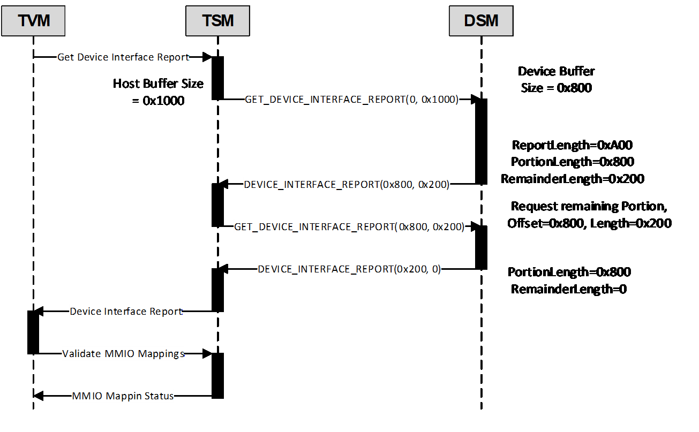
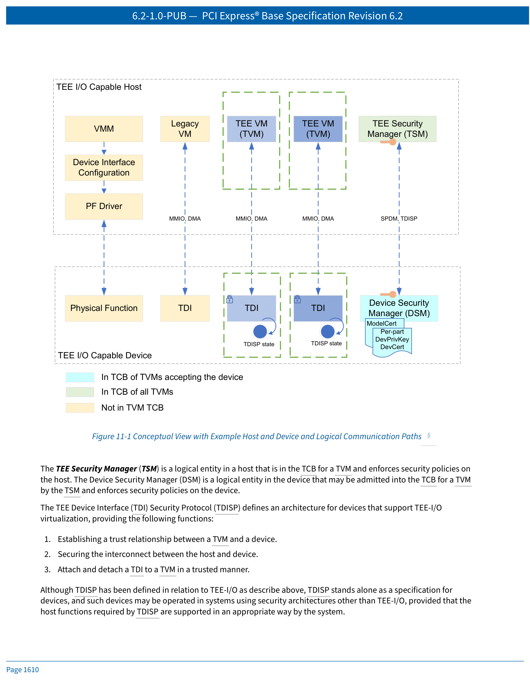
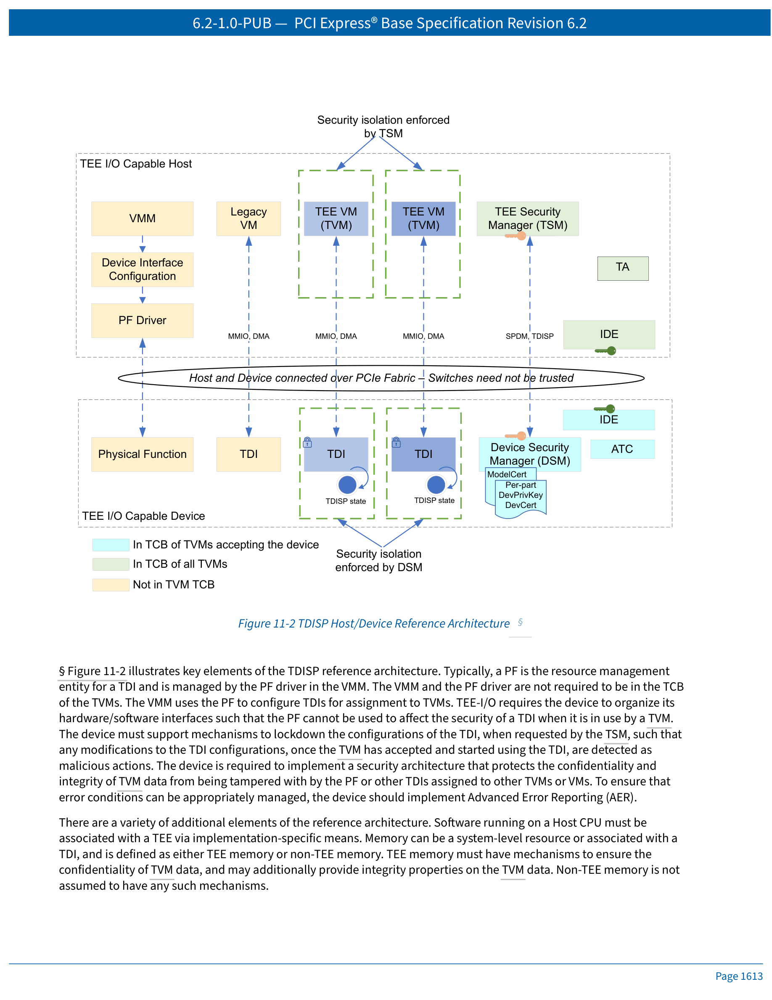
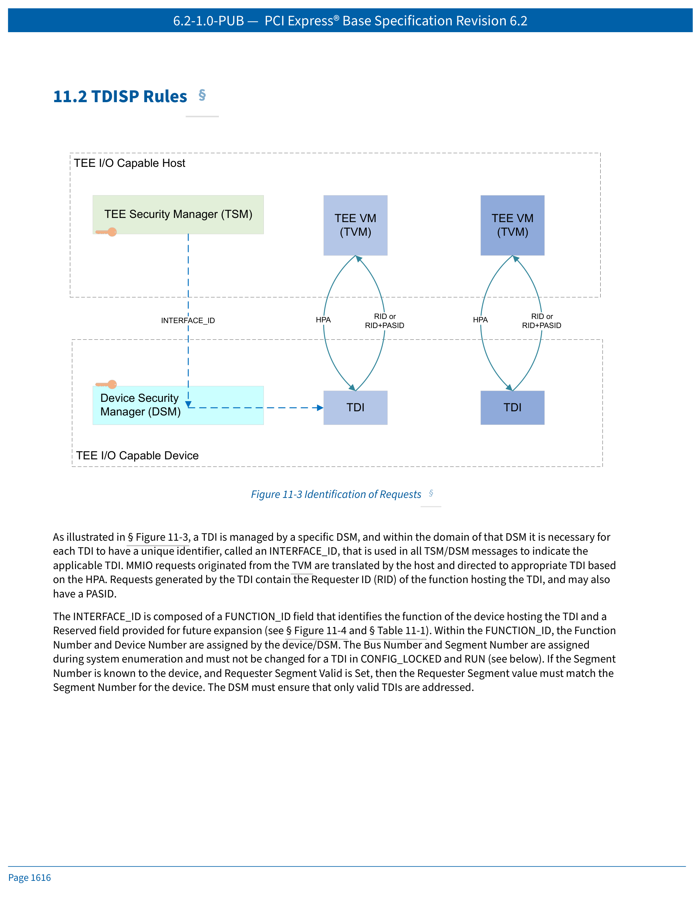
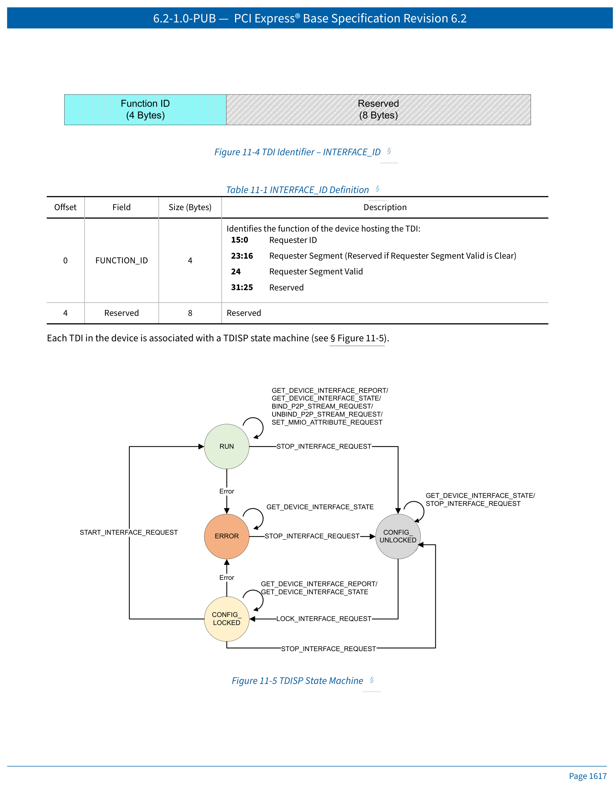
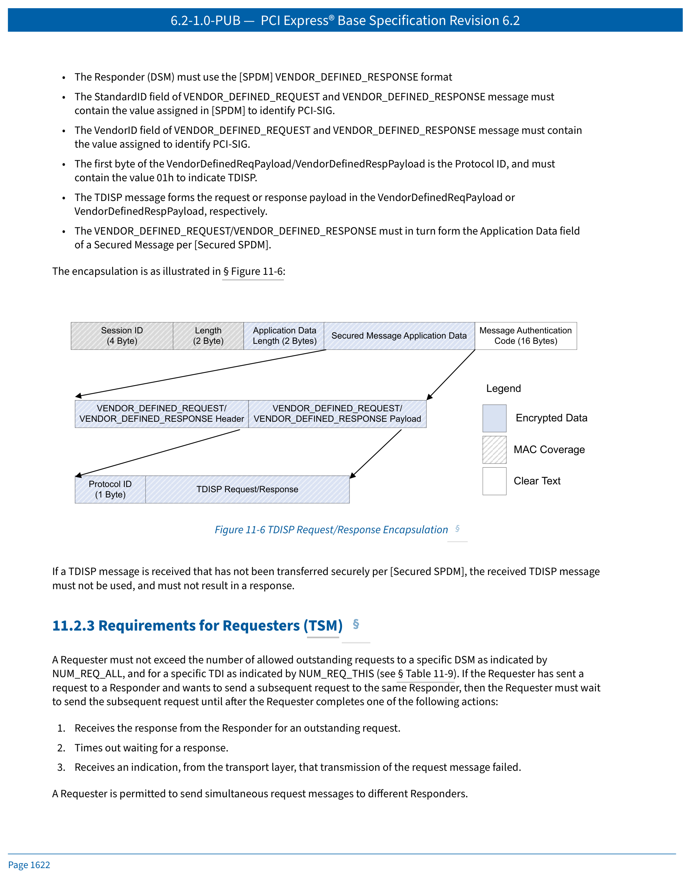

# PCI Express Base Specification 6.2 — Chapter 11
# TEE Device Interface Security Protocol (TDISP)
# TEE 设备接口安全协议

> **中英文对照翻译 | Chinese-English Parallel Translation**

> **Source**: NCB-PCI_Express_Base_6.2-2024-01-25.pdf, Pages 1609–1658

> **Translator's Note**: 本文档提供 PCIe 6.2 规范第 11 章 TDISP 的完整中英文对照翻译，图片已保留嵌入。翻译采用专业术语标准化处理，首次出现的术语会标注中英文对照。

---

## Chapter 11. TEE Device Interface Security Protocol (TDISP)
## 第 11 章 TEE 设备接口安全协议

---

 <em>Figure 11-7 Example Flow Where DSM is Unable to Return Full Length Report</em>

---

## 快速导航 | Quick Navigation

| 章节 | Section | 内容 |
|------|---------|------|
| [11.1](#111-overview-of-the-tee-io-security-model-as-it-relates-to-devices) | Overview | TEE-I/O 安全模型概述 |
| [11.2](#112-tdisp-rules) | TDISP Rules | TDISP 规则、状态机、TLP规则、消息传输 |
| [11.3](#113-tdisp-message-formats-and-processing) | Message Formats | TDISP 消息格式与处理（26个子章节） |
| [11.4](#114-device-security-requirements) | Device Security | 设备安全需求（10个子章节） |
| [11.5](#115-requirements-placed-on-host-security-due-to-tdi-requirements) | Host Security | 主机安全需求（8个子章节） |
| [11.6](#116-overview-of-threat-model-and-mitigations) | Threat Model | 威胁模型与缓解措施 |

---

## 11.1 Overview of the TEE-I/O Security Model as it Relates to Devices
## 11.1 TEE-I/O 安全模型概述（设备相关）

Trusted Execution Environments (TEEs) that include a composition of resources from one or more devices and the host require mechanisms to establish and manage trust relationships. Here we will use the term TEE-I/O to refer to a conceptual framework for performing such operations. This chapter defines a specific architecture for hosts and devices to participate in TEE-I/O.

> 包含来自一个或多个设备及主机的资源组合的可信执行环境（TEE）需要相应的机制来建立和管理信任关系。这里我们使用术语 **TEE-I/O** 来指代执行此类操作的概念框架。本章定义了主机和设备参与 TEE-I/O 的特定架构。

---

TEE-I/O builds upon existing capabilities for the direct assignment of devices to VMs, such as SR-IOV (Chapter 9) and ATS (Chapter 10), to establish Trusted Execution Environment VMs (**TVMs**). All VMs that are not TVMs are referred to as **legacy VMs**. In TEE-I/O, the VMM itself may not be trusted by TVMs, and mechanisms are provided to enable the TVM to make trust decisions based on the underlying hardware it is using. Although the VMM is not required to be trusted by TVMs, it continues to perform the resource allocation and system management functions as it does in non-TEE-I/O use models, but in such a way that the results can be tested. The VMM can be blocked from bypassing the security of the affected TVM(s). Legacy VMs that implicitly trust the VMM may co-exist with TVMs in a system.

> TEE-I/O 建立在现有的设备直接分配给 VM 的能力之上，如 SR-IOV（第 9 章）和 ATS（第 10 章），以建立可信执行环境 VM（**TVM**）。所有非 TVM 的 VM 被称为**传统 VM**。在 TEE-I/O 中，VMM 本身可能不被 TVM 信任，并且提供了相应的机制，使 TVM 能够根据其使用的底层硬件做出信任决策。虽然不要求 TVM 信任 VMM，但 VMM 仍继续执行资源分配和系统管理功能（如同在非 TEE-I/O 使用模型中一样），但其执行方式使得结果可以被检验。VMM 可以被阻止绕过受影响 TVM 的安全性。隐式信任 VMM 的传统 VM 可以与 TVM 在系统中并存。

---

The **TEE Security Manager (TSM)** is a logical entity in a host that is in the TCB for a TVM and enforces security policies on the host. The **Device Security Manager (DSM)** is a logical entity in the device that may be admitted into the TCB for a TVM by the TSM and enforces security policies on the device.

> **TEE 安全管理器（TSM）** 是主机中的一个逻辑实体，位于 TVM 的 TCB（可信计算基）中，在主机上执行安全策略。**设备安全管理器（DSM）** 是设备中的一个逻辑实体，可由 TSM 准入到 TVM 的 TCB 中，并在设备上执行安全策略。

---

The TEE Device Interface (TDI) Security Protocol (TDISP) defines an architecture for devices that support TEE-I/O virtualization, providing the following functions:

1. Establishing a trust relationship between a TVM and a device.
2. Securing the interconnect between the host and device.
3. Attach and detach a **TDI** to a TVM in a trusted manner.

> TEE 设备接口（TDI）安全协议（TDISP）定义了支持 TEE-I/O 虚拟化的设备架构，提供以下功能：

> 1. 建立 TVM 与设备之间的信任关系。
> 2. 保护主机与设备之间的互连安全。
> 3. 以可信方式将 **TDI（TEE 设备接口）** 附加到 TVM 和从 TVM 分离。

---

Although TDISP has been defined in relation to TEE-I/O as described above, TDISP stands alone as a specification for devices, and such devices may be operated in systems using security architectures other than TEE-I/O, provided that the host functions required by TDISP are supported in an appropriate way by the system.

> 尽管 TDISP 是如上所述针对 TEE-I/O 定义的，但 TDISP 作为设备规范是独立存在的，此类设备可以在使用 TEE-I/O 以外的安全架构的系统中运行，前提是系统以适当的方式支持 TDISP 所需的主机功能。

---

### Key Concepts | 核心概念

The TEE-I/O considers all resources, including memory of all types, host processors, TDIs and, in some cases internal state, to be in one of two classes:

- **"TEE-assignable"** resources have the required trust/security capabilities to be assigned to a TEE. Once assigned to a TEE, these resources become **"TEE-Owned."**
- **"Non-TEE-assignable"** resources either do not possess the required trust/security capabilities to be assigned to a TEE or have been excluded by some implementation-specific mechanism.

> TEE-I/O 将所有资源（包括各类内存、主机处理器、TDI，以及某些情况下的内部状态）归为以下两类之一：

> - **"TEE 可分配"（TEE-assignable）** 资源具备分配给 TEE 所需的信任/安全能力。一旦分配给 TEE，这些资源即成为 **"TEE 拥有"（TEE-Owned）**。
> - **"非 TEE 可分配"（Non-TEE-assignable）** 资源要么不具备分配给 TEE 所需的信任/安全能力，要么已被某些实现特定的机制排除在外。

---

TVM data, code, and execution state stored in an assigned device must be protected against:

- **Confidentiality breaches**: read access by entities (firmware, software, or hardware) not in the TCB of the TVM (such as other TVMs, VMM, etc.).
- **Integrity**: modification by entities (firmware, software, or hardware) not in the TCB of the TVM (such as other TVMs, VMM, etc.).

> 存储在已分配设备中的 TVM 数据、代码和执行状态必须受到保护，防止：

> - **机密性泄露**：不在 TVM 的 TCB 中的实体（固件、软件或硬件，如其他 TVM、VMM 等）的读取访问。
> - **完整性破坏**：不在 TVM 的 TCB 中的实体（固件、软件或硬件，如其他 TVM、VMM 等）的修改。

---

This security model does not require protection of TVMs against denial-of-service attacks in general. However, systems may impose a requirement that a TVM not have the ability to cause denial of service to other TVMs, VMM, or other VMs executing on the platform.

> 此安全模型通常不要求保护 TVM 免受拒绝服务攻击。然而，系统可能要求 TVM 不能对平台上执行的其他 TVM、VMM 或其他 VM 造成拒绝服务。

---

### Four Pillars of TEE-I/O Security | TEE-I/O 安全的四大支柱

The hardware assisted I/O virtualization schemes for direct I/O from TVMs to devices must address the following to preserve the confidentiality and integrity of the TVMs and the data moved between the TVMs and devices:

> 从 TVM 到设备的直接 I/O 的硬件辅助 I/O 虚拟化方案必须解决以下问题，以保护 TVM 以及在 TVM 与设备之间传输的数据的机密性和完整性：

---

**1. Authenticating device identity and measurement reporting** — Device identities like Vendor ID and Device ID may be spoofed with malicious intent. Firmware executing on devices may have security vulnerabilities, or may have been tampered with. Device debug interfaces may be used to obtain low level access to the device hardware and thereby influence the security property of devices. The TVM must be able to cryptographically check the identity of the device, identity of the firmware components running on the device, and security state of the device (e.g., debug active). **CMA/SPDM** is used to support these requirements.

> **1. 设备身份认证与度量报告** — 设备身份（如 Vendor ID 和 Device ID）可能被恶意伪造。设备上执行的固件可能存在安全漏洞，或已被篡改。设备调试接口可能被用于获取对设备硬件的低级访问，从而影响设备的安全属性。TVM 必须能够以密码学方式检查设备身份、设备上运行的固件组件的身份以及设备的安全状态（例如调试是否激活）。使用 **CMA/SPDM** 来支持这些需求。

---

**2. Device to Host communication Security** — Physical access may be used to tamper with the data transferred between the host and the device. Transfers must be cryptographically protected to provide confidentiality, integrity, and replay protection to TVM data, and such schemes must also guard against violations of producer-consumer ordering. **IDE (Integrity and Data Encryption)** is used to support these requirements. In some cases, e.g. for an RCiEP, it may be possible to ensure by construction that communication is not susceptible to tampering, and therefore may not require the use of IDE.

> **2. 设备到主机的通信安全** — 物理访问可能被用于篡改主机与设备之间传输的数据。传输必须经过密码学保护，为 TVM 数据提供机密性、完整性和重放保护，并且此类方案还必须防范生产者-消费者排序的违反。使用 **IDE（完整性和数据加密）** 来支持这些需求。在某些情况下（例如 RCiEP），可能通过构造确保通信不易受篡改，因此可能不需要使用 IDE。

---

**3. TEE Device Interface (TDI) management** — DMA and interrupt remapping tables set up by the VMM may be tampered with by the VMM. The VMM administration of these tables (e.g., IOMMU TLB management, Device TLB management, Page Request handling, etc.) may additionally be tampered with by the VMM to influence the security of the TVM interaction with the device. The device must support locking down configurations of the TDI, reporting the configurations in a trusted manner, securely placing the TDIs into operational state, and subsequently tearing them down when the TDI is detached from a TVM. **This chapter defines the mechanisms used to manage the security states of TDIs.**

> **3. TEE 设备接口（TDI）管理** — VMM 设置的 DMA 和中断重映射表可能被 VMM 篡改。VMM 对这些表的管理（例如 IOMMU TLB 管理、设备 TLB 管理、页面请求处理等）也可能被 VMM 篡改，以影响 TVM 与设备交互的安全性。设备必须支持锁定 TDI 的配置、以可信方式报告配置、安全地将 TDI 置于运行状态，以及在 TDI 从 TVM 分离后拆除它们。**本章定义了用于管理 TDI 安全状态的机制。**

---

**4. Device Security Architecture** — Administrative interfaces (e.g., a PF) may be used to influence the security properties of the TDI used by the TVM. The device's security architecture must provide isolation and access control for TVM data in the device for protection against entities that are not in the trust boundary of the TVM. This chapter defines some device security architecture requirements, but additional requirements may exist for specific implementations that are outside the scope of this specification.

> **4. 设备安全架构** — 管理接口（例如 PF）可能被用于影响 TVM 使用的 TDI 的安全属性。设备的安全架构必须为设备中的 TVM 数据提供隔离和访问控制，以防止不在 TVM 信任边界内的实体的访问。本章定义了一些设备安全架构要求，但特定实现可能存在超出本规范范围的额外要求。

---

### TDISP Reference Architecture | TDISP 参考架构

 <em>Figure 11-1 Conceptual View with Example Host and Device and Logical Communication Paths</em>

Figure 11-2 illustrates key elements of the TDISP reference architecture. Typically, a PF is the resource management entity for a TDI and is managed by the PF driver in the VMM. The VMM and the PF driver are not required to be in the TCB of the TVMs. The VMM uses the PF to configure TDIs for assignment to TVMs. TEE-I/O requires the device to organize its hardware/software interfaces such that the PF cannot be used to affect the security of a TDI when it is in use by a TVM.

> 图 11-2 展示了 TDISP 参考架构的关键元素。通常，PF（物理功能）是 TDI 的资源管理实体，由 VMM 中的 PF 驱动程序管理。不要求 VMM 和 PF 驱动程序位于 TVM 的 TCB 中。VMM 使用 PF 来配置 TDI 以分配给 TVM。TEE-I/O 要求设备组织其硬件/软件接口，使得当 TDI 被 TVM 使用时，PF 不能被用于影响 TDI 的安全性。

---

 <em>Figure 11-2 TDISP Host/Device Reference Architecture</em>

The device must support mechanisms to lockdown the configurations of the TDI, when requested by the TSM, such that any modifications to the TDI configurations, once the TVM has accepted and started using the TDI, are detected as malicious actions. The device is required to implement a security architecture that protects the confidentiality and integrity of TVM data from being tampered with by the PF or other TDIs assigned to other TVMs or VMs. To ensure that error conditions can be appropriately managed, the device should implement Advanced Error Reporting (AER).

> 设备必须支持在 TSM 请求时锁定 TDI 配置的机制，使得一旦 TVM 接受并开始使用 TDI 后，对 TDI 配置的任何修改都会被检测为恶意操作。设备需要实现一种安全架构，保护 TVM 数据的机密性和完整性，防止被 PF 或分配给其他 TVM 或 VM 的其他 TDI 篡改。为确保错误状况能够得到适当管理，设备应实现高级错误报告（AER）。

---

When Links that could be subject to physical attacks are used, Integrity and Data Encryption (IDE) must be supported and enabled. The use of Selective IDE Streams minimizes the TCB and attack surface by allowing intermediate Switches to be excluded from the TCB. For Endpoint Upstream Ports connected directly to Root Ports, Link IDE meets the stated requirement of minimizing TCB and attack surface, and it is acceptable in such configurations to use Link IDE instead of Selective IDE, provided the TSM and DSM are able to provide acceptable security in this configuration.

> 当使用可能受到物理攻击的链路时，必须支持并启用完整性和数据加密（IDE）。使用选择性 IDE 流通过允许将中间交换机排除在 TCB 之外，最大化地减小了 TCB 和攻击面。对于直接连接到根端口（Root Port）的端点上游端口，链路 IDE 满足最小化 TCB 和攻击面的要求，在此类配置中使用链路 IDE 代替选择性 IDE 是可接受的，前提是 TSM 和 DSM 能够在此配置下提供可接受的安全性。

---

### DSM and TSM Functions | DSM 与 TSM 功能

The **DSM** provides the following functions:

1. Authentication of device identities and measurement reporting.
2. Configuring the IDE encryption keys in the device.
3. Device interface management for locking TDI configuration, reporting TDI configurations, attaching, and detaching TDIs from TVMs.
4. Implementing access control and security mechanisms to isolate TVM provided data from entities not in the TCB of the TVM.

> **DSM（设备安全管理器）** 提供以下功能：

> 1. 设备身份认证和度量报告。
> 2. 在设备中配置 IDE 加密密钥。
> 3. 设备接口管理：锁定 TDI 配置、报告 TDI 配置、将 TDI 附加到 TVM 和从 TVM 分离。
> 4. 实现访问控制和安全机制，将 TVM 提供的数据与不在 TVM 的 TCB 中的实体隔离开。

---

The **TSM** provides the following functions:

1. Provide interfaces to the VMM to assign memory, CPU, and TDI resources to TVMs.
2. Implements the security mechanisms and access controls (e.g., IOMMU translation tables, etc.) to protect confidentiality and integrity of the TVM data and execution state in the host from entities not in the TCB of the TVM.
3. Use TDISP protocol to manage the security state of the TDIs to be used by TVMs.
4. Establishing/managing IDE encryption keys for the host, and, if needed, scheduling key refreshes.

> **TSM（TEE 安全管理器）** 提供以下功能：

> 1. 向 VMM 提供接口以分配内存、CPU 和 TDI 资源给 TVM。
> 2. 实现安全机制和访问控制（如 IOMMU 转换表等），保护主机中 TVM 数据和执行状态的机密性和完整性，防止不在 TVM 的 TCB 中的实体的访问。
> 3. 使用 TDISP 协议管理 TVM 将要使用的 TDI 的安全状态。
> 4. 建立/管理主机的 IDE 加密密钥，并在需要时安排密钥刷新。

---

### SPDM Secure Session | SPDM 安全会话

Secured messages as specified in Section 6.31 are used by TSM and DSM to communicate TDISP messages securely. The secure session establishment is used by the TSM to authenticate the DSM (Optionally, the DSM may be configured to authenticate the TSM, if required by the system design), negotiate cryptographic parameters, and establish shared keying material.

> TSM 和 DSM 使用第 6.31 节中规定的安全消息来安全地通信 TDISP 消息。TSM 使用安全会话建立来认证 DSM（可选地，如果系统设计要求，DSM 可配置为认证 TSM）、协商密码学参数并建立共享密钥材料。

---

Once the SPDM secure session has been established, the session enters the application phase where all application data between the TSM and DSM are communicated using secured messages within the SPDM secure session. Two types of application data are used by TEE-I/O:

- **IDE Key Programming** — When IDE is required, the IDE_KM protocol is used for key programming. An IDE stream may also be established between two devices for peer-to-peer communication.
- **TDI Management** — the TSM uses the TDISP protocol to manage the TDI attach and detach to a TVM.

> 一旦 SPDM 安全会话建立完成，会话即进入应用阶段，在此阶段 TSM 和 DSM 之间的所有应用数据都使用 SPDM 安全会话中的安全消息进行通信。TEE-I/O 使用两种类型的应用数据：

> - **IDE 密钥编程** — 当需要 IDE 时，使用 IDE_KM 协议进行密钥编程。也可以在两台设备之间建立 IDE 流用于点对点通信。
> - **TDI 管理** — TSM 使用 TDISP 协议管理 TDI 对 TVM 的附加和分离。

---

### INTERFACE_ID | 接口标识符

As illustrated in Figure 11-3, a TDI is managed by a specific DSM, and within the domain of that DSM it is necessary for each TDI to have a unique identifier, called an **INTERFACE_ID**, that is used in all TSM/DSM messages to indicate the applicable TDI. MMIO requests originated from the TVM are translated by the host and directed to appropriate TDI based on the HPA. Requests generated by the TDI contain the Requester ID (RID) of the function hosting the TDI, and may also have a PASID.

 <em>Figure 11-3 Identification of Requests</em>

> 如图 11-3 所示，TDI 由特定的 DSM 管理，在该 DSM 的域内，每个 TDI 必须有一个唯一的标识符，称为 **INTERFACE_ID**，在所有 TSM/DSM 消息中使用以指示适用的 TDI。从 TVM 发出的 MMIO 请求由主机转换并根据 HPA 定向到适当的 TDI。TDI 生成的请求包含承载 TDI 的功能的请求者 ID（RID），也可能含有 PASID。

---

 <em>Figure 11-4 TDI Identifier - INTERFACE_ID</em>

The INTERFACE_ID is composed of a **FUNCTION_ID** field that identifies the function of the device hosting the TDI and a Reserved field provided for future expansion (see Figure 11-4 and Table 11-1). Within the FUNCTION_ID, the Function Number and Device Number are assigned by the device/DSM. The Bus Number and Segment Number are assigned during system enumeration and must not be changed for a TDI in CONFIG_LOCKED and RUN.

> INTERFACE_ID 由标识承载 TDI 的设备功能的 **FUNCTION_ID** 字段和为未来扩展而设的保留字段组成（见图 11-4 和表 11-1）。在 FUNCTION_ID 中，功能号和设备号由设备/DSM 分配。总线号和段号在系统枚举期间分配，对于处于 CONFIG_LOCKED 和 RUN 状态的 TDI，不得更改。

---

**Table 11-1 INTERFACE_ID Definition | INTERFACE_ID 定义**

| Offset | Field | Size (Bytes) | Description |
|--------|-------|-------------|-------------|
| 0 | FUNCTION_ID | 4 | Identifies the function hosting the TDI (Requester ID + Requester Segment + Requester Segment Valid + Reserved) |
| 4 | Reserved | 8 | Reserved |

---

## 11.2 TDISP Rules
## 11.2 TDISP 规则

### TDISP State Machine | TDISP 状态机

 <em>Figure 11-5 TDISP State Machine</em>

Each TDI in the device is associated with a TDISP state machine (see Figure 11-5). The TSM steps the TDI through these security states as part of the TDI security lifecycle management process.

> 设备中的每个 TDI 都与一个 TDISP 状态机相关联（见图 11-5）。TSM 作为 TDI 安全生命周期管理过程的一部分，引导 TDI 通过这些安全状态。

---

A TDI is considered **"locked"** in CONFIG_LOCKED and RUN. A TDI is considered **"unlocked"** when in ERROR and CONFIG_UNLOCKED.

> TDI 在 CONFIG_LOCKED 和 RUN 状态被认为处于 **"锁定"（locked）** 状态。在 ERROR 和 CONFIG_UNLOCKED 状态被认为处于 **"解锁"（unlocked）** 状态。

---

#### TDISP States | 四种状态

**CONFIG_UNLOCKED**
- This is the default state. In CONFIG_UNLOCKED the VMM configures the TDI to be assigned to a TVM.
- A TDI is not required to protect confidential data placed into it in this state; TVMs should not place confidential data into a TDI in this state.
- Memory Requests originating within a TVM (as indicated by the T bit being Set) must be rejected in this state.
- This state must be entered from any other state in response to the STOP_INTERFACE_REQUEST message. When the TDI transitions to CONFIG_UNLOCKED, the DSM must ensure all TVM confidential data held by the device in the context of that TDI cannot be exposed as plaintext outside the device.

> **CONFIG_UNLOCKED（配置未锁定）**
> - 这是默认状态。在 CONFIG_UNLOCKED 状态，VMM 配置 TDI 以分配给 TVM。
> - 在此状态，不要求 TDI 保护放入其中的机密数据；TVM 不应在此状态将机密数据放入 TDI。
> - 在此状态，来自 TVM 的内存请求（以 T 位被置位指示）必须被拒绝。
> - 响应 STOP_INTERFACE_REQUEST 消息时，必须从任何其他状态进入此状态。当 TDI 转换到 CONFIG_UNLOCKED 时，DSM 必须确保设备在该 TDI 上下文中持有的所有 TVM 机密数据不能在设备外以明文形式暴露。

---

**CONFIG_LOCKED**
- Once the TDI configuration is finalized by the VMM, the VMM requests the TSM to lock the TDI configuration by transitioning the TDI to CONFIG_LOCKED.
- The DSM must transition a TDI to CONFIG_LOCKED only in response to a LOCK_INTERFACE_REQUEST message.
- On entry to this state, the DSM must perform all necessary actions to lock the TDI configuration, and then must start tracking the TDI for changes that affect the configuration or the security of the TDI. Changes detected must be treated as an error, and the TDI transitioned to ERROR.
- The TVM may obtain the identity and measurements of the device hosting the TDI from the DSM, and also, if applicable, verify that an IDE stream has been established by the TSM between the host and the device.

> **CONFIG_LOCKED（配置已锁定）**
> - 一旦 VMM 完成 TDI 配置，VMM 请求 TSM 通过将 TDI 转换到 CONFIG_LOCKED 来锁定 TDI 配置。
> - DSM 必须仅在响应 LOCK_INTERFACE_REQUEST 消息时将 TDI 转换到 CONFIG_LOCKED。
> - 进入此状态时，DSM 必须执行所有必要的操作以锁定 TDI 配置，然后必须开始跟踪影响 TDI 配置或安全的更改。检测到的更改必须被视为错误，TDI 转换到 ERROR。
> - TVM 可以从 DSM 获取承载 TDI 的设备的身份和度量，并且（如适用）验证 TSM 是否已在主机和设备之间建立了 IDE 流。

---

**RUN**
- TDI resources are operational and permitted to be accessed and managed by the TVM.
- On entry to this state, the DSM must continue tracking the TDI for changes that affect the configuration or the security of the TDI. Changes detected must be treated as an error, and the TDI transitioned to ERROR.

> **RUN（运行）**
> - TDI 资源处于可运行状态，允许由 TVM 访问和管理。
> - 进入此状态时，DSM 必须继续跟踪影响 TDI 配置或安全的更改。检测到的更改必须被视为错误，TDI 转换到 ERROR。

---

**ERROR**
- The TDI must not expose confidential TVM data.
- Memory Requests originating within a TVM (as indicated by the T bit being Set) must be rejected in this state.
- The TDI must restrict TLP operations as defined in Section 11.2.1.
- In ERROR, the TDI may still have confidential TVM data, and it is permitted that clearing this data be deferred until the receipt of a STOP_INTERFACE_REQUEST to transition the TDI to CONFIG_UNLOCKED.

> **ERROR（错误）**
> - TDI 不得暴露 TVM 机密数据。
> - 在此状态下来自 TVM 的内存请求（T 位置位）必须被拒绝。
> - TDI 必须按照第 11.2.1 节的规定限制 TLP 操作。
> - 在 ERROR 状态，TDI 可能仍持有 TVM 机密数据，允许延迟清除这些数据，直到接收到 STOP_INTERFACE_REQUEST 将 TDI 转换到 CONFIG_UNLOCKED。

---

### Error Conditions in CONFIG_LOCKED and RUN | CONFIG_LOCKED 和 RUN 中的错误条件

In CONFIG_LOCKED and RUN, the following conditions must be treated as errors, and cause the TDI to move to ERROR:

- Changes to TDI configuration that affect the configuration or the security of the TDI.
- Changes to the Requester ID.
- Resetting the TDI using a Function Level Reset. A PF reset affects all subordinate VF TDIs, whereas a VF reset affects only that TDI.
- Any IDE stream bound to the TDI transitions to the Insecure state.
- Except when the TDI implements mechanisms to recover, receipt of a poisoned TLP or detecting data integrity errors.
- Other device specific conditions or changes in configuration that affect trust properties.

> 在 CONFIG_LOCKED 和 RUN 中，以下条件必须被视为错误，并导致 TDI 转移到 ERROR：

> - 影响 TDI 配置或安全的 TDI 配置更改。
> - 请求者 ID 的更改。
> - 使用功能级复位（Function Level Reset）复位 TDI。PF 复位影响所有下级 VF TDI，而 VF 复位仅影响该 TDI。
> - 绑定到 TDI 的任何 IDE 流转到 Insecure（不安全）状态。
> - 除非 TDI 实现了恢复机制，否则接收到中毒 TLP 或检测到数据完整性错误。
> - 影响信任属性的其他设备特定条件或配置更改。

---

### Peer-to-Peer Support | 点对点支持

Some TDIs may support peer-to-peer communication with other devices. The Stream ID of the IDE stream(s) used for this communication are configured into the device using the BIND_P2P_STREAM_REQUEST message. This message must only be accepted by the DSM if the TDI is in RUN. The device must be ATS capable, and must have ATS enabled, to support peer-to-peer communication between TVM-assigned TDIs.

> 某些 TDI 可能支持与其他设备的点对点通信。用于此通信的 IDE 流的流 ID 使用 BIND_P2P_STREAM_REQUEST 消息配置到设备中。只有在 TDI 处于 RUN 状态时，DSM 才能接受此消息。设备必须具备 ATS 能力，并且必须启用 ATS，以支持分配给 TVM 的 TDI 之间的点对点通信。

---

### 11.2.1 TDISP TLP Rules
### 11.2.1 TDISP TLP 规则

This section defines the rules for TLPs that are associated with TVMs. Under all circumstances, devices must ensure that device memory with the IS_NON_TEE_MEM attribute Clear can only be read/written within the context of an authorized TVM (indicated, when IDE is used, by the T bit being Set).

> 本节定义了与 TVM 关联的 TLP 的规则。在所有情况下，设备必须确保 IS_NON_TEE_MEM 属性为 Clear 的设备内存只能在授权的 TVM 上下文（使用 IDE 时，由 T 位被置位指示）中读/写。

---

**TDI as Requester rules:**

- In systems where IDE is required, a TDI in CONFIG_LOCKED or RUN must transmit TLPs with T bit Set only on an IDE stream bound to the TDI.
- Memory Reads must only be issued while in RUN and must Set the T bit.
- Memory Writes other than MSI/MSI-X interrupts must only be issued while in RUN and must Set the T bit.

> **TDI 作为请求者的规则：**

> - 在需要 IDE 的系统中，处于 CONFIG_LOCKED 或 RUN 状态的 TDI 必须仅在绑定到该 TDI 的 IDE 流上发送 T 位置位的 TLP。
> - 内存读取只能在 RUN 状态下发出且必须置位 T 位。
> - 除 MSI/MSI-X 中断外的内存写入只能在 RUN 状态下发出且必须置位 T 位。

---

**TDI as Completer rules:**

- Received Memory Requests targeting device memory with the IS_NON_TEE_MEM attribute Clear must be handled normally if and only if: (a) the T bit for the Request is Set, (b) the TDI is in RUN, and (c) if IDE is required, the Request is received on a Stream ID bound to the TDI. In all other cases, the Request must be rejected.
- The value of the T bit in the Completion(s) returned by the TDI must match the value of the T bit in the corresponding Request.

> **TDI 作为完成者的规则：**

> - 目标为 IS_NON_TEE_MEM 属性为 Clear 的设备内存的接收内存请求，必须仅在以下所有条件满足时正常处理：(a) 请求的 T 位置位，(b) TDI 处于 RUN 状态，(c) 如果需要 IDE，请求在绑定到该 TDI 的流 ID 上接收。在所有其他情况下，请求必须被拒绝。
> - TDI 返回的完成中的 T 位值必须与相应请求中的 T 位值匹配。

---

**MSI/MSI-X Interrupt Rules:**
- An MSI interrupt must be generated with T bit Clear.
- An MSI-X interrupt must be generated with T bit Clear if the MSI-X table is not part of the MMIO ranges that are locked and reported in the DEVICE_INTERFACE_REPORT, else the MSI-X interrupt must be generated with T bit Set.

> **MSI/MSI-X 中断规则：**
> - MSI 中断必须以 T 位清零方式生成。
> - 如果 MSI-X 表不是 DEVICE_INTERFACE_REPORT 中锁定和报告的 MMIO 范围的一部分，MSI-X 中断必须以 T 位清零方式生成；否则必须以 T 位置位方式生成。

---

### 11.2.2 TDISP Message Transport
### 11.2.2 TDISP 消息传输

All TDISP messages must be transported between TSM and DSM using secured messages as specified by Secured CMA/SPDM (see Section 6.31.4) used within a secure session established between TSM and DSM as specified by [SPDM]. TDISP requires the TSM and the DSM to support **AES-256-GCM** as the Authenticated Encryption with Associated Data (AEAD) algorithm to protect data transferred using secured messages.

> 所有 TDISP 消息必须使用安全 CMA/SPDM（见第 6.31.4 节）规定的安全消息在 TSM 和 DSM 之间传输，该消息在 TSM 和 DSM 之间建立的 [SPDM] 规定的安全会话中使用。TDISP 要求 TSM 和 DSM 支持 **AES-256-GCM** 作为带关联数据的认证加密（AEAD）算法，以保护使用安全消息传输的数据。

---

TDISP messages are transported as follows:
- The Requester (TSM) must use the [SPDM] **VENDOR_DEFINED_REQUEST** format
- The Responder (DSM) must use the [SPDM] **VENDOR_DEFINED_RESPONSE** format
- The StandardID field must contain the value assigned in [SPDM] to identify PCI-SIG
- The VendorID field must contain the value assigned to identify PCI-SIG
- The first byte of the payload is the Protocol ID, and must contain the value **01h** to indicate TDISP

 <em>Figure 11-6 TDISP Request/Response Encapsulation</em>

> TDISP 消息按如下方式传输：
> - 请求者（TSM）必须使用 [SPDM] **VENDOR_DEFINED_REQUEST** 格式
> - 响应者（DSM）必须使用 [SPDM] **VENDOR_DEFINED_RESPONSE** 格式
> - StandardID 字段必须包含 [SPDM] 中分配用于标识 PCI-SIG 的值
> - VendorID 字段必须包含分配用于标识 PCI-SIG 的值
> - 有效负载的第一个字节是协议 ID，必须包含值 **01h** 以指示 TDISP

---

### 11.2.3-11.2.7 Requirements | 请求者/响应者要求

**Requirements for Requesters (TSM)**: A Requester must not exceed the number of allowed outstanding requests to a specific DSM as indicated by NUM_REQ_ALL, and for a specific TDI as indicated by NUM_REQ_THIS. A Requester is permitted to send simultaneous request messages to different Responders.

> **请求者（TSM）的要求**：请求者不得超过对特定 DSM 允许的未完成请求数（由 NUM_REQ_ALL 指示），以及对特定 TDI 的未完成请求数（由 NUM_REQ_THIS 指示）。允许请求者同时向不同的响应者发送请求消息。

---

**Requirements for Responders (DSM)**: A Responder is not required to process more than NUM_REQ_THIS requests at a time. A Responder that is not ready to accept a new request message must either respond with a TDISP_ERROR response message with ERROR_CODE=BUSY or silently discard the request message.

> **响应者（DSM）的要求**：不要求响应者一次处理超过 NUM_REQ_THIS 个请求。未准备好接受新请求消息的响应者必须要么以 ERROR_CODE=BUSY 的 TDISP_ERROR 响应消息回复，要么静默丢弃请求消息。

---

**TVM Acceptance of a TDI**: A TVM must ask the following questions before it accepts a TDI into its TCB:

1. Is the identity of the device and the measurements reported by the device hosting the TDI acceptable?
2. Is there a SPDM secure session established between the TSM and the DSM, and does the identity authenticated by the TSM match the identity reported to the TVM?
3. When IDE is required, were all IDE keys for the IDE stream used by the TDI established or verified by the TSM?
4. Has the VMM configured the TDI and mapped the TDI into the TVM address space as expected?

If the answer to all of these questions is yes, then the TVM may accept the TDI into its TCB.

> **TVM 对 TDI 的接受**：TVM 在接受 TDI 进入其 TCB 之前必须询问以下问题：

> 1. 承载 TDI 的设备报告的设备身份和度量是否可接受？
> 2. TSM 和 DSM 之间是否建立了 SPDM 安全会话，且 TSM 认证的身份是否与向 TVM 报告的身份匹配？
> 3. 需要 IDE 时，TDI 使用的 IDE 流的所有 IDE 密钥是否由 TSM 建立或验证？
> 4. VMM 是否按预期配置了 TDI 并将 TDI 映射到 TVM 地址空间？

> 如果所有这些问题的答案都是"是"，则 TVM 可以接受 TDI 进入其 TCB。

---

## 11.3 TDISP Message Formats and Processing
## 11.3 TDISP 消息格式与处理

### 11.3.1 TDISP Request Codes | TDISP 请求码

**Table 11-3 TDISP Request Codes | TDISP 请求码**

| Message | Code | Required/Optional | Legal States | Description |
|---------|------|-------------------|-------------|-------------|
| GET_TDISP_VERSION | 81h | Required | N/A | Retrieve device's TDISP version |
| GET_TDISP_CAPABILITIES | 82h | Required | N/A | Retrieve protocol capabilities |
| LOCK_INTERFACE_REQUEST | 83h | Required | CONFIG_UNLOCKED | Move TDI to CONFIG_LOCKED |
| GET_DEVICE_INTERFACE_REPORT | 84h | Required | CONFIG_LOCKED, RUN | Obtain a TDI report |
| GET_DEVICE_INTERFACE_STATE | 85h | Required | All states | Obtain TDI state |
| START_INTERFACE_REQUEST | 86h | Required | CONFIG_LOCKED | Start a TDI (move to RUN) |
| STOP_INTERFACE_REQUEST | 87h | Required | All except CONFIG_UNLOCKED | Stop and move to CONFIG_UNLOCKED |
| BIND_P2P_STREAM_REQUEST | 88h | Optional | RUN | Bind a P2P stream |
| UNBIND_P2P_STREAM_REQUEST | 89h | Optional | RUN | Unbind a P2P stream |
| SET_MMIO_ATTRIBUTE_REQUEST | 8Ah | Optional | RUN | Update MMIO range attributes |
| VDM_REQUEST | 8Bh | Optional | N/A | Vendor defined message request |

### 11.3.2 TDISP Response Codes | TDISP 响应码

**Table 11-4 TDISP Response Codes | TDISP 响应码**

| Message | Code | Required/Optional | Description |
|---------|------|-------------------|-------------|
| TDISP_VERSION | 01h | Required | Version supported by device |
| TDISP_CAPABILITIES | 02h | Required | Protocol capabilities of the device |
| LOCK_INTERFACE_RESPONSE | 03h | Required | Response to LOCK_INTERFACE_REQUEST |
| DEVICE_INTERFACE_REPORT | 04h | Required | Report for a TDI |
| DEVICE_INTERFACE_STATE | 05h | Required | Returns TDI state |
| START_INTERFACE_RESPONSE | 06h | Required | Response to move TDI to RUN |
| STOP_INTERFACE_RESPONSE | 07h | Required | Response to STOP_INTERFACE_REQUEST |
| BIND_P2P_STREAM_RESPONSE | 08h | Optional | Response to bind P2P stream |
| UNBIND_P2P_STREAM_RESPONSE | 09h | Optional | Response to unbind P2P stream |
| SET_MMIO_ATTRIBUTE_RESPONSE | 0Ah | Optional | Response to update MMIO range attributes |
| VDM_RESPONSE | 0Bh | Optional | Vendor defined message response |
| TDISP_ERROR | 7Fh | Required | Error in handling a request |

### 11.3.3 TDISP Message Format and Protocol Versioning
### 11.3.3 TDISP 消息格式与协议版本管理

All TDISP messages include the one Byte **TDISPVersion** field, which is divided into two sub-fields:
- Bits 7:4 — **Major Version** — incremented when the protocol modification breaks backward compatibility.
- Bits 3:0 — **Minor Version** — incremented when the protocol modification maintains backward compatibility.

This version of TDISP is **V1.0**, represented as **10h**.

> 所有 TDISP 消息都包含一个字节的 **TDISPVersion** 字段，分为两个子字段：
> - 位 7:4 — **主版本号** — 在协议修改破坏向后兼容性时递增。
> - 位 3:0 — **次版本号** — 在协议修改保持向后兼容性时递增。

> 本版 TDISP 为 **V1.0**，表示为 **10h**。

---

**Table 11-5 TDISP Message Format | TDISP 消息格式**

| Offset | Field | Size (Bytes) | Description |
|--------|-------|-------------|-------------|
| 0 | TDISPVersion | 1 | Version (Major[7:4], Minor[3:0]) |
| 1 | MessageType | 1 | Code identifying message type |
| 2 | Reserved | 2 | Reserved |
| 4 | INTERFACE_ID | 12 | The TDI's ID |
| 16 | TDISP message payload | Variable | Zero or more bytes specific to MessageType |

---

### 11.3.4-11.3.7 Version/Capabilities Discovery | 版本/能力发现

**GET_TDISP_VERSION (81h)**: Retrieves the device's TDISP version. The Requester must begin the discovery process by sending a GET_TDISP_VERSION request message with major version 1h. All Responders must always support this request and provide a TDISP_VERSION response containing all supported versions.

> **GET_TDISP_VERSION (81h)**：检索设备的 TDISP 版本。请求者必须通过发送主版本为 1h 的 GET_TDISP_VERSION 请求消息来开始发现过程。所有响应者必须始终支持此请求，并提供包含所有受支持版本的 TDISP_VERSION 响应。

---

**GET_TDISP_CAPABILITIES (82h)**: Used to retrieve the Responder's TDISP capabilities. The response includes:
- **DSM_CAPS** — DSM Capability Flags
- **REQ_MSGS_SUPPORTED** — Bitmask indicating supported request message types
- **LOCK_INTERFACE_FLAGS_SUPPORTED** — Supported lock interface flags
- **DEV_ADDR_WIDTH** — Number of address bits supported by the device
- **NUM_REQ_THIS** — Number of outstanding requests permitted for this TDI
- **NUM_REQ_ALL** — Number of outstanding requests permitted for all TDIs managed by this DSM

> **GET_TDISP_CAPABILITIES (82h)**：用于检索响应者的 TDISP 能力。响应包括：
> - **DSM_CAPS** — DSM 能力标志
> - **REQ_MSGS_SUPPORTED** — 指示支持的请求消息类型的位掩码
> - **LOCK_INTERFACE_FLAGS_SUPPORTED** — 支持的锁定接口标志
> - **DEV_ADDR_WIDTH** — 设备支持的地址位数量
> - **NUM_REQ_THIS** — 对此 TDI 允许的未完成请求数
> - **NUM_REQ_ALL** — 对此 DSM 管理的所有 TDI 允许的未完成请求数

---

### 11.3.8-11.3.9 LOCK_INTERFACE_REQUEST/RESPONSE
### 11.3.8-11.3.9 锁定接口请求/响应

The **LOCK_INTERFACE_REQUEST (83h)** is used to move the TDI to CONFIG_LOCKED. The DSM confirms that the device, including elements of Function 0 and the TDI itself, is acceptably configured.

**Key Parameters:**
- **FLAGS**: NO_FW_UPDATE, System Cache Line Size, LOCK_MSIX, BIND_P2P, ALL_REQUEST_REDIRECT
- **Stream ID** for Default Stream — IDE default stream binding
- **MMIO_REPORTING_OFFSET** — Signed 64-bit offset applied to all MMIO addresses in reports
- **BIND_P2P_ADDRESS_MASK** — Mask for peer-to-peer address matching

> **LOCK_INTERFACE_REQUEST (83h)** 用于将 TDI 转移到 CONFIG_LOCKED。DSM 确认设备（包括功能 0 的元素和 TDI 本身）的配置是可接受的。

> **关键参数：**
> - **FLAGS**: NO_FW_UPDATE, 系统缓存行大小, LOCK_MSIX, BIND_P2P, ALL_REQUEST_REDIRECT
> - **默认流的流 ID** — IDE 默认流绑定
> - **MMIO_REPORTING_OFFSET** — 应用于报告中所有 MMIO 地址的有符号 64 位偏移量
> - **BIND_P2P_ADDRESS_MASK** — 用于点对点地址匹配的掩码

---

**LOCK_INTERFACE_RESPONSE (03h)** is provided on successful handling. It includes a **START_INTERFACE_NONCE** (32 bytes) generated when the TDI is locked. This nonce must be destroyed when the TDI moves to CONFIG_UNLOCKED or ERROR from CONFIG_LOCKED.

Generating a LOCK_INTERFACE_RESPONSE implies:
- All in-flight and accepted work for the TDI are aborted
- All DMA for the TDI are completed or aborted
- All ATS requests have completed or aborted; ATC translations invalidated
- PRI page requests have received responses or will be discarded
- DSM has locked TDI configuration and IDE configuration registers
- DSM has enabled tracking mechanisms for configuration changes

> **LOCK_INTERFACE_RESPONSE (03h)** 在成功处理时提供。它包括 TDI 锁定时生成的 **START_INTERFACE_NONCE**（32 字节）。当 TDI 从 CONFIG_LOCKED 转移到 CONFIG_UNLOCKED 或 ERROR 时，此 nonce 必须被销毁。

> 生成 LOCK_INTERFACE_RESPONSE 意味着：
> - TDI 的所有正在处理和已接受的工作均被中止
> - TDI 的所有 DMA 已完成或中止
> - 所有 ATS 请求已完成或中止；ATC 转换已作废
> - PRI 页面请求已收到响应或将被丢弃
> - DSM 已锁定 TDI 配置和 IDE 配置寄存器
> - DSM 已启用配置更改的跟踪机制

---

### 11.3.10-11.3.11 DEVICE_INTERFACE_REPORT
### 11.3.10-11.3.11 设备接口报告

The **GET_DEVICE_INTERFACE_REPORT (84h)** requests a report from the device. The report may be larger than a single response can contain, so the requester can request specific portions. Key parameters include **OFFSET** and **LENGTH**.

> **GET_DEVICE_INTERFACE_REPORT (84h)** 从设备请求报告。报告可能超过单个响应所能包含的大小，因此请求者可以请求特定部分。关键参数包括 **OFFSET** 和 **LENGTH**。

---

The **DEVICE_INTERFACE_REPORT** contains:
- **INTERFACE_INFO** — Flags: NO_FW_UPDATE, DMA without/with PASID, ATS enabled, PRS enabled
- **MSI_X_MESSAGE_CONTROL** — MSI-X capability state
- **LNR_CONTROL** — LN Requester control state
- **TPH_CONTROL** — TPH Requester control state
- **MMIO_RANGE_COUNT** + **MMIO_RANGE[]** — Base, size (in 4K pages), and attributes for each range
- **DEVICE_SPECIFIC_INFO** — Device-specific information

> **DEVICE_INTERFACE_REPORT** 包含：
> - **INTERFACE_INFO** — 标志：NO_FW_UPDATE, 不带/带 PASID 的 DMA, ATS 已启用, PRS 已启用
> - **MSI_X_MESSAGE_CONTROL** — MSI-X 能力状态
> - **LNR_CONTROL** — LN 请求者控制状态
> - **TPH_CONTROL** — TPH 请求者控制状态
> - **MMIO_RANGE_COUNT** + **MMIO_RANGE[]** — 每个范围的基础地址、大小（以 4K 页为单位）和属性
> - **DEVICE_SPECIFIC_INFO** — 设备特定信息

---

MMIO Range Attributes:
- **Bit 0**: MSI-X Table
- **Bit 1**: MSI-X PBA
- **Bit 2**: IS_NON_TEE_MEM
- **Bit 3**: IS_MEM_ATTR_UPDATABLE
- **Bits 15:4**: Reserved
- **Bits 31:16**: Range ID

> MMIO 范围属性：
> - **位 0**: MSI-X 表
> - **位 1**: MSI-X PBA
> - **位 2**: IS_NON_TEE_MEM
> - **位 3**: IS_MEM_ATTR_UPDATABLE
> - **位 15:4**: 保留
> - **位 31:16**: 范围 ID

---

### 11.3.12-11.3.13 DEVICE_INTERFACE_STATE
### 11.3.12-11.3.13 设备接口状态

The **GET_DEVICE_INTERFACE_STATE (85h)** returns the current TDI_STATE value:
- 0: CONFIG_UNLOCKED
- 1: CONFIG_LOCKED
- 2: RUN
- 3: ERROR

> **GET_DEVICE_INTERFACE_STATE (85h)** 返回当前 TDI_STATE 值：
> - 0: CONFIG_UNLOCKED（配置未锁定）
> - 1: CONFIG_LOCKED（配置已锁定）
> - 2: RUN（运行）
> - 3: ERROR（错误）

---

### 11.3.14-11.3.15 START_INTERFACE_REQUEST/RESPONSE
### 11.3.14-11.3.15 启动接口请求/响应

The **START_INTERFACE_REQUEST (86h)** transitions the TDI to RUN. It carries the **START_INTERFACE_NONCE** (32 bytes) that was generated by the device in the LOCK_INTERFACE_RESPONSE. The device must invalidate the nonce before moving the TDI to RUN so it cannot be reused.

**Error conditions**: Invalid nonce (nonce mismatch), TDI not in CONFIG_LOCKED.

> **START_INTERFACE_REQUEST (86h)** 将 TDI 转移到 RUN。它携带设备在 LOCK_INTERFACE_RESPONSE 中生成的 **START_INTERFACE_NONCE**（32 字节）。设备必须在将 TDI 转移到 RUN 之前作废 nonce，使其不可被重复使用。

> **错误条件**: 无效 nonce（nonce 不匹配），TDI 不在 CONFIG_LOCKED 状态。

---

### 11.3.16-11.3.17 STOP_INTERFACE_REQUEST/RESPONSE
### 11.3.16-11.3.17 停止接口请求/响应

The **STOP_INTERFACE_REQUEST (87h)** performs the following actions:
- Abort all in-flight and accepted operations for the TDI
- All DMA operations completed or aborted
- All interrupts from the TDI generated
- All ATS requests completed or aborted; ATC translations invalidated
- No more PRI page requests; outstanding responses handled
- Scrub internal state to remove secrets associated with the TDI
- Reclaim and scrub private resources (e.g., memory encryption keys)

> **STOP_INTERFACE_REQUEST (87h)** 执行以下操作：
> - 中止 TDI 的所有正在处理和已接受的操作
> - 所有 DMA 操作完成或中止
> - TDI 的所有中断已生成
> - 所有 ATS 请求完成或中止；ATC 转换已作废
> - 不再有 PRI 页面请求；处理未完成的响应
> - 清除内部状态以移除与 TDI 关联的机密
> - 回收并清除私有资源（如内存加密密钥）

---

### 11.3.18-11.3.21 BIND/UNBIND P2P STREAM
### 11.3.18-11.3.21 绑定/解绑点对点流

The **BIND_P2P_STREAM_REQUEST (88h)** binds a peer-to-peer selective IDE Stream to the TDI. The DSM locks the IDE configurations for the specified stream ID and enables tracking mechanisms.

**Key constraint**: The IDE keys for the P2P stream must have been configured over the same SPDM session on which the LOCK_INTERFACE_REQUEST was received.

> **BIND_P2P_STREAM_REQUEST (88h)** 将点对点选择性 IDE 流绑定到 TDI。DSM 锁定指定流 ID 的 IDE 配置并启用跟踪机制。

> **关键约束**：P2P 流的 IDE 密钥必须是在接收到 LOCK_INTERFACE_REQUEST 的同一个 SPDM 会话上配置的。

---

The **UNBIND_P2P_STREAM_REQUEST (89h)** unbinds a previously bound P2P stream. An UNBIND_P2P_STREAM_RESPONSE implies:
- All DMA using the specified P2P stream are aborted or completed
- IDE configuration register locking for this stream is removed

> **UNBIND_P2P_STREAM_REQUEST (89h)** 解绑先前绑定的 P2P 流。UNBIND_P2P_STREAM_RESPONSE 意味着：
> - 使用指定 P2P 流的所有 DMA 已中止或完成
> - 移除对该流的 IDE 配置寄存器锁定

---

### 11.3.22-11.3.23 SET_MMIO_ATTRIBUTE_REQUEST/RESPONSE
### 11.3.22-11.3.23 设置 MMIO 属性请求/响应

The **SET_MMIO_ATTRIBUTE_REQUEST (8Ah)** enables a TVM to update attributes of MMIO ranges. The key attribute is **IS_NON_TEE_MEM**:
- Updated to **1**: Allows sharing the MMIO range with entities not in the TVM trust boundary
- Updated to **0**: Disallows sharing; only Requests with T bit Set may access

> **SET_MMIO_ATTRIBUTE_REQUEST (8Ah)** 使 TVM 能够更新 MMIO 范围的属性。关键属性是 **IS_NON_TEE_MEM**：
> - 更新为 **1**：允许与不在 TVM 信任边界内的实体共享 MMIO 范围
> - 更新为 **0**：不允许共享；只有 T 位置位的请求才能访问

---

### 11.3.24 TDISP_ERROR
### 11.3.24 TDISP 错误

Table 11-27 defines all error codes:

> 表 11-27 定义了所有错误码：

| Error Code | Value | Description |
|-----------|-------|-------------|
| INVALID_REQUEST | 0001h | One or more request fields invalid |
| BUSY | 0003h | Responder is busy; try again later |
| INVALID_INTERFACE_STATE | 0004h | Wrong TDI state for the request |
| UNSPECIFIED | 0005h | Unspecified error |
| UNSUPPORTED_REQUEST | 0007h | Request code is unsupported |
| VERSION_MISMATCH | 0041h | Version not supported |
| VENDOR_SPECIFIC_ERROR | 00FFh | Vendor defined error |
| INVALID_INTERFACE | 0101h | INTERFACE_ID does not exist |
| INVALID_NONCE | 0102h | Nonce mismatch |
| INSUFFICIENT_ENTROPY | 0103h | Failed to generate nonce |
| INVALID_DEVICE_CONFIGURATION | 0104h | Invalid/unsupported device configuration |

---

### 11.3.25-11.3.26 VDM_REQUEST / VDM_RESPONSE
### 11.3.25-11.3.26 供应商定义消息

The **VDM_REQUEST (8Bh)** and **VDM_RESPONSE (0Bh)** provide vendor-defined message exchange capability. Each includes:
- **REGISTRY_ID** — 00h: PCI-SIG assigned vendor ID; 01h: CXL assigned vendor ID
- **VENDOR_ID_LEN** — Length of VENDOR_ID field
- **VENDOR_ID** — Assigned vendor identifier
- **VENDOR_DATA** — Variable-length vendor-defined data

> **VDM_REQUEST (8Bh)** 和 **VDM_RESPONSE (0Bh)** 提供供应商定义的消息交换能力。每个包括：
> - **REGISTRY_ID** — 00h: PCI-SIG 分配的供应商 ID；01h: CXL 分配的供应商 ID
> - **VENDOR_ID_LEN** — VENDOR_ID 字段的长度
> - **VENDOR_ID** — 分配的供应商标识符
> - **VENDOR_DATA** — 可变长度的供应商定义数据

---

## 11.4 Device Security Requirements
## 11.4 设备安全需求

### 11.4.1 Device Identity and Authentication | 设备身份与认证

A TEE-I/O capable device must implement the [SPDM] as the device secure communication protocol with the host. The device must use SPDM protocol to report the device identity and support the authentication. The device is recommended to implement the Device Identifier Composition Engine (**DICE**) architecture specified by the Trusted Computing Group (TCG). In this case, a DICE certificate must be returned in SPDM protocol.

> 支持 TEE-I/O 的设备必须实现 [SPDM] 作为与主机之间的设备安全通信协议。设备必须使用 SPDM 协议报告设备身份并支持认证。建议设备实现可信计算组（TCG）规定的设备标识符组合引擎（**DICE**）架构。在这种情况下，必须在 SPDM 协议中返回 DICE 证书。

---

### 11.4.2 Firmware and Configuration Measurements | 固件与配置度量

A TEE-I/O capable device must implement [SPDM] to return device measurements to the TSM. The device may report hash-based measurements and/or Secure Version Number (SVN). The device is permitted to support runtime update without reset. Such capability must be reported via INTERFACE_INFO, and can be blocked via NO_FW_UPDATE. An attempt to lower the SVN must be rejected if there are active TDIs in CONFIG_LOCKED or RUN.

> 支持 TEE-I/O 的设备必须实现 [SPDM] 以向 TSM 返回设备度量。设备可以报告基于哈希的度量和/或安全版本号（SVN）。允许设备支持无需复位的运行时更新。此类能力必须通过 INTERFACE_INFO 报告，并可通过 NO_FW_UPDATE 阻止。如果有活跃的 TDI 处于 CONFIG_LOCKED 或 RUN 状态，则必须拒绝降低 SVN 的尝试。

---

### 11.4.3 Securing Interconnects | 保护互连

TEE-I/O capable devices must support Integrity and Data Encryption (**IDE**) to protect transactions on the interconnect between the device and the Root Complex. Devices must support selective IDE streams. Peer-to-peer links must use IDE to secure communications. The symmetric stream encryption keys and IV must not be revealed in plaintext form outside the device.

> 支持 TEE-I/O 的设备必须支持完整性和数据加密（**IDE**）以保护设备与根复合体之间互连上的事务。设备必须支持选择性 IDE 流。点对点链路必须使用 IDE 来保护通信。对称流加密密钥和 IV 不得在设备外部以明文形式暴露。

---

### 11.4.4 Device Attached Memory | 设备附加内存

Certain devices implement device attached memory where such memory is used to host TVM data. The device must ensure the confidentiality of the TVM data stored in such memory. To the maximum extent possible the ciphertext associated with the TVM data must not be exposed outside the device. The device may additionally provide integrity properties on the TVM data.

> 某些设备实现了设备附加内存，用于承载 TVM 数据。设备必须确保存储在此类内存中的 TVM 数据的机密性。尽可能最大限度地确保与 TVM 数据关联的密文不在设备外部暴露。设备还可额外地为 TVM 数据提供完整性属性。

---

### 11.4.5 TDI Security | TDI 安全

TEE-I/O capable devices must:
- Support [Secure SPDM] to establish secure communication between TSM and DSM
- Ensure all IDE sub-stream keys are programmed over the same SPDM session used to lock the interface
- IDE key refresh must be accepted only on the original SPDM session
- When the SPDM session terminates, all IDE streams configured over that session transition to Insecure, and all associated TDIs transition to ERROR
- Ensure confidentiality and integrity of configurations and data associated with TVM-assigned TDIs

> 支持 TEE-I/O 的设备必须：
> - 支持 [Secure SPDM] 以建立 TSM 和 DSM 之间的安全通信
> - 确保所有 IDE 子流密钥通过用于锁定接口的同一 SPDM 会话进行编程
> - IDE 密钥刷新必须仅在原始 SPDM 会话上接受
> - 当 SPDM 会话终止时，通过该会话配置的所有 IDE 流转到 Insecure 状态，所有关联的 TDI 转到 ERROR
> - 确保与分配给 TVM 的 TDI 关联的配置和数据的机密性和完整性

---

### 11.4.6 Data Integrity Errors | 数据完整性错误

Receipt of a poisoned TLP on an interface in RUN indicates occurrence of uncorrectable data integrity errors. Except when the TDI implements mechanisms to recover, receipt of such a TLP must transition the interface from RUN to ERROR. The device should implement suitable protection schemes such as parity or ECC on its internal data buffers and caches. If uncorrectable data integrity errors were detected, the affected interfaces must transition to ERROR and poison signaled to the requester.

> 在 RUN 状态的接口上接收到中毒 TLP 表示发生了不可纠正的数据完整性错误。除非 TDI 实现了恢复机制，否则此类 TLP 的接收必须将接口从 RUN 转到 ERROR。设备应在其内部数据缓冲区和缓存上实现适当的保护方案，如奇偶校验或 ECC。如果检测到不可纠正的数据完整性错误，则受影响的接口必须转到 ERROR，并向请求者发出中毒信号。

---

### 11.4.7 Debug Modes | 调试模式

Devices may support multiple debug modes. Some debug capabilities must not affect device security or lead to compromise of TVM data confidentiality/integrity. Debug configuration may be reported in SPDM measurements (non-invasive vs. invasive debug mode). Devices may support debug-mode identity certificates to identify active debug modes, enabling the TVM to determine if it may provide secrets to the device.

> 设备可能支持多种调试模式。某些调试能力不得影响设备安全或导致 TVM 数据机密性/完整性的破坏。调试配置可在 SPDM 度量中报告（非侵入式 vs. 侵入式调试模式）。设备可能支持调试模式身份证书以标识活跃的调试模式，使 TVM 能够确定是否可以向设备提供机密。

---

### 11.4.8 Conventional Reset | 常规复位

A conventional reset (cold, warm, or hot) leads to all TDISP states transitioning to CONFIG_UNLOCKED. The device reset architecture must ensure that all TVM data, IDE keys, other encryption keys, and SPDM session keys are cleared such that they are not exposed in plaintext following exit from reset.

> 常规复位（冷复位、温复位或热复位）导致所有 TDISP 状态转换到 CONFIG_UNLOCKED。设备复位架构必须确保所有 TVM 数据、IDE 密钥、其他加密密钥和 SPDM 会话密钥被清除，以便在退出复位后不会以明文形式暴露。

---

### 11.4.9 Function Level Reset | 功能级复位

A function level reset of a VF or non-IOV function must affect the TDI hosted by that function. A function level reset of the PF must affect all subordinate VF TDIs. A function level reset must transition all affected TDIs from CONFIG_LOCKED/RUN to ERROR. A functional level reset to Functions other than Function 0 does not affect active SPDM sessions or IDE streams.

> VF 或非 IOV 功能的功能级复位必须影响由该功能承载的 TDI。PF 的功能级复位必须影响所有下级 VF TDI。功能级复位必须将所有受影响的 TDI 从 CONFIG_LOCKED/RUN 转换到 ERROR。对功能 0 以外的功能进行的功能级复位不影响活跃的 SPDM 会话或 IDE 流。

---

### 11.4.10 ATS and ACS | 地址转换服务与访问控制服务

TEE-I/O capable devices that support ATS and have ATS enabled must generate translation requests and page requests for a TDI in RUN with T bit Set. If IDE is supported, these requests must be generated over the IDE stream bound to the TDI by LOCK_INTERFACE_REQUEST. Key requirements include:
- Execute Permission Supported must be Clear
- Global Invalidate Supported must be Clear
- Devices must treat the G bit as zero in all Translation Completions

> 支持 ATS 并已启用 ATS 的 TEE-I/O 设备必须为处于 RUN 状态的 TDI 生成带 T 位置位的转换请求和页面请求。如果支持 IDE，这些请求必须通过 LOCK_INTERFACE_REQUEST 绑定到 TDI 的 IDE 流上生成。关键要求包括：
> - 执行权限支持必须为 Clear
> - 全局作废支持必须为 Clear
> - 设备必须在所有转换完成中将 G 位视为零

---

The use of Access Control Services (**ACS**) mechanisms for redirection must be coordinated with device configuration. Specifically: ACS Translation Blocking, ACS P2P Request Redirect, ACS P2P Completion Redirect, ACS Upstream Forwarding, ACS P2P Egress Control, and ACS Direct Translated P2P.

> 访问控制服务（**ACS**）机制的重定向使用必须与设备配置相协调。具体包括：ACS 转换阻止、ACS P2P 请求重定向、ACS P2P 完成重定向、ACS 上游转发、ACS P2P 出口控制以及 ACS 直接转换 P2P。

---

## 11.5 Requirements Placed on Host Security due to TDI Requirements
## 11.5 TDI 需求对主机安全的要求

### 11.5.1 Address Translation | 地址转换

The TVM relies on the TSM and Translation Agent (TA) to translate requests from TVM-assigned TDIs such that:

1. An untrusted VMM cannot compromise the integrity of Guest Physical Address or Guest Virtual Address to physical address translation.
2. The TA ensures that Untranslated Requests from a TDI are checked against access permissions for that TDI.
3. An Address Translation Cache (ATC) in the TDI, if enabled, is consistent with the ATPT associated with the TVM.
4. Identifiers such as Requester ID (and PASID) used for ATPT lookup are verified for integrity.

> TVM 依赖 TSM 和转换代理（TA）来转换来自分配给 TVM 的 TDI 的请求，以确保：

> 1. 不受信任的 VMM 不能破坏客户物理地址或客户虚拟地址到物理地址转换的完整性。
> 2. TA 确保来自 TDI 的未转换请求会根据该 TDI 的访问权限进行检查。
> 3. TDI 中的地址转换缓存（ATC）（如果启用）与 TVM 关联的 ATPT 一致。
> 4. 用于 ATPT 查找的标识符（如请求者 ID 和 PASID）经过完整性验证，防止伪造。

---

### 11.5.2 MMIO Access Control | MMIO 访问控制

The TSM must:
1. Verify all MMIO resources reported in DEVICE_INTERFACE_REPORT are accessible to the TVM and the mapping order matches expectations.
2. Restrict a TVM and TVM-assigned TDIs to only access MMIO resources assigned to that TVM.
3. Ensure TLPs with T bit Set to MMIO resources are generated only by the owning TVM or components in its TCB.

> TSM 必须：
> 1. 验证 DEVICE_INTERFACE_REPORT 中报告的所有 MMIO 资源对 TVM 可访问，且映射顺序符合预期。
> 2. 限制 TVM 和分配给 TVM 的 TDI 只能访问分配给该 TVM 的 MMIO 资源。
> 3. 确保到 MMIO 资源的 T 位置位的 TLP 仅由拥有的 TVM 或其 TCB 中的组件生成。

---

### 11.5.3 DMA Access Control | DMA 访问控制

The TSM must provide the following access controls:
1. DMA through untranslated or already-translated requests to TVM memory must be allowed only from TDIs accepted by a TVM in its TCB.
2. A TVM that accepts a device into its TCB trusts the device to not spoof identifiers used for DMA access control (Requester ID, PASID).
3. A TVM that does not accept a TDI of a device must not have that device in its TCB, and such devices must not have access to TVM memory or MMIO resources.

> TSM 必须提供以下访问控制：
> 1. 只有被 TVM 在其 TCB 中接受的 TDI 才能通过未转换或已转换请求对 TVM 内存进行 DMA。
> 2. 将设备接受进入其 TCB 的 TVM 信任该设备不会伪造用于 DMA 访问控制的标识符（请求者 ID、PASID）。
> 3. 不接受某个设备的 TDI 的 TVM 不得将该设备纳入其 TCB，且此类设备不得访问 TVM 内存或 MMIO 资源。

---

### 11.5.4 Device Binding | 设备绑定

The TVM uses the authentication and measurement reporting protocol specified by [SPDM] to determine if the device identity and measurements are acceptable. The TVM needs to further determine if the authenticated device is presently bound to the host using an IDE stream (if applicable) and a SPDM session established by the TSM. The TSM must provide a trusted mechanism to determine if:

1. A SPDM session is active between the TSM and the DSM in the device authenticated by the TVM.
2. IDE keys for the IDE stream used by that TDI have been established by the TSM.

> TVM 使用 [SPDM] 规定的认证和度量报告协议来确定设备身份和度量是否可接受。TVM 需要进一步确定已认证的设备当前是否使用 IDE 流（如适用）和 TSM 建立的 SPDM 会话绑定到主机。TSM 必须提供可信机制来确定：

> 1. TVM 认证的设备中 TSM 和 DSM 之间的 SPDM 会话是否活跃。
> 2. TDI 使用的 IDE 流的 IDE 密钥是否由 TSM 建立。

---

### 11.5.5 Securing Interconnects | 保护互连

The symmetric stream encryption keys and IV of each IDE Sub-Stream are secret. The host must implement adequate security measures to prevent leakage of the encryption key at rest and in use. The stream encryption keys and IV must not be revealed outside the TSM and the TSM TCB. The host must not allow modifications to the stream encryption keys or the IV through untrusted mechanisms. The host must program a unique encryption key for each IDE sub-stream and must not re-use encryption keys when refreshed.

> 每个 IDE 子流的对称流加密密钥和 IV 都是机密的。主机必须实现充分的安全措施以防止加密密钥在静止和使用中泄露。流加密密钥和 IV 不得在 TSM 和 TSM TCB 之外暴露。主机不得允许通过不受信任的机制修改流加密密钥或 IV。主机必须为每个 IDE 子流编程唯一的加密密钥，且刷新时不得重用加密密钥。

---

### 11.5.6 Data Integrity Errors | 数据完整性错误

The host must provide data containment mechanisms to prevent consumption and propagation of data in a poisoned TLP by a TVM or components in the TVM TCB. It is strongly recommended that the host implement suitable protection schemes such as parity or ECC on its internal data buffers and caches. If uncorrectable data integrity errors were detected, the host must poison the data to prevent consumption and propagation. The host must scrub registers that log error information (e.g., syndrome) that could reveal confidential data.

> 主机必须提供数据遏制机制，防止 TVM 或 TVM TCB 中的组件消费和传播中毒 TLP 中的数据。强烈建议主机在其内部数据缓冲区和缓存上实现适当的保护方案（如奇偶校验或 ECC）。如果检测到不可纠正的数据完整性错误，主机必须将数据标记为中毒（poison），以防止消费和传播。主机必须清除可能泄露机密数据的错误信息日志寄存器（如 syndrome）。

---

### 11.5.7 TSM Tracking and Handling of Locked Root Port Configurations
### 11.5.7 TSM 对锁定根端口配置的跟踪与处理

The TSM must track attempts to modify registers or other changeable configuration controls affecting Root Ports connecting to devices in CONFIG_LOCKED or RUN. Table 11-31 provides guidance for architecturally defined registers. Key examples:

> TSM 必须跟踪修改影响连接到处于 CONFIG_LOCKED 或 RUN 状态的设备的根端口（Root Port）的寄存器或其他可更改配置控制的尝试。表 11-31 提供了架构定义寄存器的指导。关键示例：

| Register | Response | Description |
|----------|----------|-------------|
| Command Register (Memory Space Enable / Bus Master Enable Clear) | Error | IDE streams → Insecure |
| Base Address Registers, Expansion ROM BAR, Bus Numbers | Error | IDE streams → Insecure |
| Memory Base/Limit, Prefetchable Memory Base/Limit | Error | IDE streams → Insecure |
| Enhanced Allocation Capability, Resizable BAR | Error | IDE streams → Insecure |
| IDE Extended Capability (stream control, RID/address association) | Error | Stream → Insecure |
| Multicast Extended Capability | Error | IDE streams → Insecure |

---

### 11.5.8 IDE Extended Capability Registers | IDE 扩展能力寄存器

The host must enforce the integrity of IDE Extended Capability registers of Root Ports used for TEE-I/O. Mechanisms include:
1. Restrict write access to such registers to the TSM or components in TSM TCB.
2. Transition the corresponding IDE stream to Insecure state if modified by entities other than the TSM or components in TSM TCB.

> 主机必须强制保护用于 TEE-I/O 的根端口的 IDE 扩展能力寄存器的完整性。机制包括：
> 1. 将此类寄存器的写访问限制在 TSM 或 TSM TCB 中的组件。
> 2. 如果由 TSM 或 TSM TCB 中组件以外的实体修改，则将相应的 IDE 流转到 Insecure 状态。

---

## 11.6 Overview of Threat Model and Mitigations
## 11.6 威胁模型与缓解措施概述

### 11.6.1 Interconnect Security | 互连安全

The interconnect used to attach the device to the host needs to be secure against threats from physical attacks. Adversaries are expected to have the ability to use lab equipment, interposers, custom devices, Switch firmware modifications, Switch routing table modifications, debug hooks in Switches and Retimers, etc. to capture, re-order, or drop data transiting the links.

**These threats are addressed by use of IDE** to secure the TLPs that carry TVM data. The integrity protection on TLP headers helps detect tampering of identities (RID, PASID). Selective IDE streams enable detection of RID range violations. The device and host secure IDE keys and SPDM session keys from entities not in the TVM TCB.

> 将设备连接到主机的互连需要能够抵御物理攻击的威胁。对手预期有能力使用实验室设备、中间人设备（interposer）、定制设备、交换机固件修改、交换机路由表修改、交换机和重定时器中的调试钩子等来捕获、重排序或丢弃在链路上传输的数据。

> **这些威胁通过使用 IDE 来应对**，保护承载 TVM 数据的 TLP。TLP 头部的完整性保护有助于检测身份（RID、PASID）的篡改。选择性 IDE 流能够检测 RID 范围的违规。设备和主机保护 IDE 密钥和 SPDM 会话密钥，防止不在 TVM TCB 中的实体获取。

---

The host should guard against additional threats including:
- Configurations used to route addresses to Root Ports should be protected against rerouting
- Reset of Root Ports and logic blocks to HwInit state
- Debug modes affecting IDE keys, IVs, routing configurations

> 主机还应防范其他威胁，包括：
> - 保护用于将地址路由到根端口的配置，防止重路由
> - 根端口和逻辑块复位到 HwInit 状态
> - 影响 IDE 密钥、IV、路由配置的调试模式

---

### 11.6.2 Identity and Measurement Reporting | 身份与度量报告

**Threats include:**
- Adversary building custom devices mimicking legitimate devices
- Adversary controlling device firmware version to exploit vulnerabilities
- Debug capabilities used to affect device confidentiality/integrity
- Physical access to subvert device root of trust
- Firmware downgrade after TVM verification
- Host firmware/software vulnerabilities in the TVM trust boundary

> **威胁包括：**
> - 对手构建仿冒合法设备的定制设备
> - 对手控制设备固件版本以利用漏洞
> - 调试能力被用于影响设备机密性/完整性
> - 物理访问用于破坏设备信任根
> - TVM 验证后进行固件降级
> - TVM 信任边界内的主机固件/软件漏洞

---

**Mitigations**: These threats are mitigated by use of [SPDM] for identity and measurement reporting. Devices implement secure mechanisms to provision device root of trust. Devices protect the Root of Trust (RoT) and Root of Trust for Measurement (RTM) from debug modes. TSM provides device binding information to the TVM so the TVM can determine if it is accepting a device in a secure state into its TCB.

> **缓解措施**：这些威胁通过使用 [SPDM] 进行身份和度量报告来缓解。设备实现安全机制来配置设备信任根。设备保护信任根（RoT）和度量信任根（RTM）免受调试模式影响。TSM 向 TVM 提供设备绑定信息，使 TVM 能够确定是否在接受处于安全状态的设备进入其 TCB。

---

### 11.6.3 TDI Assignment and Detach | TDI 分配与分离

**Threats include:**
- Software outside TVM trust boundary influencing MMIO resource assignment and DMA translation table integrity
- Untrusted VMM or unrelated TVM accessing another TVM's MMIO resources
- Incorrect MMIO mapping order tricking TVM into accessing wrong registers
- Address decode priority exploitation via overlapping MMIO resources
- Reprogramming a TDI in use by a TVM
- Asynchronous device state changes via resets
- Maliciously crafted TVM collaborating with adversary

> **威胁包括：**
> - TVM 信任边界外的软件影响 MMIO 资源分配和 DMA 转换表的正确性/完整性
> - 不受信任的 VMM 或不相关的 TVM 访问另一个 TVM 的 MMIO 资源
> - 错误的 MMIO 映射顺序欺骗 TVM 访问错误的寄存器集
> - 通过重叠的 MMIO 资源利用地址解码优先级
> - 重新编程 TVM 正在使用的 TDI
> - 通过复位异步改变设备状态
> - 恶意构造的 TVM 与对手合谋

---

**Mitigations**: These threats are mitigated by the use of TDISP:

TDISP provides the protocol and security requirements to:
1. Lock TDI configurations using **LOCK_INTERFACE_REQUEST**
2. Obtain a trusted report of locked TDIs using **GET_DEVICE_INTERFACE_REPORT**
3. Securely enable memory space and DMA for TVM access using **START_INTERFACE_REQUEST**
4. A **nonce** generated at CONFIG_LOCKED and verified at RUN ensures all state transitions occur within the same SPDM secure session
5. The **DEVICE_INTERFACE_REPORT** provides the list of MMIO resources and the order in which they must be mapped
6. Devices in RUN only allow access to memory with IS_NON_TEE_MEM Clear when the Request's T bit is Set
7. **STOP_INTERFACE_REQUEST** ensures all work is drained before resources are reclaimed
8. Devices track configurations of TDIs in CONFIG_LOCKED to detect reconfiguration attempts
9. Conventional resets require clearing of residual TVM secrets, IDE secrets, and SPDM session secrets

> **缓解措施**：这些威胁通过使用 TDISP 来缓解：

> TDISP 提供了协议和安全要求以：
> 1. 使用 **LOCK_INTERFACE_REQUEST** 锁定 TDI 配置
> 2. 使用 **GET_DEVICE_INTERFACE_REPORT** 获取锁定 TDI 的可信报告
> 3. 使用 **START_INTERFACE_REQUEST** 安全地启用 TVM 访问的内存空间和 DMA
> 4. 在 CONFIG_LOCKED 时生成的 **nonce** 并在 RUN 时验证，确保所有状态转换都在同一 SPDM 安全会话中发生
> 5. **DEVICE_INTERFACE_REPORT** 提供 MMIO 资源列表及其必须被映射的顺序
> 6. 处于 RUN 状态的设备仅当请求的 T 位置位时允许访问 IS_NON_TEE_MEM 为 Clear 的内存
> 7. **STOP_INTERFACE_REQUEST** 确保在资源被回收前所有工作已排空
> 8. 设备跟踪处于 CONFIG_LOCKED 状态的 TDI 的配置，以检测重新配置尝试
> 9. 常规复位要求清除残留的 TVM 机密、IDE 机密和 SPDM 会话机密

---

## Appendix: Summary of Key Acronyms
## 附录：关键缩略语总结

| 缩略语 | 全称 (English) | 中文翻译 |
|--------|---------------|---------|
| TDISP | TEE Device Interface Security Protocol | TEE 设备接口安全协议 |
| TEE | Trusted Execution Environment | 可信执行环境 |
| TVM | TEE Virtual Machine | TEE 虚拟机 |
| TSM | TEE Security Manager | TEE 安全管理器 |
| DSM | Device Security Manager | 设备安全管理器 |
| TDI | TEE Device Interface | TEE 设备接口 |
| TCB | Trusted Computing Base | 可信计算基 |
| IDE | Integrity and Data Encryption | 完整性与数据加密 |
| SPDM | Security Protocol and Data Model | 安全协议与数据模型 |
| DMA | Direct Memory Access | 直接内存访问 |
| MMIO | Memory-Mapped I/O | 内存映射 I/O |
| ATS | Address Translation Services | 地址转换服务 |
| ACS | Access Control Services | 访问控制服务 |
| PASID | Process Address Space ID | 进程地址空间 ID |
| AER | Advanced Error Reporting | 高级错误报告 |
| SR-IOV | Single Root I/O Virtualization | 单根 I/O 虚拟化 |
| PF | Physical Function | 物理功能 |
| VF | Virtual Function | 虚拟功能 |
| VMM | Virtual Machine Monitor | 虚拟机监视器 |
| DICE | Device Identifier Composition Engine | 设备标识符组合引擎 |
| AEAD | Authenticated Encryption with Associated Data | 带关联数据的认证加密 |

---

> **Translator's Notes | 译者说明**

> 本文档翻译自 PCI Express Base Specification Revision 6.2 (January 25, 2024) 第 11 章全文 (Pages 1609–1658)。
> 翻译原则：
> - 术语首次出现时标注中英文对照，后续使用缩写或中文术语
> - 表格和寄存器定义保留英文原文，中文翻译以描述形式附在表格后
> - 技术协议消息名称（如 LOCK_INTERFACE_REQUEST）保留英文
> - 数值和位域定义保持不变

> **文档格式**: GitHub Flavored Markdown with embedded images.
