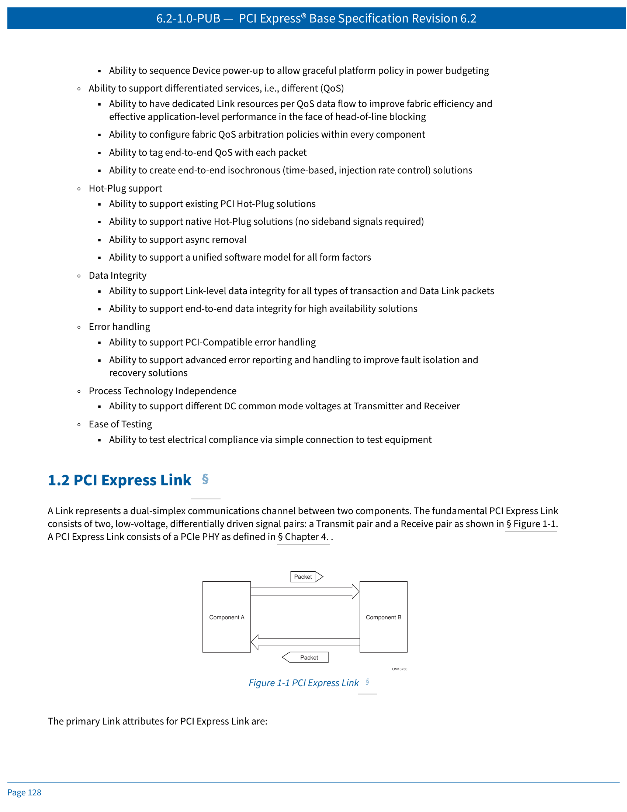
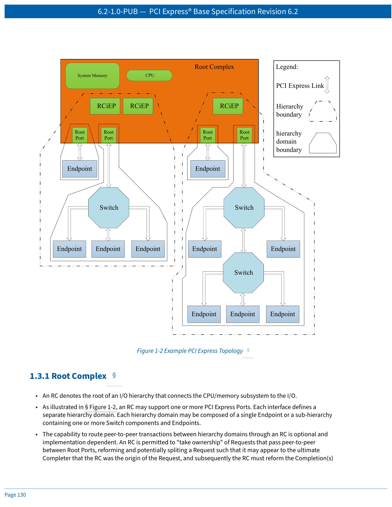
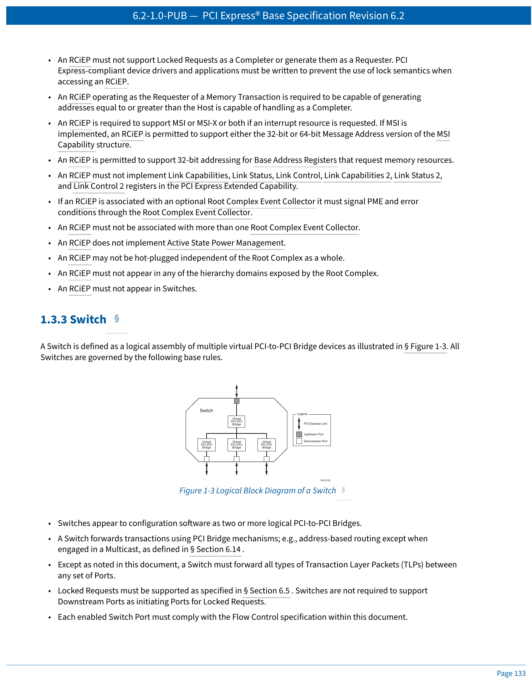
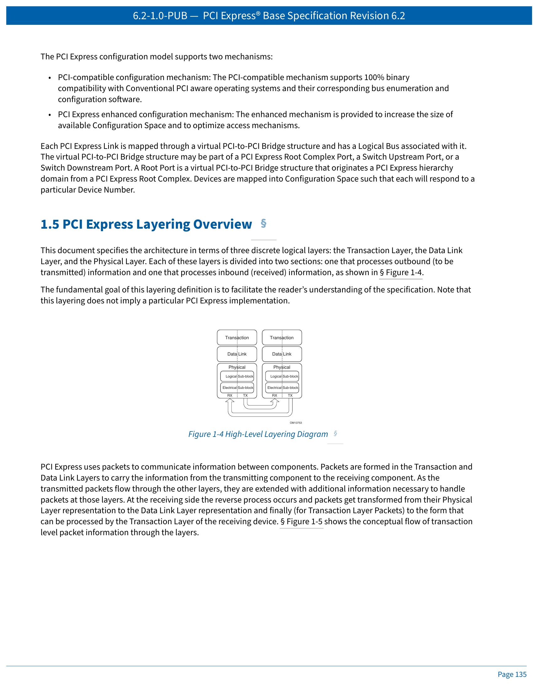
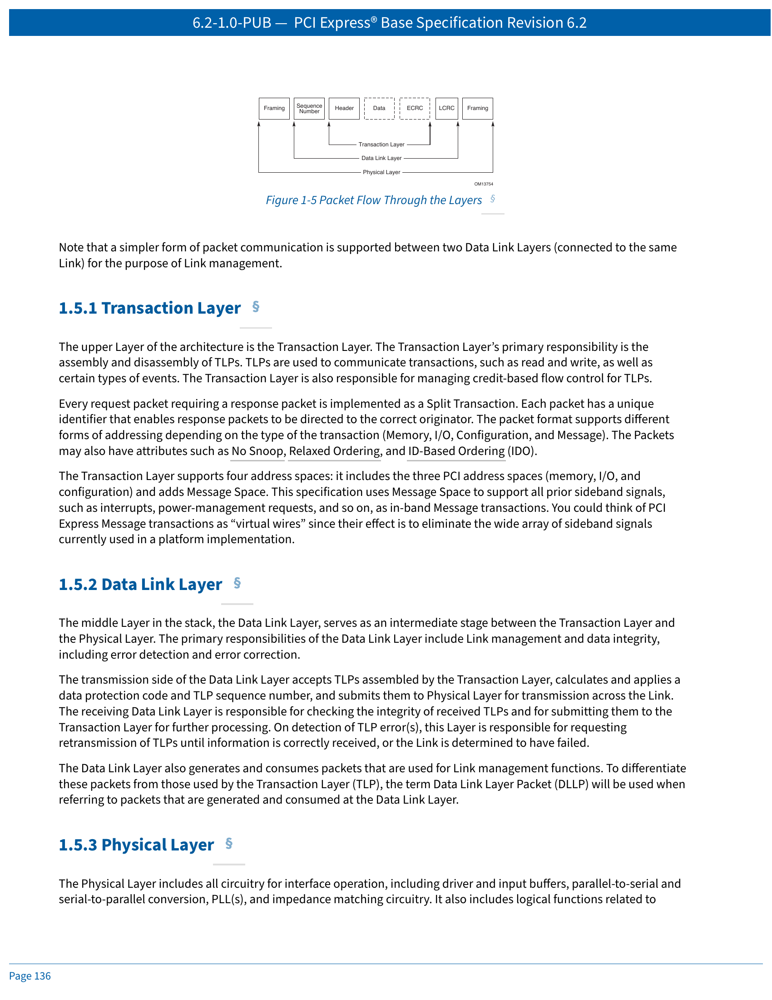

# PCI Express Base Specification Revision 6.2

# PCI Express 基础规范 修订版 6.2

**Chinese-English Parallel Translation / 中英对照翻译**

**Chapter 1: Introduction / 第1章：引言**

---

> **Document Information / 文档信息**
>
> - **Title / 标题**: PCI Express® Base Specification Revision 6.2
> - **Version / 版本**: 6.2-1.0-PUB
> - **Date / 日期**: January 25, 2024
> - **Copyright / 版权**: © 2002-2024 PCI-SIG
> - **Translator's Note / 译者说明**: This is a paragraph-level Chinese-English parallel translation. 本文为段落级中英对照翻译，英文原文在上，中文翻译紧随其后。

---

## Table of Contents / 目录

> **1. Introduction / 引言** ........................................................................................ 127
>   1.1 An Evolving I/O Interconnect / 不断演进的I/O互连 ............................................ 127
>   1.2 PCI Express Link / PCI Express链路 ............................................................... 128
>   1.3 PCI Express Fabric Topology / PCI Express结构拓扑 ........................................... 129
>      1.3.1 Root Complex / 根复合体 .................................................................. 130
>      1.3.2 Endpoints / 端点 .............................................................................. 131
>      1.3.3 Switch / 交换机 ................................................................................ 133
>      1.3.4 Root Complex Event Collector / 根复合体事件收集器 ............................... 134
>      1.3.5 PCI Express to PCI/PCI-X Bridge / PCI Express到PCI/PCI-X桥 ...................... 134
>   1.4 Hardware/Software Model for Discovery, Configuration and Operation / 硬件/软件发现、配置与操作模型 ............................................................................................. 134
>   1.5 PCI Express Layering Overview / PCI Express分层概述 ......................................... 135
>      1.5.1 Transaction Layer / 事务层 ................................................................ 136
>      1.5.2 Data Link Layer / 数据链路层 ............................................................. 136
>      1.5.3 Physical Layer / 物理层 ...................................................................... 136
>      1.5.4 Layer Functions and Services / 各层功能与服务 ........................................ 137
>
> **2. Transaction Layer Specification / 事务层规范** ...................................................... 141
> **3. Data Link Layer Specification / 数据链路层规范** .................................................... 309
> **4. Physical Layer Logical Block / 物理层逻辑块** ........................................................ 351
> **5. Power Management / 电源管理** ........................................................................... 651
> **6. System Architecture / 系统架构** .......................................................................... 707
> **7. Configuration Registers / 配置寄存器** .................................................................. 751
> **8. Electrical Specification / 电气规范** ...................................................................... 1047
> **9. Mechanical Specification / 机械规范** .................................................................... 1911
> **Appendix / 附录** .................................................................................................. 2091

> *(Full detailed TOC to be translated in subsequent batches. 详细目录将在后续批次中翻译。)*

---

## 1. Introduction / 引言

### 1.1 An Evolving I/O Interconnect / 不断演进的I/O互连

This chapter presents an overview of the PCI Express architecture and key concepts. PCI Express is a high-performance, general purpose I/O interconnect defined for a wide variety of future computing and communication platforms. Key attributes, such as usage model, load-store architecture, and software interfaces, are maintained from PCI Local Bus, whereas PCI Local Bus's parallel bus implementation is replaced by a highly scalable, fully serial interface. PCI Express takes advantage of advances in point-to-point interconnects, Switch-based technology, and packetized protocol to deliver new levels of performance and features. Power Management, Quality of Service (QoS), Hot-Plug/hot-swap support, data integrity, and error handling are among some of the advanced features supported by PCI Express.

>
> 本章概述了 PCI Express 架构及其关键概念。PCI Express 是一种高性能、通用 I/O 互连，为各种未来计算和通信平台而定义。其关键属性（如使用模型、加载-存储架构和软件接口）沿袭自 PCI 局部总线，而 PCI 局部总线的并行总线实现则被高度可扩展的全串行接口所取代。PCI Express 利用点对点互连、基于交换机的技术以及数据包化协议方面的进步，提供更高水平的性能和功能。电源管理、服务质量（QoS）、热插拔支持、数据完整性和错误处理是 PCI Express 支持的部分高级功能。
>

The high-level requirements for this evolving I/O interconnect are as follows:

>
> 这一不断演进的 I/O 互连的高层需求如下：
>

- Supports multiple market segments and emerging applications / 支持多个细分市场和新兴应用：
  - Unifying I/O architecture for desktop, mobile, workstation, server, communications platforms, and embedded devices / 统一桌面、移动、工作站、服务器、通信平台和嵌入式设备的 I/O 架构
- Ability to deliver low cost, high volume solutions / 能够提供低成本、大批量解决方案：
  - Cost at or below PCI cost structure at the system level / 系统级成本达到或低于 PCI 成本结构
- Support multiple platform interconnect usages / 支持多种平台互连用途：
  - Chip-to-chip, board-to-board via connector or cabling / 芯片到芯片、通过连接器或电缆的板到板
- A variety of mechanical form factors / 多种机械形态：
  - [M.2], [CEM] (Card Electro-Mechanical), [U.2], [OCuLink]
- PCI-compatible software model / PCI 兼容的软件模型：
  - Ability to enumerate and configure PCI Express hardware using PCI system configuration software implementations with no modifications / 能够使用 PCI 系统配置软件实现枚举和配置 PCI Express 硬件，无需修改
  - Ability to boot existing operating systems with no modifications / 能够引导现有操作系统，无需修改
  - Ability to support existing I/O device drivers with no modifications / 能够支持现有 I/O 设备驱动程序，无需修改
  - Ability to configure/enable new PCI Express functionality by adopting the PCI configuration paradigm / 能够通过采用 PCI 配置范式来配置/启用新的 PCI Express 功能
- Performance / 性能：
  - Low-overhead, low-latency communications to maximize application payload bandwidth and Link efficiency / 低开销、低延迟通信，最大化应用有效载荷带宽和链路效率
  - High-bandwidth per pin to minimize pin count per device and connector interface / 每引脚高带宽，最小化每个设备和连接器接口的引脚数
  - Scalable performance via aggregated Lanes and signaling frequency / 通过聚合通道和信号频率实现可扩展性能
- Advanced features / 高级功能：
  - Comprehend different data types and ordering rules / 理解不同数据类型和排序规则
  - Power management and budgeting / 电源管理和预算：
    - Ability to identify power management capabilities of a Device of a specific Function / 能够识别特定功能设备的电源管理能力
    - Ability to transition a Device or Function into a specific power state / 能够将设备或功能转换到特定的电源状态
    - Ability to receive notification of the current power state of a Device of Function / 能够接收设备或功能的当前电源状态通知
    - Ability to generate a request to wakeup from a power-off state of the main power supply / 能够从主电源的断电状态生成唤醒请求
    - Ability to sequence Device power-up to allow graceful platform policy in power budgeting / 能够对设备上电进行排序，以在电源预算中实现优雅的平台策略
  - Ability to support differentiated services, i.e., different (QoS) / 能够支持差异化服务，即不同的 QoS：
    - Ability to have dedicated Link resources per QoS data flow to improve fabric efficiency and effective application-level performance in the face of head-of-line blocking / 能够为每个 QoS 数据流提供专用链路资源，以在面对队头阻塞时提高结构效率和有效的应用级性能
    - Ability to configure fabric QoS arbitration policies within every component / 能够在每个组件内配置结构 QoS 仲裁策略
    - Ability to tag end-to-end QoS with each packet / 能够为每个数据包标记端到端 QoS
    - Ability to create end-to-end isochronous (time-based, injection rate control) solutions / 能够创建端到端同步（基于时间、注入速率控制）解决方案
  - Hot-Plug support / 热插拔支持：
    - Ability to support existing PCI Hot-Plug solutions / 能够支持现有 PCI 热插拔解决方案
    - Ability to support native Hot-Plug solutions (no sideband signals required) / 能够支持原生热插拔解决方案（无需边带信号）
    - Ability to support async removal / 能够支持异步移除
    - Ability to support a unified software model for all form factors / 能够支持所有形态的统一软件模型
  - Data Integrity / 数据完整性：
    - Ability to support Link-level data integrity for all types of transaction and Data Link packets / 能够支持所有类型的事务和数据链路数据包的链路级数据完整性
    - Ability to support end-to-end data integrity for high availability solutions / 能够支持高可用性解决方案的端到端数据完整性
  - Error handling / 错误处理：
    - Ability to support PCI-Compatible error handling / 能够支持 PCI 兼容的错误处理
    - Ability to support advanced error reporting and handling to improve fault isolation and recovery solutions / 能够支持高级错误报告和处理，以改进故障隔离和恢复解决方案
  - Process Technology Independence / 工艺技术独立性：
    - Ability to support different DC common mode voltages at Transmitter and Receiver / 能够在发送器和接收器支持不同的直流共模电压
  - Ease of Testing / 易于测试：
    - Ability to test electrical compliance via simple connection to test equipment / 能够通过简单连接到测试设备来测试电气合规性

---

### 1.2 PCI Express Link / PCI Express 链路

A Link represents a dual-simplex communications channel between two components. The fundamental PCI Express Link consists of two, low-voltage, differentially driven signal pairs: a Transmit pair and a Receive pair as shown in Figure 1-1. A PCI Express Link consists of a PCIe PHY as defined in Chapter 4.

>
> 链路表示两个组件之间的双单工通信通道。基本的 PCI Express 链路由两对低压差分驱动信号对组成：一对发送对和一对接收对，如图 1-1 所示。PCI Express 链路由第 4 章中定义的 PCIe PHY 组成。
>

> *Figure 1-1: PCI Express Link / 图1-1：PCI Express链路*
>
> *[Component A] ← Packet / 数据包 → [Component B]*
>
> *The diagram shows a bidirectional Link between Component A and Component B, consisting of a Transmit pair and a Receive pair. 该图显示了组件A和组件B之间的双向链路，由一对发送对和一对接收对组成。*

The primary Link attributes for PCI Express Link are:

>
> PCI Express 链路的主要链路属性包括：
>

- **The basic Link** — PCI Express Link consists of dual unidirectional differential Links, implemented as a Transmit pair and a Receive pair. A data clock is embedded using an encoding scheme (see Chapter 4) to achieve very high data rates.
- **基本链路** — PCI Express 链路由双单向差分链路组成，实现为一对发送对和一对接收对。数据时钟使用编码方案嵌入（见第4章），以实现非常高的数据速率。

- **The Signaling method** — Each major revision of PCI Express signaling has evolved one (or more) characteristics to increase bandwidth. Throughout this specification, the term GT/s is used to refer to the number of encoded bits transferred in a second on a direction of a Lane. The actual effective data rate is dependent on a combination of modulation method, encoding method, and data rate. Table 1-1 provides a summary of Max Data Rate, Modulation Scheme, Encoding Method, and Effective Max Data Rate with the accounting of only encoding overhead for all the six major revisions of PCI Express. See Chapter 4 for more information about the combined signaling method and Chapter 8 for electrical specification details for each major PCI Express revision.
- **信号方法** — PCI Express 信号的每个主要修订版都演进了一项（或多项）特性以增加带宽。在本规范中，术语 GT/s 用于指代一条通道的一个方向上每秒传输的编码比特数。实际有效数据速率取决于调制方法、编码方法和数据速率的组合。表 1-1 总结了 PCI Express 所有六个主要修订版的最大数据速率、调制方案、编码方法和扣除编码开销后的有效最大数据速率。有关组合信号方法的更多信息，请参见第4章，有关每个主要 PCI Express 修订版的电气规范详情，请参见第8章。

**Table 1-1: PCIe Signaling Characteristics / 表1-1：PCIe 信号特性**

| Data Rate | Modulation | Encoding | Effective Data Rate (after removing Encoding overhead) | Base Specification Revision |
|-----------|------------|----------|--------------------------------------------------------|----------------------------|
| 2.5 GT/s | NRZ | 8b/10b | 2 Gbit/s | 1.0, 2.0, 3.0, 4.x, 5.x, 6.x |
| 5.0 GT/s | NRZ | 8b/10b | 4 Gbit/s | 2.0, 3.0, 4.x, 5.x, 6.x |
| 8.0 GT/s | NRZ | 128b/130b | ~8 Gbit/s | 3.0, 4.x, 5.x, 6.x |
| 16.0 GT/s | NRZ | 128b/130b | ~16 Gbit/s | 4.x, 5.x, 6.x |
| 32.0 GT/s | NRZ | 128b/130b | ~32 Gbit/s | 5.x, 6.x |
| 64.0 GT/s | PAM4 | 1b/1b | 64 Gbit/s | 6.x |

> *Note: Terms like "PCIe Gen3" are ambiguous and should be avoided. For example, "gen3" could mean (1) compliant with Base 3.0, (2) compliant with Base 3.1 (last revision of 3.x), (3) compliant with Base 3.0 and supporting 8.0 GT/s, (4) compliant with Base 3.0 or later and supporting 8.0 GT/s, etc. 注意：像"PCIe Gen3"这样的术语是模糊的，应避免使用。例如，"gen3"可能意味着(1)符合Base 3.0，(2)符合Base 3.1（3.x的最后一个修订版），(3)符合Base 3.0并支持8.0 GT/s，(4)符合Base 3.0或更高版本并支持8.0 GT/s等。*

- **Lanes** — A Link must support at least one Lane — each Lane represents a set of differential signal pairs (one pair for transmission, one pair for reception). To scale bandwidth, a Link may aggregate multiple Lanes denoted by xN where N may be any of the supported Link widths. A x8 Link operating at the 2.5 GT/s data rate represents an aggregate bandwidth of 20 Gigabits/second of raw bandwidth in each direction. This specification describes operations for x1, x2, x4, x8, and x16 Lane widths.
- **通道（Lanes）** — 链路必须支持至少一条通道 — 每条通道代表一组差分信号对（一对用于发送，一对用于接收）。为扩展带宽，链路可以聚合多个通道，用 xN 表示，其中 N 可以是任何支持的链路宽度。以 2.5 GT/s 数据速率运行的 x8 链路在每个方向上表示 20 Gbps 的原始聚合带宽。本规范描述了 x1、x2、x4、x8 和 x16 通道宽度的操作。

- **Data Stream** — PCI Express uses Data Stream in Flit Mode and Data Stream in Non-Flit Mode (see Section 4.2, including Table 4-1 and Table 4-2). Support of Data Stream in Non-Flit Mode is mandatory, while support of Data Stream in Flit Mode is mandatory only if a data rate that exceeds 32.0 GT/s is supported.
- **数据流（Data Stream）** — PCI Express 使用 Flit 模式下的数据流和非 Flit 模式下的数据流（见第4.2节，包括表4-1和表4-2）。支持非 Flit 模式的数据流是强制性的，而支持 Flit 模式的数据流仅在支持超过 32.0 GT/s 的数据速率时才是强制性的。

- **Initialization** — During hardware initialization, each PCI Express Link is set up following a negotiation of Link width, data rate, and Flit mode by the two agents at each end of the Link. No firmware or operating system software is involved.
- **初始化** — 在硬件初始化期间，每个 PCI Express 链路由链路两端的两个代理协商链路宽度、数据速率和 Flit 模式后进行设置。不涉及固件或操作系统软件。

- **Symmetry** — Each Link must support a symmetric number of Lanes in each direction, i.e., a x16 Link indicates there are 16 differential signal pairs in each direction.
- **对称性** — 每条链路必须在每个方向上支持对称数量的通道，即 x16 链路表示每个方向有16对差分信号对。

---

### 1.3 PCI Express Fabric Topology / PCI Express 结构拓扑

A fabric is composed of point-to-point Links that interconnect a set of components — an example fabric topology is shown in Figure 1-2. This figure illustrates a single fabric instance with two Hierarchies composed of a Root Complex (RC), multiple Endpoints, and multiple Switches, interconnected via PCI Express Links.

>
> 结构由互连一组组件的点对点链路组成 — 图 1-2 显示了一个示例结构拓扑。该图展示了一个单一结构实例，其中包含两个层次结构，由根复合体（RC）、多个端点和多个交换机组成，通过 PCI Express 链路互连。
>

> *Figure 1-2: Example PCI Express Topology. The diagram shows an RC connected to CPU/System Memory, multiple Root Ports forming hierarchy domains, Switches, and various Endpoints including RCiEPs. 图1-2：PCI Express拓扑示例。该图显示了连接到CPU/系统内存的RC、形成层次结构域的多个根端口、交换机以及包括RCiEP在内的各种端点。*

#### 1.3.1 Root Complex / 根复合体

- An RC denotes the root of an I/O hierarchy that connects the CPU/memory subsystem to the I/O.
- RC 表示将 CPU/内存子系统连接到 I/O 的 I/O 层次结构的根。

- As illustrated in Figure 1-2, an RC may support one or more PCI Express Ports. Each interface defines a separate hierarchy domain. Each hierarchy domain may be composed of a single Endpoint or a sub-hierarchy containing one or more Switch components and Endpoints.
> - 如图1-2所示，一个RC可以支持一个或多个 PCI Express 端口。每个接口定义了一个独立的层次结构域。每个层次结构域可以由单个端点或包含一个或多个交换机组件和端点的子层次结构组成。

- The capability to route peer-to-peer transactions between hierarchy domains through an RC is optional and implementation dependent. An RC is permitted to "take ownership" of Requests that pass peer-to-peer between Root Ports, reforming and potentially splitting a Request such that it may appear to the ultimate Completer that the RC was the origin of the Request, and subsequently the RC must reform the Completion(s) being returned to the original Requester. Alternatively, an RC implementation may incorporate a real or virtual Switch internally within the Root Complex to enable full peer-to-peer support in a software transparent way.
> - 通过 RC 在层次结构域之间路由对等事务的能力是可选的，且取决于具体实现。RC 被允许"接管"在根端口之间通过对等传输的请求，重新构造并可能拆分请求，使得最终的完成者看起来 RC 是请求的发起者，随后 RC 必须重新构造返回给原始请求者的完成。或者，RC 实现可以在根复合体内部包含一个真实或虚拟的交换机，以软件透明的方式实现完全的对等支持。

- Unlike the rules for a Switch, an RC is generally permitted to split a packet into smaller packets when routing transactions peer-to-peer between hierarchy domains (except as noted below), e.g., split a single packet with a 256-byte payload into two packets of 128 bytes payload each. The resulting packets are subject to the normal packet formation rules contained in this specification (e.g., Max_Payload_Size, Read Completion Boundary (RCB), etc.). Component designers should note that splitting a packet into smaller packets may have negative performance consequences, especially for a transaction addressing a device behind a PCI Express to PCI/PCI-X bridge.
> - 与交换机的规则不同，RC 通常被允许在层次结构域之间对等路由事务时将数据包拆分为更小的数据包（除非下文另有说明），例如，将一个具有256字节有效载荷的单个数据包拆分为两个各具有128字节有效载荷的数据包。生成的数据包受本规范中包含的常规数据包形成规则的约束（例如，Max_Payload_Size、Read Completion Boundary (RCB) 等）。组件设计者应注意，将数据包拆分为更小的数据包可能会对性能产生负面影响，特别是对于寻址 PCI Express 到 PCI/PCI-X 桥后面设备的事务。

- **Exception**: An RC that supports UIO peer-to-peer routing is permitted to split UIO Memory Write Requests only at naturally aligned 64B boundaries.
- **例外**：支持 UIO 对等路由的 RC 仅允许在自然对齐的 64B 边界上拆分 UIO 存储器写请求。

- **Exception**: An RC that supports peer-to-peer routing of Deferrable Memory Write Requests is not permitted to split a Deferrable Memory Write Request packet into smaller packets (see Section 6.32).
- **例外**：支持可延迟存储器写请求对等路由的 RC 不允许将可延迟存储器写请求数据包拆分为更小的数据包（见第6.32节）。

- **Exception**: An RC that supports peer-to-peer routing of Vendor-Defined Messages is not permitted to split a Vendor-Defined Message packet into smaller packets except at 128-byte boundaries (i.e., all resulting packets except the last must be an integral multiple of 128 bytes in length) in order to retain the ability to forward the Message across a PCI Express to PCI/PCI-X Bridge.
- **例外**：支持供应商定义消息对等路由的 RC 不允许将供应商定义消息数据包拆分为更小的数据包，除非在128字节边界上（即，除最后一个外，所有生成的数据包长度必须是128字节的整数倍），以便保留通过 PCI Express 到 PCI/PCI-X 桥转发消息的能力。

- An RC must support generation of Configuration Requests as a Requester.
- RC 必须支持作为请求者生成配置请求。

- An RC is permitted to support the generation of I/O Requests as a Requester.
  - An RC is permitted to generate I/O Requests to either or both of locations 80h and 84h to a selected Root Port, without regard to that Root Port's PCI Bridge I/O decode configuration; it is recommended that this mechanism only be enabled when specifically needed.
- RC 被允许支持作为请求者生成 I/O 请求。
  - RC 被允许向选定的根端口的 80h 和 84h 位置之一或两者生成 I/O 请求，而不考虑该根端口的 PCI 桥 I/O 解码配置；建议仅在特别需要时启用此机制。

- An RC must not support Lock semantics as a Completer.
- RC 不得作为完成者支持锁定语义。

- An RC is permitted to support generation of Locked Requests as a Requester.
- RC 被允许支持作为请求者生成锁定请求。

#### 1.3.2 Endpoints / 端点

Endpoint refers to a type of Function that can be the Requester or Completer of a PCI Express transaction either on its own behalf or on behalf of a distinct non-PCI Express device (other than a PCI device or host CPU), e.g., a PCI Express attached graphics controller or a PCI Express-USB host controller. Endpoints are classified as either legacy, PCI Express, or Root Complex Integrated Endpoints (RCiEPs).

>
> 端点指一种功能类型，可以作为 PCI Express 事务的请求者或完成者，代表自身或代表一个独立的非 PCI Express 设备（除 PCI 设备或主机 CPU 外），例如，PCI Express 连接的图形控制器或 PCI Express-USB 主机控制器。端点分为传统端点、PCI Express 端点或根复合体集成端点（RCiEP）。
>

##### 1.3.2.1 Legacy Endpoint Rules / 传统端点规则

- A Legacy Endpoint must be a Function with a Type 00h Configuration Space header.
> - 传统端点必须是具有 Type 00h 配置空间头的功能。

- A Legacy Endpoint must support Configuration Requests as a Completer.
> - 传统端点必须支持作为完成者处理配置请求。

- A Legacy Endpoint may support I/O Requests as a Completer.
  - A Legacy Endpoint is permitted to accept I/O Requests to either or both of locations 80h and 84h, without regard to that Endpoint's I/O decode configuration.
> - 传统端点可以支持作为完成者处理 I/O 请求。
>   - 传统端点被允许接受 80h 和 84h 位置之一或两者的 I/O 请求，而不考虑该端点的 I/O 解码配置。

- A Legacy Endpoint may generate I/O Requests.
> - 传统端点可以生成 I/O 请求。

- A Legacy Endpoint may support Lock memory semantics as a Completer if that is required by the device's legacy software support requirements.
> - 如果设备的传统软件支持要求需要，传统端点可以支持作为完成者的锁定存储器语义。

- A Legacy Endpoint must not issue a Locked Request.
> - 传统端点不得发出锁定请求。

- A Legacy Endpoint may implement Extended Configuration Space Capabilities, but such Capabilities may be ignored by software.
> - 传统端点可以实现扩展配置空间能力，但软件可能会忽略这些能力。

- A Legacy Endpoint operating as the Requester of a Memory Transaction is not required to be capable of generating addresses 4 GB or greater.
> - 作为存储器事务请求者操作的传统端点不需要能够生成 4 GB 或更大的地址。

- A Legacy Endpoint is required to support MSI or MSI-X or both if an interrupt resource is requested. If MSI is implemented, a Legacy Endpoint is permitted to support either the 32-bit or 64-bit Message Address version of the MSI Capability structure.
> - 如果请求中断资源，传统端点需要支持 MSI 或 MSI-X 或两者。如果实现了 MSI，传统端点被允许支持 MSI 能力结构的 32 位或 64 位消息地址版本。

- A Legacy Endpoint is permitted to support 32-bit addressing for Base Address Registers that request memory resources.
> - 传统端点被允许为请求存储器资源的基地址寄存器支持 32 位寻址。

- A Legacy Endpoint must appear within one of the hierarchy domains originated by the Root Complex.
> - 传统端点必须出现在由根复合体发起的层次结构域之一内。

##### 1.3.2.2 PCI Express Endpoint Rules / PCI Express 端点规则

- A PCI Express Endpoint must be a Function with a Type 00h Configuration Space header.
- PCI Express 端点必须是具有 Type 00h 配置空间头的功能。

- A PCI Express Endpoint must support Configuration Requests as a Completer.
- PCI Express 端点必须支持作为完成者处理配置请求。

- A PCI Express Endpoint must not depend on operating system allocation of I/O resources claimed through BAR(s).
- PCI Express 端点不得依赖操作系统通过 BAR 声明的 I/O 资源分配。

- A PCI Express Endpoint must not generate I/O Requests.
- PCI Express 端点不得生成 I/O 请求。

- A PCI Express Endpoint must not support Locked Requests as a Completer or generate them as a Requester. PCI Express-compliant device drivers and applications must be written to prevent the use of lock semantics when accessing a PCI Express Endpoint.
- PCI Express 端点不得支持作为完成者的锁定请求，也不得作为请求者生成锁定请求。PCI Express 兼容的设备驱动程序和应用程序必须编写为防止在访问 PCI Express 端点时使用锁定语义。

- A PCI Express Endpoint operating as the Requester of a Memory Transaction is required to be capable of generating addresses greater than 4 GB.
> - 作为存储器事务请求者操作的 PCI Express 端点需要能够生成大于 4 GB 的地址。

- A PCI Express Endpoint is required to support MSI or MSI-X or both if an interrupt resource is requested. If MSI is implemented, a PCI Express Endpoint must support the 64-bit Message Address version of the MSI Capability structure.
> - 如果请求中断资源，PCI Express 端点需要支持 MSI 或 MSI-X 或两者。如果实现了 MSI，PCI Express 端点必须支持 MSI 能力结构的 64 位消息地址版本。

- A PCI Express Endpoint requesting memory resources through a BAR must set the BAR's Prefetchable bit unless the range contains locations with read side-effects or locations in which the Function does not tolerate write merging. See Section 7.5.1.2.1 for additional guidance on having the Prefetchable bit Set.
> - 通过 BAR 请求存储器资源的 PCI Express 端点必须设置 BAR 的预取位，除非该范围包含具有读副作用的地址或功能不允许写合并的地址。有关设置预取位的其他指导，请参见第7.5.1.2.1节。

- For a PCI Express Endpoint, 64-bit addressing must be supported for all BARs that have the Prefetchable bit Set. 32-bit addressing is permitted for all BARs that do not have the Prefetchable bit Set.
> - 对于 PCI Express 端点，必须为所有设置了预取位的 BAR 支持 64 位寻址。允许为所有未设置预取位的 BAR 支持 32 位寻址。

- The minimum memory address range requested by a BAR is 128 bytes.
- BAR 请求的最小存储器地址范围是 128 字节。

- A PCI Express Endpoint must appear within one of the hierarchy domains originated by the Root Complex.
- PCI Express 端点必须出现在由根复合体发起的层次结构域之一内。

##### 1.3.2.3 Root Complex Integrated Endpoint Rules / 根复合体集成端点规则

- A Root Complex Integrated Endpoint (RCiEP) is implemented on internal logic of Root Complexes that contains the Root Ports.
> - 根复合体集成端点（RCiEP）在包含根端口的根复合体的内部逻辑上实现。

- An RCiEP must be a Function with a Type 00h Configuration Space header.
- RCiEP 必须是具有 Type 00h 配置空间头的功能。

- An RCiEP must support Configuration Requests as a Completer.
- RCiEP 必须支持作为完成者处理配置请求。

- An RCiEP must not require I/O resources claimed through BAR(s).
- RCiEP 不得要求通过 BAR 声明的 I/O 资源。

- An RCiEP must not generate I/O Requests.
- RCiEP 不得生成 I/O 请求。

- An RCiEP must not support Locked Requests as a Completer or generate them as a Requester. PCI Express-compliant device drivers and applications must be written to prevent the use of lock semantics when accessing an RCiEP.
- RCiEP 不得支持作为完成者的锁定请求，也不得作为请求者生成锁定请求。PCI Express 兼容的设备驱动程序和应用程序必须编写为防止在访问 RCiEP 时使用锁定语义。

- An RCiEP operating as the Requester of a Memory Transaction is required to be capable of generating addresses equal to or greater than the Host is capable of handling as a Completer.
> - 作为存储器事务请求者操作的 RCiEP 需要能够生成等于或大于主机作为完成者能够处理的地址。

- An RCiEP is required to support MSI or MSI-X or both if an interrupt resource is requested. If MSI is implemented, an RCiEP is permitted to support either the 32-bit or 64-bit Message Address version of the MSI Capability structure.
> - 如果请求中断资源，RCiEP 需要支持 MSI 或 MSI-X 或两者。如果实现了 MSI，RCiEP 被允许支持 MSI 能力结构的 32 位或 64 位消息地址版本。

- An RCiEP is permitted to support 32-bit addressing for Base Address Registers that request memory resources.
- RCiEP 被允许为请求存储器资源的基地址寄存器支持 32 位寻址。

- An RCiEP must not implement Link Capabilities, Link Status, Link Control, Link Capabilities 2, Link Status 2, and Link Control 2 registers in the PCI Express Extended Capability.
- RCiEP 不得在 PCI Express 扩展能力中实现链路能力、链路状态、链路控制、链路能力2、链路状态2和链路控制2寄存器。

- If an RCiEP is associated with an optional Root Complex Event Collector, it must signal PME and error conditions through the Root Complex Event Collector.
> - 如果 RCiEP 与可选的根复合体事件收集器关联，则必须通过根复合体事件收集器发出 PME 和错误条件信号。

- An RCiEP must not be associated with more than one Root Complex Event Collector.
- RCiEP 不得与多个根复合体事件收集器关联。

- An RCiEP does not implement Active State Power Management.
- RCiEP 不实现主动状态电源管理。

- An RCiEP may not be hot-plugged independent of the Root Complex as a whole.
- RCiEP 不能独立于整个根复合体进行热插拔。

- An RCiEP must not appear in any of the hierarchy domains exposed by the Root Complex.
- RCiEP 不得出现在根复合体公开的任何层次结构域中。

- An RCiEP must not appear in Switches.
- RCiEP 不得出现在交换机中。

---

### 1.3.3 Switch / 交换机

A Switch is defined as a logical assembly of multiple virtual PCI-to-PCI Bridge devices as illustrated in Figure 1-3. All Switches are governed by the following base rules.

>
> 交换机被定义为多个虚拟 PCI-to-PCI 桥设备的逻辑组合，如图 1-3 所示。所有交换机受以下基本规则的约束。
>

> *Figure 1-3: Logical Block Diagram of a Switch. Shows an Upstream Port connected to multiple Downstream Ports through virtual PCI-to-PCI Bridges. 图1-3：交换机逻辑框图。显示了一个上行端口通过虚拟PCI-to-PCI桥连接到多个下行端口。*

- Switches appear to configuration software as two or more logical PCI-to-PCI Bridges.
> - 交换机在配置软件中呈现为两个或多个逻辑 PCI-to-PCI 桥。

- A Switch forwards transactions using PCI Bridge mechanisms; e.g., address-based routing except when engaged in a Multicast, as defined in Section 6.14.
> - 交换机使用 PCI 桥机制转发事务；例如，基于地址的路由，除非在进行了多播时（如第6.14节所定义）。

- Except as noted in this document, a Switch must forward all types of Transaction Layer Packets (TLPs) between any set of Ports.
> - 除非本文件另有说明，交换机必须在任意端口组之间转发所有类型的事务层数据包（TLP）。

- Locked Requests must be supported as specified in Section 6.5. Switches are not required to support Downstream Ports as initiating Ports for Locked Requests.
> - 必须按照第6.5节的规定支持锁定请求。不要求交换机支持下行端口作为锁定请求的发起端口。

- Each enabled Switch Port must comply with the Flow Control specification within this document.
> - 每个启用的交换机端口必须符合本文件中的流控制规范。

- A Switch is not allowed to split a packet into smaller packets, e.g., a single packet with a 256-byte payload must not be divided into two packets of 128 bytes payload each.
> - 不允许交换机将数据包拆分为更小的数据包，例如，不得将具有256字节有效载荷的单个数据包拆分为各具有128字节有效载荷的两个数据包。

- Arbitration between Ingress Ports (inbound Link) of a Switch may be implemented using round robin or weighted round robin when contention occurs on the same Virtual Channel. This is described in more detail later within the specification.
> - 当在同一虚拟通道上发生竞争时，交换机入口端口（入站链路）之间的仲裁可以使用轮询或加权轮询来实现。这将在本规范的后续部分中更详细地描述。

- Endpoints (represented by Type 00h Configuration Space headers) must not appear to configuration software on the Switch's internal bus as peers of the virtual PCI-to-PCI Bridges representing the Switch Downstream Ports.
> - 端点（由 Type 00h 配置空间头表示）不得在配置软件中作为交换机内部总线上代表交换机下行端口的虚拟 PCI-to-PCI 桥的对等体出现。

---

### 1.3.4 Root Complex Event Collector / 根复合体事件收集器

- A Root Complex Event Collector (RCEC) provides support for terminating error and PME messages from RCiEPs.
> - 根复合体事件收集器（RCEC）为终止来自 RCiEP 的错误和 PME 消息提供支持。

- A Root Complex Event Collector must follow all rules for an RCiEP (unless otherwise specified).
> - 根复合体事件收集器必须遵循 RCiEP 的所有规则（除非另有规定）。

- A Root Complex Event Collector is not required to decode any memory or I/O resources.
> - 根复合体事件收集器不需要解码任何存储器或 I/O 资源。

- A Root Complex Event Collector is identified by its Device/Port Type value (see Section 7.5.3.2).
> - 根复合体事件收集器通过其设备/端口类型值来识别（见第7.5.3.2节）。

- A Root Complex Event Collector has the Base Class 08h, Sub-Class 07h and Programming Interface 00h. (Since an earlier version of this specification used Sub-Class 06h for this purpose, an implementation is still permitted to use Sub-Class 06h, but this is strongly discouraged.)
> - 根复合体事件收集器的基类为 08h，子类为 07h，编程接口为 00h。（由于本规范的早期版本为此目的使用了子类 06h，仍然允许实现使用子类 06h，但强烈不建议这样做。）

- A Root Complex Event Collector resides on a Bus in the Root Complex. Multiple Root Complex Event Collectors are permitted to reside on a single Bus.
> - 根复合体事件收集器驻留在根复合体中的总线上。允许多个根复合体事件收集器驻留在单条总线上。

- A Root Complex Event Collector explicitly declares supported RCiEPs through the Root Complex Event Collector Endpoint Association Extended Capability.
> - 根复合体事件收集器通过根复合体事件收集器端点关联扩展能力显式声明支持的 RCiEP。

- Root Complex Event Collectors are optional.
> - 根复合体事件收集器是可选的。

### 1.3.5 PCI Express to PCI/PCI-X Bridge / PCI Express 到 PCI/PCI-X 桥

- A PCI Express to PCI/PCI-X Bridge provides a connection between a PCI Express fabric and a PCI/PCI-X hierarchy.
- PCI Express 到 PCI/PCI-X 桥在 PCI Express 结构和 PCI/PCI-X 层次结构之间提供连接。

---

### 1.4 Hardware/Software Model for Discovery, Configuration and Operation / 硬件/软件发现、配置与操作模型

The PCI/PCIe hardware/software model includes architectural constructs necessary to discover, configure, and use a Function, without needing Function-specific knowledge. Key elements include:

>
> PCI/PCIe 硬件/软件模型包括发现、配置和使用功能所需的架构构造，而无需特定于功能的知识。关键元素包括：
>

- A configuration model which provides system software the means to discover hardware Functions available in a system
> - 配置模型，为系统软件提供发现系统中可用硬件功能的手段

- Mechanisms to perform basic resource allocation for addressable resources such as memory space and interrupts
> - 为可寻址资源（如存储空间和中断）执行基本资源分配的机制

- Enable/disable controls for Function response to received Requests, and initiation of Requests
> - 启用/禁用控制，用于功能对接收到的请求的响应以及请求的发起

- Well-defined ordering and flow control models to support the consistent and robust implementation of hardware/software interfaces
> - 定义良好的排序和流控制模型，以支持硬件/软件接口的一致和健壮实现

The PCI Express configuration model supports two mechanisms:

>
> PCI Express 配置模型支持两种机制：
>

- **PCI-compatible configuration mechanism**: The PCI-compatible mechanism supports 100% binary compatibility with Conventional PCI aware operating systems and their corresponding bus enumeration and configuration software.
- **PCI 兼容配置机制**：PCI 兼容机制支持与支持传统 PCI 的操作系统及其相应的总线枚举和配置软件 100% 二进制兼容。

- **PCI Express enhanced configuration mechanism**: The enhanced mechanism is provided to increase the size of available Configuration Space and to optimize access mechanisms.
- **PCI Express 增强配置机制**：提供增强机制以增加可用配置空间的大小并优化访问机制。

Each PCI Express Link is mapped through a virtual PCI-to-PCI Bridge structure and has a Logical Bus associated with it. The virtual PCI-to-PCI Bridge structure may be part of a PCI Express Root Complex Port, a Switch Upstream Port, or a Switch Downstream Port. A Root Port is a virtual PCI-to-PCI Bridge structure that originates a PCI Express hierarchy domain from a PCI Express Root Complex. Devices are mapped into Configuration Space such that each will respond to a particular Device Number.

>
> 每个 PCI Express 链路通过虚拟 PCI-to-PCI 桥结构进行映射，并与一个逻辑总线关联。虚拟 PCI-to-PCI 桥结构可以是 PCI Express 根复合体端口、交换机上行端口或交换机下行端口的一部分。根端口是从 PCI Express 根复合体发起 PCI Express 层次结构域的虚拟 PCI-to-PCI 桥结构。设备被映射到配置空间中，使得每个设备都响应特定的设备号。
>

---

### 1.5 PCI Express Layering Overview / PCI Express 分层概述

This document specifies the architecture in terms of three discrete logical layers: the Transaction Layer, the Data Link Layer, and the Physical Layer. Each of these layers is divided into two sections: one that processes outbound (to be transmitted) information and one that processes inbound (received) information, as shown in Figure 1-4. The fundamental goal of this layering definition is to facilitate the reader's understanding of the specification. Note that this layering does not imply a particular PCI Express implementation.

>
> 本文件从三个独立的逻辑层来规定架构：事务层、数据链路层和物理层。每层分为两个部分：一个处理出站（待发送）信息，一个处理入站（已接收）信息，如图 1-4 所示。此分层定义的基本目标是促进读者对本规范的理解。注意，此分层并不意味着特定的 PCI Express 实现。
>

> *Figure 1-4: High-Level Layering Diagram. Shows Tx/Rx for Transaction Layer, Data Link Layer, and Physical Layer (with Logical and Electrical sub-blocks). 图1-4：高层分层图。显示了事务层、数据链路层和物理层（含逻辑和电气子块）的Tx/Rx。*

PCI Express uses packets to communicate information between components. Packets are formed in the Transaction and Data Link Layers to carry the information from the transmitting component to the receiving component. As the transmitted packets flow through the other layers, they are extended with additional information necessary to handle packets at those layers. At the receiving side the reverse process occurs and packets get transformed from their Physical Layer representation to the Data Link Layer representation and finally (for Transaction Layer Packets) to the form that can be processed by the Transaction Layer of the receiving device. Figure 1-5 shows the conceptual flow of transaction level packet information through the layers.

>
> PCI Express 使用数据包在组件之间传递信息。数据包在事务层和数据链路层中形成，将信息从发送组件传输到接收组件。随着发送的数据包流经其他层，它们会被附加在这些层处理数据包所需的额外信息。在接收侧，反向过程发生，数据包从其物理层表示转换为数据链路层表示，最终（对于事务层数据包）转换为可以被接收设备的事务层处理的形式。图 1-5 显示了事务级数据包信息通过各层的概念流。
>

> *Figure 1-5: Packet Flow Through the Layers. Shows the framing, sequence number, header, data, ECRC, LCRC being added/removed at each layer. 图1-5：数据包流经各层。显示了帧定界、序列号、头部、数据、ECRC、LCRC在各层的添加/移除。*

Note that a simpler form of packet communication is supported between two Data Link Layers (connected to the same Link) for the purpose of Link management.

>
> 注意，在两个数据链路层之间（连接到同一条链路）支持一种更简单的数据包通信形式，用于链路管理的目的。
>

#### 1.5.1 Transaction Layer / 事务层

The upper Layer of the architecture is the Transaction Layer. The Transaction Layer's primary responsibility is the assembly and disassembly of TLPs. TLPs are used to communicate transactions, such as read and write, as well as certain types of events. The Transaction Layer is also responsible for managing credit-based flow control for TLPs.

>
> 架构的上层是事务层。事务层的主要职责是 TLP 的组装和拆解。TLP 用于传递事务，如读和写，以及某些类型的事件。事务层还负责管理 TLP 的基于信用的流控制。
>

Every request packet requiring a response packet is implemented as a Split Transaction. Each packet has a unique identifier that enables response packets to be directed to the correct originator. The packet format supports different forms of addressing depending on the type of the transaction (Memory, I/O, Configuration, and Message). The packets may also have attributes such as No Snoop, Relaxed Ordering, and ID-Based Ordering (IDO).

>
> 每个需要响应数据包的请求数据包都实现为拆分事务。每个数据包都有一个唯一标识符，使响应数据包能够定向到正确的发起者。数据包格式根据事务类型（存储器、I/O、配置和消息）支持不同形式的寻址。数据包还可以具有属性，如 No Snoop、Relaxed Ordering 和 ID-Based Ordering (IDO)。
>

The Transaction Layer supports four address spaces: it includes the three PCI address spaces (memory, I/O, and configuration) and adds Message Space. This specification uses Message Space to support all prior sideband signals, such as interrupts, power-management requests, and so on, as in-band Message transactions. You could think of PCI Express Message transactions as "virtual wires" since their effect is to eliminate the wide array of sideband signals currently used in a platform implementation.

>
> 事务层支持四个地址空间：它包括三个 PCI 地址空间（存储器、I/O 和配置）并增加了消息空间。本规范使用消息空间来支持所有先前的边带信号，如中断、电源管理请求等，作为带内消息事务。您可以将 PCI Express 消息事务视为"虚拟线路"，因为它们的效果是消除了当前平台实现中使用的大量边带信号。
>

#### 1.5.2 Data Link Layer / 数据链路层

The middle Layer in the stack, the Data Link Layer, serves as an intermediate stage between the Transaction Layer and the Physical Layer. The primary responsibilities of the Data Link Layer include Link management and data integrity, including error detection and error correction.

>
> 堆栈中的中间层——数据链路层，作为事务层和物理层之间的中间阶段。数据链路层的主要职责包括链路管理和数据完整性，包括错误检测和错误纠正。
>

The transmission side of the Data Link Layer accepts TLPs assembled by the Transaction Layer, calculates and applies a data protection code and TLP sequence number, and submits them to Physical Layer for transmission across the Link. The receiving Data Link Layer is responsible for checking the integrity of received TLPs and for submitting them to the Transaction Layer for further processing. On detection of TLP error(s), this Layer is responsible for requesting retransmission of TLPs until information is correctly received, or the Link is determined to have failed.

>
> 数据链路层的发送侧接收事务层组装的 TLP，计算并应用数据保护码和 TLP 序列号，然后将其提交给物理层以通过链路传输。接收数据链路层负责检查接收到的 TLP 的完整性，并将其提交给事务层进行进一步处理。在检测到 TLP 错误时，该层负责请求重新传输 TLP，直到信息被正确接收，或确定链路已失败。
>

The Data Link Layer also generates and consumes packets that are used for Link management functions. To differentiate these packets from those used by the Transaction Layer (TLP), the term Data Link Layer Packet (DLLP) will be used when referring to packets that are generated and consumed at the Data Link Layer.

>
> 数据链路层还生成和使用用于链路管理功能的数据包。为了将这些数据包与事务层使用的数据包（TLP）区分开来，在引用在数据链路层生成和使用的数据包时，将使用术语数据链路层数据包（DLLP）。
>

#### 1.5.3 Physical Layer / 物理层

The Physical Layer includes all circuitry for interface operation, including driver and input buffers, parallel-to-serial and serial-to-parallel conversion, PLL(s), and impedance matching circuitry. It also includes logical functions related to interface initialization and maintenance. The Physical Layer exchanges information with the Data Link Layer in an implementation specific format. This Layer is responsible for converting information received from the Data Link Layer into an appropriate serialized format and transmitting it across the PCI Express Link at a frequency and width compatible with the component connected to the other side of the Link.

>
> 物理层包括接口操作的所有电路，包括驱动器和输入缓冲器、并串和串并转换、PLL 以及阻抗匹配电路。它还包括与接口初始化和维护相关的逻辑功能。物理层以实现特定的格式与数据链路层交换信息。该层负责将从数据链路层接收的信息转换为适当的序列化格式，并以与连接到链路另一侧的组件兼容的频率和宽度在 PCI Express 链路上传输。
>

The PCI Express architecture has "hooks" to support future performance enhancements via speed upgrades and advanced encoding techniques. The future speeds, encoding techniques or media may only impact the Physical Layer definition.

>
> PCI Express 架构具有"钩子"以支持通过速度升级和高级编码技术实现未来性能增强。未来的速度、编码技术或介质可能仅影响物理层定义。
>

#### 1.5.4 Layer Functions and Services / 各层功能与服务

##### 1.5.4.1 Transaction Layer Services / 事务层服务

The Transaction Layer, in the process of generating and receiving TLPs, exchanges Flow Control information with its complementary Transaction Layer on the other side of the Link. It is also responsible for supporting both software and hardware-initiated power management.

>
> 事务层在生成和接收 TLP 的过程中，与链路另一侧的互补事务层交换流控制信息。它还负责支持软件和硬件启动的电源管理。
>

Initialization and configuration functions require the Transaction Layer to:
- Store Link configuration information generated by the processor or management device,
- Store Link capabilities generated by Physical Layer hardware negotiation of width and operational frequency.

>
> 初始化和配置功能要求事务层：
> - 存储由处理器或管理设备生成的链路配置信息，
> - 存储由物理层硬件协商宽度和操作频率生成的链路能力。
>

A Transaction Layer's Packet generation and processing services require it to:
- Generate TLPs from device core Requests
- Convert received Request TLPs into Requests for the device core,
- Convert received Completion Packets into a payload, or status information, deliverable to the core,
- Detect unsupported TLPs and invoke appropriate mechanisms for handling them,
- If end-to-end data integrity is supported, generate the end-to-end data integrity CRC and update the TLP header accordingly.

>
> 事务层的数据包生成和处理服务要求其：
> - 从设备核心请求生成 TLP
> - 将接收到的请求 TLP 转换为设备核心的请求，
> - 将接收到的完成数据包转换为可交付给核心的有效载荷或状态信息，
> - 检测不受支持的 TLP 并调用适当的机制来处理它们，
> - 如果支持端到端数据完整性，生成端到端数据完整性 CRC 并相应更新 TLP 头。
>

Flow Control services:
- The Transaction Layer tracks Flow Control credits for TLPs across the Link.
- Transaction credits status is periodically transmitted to the remote Transaction Layer using transport services of the Data Link Layer.
- Remote Flow Control information is used to throttle TLP transmission.

>
> 流控制服务：
> - 事务层跟踪链路上 TLP 的流控制信用。
> - 事务信用状态使用数据链路层的传输服务定期传输到远程事务层。
> - 远程流控制信息用于限制 TLP 传输。
>

Ordering rules:
- PCI/PCI-X compliant producer/consumer ordering model,
- Extensions to support Relaxed Ordering,
- Extensions to support ID-Based Ordering,
- Support for UIO ordering model.

>
> 排序规则：
> - PCI/PCI-X 兼容的生产者/消费者排序模型，
>

> - 支持 Relaxed Ordering 的扩展，
> - 支持 ID-Based Ordering 的扩展，
> - 支持 UIO 排序模型。

Power management services:
- Software-controlled power management through mechanisms, as dictated by system software.
- Hardware-controlled autonomous power management minimizes power during full-on power states.

>
> 电源管理服务：
> - 通过系统软件指定的机制进行软件控制的电源管理。
> - 硬件控制的自主电源管理在全开电源状态期间最小化功耗。
>

Virtual Channels and Traffic Class:
- The combination of Virtual Channel mechanism and Traffic Class identification is provided to support differentiated services and QoS support for certain classes of applications. They are also used to provide separate ordering domains for UIO and non-UIO Virtual Channels.
- Virtual Channels: Virtual Channels provide a means to support multiple independent logical data flows over given common physical resources of the Link. Conceptually this involves multiplexing different data flows onto a single physical Link.
- Traffic Class: The Traffic Class is a Transaction Layer Packet label that is transmitted unmodified end-to-end through the fabric. At every service point (e.g., Switch) within the fabric, Traffic Class labels are used to apply appropriate servicing policies. Each Traffic Class label defines a unique ordering domain — no ordering guarantees are provided for packets that contain different Traffic Class labels.

>
> 虚拟通道和流量类别：
> - 虚拟通道机制和流量类别标识的组合用于支持差异化服务和某些应用类别的 QoS 支持。它们还用于为 UIO 和非 UIO 虚拟通道提供独立的排序域。
> - 虚拟通道：虚拟通道提供了在给定的公共物理链路资源上支持多个独立逻辑数据流的手段。概念上，这涉及将不同的数据流多路复用到单个物理链路上。
> - 流量类别：流量类别是一个事务层数据包标签，通过结构端到端不变地传输。在结构内的每个服务点（如交换机），流量类别标签用于应用适当的服务策略。每个流量类别标签定义了一个唯一的排序域 — 对于包含不同流量类别标签的数据包，不提供排序保证。
>

##### 1.5.4.2 Data Link Layer Services / 数据链路层服务

The Data Link Layer is responsible for reliably exchanging information with its counterpart on the opposite side of the Link.

>
> 数据链路层负责与链路对面的对应层可靠地交换信息。
>

Initialization and power management services:
- Accept power state Requests from the Transaction Layer and convey to the Physical Layer
- Convey active/reset/disconnected/power managed state to the Transaction Layer

>
> 初始化和电源管理服务：
> - 接受来自事务层的电源状态请求并传递给物理层
> - 将活动/复位/断开/电源管理状态传递给事务层
>

Data protection, error checking, and retry services:
- CRC generation
- Transmitted TLP storage for Data Link level retry
- Error checking
- TLP acknowledgment and retry Messages
- Error indication for error reporting and logging

>
> 数据保护、错误检查和重试服务：
> - CRC 生成
> - 用于数据链路级重试的已发送 TLP 存储
> - 错误检查
> - TLP 确认和重试消息
> - 用于错误报告和记录的错误指示
>

##### 1.5.4.3 Physical Layer Services / 物理层服务

Interface initialization, maintenance control, and status tracking:
- Reset/Hot-Plug control/status
- Interconnect power management
- Width and Lane mapping negotiation
- Lane polarity inversion

>
> 接口初始化、维护控制和状态跟踪：
> - 复位/热插拔控制/状态
> - 互连电源管理
> - 宽度和通道映射协商
> - 通道极性反转
>

Symbol and special Ordered Set generation:
- 8b/10b encoding/decoding
- Embedded clock tuning and alignment

>
> 符号和特殊有序集生成：
> - 8b/10b 编码/解码
> - 嵌入时钟调谐和对齐
>

Block and special Ordered Set generation:
- 128b/130b encoding/decoding
- 1b/1b encoding/decoding
- Link Equalization

>
> 块和特殊有序集生成：
> - 128b/130b 编码/解码
> - 1b/1b 编码/解码
> - 链路均衡
>

Symbol transmission and alignment:
- Transmission circuits
- Reception circuits
- Elastic buffer at receiving side
- Multi-Lane de-skew (for widths > x1) at receiving side

>
> 符号传输和对齐：
> - 传输电路
> - 接收电路
> - 接收侧的弹性缓冲器
> - 接收侧的多通道去偏移（宽度 > x1）
>

System Design For Testability (DFT) support features:
- Compliance Pattern (see Section 4.2.9, Section 4.2.11, and Section 4.2.14)
- Modified Compliance Pattern (see Section 4.2.10, Section 4.2.12, and Section 4.2.15)
- Jitter Measurement Pattern (see Section 4.2.13 and Section 4.2.16)
- Flit Error Injection (see Section 7.8.13)

>
> 系统可测试性设计 (DFT) 支持功能：
> - 合规模式（见第4.2.9节、第4.2.11节和第4.2.14节）
> - 修改的合规模式（见第4.2.10节、第4.2.12节和第4.2.15节）
> - 抖动测量模式（见第4.2.13节和第4.2.16节）
> - Flit 错误注入（见第7.8.13节）
>

##### 1.5.4.4 Inter-Layer Interfaces / 层间接口

**1.5.4.4.1 Transaction/Data Link Interface / 事务层/数据链路层接口**

The Transaction to Data Link interface provides:
- Byte or multi-byte data to be sent across the Link
  - Local TLP-transfer handshake mechanism
  - TLP boundary information
- Requested power state for the Link

>
> 事务层到数据链路层接口提供：
> - 要通过链路发送的字节或多字节数据
>   - 本地 TLP 传输握手机制
>   - TLP 边界信息
> - 链路的请求电源状态
>

The Data Link to Transaction interface provides:
- Byte or multi-byte data received from the PCI Express Link
- TLP framing information for the received byte
- Actual power state for the Link
- Link status information

>
> 数据链路层到事务层接口提供：
> - 从 PCI Express 链路接收的字节或多字节数据
> - 接收字节的 TLP 定帧信息
> - 链路的实际电源状态
> - 链路状态信息
>

**1.5.4.4.2 Data Link/Physical Interface / 数据链路层/物理层接口**

The Data Link to Physical interface provides:
- Byte or multi-byte wide data to be sent across the Link
  - Data transfer handshake mechanism
  - TLP and DLLP boundary information for bytes
- Requested power state for the Link

>
> 数据链路层到物理层接口提供：
> - 要通过链路发送的字节或多字节宽数据
>   - 数据传输握手机制
>   - 字节的 TLP 和 DLLP 边界信息
> - 链路的请求电源状态
>

The Physical to Data Link interface provides:
- Byte or multi-byte wide data received from the PCI Express Link
- TLP and DLLP framing information for data
- Indication of errors detected by the Physical Layer
- Actual power state for the Link
- Connection status information

>
> 物理层到数据链路层接口提供：
> - 从 PCI Express 链路接收的字节或多字节宽数据
> - 数据的 TLP 和 DLLP 定帧信息
> - 物理层检测到的错误指示
> - 链路的实际电源状态
> - 连接状态信息
>

---

> **[End of Chapter 1 / 第1章结束]**
>
> *Next: Chapter 2 — Transaction Layer Specification / 下一章：第2章 — 事务层规范*
>
> *Translation Batch 1 of N. Subsequent chapters will be translated in follow-up batches. 翻译第1批，共N批。后续章节将在后续批次中翻译。*
