# Chapter 3: Data Link Layer — 第3章：数据链路层规范

> 中英文对照翻译 | Chinese-English Parallel Translation
> Source: NCB-PCI Express Base Specification Revision 6.2 (2024-01-25), PDF Pages 309–351 (43 pages)

---

## 快速导航 | Quick Navigation

- [3.1 Data Link Layer Overview — 数据链路层概述](#31-data-link-layer-overview)
- [3.2 Data Link Control and Management State Machine — 数据链路控制与管理状态机](#32-data-link-control-and-management-state-machine)
  - [3.2.1 DLCMSM Rules — 状态机规则](#321-data-link-control-and-management-state-machine-rules)
- [3.3 Data Link Feature Exchange — 数据链路功能交换](#33-data-link-feature-exchange)
- [3.4 Flow Control Initialization Protocol — 流控初始化协议](#34-flow-control-initialization-protocol)
  - [3.4.1 FC Initialization State Machine Rules — 流控初始化状态机规则](#341-flow-control-initialization-state-machine-rules)
  - [3.4.2 Scaled Flow Control — 缩放流控](#342-scaled-flow-control)
- [3.5 Data Link Layer Packets (DLLPs) — 数据链路层包](#35-data-link-layer-packets-dllps)
  - [3.5.1 DLLP Rules — DLLP规则](#351-data-link-layer-packet-rules)
- [3.6 Data Integrity Mechanisms — 数据完整性机制](#36-data-integrity-mechanisms)
  - [3.6.1 Introduction — 概述](#361-introduction)
  - [3.6.2 TLP Transmitter — TLP发送端](#362-lcrc-sequence-number-and-retry-management-tlp-transmitter)
  - [3.6.3 TLP Receiver (Non-Flit Mode) — TLP接收端](#363-lcrc-and-sequence-number-tlp-receiver-non-flit-mode)
- [术语附录 | Terminology Appendix](#术语附录-terminology-appendix)

---

## 3.1 Data Link Layer Overview
## 3.1 数据链路层概述

The Data Link Layer acts as an intermediate stage between the Transaction Layer and the Physical Layer. Its primary responsibility is to provide a reliable mechanism for exchanging Transaction Layer Packets (TLPs) between the two components on a Link.

> 数据链路层作为事务层与物理层之间的中间层。其主要职责是为链路上两个组件之间交换事务层包（TLP）提供可靠的机制。

The Data Link Layer is responsible for reliably conveying TLPs supplied by the Transaction Layer across a PCI Express Link to the other component's Transaction Layer. Services provided by the Data Link Layer include:

**Data Exchange:**
- Accept TLPs for transmission from the Transmit Transaction Layer and convey them to the Transmit Physical Layer
- Accept TLPs received over the Link from the Physical Layer and convey them to the Receive Transaction Layer

**Error Detection and Retry (Non-Flit Mode):**
- TLP Sequence Number and LCRC generation
- Transmitted TLP storage for Data Link Layer Retry
- Data integrity checking for TLPs and Data Link Layer Packets (DLLPs)
- Positive and negative acknowledgement DLLPs
- Error indications for error reporting and logging mechanisms
- Link Acknowledgement Timeout replay mechanism

**Initialization and power management:**
- Track Link state and convey active/reset/disconnected state to Transaction Layer

> 数据链路层负责将事务层提供的TLP可靠地通过PCIe链路传送到另一个组件的事务层。数据链路层提供的服务包括：
>
> **数据交换：**
> - 接受来自发送事务层的TLP并将其传送至发送物理层
> - 接受物理层通过链路接收的TLP并将其传送至接收事务层
>
> **错误检测与重试（非Flit模式）：**
> - TLP序列号和LCRC生成
> - 发送的TLP存储以支持数据链路层重试
> - TLP和数据链路层包（DLLP）的数据完整性检查
> - 正确认和负确认DLLP
> - 用于错误报告和日志记录的错误指示
> - 链路确认超时重放机制
>
> **初始化与电源管理：**
> - 跟踪链路状态并向事务层传达活跃/复位/断开状态

DLLPs are:
- used for Link Management functions including TLP acknowledgement, power management, and exchange of Flow Control information
- transferred between Data Link Layers of the two directly connected components on a Link

DLLPs are sent point-to-point, between the two components on one Link. TLPs are routed from one component to another, potentially through one or more intermediate components.

> DLLP用于链路管理功能，包括TLP确认、电源管理和流控信息交换，并在一条链路上两个直连组件的数据链路层之间传输。DLLP以点对点方式在一条链路的两个组件间发送，而TLP则从一个组件路由到另一个组件，可能经过一个或多个中间组件。

In Non-Flit Mode, Data integrity checking for DLLPs and TLPs is done using a CRC included with each packet sent across the Link. DLLPs use a 16-bit CRC and TLPs (which can be much longer than DLLPs) use a 32-bit LCRC. TLPs additionally include a sequence number, which is used to detect cases where one or more entire TLPs have been lost.

> 在非Flit模式下，DLLP和TLP的数据完整性检查使用每个通过链路发送的包中包含的CRC。DLLP使用16位CRC，TLP（可能比DLLP长得多）使用32位LCRC。TLP还包含一个序列号，用于检测一个或多个完整TLP丢失的情况。

- Received DLLPs that fail the CRC check are discarded. The mechanisms that use DLLPs may suffer a performance penalty from this loss of information, but are self-repairing such that a successive DLLP will supersede any information lost.
- TLPs that fail the data integrity checks (LCRC and sequence number), or that are lost in transmission from one component to another, are re-sent by the Transmitter. The Transmitter stores a copy of all TLPs sent, re-sending these copies when required, and purges the copies only when it receives a positive acknowledgement of error-free receipt from the other component.

> - 未通过CRC检查的已接收DLLP将被丢弃。使用DLLP的机制可能因这种信息丢失而遭受性能损失，但这些机制具有自修复能力，后续的DLLP将取代任何丢失的信息。
> - 未通过数据完整性检查（LCRC和序列号）或在组件间传输过程中丢失的TLP，由发送端重新发送。发送端存储所有已发送TLP的副本，在需要时重新发送这些副本，并仅在收到来自另一端组件的无错误接收正确认后才清除这些副本。

In Flit Mode, both DLLPs and TLPs are sent using Flits. Flits contain the data integrity checks (LCRC, FEC, and sequence number). Replay occurs at the Flit level (see § Section 4.2.3.4 and § Section 4.2.3.4.2.1).

> 在Flit模式下，DLLP和TLP均使用Flit发送。Flit包含数据完整性检查（LCRC、FEC和序列号）。重放在Flit级别进行（参见第4.2.3.4节和第4.2.3.4.2.1节）。

The Data Link Layer appears as an information conduit with varying latency to the Transaction Layer. On any given individual Link all TLPs fed into the Transmit Data Link Layer will appear at the output of the Receive Data Link Layer in the same order at a later time. The latency will depend on a number of factors, including pipeline latencies, width and operational frequency of the Link, transmission of electrical signals across the Link, and delays caused by Data Link Layer Retry. As a result of these delays, the Transmit Data Link Layer can apply backpressure to the Transmit Transaction Layer, and the Receive Data Link Layer communicates the presence or absence of valid information to the Receive Transaction Layer.

> 数据链路层对事务层呈现为一个延迟可变的信息通道。在任何给定的单条链路上，所有送入发送数据链路层的TLP将在稍后的时间以相同的顺序出现在接收数据链路层的输出端。延迟取决于多种因素，包括流水线延迟、链路宽度和工作频率、跨链路的电信号传输以及数据链路层重试导致的延迟。由于这些延迟，发送数据链路层可以对发送事务层施加反压，接收数据链路层则向接收事务层传达有效信息的存在或缺失。

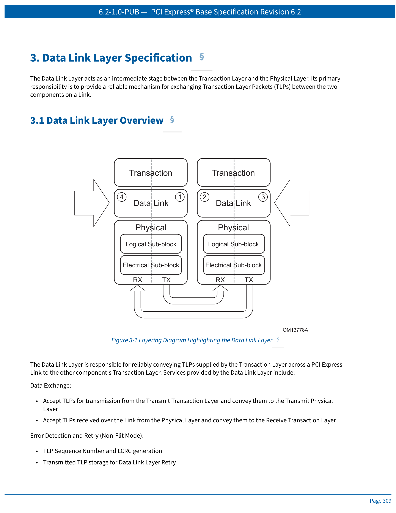
 <em>Figure 3-1: Layering Diagram Highlighting the Data Link Layer / 图3-1：突出显示数据链路层的分层图</em>

---

## 3.2 Data Link Control and Management State Machine
## 3.2 数据链路控制与管理状态机

The Data Link Layer tracks the state of the Link. It communicates Link status with the Transaction and Physical Layers, and performs Link management through the Physical Layer. The Data Link Layer contains the Data Link Control and Management State Machine (DLCMSM) to perform these tasks.

> 数据链路层跟踪链路的状态。它与事务层和物理层通信链路状态，并通过物理层执行链路管理。数据链路层包含数据链路控制与管理状态机（DLCMSM）来执行这些任务。

**States / 状态：**
- **DL_Inactive** — Physical Layer reporting Link is non-operational or nothing is connected to the Port / 物理层报告链路不可操作或无设备连接到端口
- **DL_Feature** (optional) — Physical Layer reporting Link is operational, perform the Data Link Feature Exchange / 物理层报告链路可操作，执行数据链路功能交换
- **DL_Init** — Physical Layer reporting Link is operational, initialize Flow Control for the default Virtual Channel / 物理层报告链路可操作，初始化默认虚拟通道的流控
- **DL_Active** — Normal operation mode / 正常运行模式

**Status Outputs / 状态输出：**
- **DL_Down** — The Data Link Layer is not communicating with the component on the other side of the Link / 数据链路层未与链路对端组件通信
- **DL_Up** — The Data Link Layer is communicating with the component on the other side of the Link / 数据链路层正在与链路对端组件通信

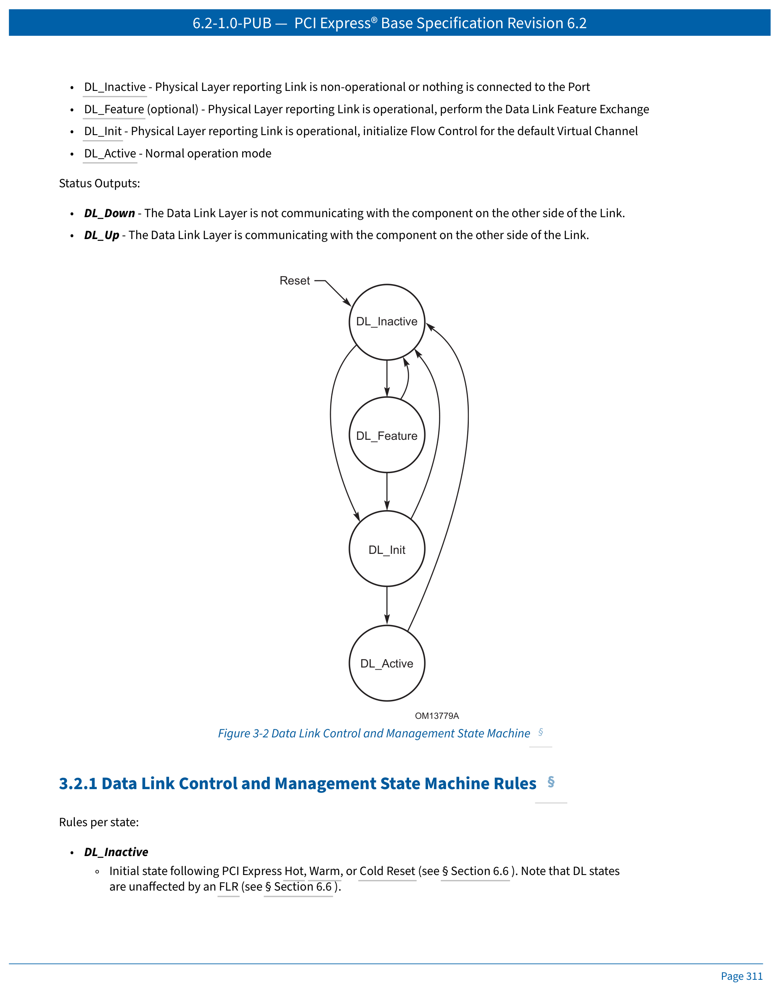
 <em>Figure 3-2: Data Link Control and Management State Machine / 图3-2：数据链路控制与管理状态机</em>

### 3.2.1 Data Link Control and Management State Machine Rules
### 3.2.1 数据链路控制与管理状态机规则

**DL_Inactive:**
- Initial state following PCI Express Hot, Warm, or Cold Reset. Note that DL states are unaffected by an FLR (see § Section 6.6).
- Upon entry to DL_Inactive: Reset all Data Link Layer state information to default values; Discard the contents of the Data Link Layer Retry Buffer
- While in DL_Inactive: Report DL_Down status to the Transaction Layer; Discard TLP information from the Transaction and Physical Layers; Do not generate or accept DLLPs
- Exit to DL_Feature if: the Port supports Data Link Feature Exchange, the Feature Exchange is enabled, and the Physical Layer reports Physical LinkUp = 1b
- Exit to DL_Init if: the Port does not support DL_Feature (or it is disabled) and the Physical Layer reports Physical LinkUp = 1b

> **DL_Inactive（非活跃）：**
> - PCIe热复位、温复位或冷复位后的初始状态。注意DL状态不受FLR影响（参见第6.6节）。
> - 进入DL_Inactive时：将所有数据链路层状态信息复位为默认值；丢弃数据链路层重试缓冲区的内容
> - 在DL_Inactive期间：向事务层报告DL_Down状态；丢弃来自事务层和物理层的TLP信息；不生成也不接受DLLP
> - 退出到DL_Feature的条件：端口支持数据链路功能交换、该功能已启用，且物理层报告Physical LinkUp = 1b
> - 退出到DL_Init的条件：端口不支持DL_Feature（或已禁用），且物理层报告Physical LinkUp = 1b

**DL_Feature (optional):**
- While in DL_Feature: Perform the Data Link Feature Exchange protocol; Report DL_Down status
- Exit to DL_Init if: Data Link Feature Exchange completes successfully (or remote doesn't support it), and Physical LinkUp = 1b
- Exit to DL_Inactive if: Physical Layer reports Physical LinkUp = 0b

> **DL_Feature（功能交换，可选）：**
> - 在DL_Feature期间：执行数据链路功能交换协议；报告DL_Down状态
> - 退出到DL_Init的条件：数据链路功能交换成功完成（或远端不支持），且Physical LinkUp = 1b
> - 退出到DL_Inactive的条件：物理层报告Physical LinkUp = 0b

**DL_Init:**
- While in DL_Init: Initialize Flow Control for VC0 following the FC initialization protocol; Report DL_Down (FC_INIT1) / DL_Up (FC_INIT2)
- Exit to DL_Active if: Flow Control initialization completes successfully and Physical LinkUp = 1b
- Exit to DL_Inactive if: Physical Layer reports Physical LinkUp = 0b

> **DL_Init（初始化）：**
> - 在DL_Init期间：按照流控初始化协议初始化VC0的流控；在FC_INIT1状态报告DL_Down，在FC_INIT2状态报告DL_Up
> - 退出到DL_Active的条件：流控初始化成功完成且Physical LinkUp = 1b
> - 退出到DL_Inactive的条件：物理层报告Physical LinkUp = 0b

**DL_Active:**
- Normal operating state. Accept and transfer TLP information; Generate and accept DLLPs; Report DL_Up status
- Exit to DL_Inactive if Physical Layer reports Physical LinkUp = 0b. Downstream Ports that are Surprise Down Error Reporting Capable must treat this transition as a Surprise Down error, except in cases where the error detection is explicitly blocked (e.g., Secondary Bus Reset, Link Disable, DPC, Switch Upstream events, PME_Turn_Off, hot-pluggable slots).

> **DL_Active（活跃）：**
> - 正常运行状态。接受并传输TLP信息；生成并接受DLLP；报告DL_Up状态
> - 退出到DL_Inactive的条件：物理层报告Physical LinkUp = 0b。具备Surprise Down错误报告能力的下游端口必须将此转换视为Surprise Down错误，但在明确阻断错误检测的情况下除外（例如：Secondary Bus Reset、Link Disable、DPC触发、Switch上行端口事件、PME_Turn_Off、热插拔插槽）。

---

## 3.3 Data Link Feature Exchange
## 3.3 数据链路功能交换

The Data Link Feature Exchange protocol is required for Ports that support Flit Mode and for Ports that support 16.0 GT/s and higher data rates. It is optional for other Ports.

> 数据链路功能交换协议对于支持Flit模式的端口和支持16.0 GT/s及以上数据速率的端口是必需的。对于其他端口是可选的。

The protocol transmits a Port's Local Feature Supported information to the Remote Port and captures that Remote Port's Feature Supported information. Key rules:
- On entry to DL_Feature: Clear the Remote Data Link Feature Supported and Remote Data Link Feature Supported Valid fields
- While in DL_Feature: Transaction Layer must block transmission of TLPs; Transmit the Data Link Feature DLLP at least once every 34 μs
- Process received Data Link Feature DLLPs: Record the Feature Supported field and Set the Remote Data Link Feature Supported Valid bit
- Exit DL_Feature if: An InitFC1 DLLP has been received, or a Data Link Feature DLLP with Feature Ack bit Set has been received

> 该协议将端口的本地功能支持信息发送到远端端口，并捕获远端端口的功能支持信息。关键规则：
> - 进入DL_Feature时：清除Remote Data Link Feature Supported和Remote Data Link Feature Supported Valid字段
> - 在DL_Feature期间：事务层必须阻断TLP的传输；至少每34μs发送一次Data Link Feature DLLP
> - 处理接收到的Data Link Feature DLLP：记录Feature Supported字段并设置Remote Data Link Feature Supported Valid位
> - 退出DL_Feature的条件：收到InitFC1 DLLP，或收到Feature Ack位被置位的Data Link Feature DLLP

**Table 3-1: Data Link Feature Supported Bit Definition | 表3-1：数据链路功能支持位定义**

| Bit | Type | Description (English) | 描述（中文） |
|-----|------|----------------------|--------------|
| 0 | Feature | Scaled Flow Control — Must be Set in Ports that support 16.0 GT/s or higher. Must be Set if Flit Mode enabled | 缩放流控 — 支持16.0 GT/s及以上的端口必须置位；Flit模式启用时必须置位 |
| 1 | Feature | Immediate Readiness — All non-Virtual Functions in the sending Port have Immediate Readiness Set | 立即就绪 — 发送端口中所有非虚拟功能均已设置立即就绪 |
| 4:2 | Parameter | Extended VC Count — Number of VC Resources supported | 扩展VC数量 — 发送端口支持的VC资源数量（Flit模式下有意义） |
| 7:5 | Parameter | L0p Exit Latency — Time required to complete link widening using L0p | L0p退出延迟 — 使用L0p完成链路拓宽所需的时间（Flit模式下有意义） |

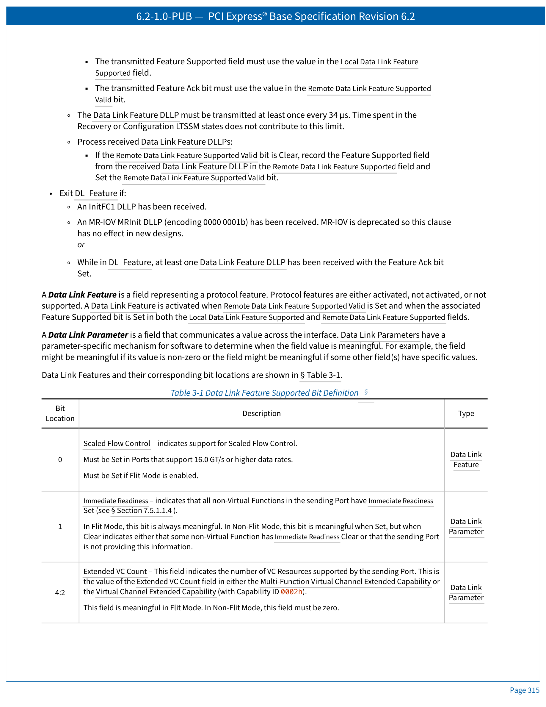
 <em>Table 3-1: Data Link Feature Supported Bit Definition (from Spec) / 表3-1：规范中的数据链路功能支持位定义</em>

---

## 3.4 Flow Control Initialization Protocol
## 3.4 流控初始化协议

Before starting normal operation following power-up or interconnect reset, it is necessary to initialize Flow Control for the default Virtual Channel, VC0. When additional Virtual Channels (VCs) are enabled, the Flow Control initialization process must be completed for each newly enabled VC before it can be used.

> 在上电或互连复位后开始正常运行之前，必须初始化默认虚拟通道VC0的流控。当启用额外的虚拟通道（VC）时，必须先完成每个新启用VC的流控初始化过程才能使用它。

Shared Flow Control is enabled in Flit Mode. Shared Flow Control is disabled in Non-Flit Mode.

> 共享流控在Flit模式下启用，在非Flit模式下禁用。

There are two states in the VC initialization process: **FC_INIT1** and **FC_INIT2**.

> VC初始化过程中有两个状态：**FC_INIT1**和**FC_INIT2**。

### 3.4.1 Flow Control Initialization State Machine Rules
### 3.4.1 流控初始化状态机规则

**FC_INIT1:**
- Entered when initialization of a VC is required (VC0 upon DL_Init entry; VC1-7 when enabled by software)
- Transaction Layer must block transmission of TLPs using that VC
- Transmit InitFC1 DLLPs in specific relative order (3 DLLPs in Non-Flit Mode, 6 DLLPs in Flit Mode including Shared)
- InitFC1 DLLPs must be transmitted at least once every 34 μs
- Set DataFC, DataScale, HdrFC, and HdrScale as shown in Tables 3-2 and 3-3
- Process received InitFC1 and InitFC2 DLLPs; record FC unit values and set flag FI1
- Exit to FC_INIT2 when FI1 is set for all of P, NP, and Cpl credit types

> **FC_INIT1：**
> - 当需要初始化VC时进入（DL_Init进入时对应VC0；软件启用VC1-7时对应相应VC）
> - 事务层必须阻断使用该VC的TLP传输
> - 按特定相对顺序发送InitFC1 DLLP（非Flit模式3个，Flit模式含共享共6个）
> - InitFC1 DLLP必须至少每34μs发送一次
> - 按表3-2和表3-3设置DataFC、DataScale、HdrFC和HdrScale
> - 处理接收到的InitFC1和InitFC2 DLLP；记录FC单元值并设置标志FI1
> - 当P、NP和Cpl所有信用类型的FI1均已设置时退出到FC_INIT2

**FC_INIT2:**
- Transaction Layer must block transmission of TLPs using that VC
- Transmit InitFC2 DLLPs in specific relative order
- Set flag FI2 on receipt of any InitFC2 DLLP, TLP, UpdateFC DLLP, or Optimized_Update_FC for the VC
- Signal completion and exit when FI2 is set. If Scaled Flow Control is activated, HdrScale/DataScale must be non-zero (01b/10b/11b) in UpdateFCs.

> **FC_INIT2：**
> - 事务层必须阻断使用该VC的TLP传输
> - 按特定相对顺序发送InitFC2 DLLP
> - 收到该VC的任何InitFC2 DLLP、TLP、UpdateFC DLLP或Optimized_Update_FC时设置标志FI2
> - FI2置位后，通知完成并退出。若缩放流控已激活，UpdateFC中HdrScale/DataScale必须为非零值（01b/10b/11b）

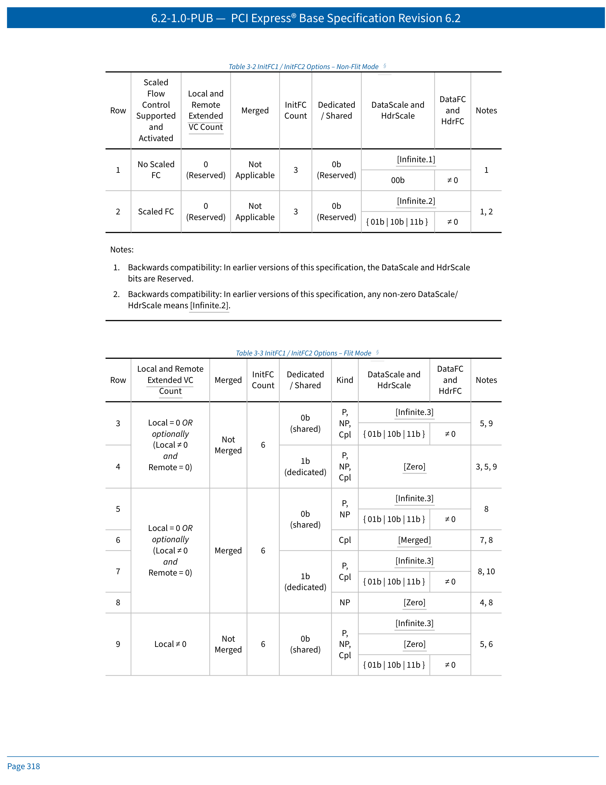
 <em>Table 3-2: InitFC1/InitFC2 Options — Non-Flit Mode / 表3-2：InitFC1/InitFC2选项 — 非Flit模式</em>

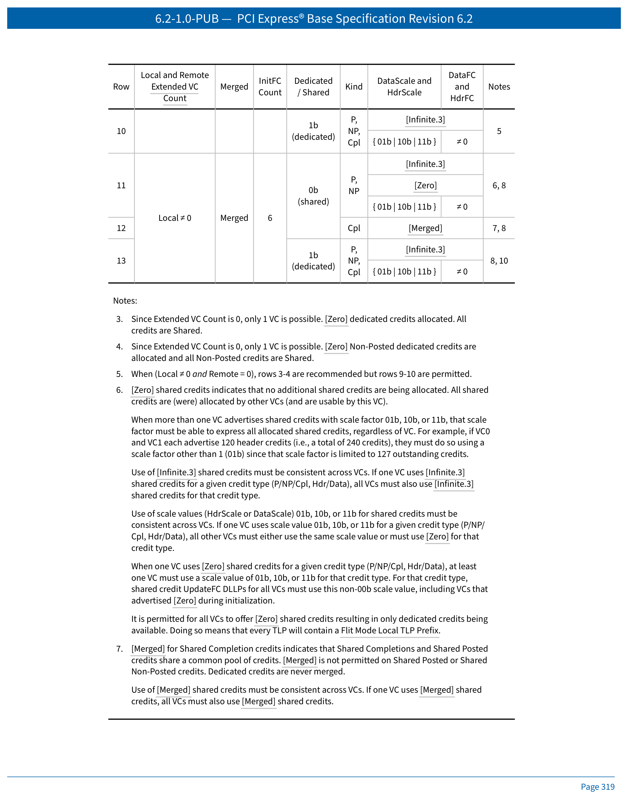
 <em>Table 3-3: InitFC1/InitFC2 Options — Flit Mode / 表3-3：InitFC1/InitFC2选项 — Flit模式</em>

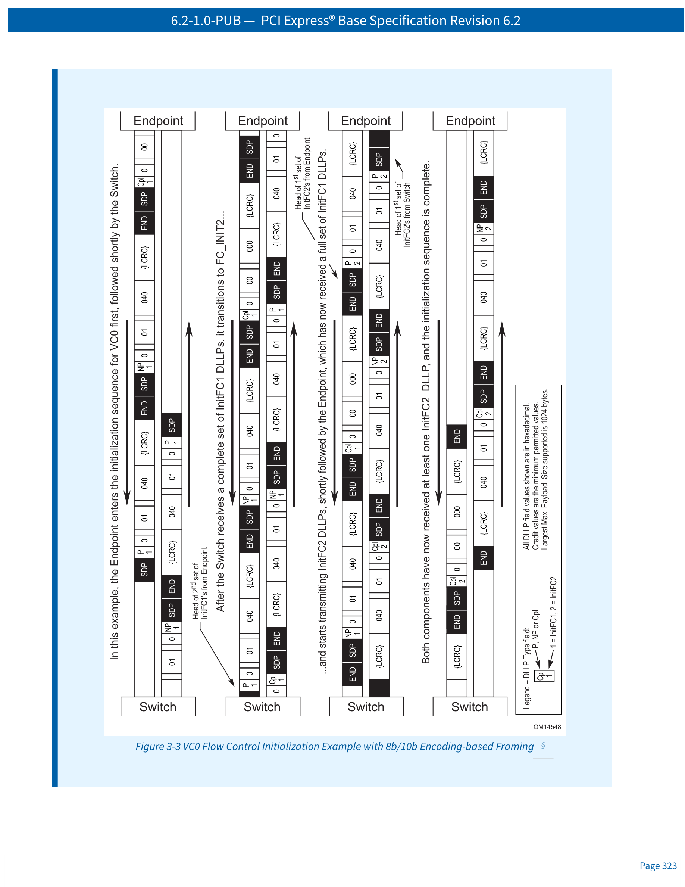
 <em>Figure 3-3: VC0 Flow Control Initialization Example with 8b/10b Encoding / 图3-3：8b/10b编码下VC0流控初始化示例</em>

### 3.4.2 Scaled Flow Control
### 3.4.2 缩放流控

Link performance can be affected when there are insufficient flow control credits available to account for the Link round trip time. This effect becomes more noticeable at higher Link speeds and the limitation of 127 header credits and 2047 data credits can limit performance. The Scaled Flow Control mechanism is designed to address this limitation.

> 当可用流控信用不足以覆盖链路往返时间时，链路性能会受到影响。这种影响在更高链路速率下更为显著，127个头信用和2047个数据信用的限制可能制约性能。缩放流控（Scaled Flow Control）机制旨在解决这一限制。

All Ports are permitted to support Scaled Flow Control. Ports that support 16.0 GT/s and higher data rates must support Scaled Flow Control. When Scaled Flow Control is activated, the HdrScale and DataScale fields in UpdateFC DLLPs use scaling factors (1x, 4x, 16x) as defined in Table 3-4, allowing up to 2032 header credits and 32,752 data credits.

> 所有端口均允许支持缩放流控。支持16.0 GT/s及以上数据速率的端口必须支持缩放流控。当缩放流控激活后，UpdateFC DLLP中的HdrScale和DataScale字段使用缩放因子（1x、4x、16x，如表3-4定义），允许最多2032个头信用和32752个数据信用。

**Table 3-4: Scaled Flow Control Scaling Factors | 表3-4：缩放流控缩放因子**

| Scale Factor | Min Hdr Credits | Max Hdr Credits | Hdr Field Width | Min Data Credits | Max Data Credits | Data Field Width |
|-------------|-----------------|-----------------|-----------------|------------------|------------------|-------------------|
| 00b (1x) | 1 | 127 | 8 bits | 1 | 2,047 | 12 bits |
| 01b (1x) | 1 | 127 | 8 bits | 1 | 2,047 | 12 bits |
| 10b (4x) | 4 | 508 | 10 bits | 4 | 8,188 | 14 bits |
| 11b (16x) | 16 | 2,032 | 12 bits | 16 | 32,752 | 16 bits |

---

## 3.5 Data Link Layer Packets (DLLPs)
## 3.5 数据链路层包（DLLP）

The following DLLPs are used to support Link operations:
- **Data Link Feature DLLP**: For negotiation of supported features / 用于协商支持的功能
- **Ack DLLP**: TLP Sequence Number acknowledgement (NFM only) / TLP序列号正确认（仅NFM）
- **Nak DLLP**: TLP Sequence Number negative acknowledgement; initiates Data Link Layer Retry (NFM only) / TLP序列号负确认；启动数据链路层重试（仅NFM）
- **InitFC1, InitFC2, UpdateFC DLLPs**: Used for Flow Control / 用于流控
- **PM DLLPs**: Used for Power Management / 用于电源管理
- **Link Management DLLPs**: Used for L0p / 用于L0p

> 以下DLLP用于支持链路操作：Data Link Feature DLLP（功能协商）、Ack/Nak DLLP（NFM中的正/负确认）、InitFC1/InitFC2/UpdateFC DLLP（流控）、PM DLLP（电源管理）、Link Management DLLP（L0p链路管理）。

### 3.5.1 Data Link Layer Packet Rules
### 3.5.1 数据链路层包规则

All DLLP fields marked Reserved must be filled with all 0's when a DLLP is formed. Values in such fields must be ignored by Receivers.

> 标记为保留（Reserved）的所有DLLP字段在构成DLLP时必须全部填充0。接收端必须忽略这些字段中的值。

In Non-Flit Mode, all DLLPs include: DLLP Type (8 bits), 24 bits of DLLP Type specific information, and 16-bit CRC. In Flit Mode, DLLPs are transmitted in the DLP bytes of a Flit and consist of: DLLP Type (8 bits) and 24 bits of DLLP Type specific information. The CRC is handled at the Flit level, not per DLLP.

> 在非Flit模式下，所有DLLP包含：DLLP Type（8位）、24位DLLP类型特定信息和16位CRC。在Flit模式下，DLLP在Flit的DLP字节中传输，包含：DLLP Type（8位）和24位DLLP类型特定信息。CRC在Flit级别处理，而非逐DLLP处理。

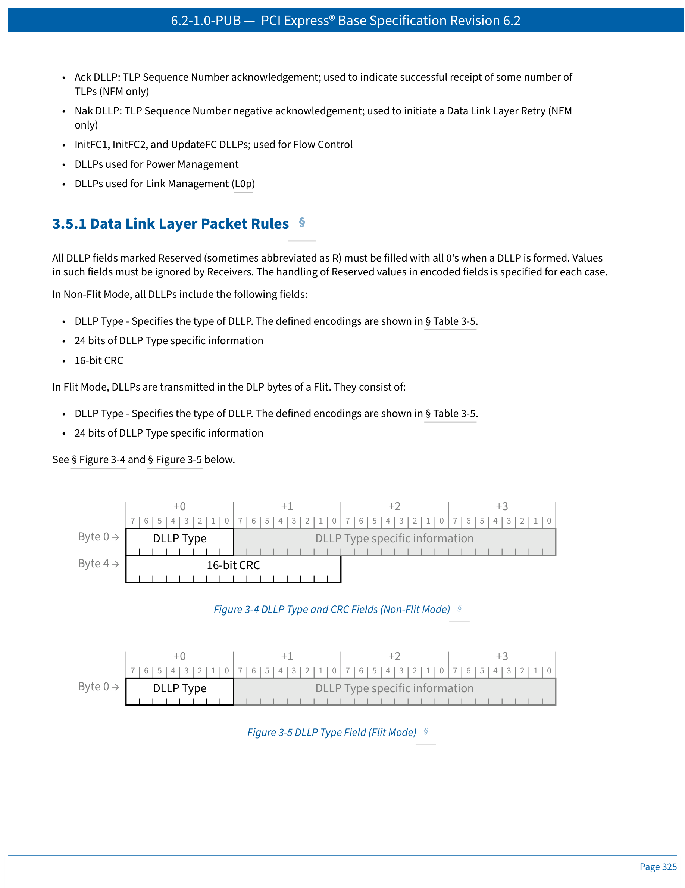
 <em>Figure 3-4: DLLP Type and CRC Fields (Non-Flit Mode) / 图3-4：DLLP Type和CRC字段（非Flit模式）</em>

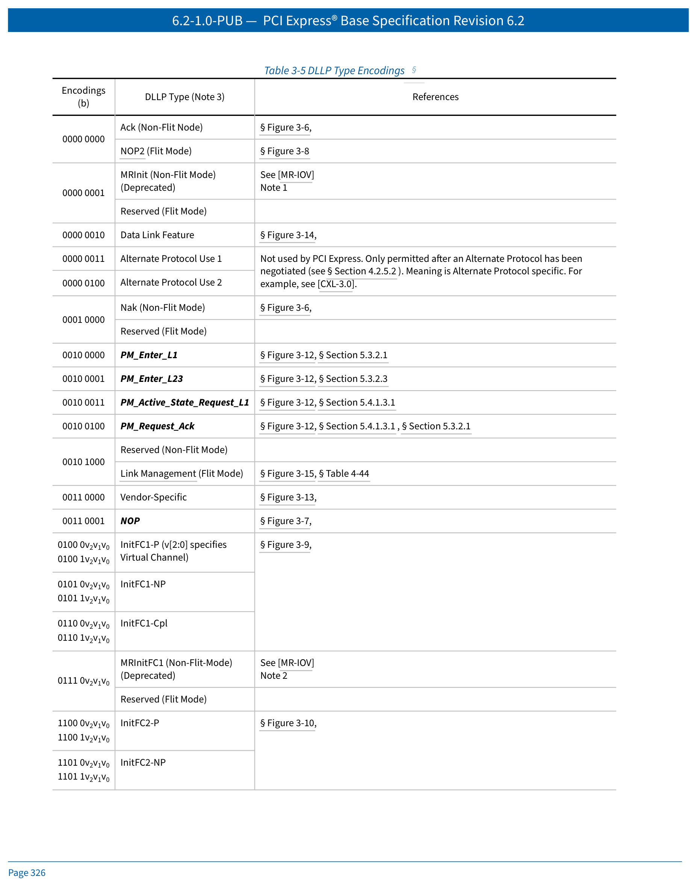
 <em>Figure 3-5: DLLP Type Field (Flit Mode) / 图3-5：DLLP Type字段（Flit模式）</em>

**Table 3-5: DLLP Type Encodings (Selected) | 表3-5：DLLP类型编码（精选）**

| Encoding (b) | DLLP Type (NFM) | DLLP Type (Flit Mode) | Function |
|-------------|-----------------|----------------------|----------|
| 0000 0000 | Ack | NOP2 | TLP确认 (NFM) / NOP2 (Flit) |
| 0001 0000 | Nak | Reserved | 负确认 (NFM) |
| 0000 0010 | Data Link Feature | Data Link Feature | 数据链路功能交换 |
| 0010 0000 | PM_Enter_L1 | PM_Enter_L1 | 进入L1请求 |
| 0010 0001 | PM_Enter_L23 | PM_Enter_L23 | 进入L2/L3请求 |
| 0010 0011 | PM_Active_State_Request_L1 | PM_Active_State_Request_L1 | 活跃状态请求L1 |
| 0010 0100 | PM_Request_Ack | PM_Request_Ack | PM请求确认 |
| 0011 0000 | Vendor-Specific | Vendor-Specific | 厂商自定义 |
| 0011 0001 | NOP | NOP | 空操作 |
| 0100 0xxx | InitFC1-P | InitFC1-P (v[2:0] = VC) | Posted流控初始化1 |
| 0101 0xxx | InitFC1-NP | InitFC1-NP | Non-Posted流控初始化1 |
| 0110 0xxx | InitFC1-Cpl | InitFC1-Cpl | Completion流控初始化1 |
| 1100 0xxx | InitFC2-P | InitFC2-P | Posted流控初始化2 |
| 1101 0xxx | InitFC2-NP | InitFC2-NP | Non-Posted流控初始化2 |
| 1110 0xxx | InitFC2-Cpl | InitFC2-Cpl | Completion流控初始化2 |
| 1000 0xxx | UpdateFC-P | UpdateFC-P | Posted流控更新 |
| 1001 0xxx | UpdateFC-NP | UpdateFC-NP | Non-Posted流控更新 |
| 1010 0xxx | UpdateFC-Cpl | UpdateFC-Cpl | Completion流控更新 |

**Key DLLP characteristics / DLLP关键特性：**
- DLLP data integrity is protected using a 16-bit CRC (NFM only), computed with polynomial 100Bh, seed value FFFFh / DLLP数据完整性由16位CRC保护（仅NFM），使用多项式100Bh、种子值FFFFh计算
- For Ack/Nak DLLPs: AckNak_Seq_Num field indicates what TLPs are affected / AckNak_Seq_Num字段指示受影响的TLP
- For FC DLLPs: HdrFC contains header credit value, DataFC contains data payload credit value, with optional HdrScale/DataScale / FC DLLP包含头信用值和数据载荷信用值，以及可选的缩放因子
- In Flit Mode, Optimized_Update_FC provides a compact alternative to UpdateFC DLLPs / Flit模式中，Optimized_Update_FC提供比UpdateFC DLLP更紧凑的替代方案

**DLLP Format Figures / DLLP格式图：**

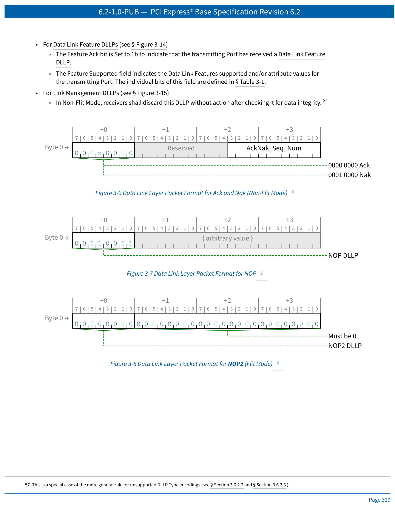
 <em>Figure 3-6: Ack and Nak DLLP Format / 图3-6：Ack和Nak DLLP格式（非Flit模式）</em>

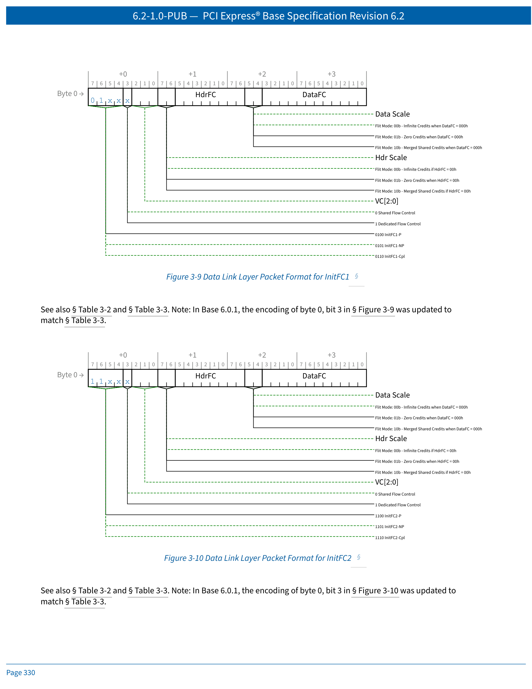
 <em>Figure 3-9: InitFC1 DLLP Format / 图3-9：InitFC1 DLLP格式</em>

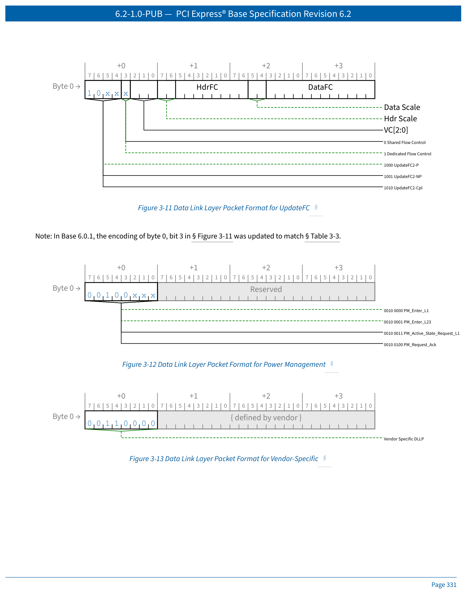
 <em>Figure 3-10: InitFC2 DLLP Format / 图3-10：InitFC2 DLLP格式</em>
 <em>Figure 3-11: UpdateFC DLLP Format / 图3-11：UpdateFC DLLP格式</em>

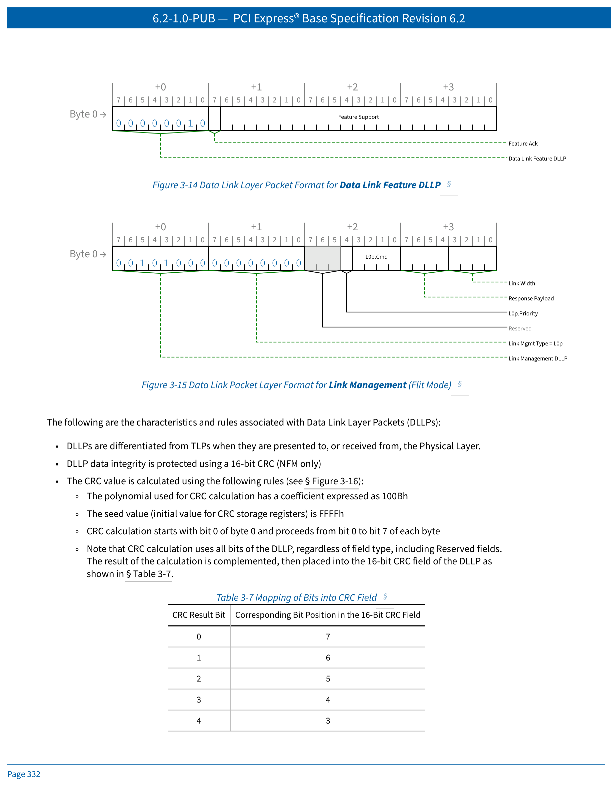
 <em>Figure 3-12: PM DLLP Format / 图3-12：电源管理DLLP格式</em>
 <em>Figure 3-13: Vendor-Specific DLLP Format / 图3-13：厂商自定义DLLP格式</em>
 <em>Figure 3-14: Data Link Feature DLLP Format / 图3-14：Data Link Feature DLLP格式</em>
 <em>Figure 3-15: Link Management DLLP Format (Flit Mode) / 图3-15：Link Management DLLP格式（Flit模式）</em>

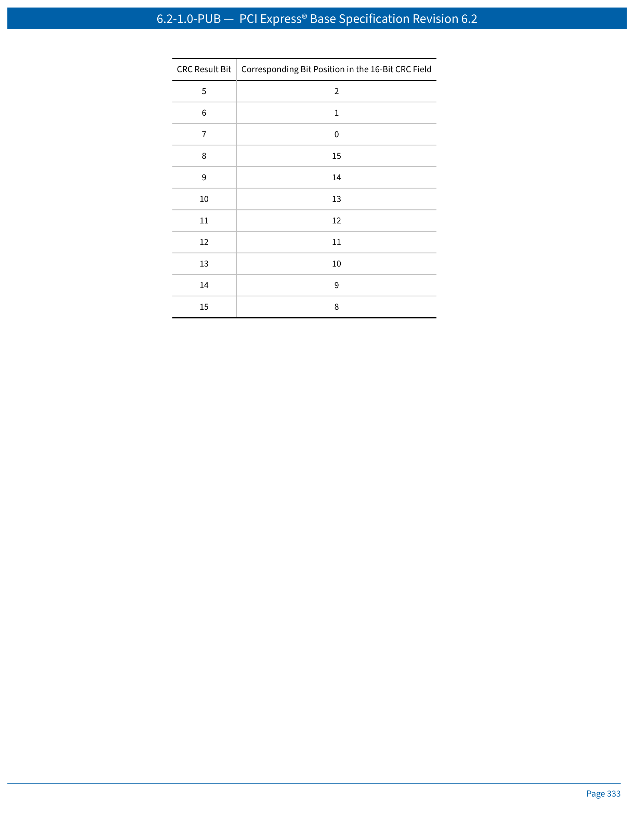
 <em>Figure 3-16: CRC Calculation Diagram for DLLPs / 图3-16：DLLP CRC计算图</em>

---

## 3.6 Data Integrity Mechanisms
## 3.6 数据完整性机制

### 3.6.1 Introduction
### 3.6.1 概述

The Transaction Layer provides TLP boundary information to the Data Link Layer. This allows the Data Link Layer to apply a TLP Sequence Number and a Link CRC (LCRC) for error detection to the TLP. The Receive Data Link Layer validates received TLPs by checking the TLP Sequence Number, LCRC code and any error indications from the Receive Physical Layer. In case any of these errors are in a TLP, Data Link Layer Retry is used for recovery.

> 事务层向数据链路层提供TLP边界信息。这使得数据链路层能够为TLP附加TLP序列号和链路CRC（LCRC）以进行错误检测。接收数据链路层通过检查TLP序列号、LCRC码以及来自接收物理层的任何错误指示来验证接收到的TLP。若TLP中存在任何此类错误，则使用数据链路层重试进行恢复。

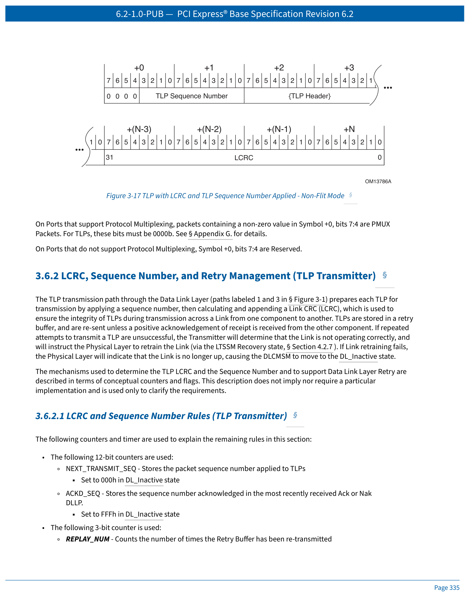
 <em>Figure 3-17: TLP with LCRC and TLP Sequence Number Applied — Non-Flit Mode / 图3-17：已附加LCRC和TLP序列号的TLP — 非Flit模式</em>

### 3.6.2 LCRC, Sequence Number, and Retry Management (TLP Transmitter)
### 3.6.2 LCRC、序列号和重试管理（TLP发送端）

The TLP transmission path prepares each TLP by applying a sequence number, then calculating and appending an LCRC. TLPs are stored in a retry buffer, and are re-sent unless a positive acknowledgement of receipt is received from the other component. If repeated attempts to transmit a TLP are unsuccessful, the Transmitter will determine that the Link is not operating correctly, and will instruct the Physical Layer to retrain the Link.

> TLP发送路径通过附加序列号，然后计算并追加LCRC来准备每个TLP。TLP存储在重试缓冲区中，除非从另一端组件收到正确认，否则将重新发送。如果多次尝试发送TLP均不成功，发送端将判定链路未正确运行，并指示物理层重新训练链路。

#### 3.6.2.1 LCRC and Sequence Number Rules (TLP Transmitter)
#### 3.6.2.1 LCRC和序列号规则（TLP发送端）

Key counters and timers:
- **NEXT_TRANSMIT_SEQ** (12-bit): Stores the packet sequence number applied to TLPs, set to 000h in DL_Inactive
- **ACKD_SEQ** (12-bit): Stores the sequence number acknowledged in the most recently received Ack/Nak, set to FFFh in DL_Inactive
- **REPLAY_NUM** (3-bit): Counts the number of retransmissions, set to 000b in DL_Inactive
- **REPLAY_TIMER**: Determines when a replay is required

> 关键计数器与定时器：
> - **NEXT_TRANSMIT_SEQ**（12位）：存储应用于TLP的包序列号，在DL_Inactive中设为000h
> - **ACKD_SEQ**（12位）：存储最近收到的Ack/Nak中确认的序列号，在DL_Inactive中设为FFFh
> - **REPLAY_NUM**（3位）：计算重传次数，在DL_Inactive中设为000b
> - **REPLAY_TIMER**：确定何时需要重放

Each TLP is assigned a 12-bit sequence number when accepted from the Transaction Layer. TLP data integrity is protected using a 32-bit LCRC calculated with polynomial 04C11DB7h, seed value FFFFFFFFh. The LCRC field is appended to the TLP.

If the equation `(NEXT_TRANSMIT_SEQ - ACKD_SEQ) mod 4096 >= 2048` (Tx SEQ Stall) is true, the Transmitter must cease accepting TLPs from the Transaction Layer.

> 每个TLP从事务层接受时被分配一个12位序列号。TLP数据完整性由32位LCRC保护（多项式04C11DB7h，种子值FFFFFFFFh）。LCRC字段追加到TLP之后。

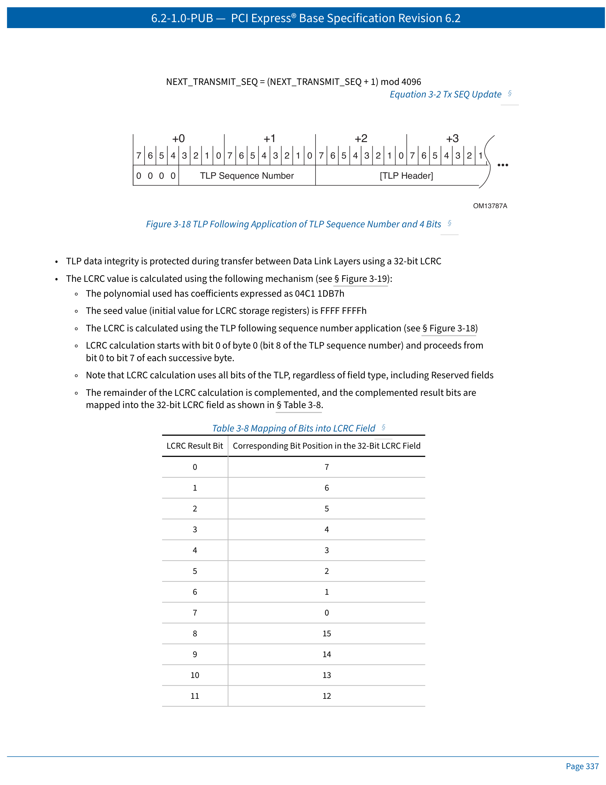
 <em>Figure 3-18: TLP Following Application of TLP Sequence Number and 4 Reserved Bits / 图3-18：附加TLP序列号和4个保留位后的TLP</em>

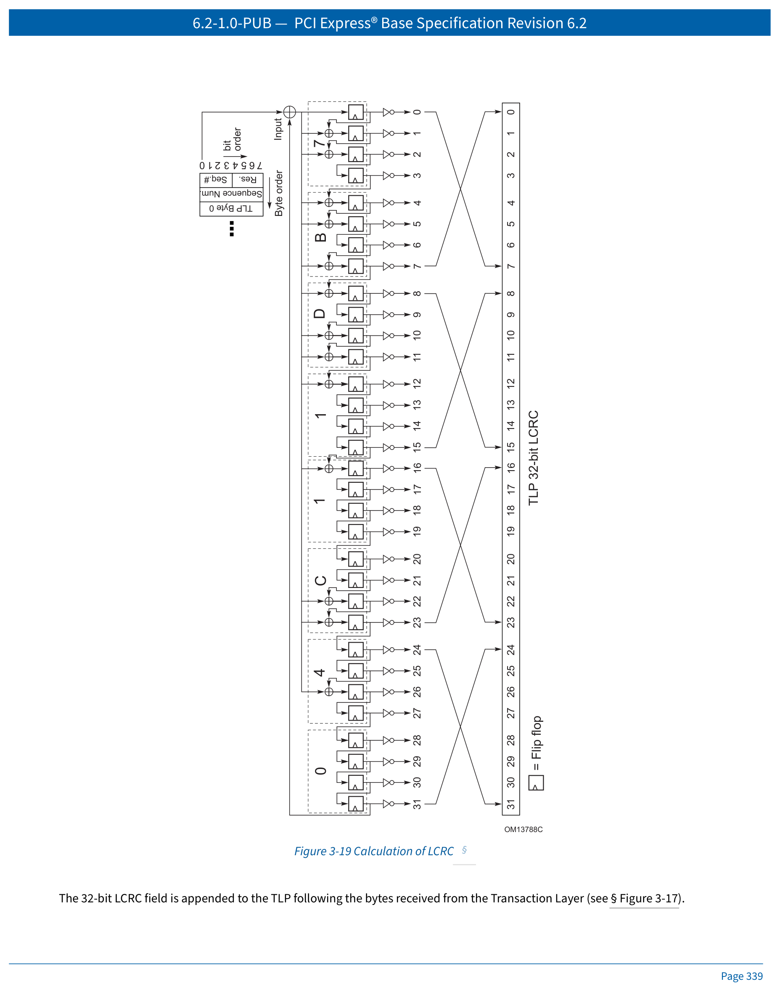
 <em>Figure 3-19: Calculation of LCRC / 图3-19：LCRC的计算</em>

> 若等式 `(NEXT_TRANSMIT_SEQ - ACKD_SEQ) mod 4096 >= 2048`（Tx SEQ停顿）为真，发送端必须停止从事务层接受TLP。

The REPLAY_TIMER Limits:
- **Simplified REPLAY_TIMER Limits** (required for 16.0 GT/s+, strongly recommended for all):
  - 24,000 to 31,000 Symbol Times when Extended Synch bit is Clear
  - 80,000 to 100,000 Symbol Times when Extended Synch bit is Set

> REPLAY_TIMER限值（简化限值，16.0 GT/s及以上必需，强烈建议所有速率采用）：
> - Extended Synch位清零时：24,000至31,000个符号时间
> - Extended Synch位置位时：80,000至100,000个符号时间

When a replay is initiated (by Nak or REPLAY_TIMER expiration): Block new TLPs from Transaction Layer; complete current transmission; retransmit unacknowledged TLPs starting with the oldest; increment REPLAY_NUM by 2 (Non-Flit Mode). If REPLAY_NUM rolls over from 110b/111b to 000b/001b, signal the Physical Layer to retrain the Link.

> 当启动重放时（由Nak或REPLAY_TIMER超时触发）：阻断来自事务层的新TLP；完成当前传输；从最旧的未确认TLP开始重新发送。在非Flit模式下REPLAY_NUM增加2。若REPLAY_NUM从110b/111b翻转到000b/001b，通知物理层重训练链路。

#### 3.6.2.2 Handling of Received DLLPs (Non-Flit Mode)
#### 3.6.2.2 已接收DLLP的处理（非Flit模式）

The TLP transmission mechanisms are also responsible for processing Ack/Nak and Flow Control DLLPs received from the other component:

- If Physical Layer indicates a Receiver Error, discard the DLLP
- For all received DLLPs, CRC is checked: compare calculated CRC with received CRC value; if not equal, the DLLP is corrupt — discard (Bad DLLP error)
- A received DLLP using unsupported DLLP Type encodings is discarded without error
- Received FC DLLPs are passed to the Transaction Layer
- Received PM DLLPs are passed to power management control logic
- For Ack/Nak DLLPs: acknowledge TLPs by purging from retry buffer all TLPs from oldest to the one matching AckNak_Seq_Num; load ACKD_SEQ; reset REPLAY_NUM and REPLAY_TIMER. If Nak, initiate replay.

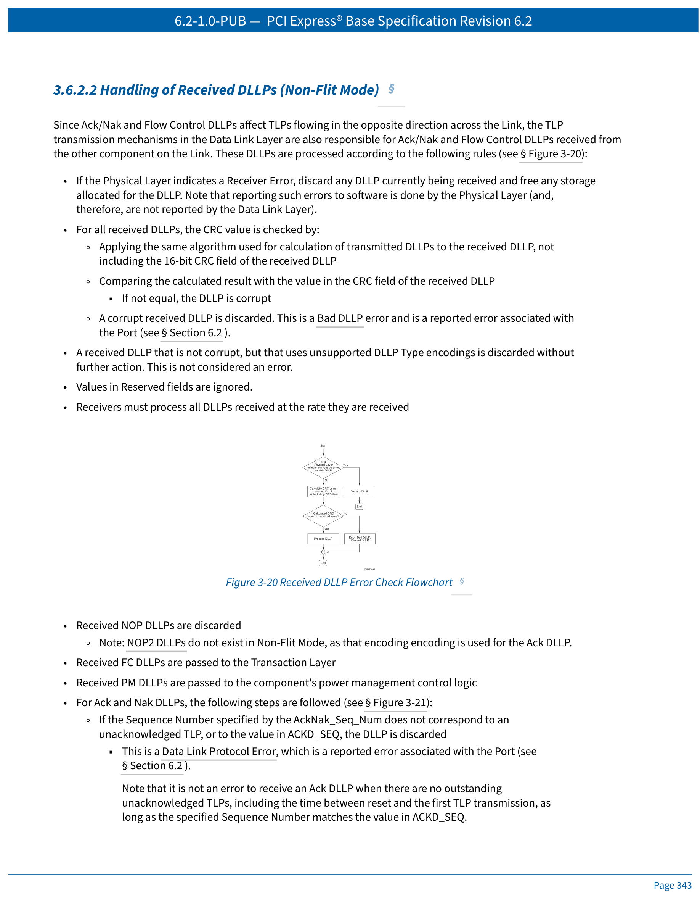
 <em>Figure 3-20: Received DLLP Error Check Flowchart / 图3-20：已接收DLLP错误检查流程图</em>

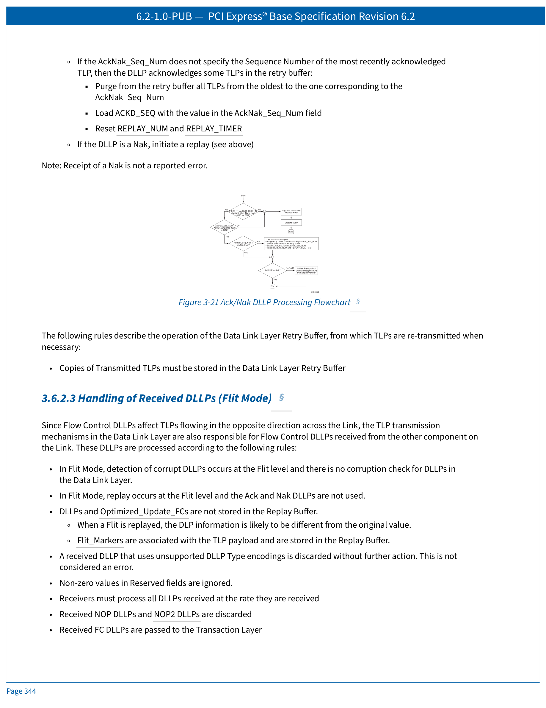
 <em>Figure 3-21: Ack/Nak DLLP Processing Flowchart / 图3-21：Ack/Nak DLLP处理流程图</em>

> TLP发送机制还负责处理从另一端组件接收的Ack/Nak和流控DLLP：
>
> - 若物理层指示发生接收错误，丢弃该DLLP
> - 对所有已接收DLLP检查CRC：将计算得到的CRC与接收的CRC值比较；若不相等，DLLP损坏——丢弃（Bad DLLP错误）
> - 使用不支持的DLLP类型编码的DLLP被丢弃，不视为错误
> - 已接收的FC DLLP传递至事务层
> - 已接收的PM DLLP传递至电源管理控制逻辑
> - 对于Ack/Nak DLLP：通过从重试缓冲区清除所有从最旧到匹配AckNak_Seq_Num的TLP来确认TLP；加载ACKD_SEQ；复位REPLAY_NUM和REPLAY_TIMER。若是Nak，启动重放。

#### 3.6.2.3 Handling of Received DLLPs (Flit Mode)
#### 3.6.2.3 已接收DLLP的处理（Flit模式）

In Flit Mode, corruption detection occurs at the Flit level and there is no corruption check for DLLPs in the Data Link Layer. Replay occurs at the Flit level and Ack/Nak DLLPs are not used. DLLPs and Optimized_Update_FCs are not stored in the Replay Buffer. Received Link Management DLLPs are passed to the L0p control logic.

> 在Flit模式下，损坏检测在Flit级别进行，数据链路层中不对DLLP进行损坏检查。重放在Flit级别发生，不使用Ack/Nak DLLP。DLLP和Optimized_Update_FC不存储在重放缓冲区中。已接收的Link Management DLLP传递至L0p控制逻辑。

### 3.6.3 LCRC and Sequence Number (TLP Receiver) (Non-Flit Mode)
### 3.6.3 LCRC和序列号（TLP接收端，非Flit模式）

The TLP Receive path processes TLPs received by the Physical Layer by checking the LCRC and sequence number, passing the TLP to the Receive Transaction Layer if OK and requesting a replay if corrupted.

> TLP接收路径处理物理层接收的TLP，检查LCRC和序列号，若无错误则将TLP传递至接收事务层，若发现损坏则请求重放。

#### 3.6.3.1 LCRC and Sequence Number Rules (TLP Receiver)
#### 3.6.3.1 LCRC和序列号规则（TLP接收端）

Key elements:
- **NEXT_RCV_SEQ** (12-bit): Expected Sequence Number for the next TLP, set to 000h in DL_Inactive
- **NAK_SCHEDULED** flag: Indicates a Nak is pending, cleared in DL_Inactive
- **AckNak_LATENCY_TIMER**: Determines when an Ack DLLP becomes scheduled

> 关键元素：
> - **NEXT_RCV_SEQ**（12位）：下一个TLP的预期序列号，在DL_Inactive中设为000h
> - **NAK_SCHEDULED**标志：指示有Nak待发送，在DL_Inactive中清零
> - **AckNak_LATENCY_TIMER**：确定何时调度Ack DLLP发送

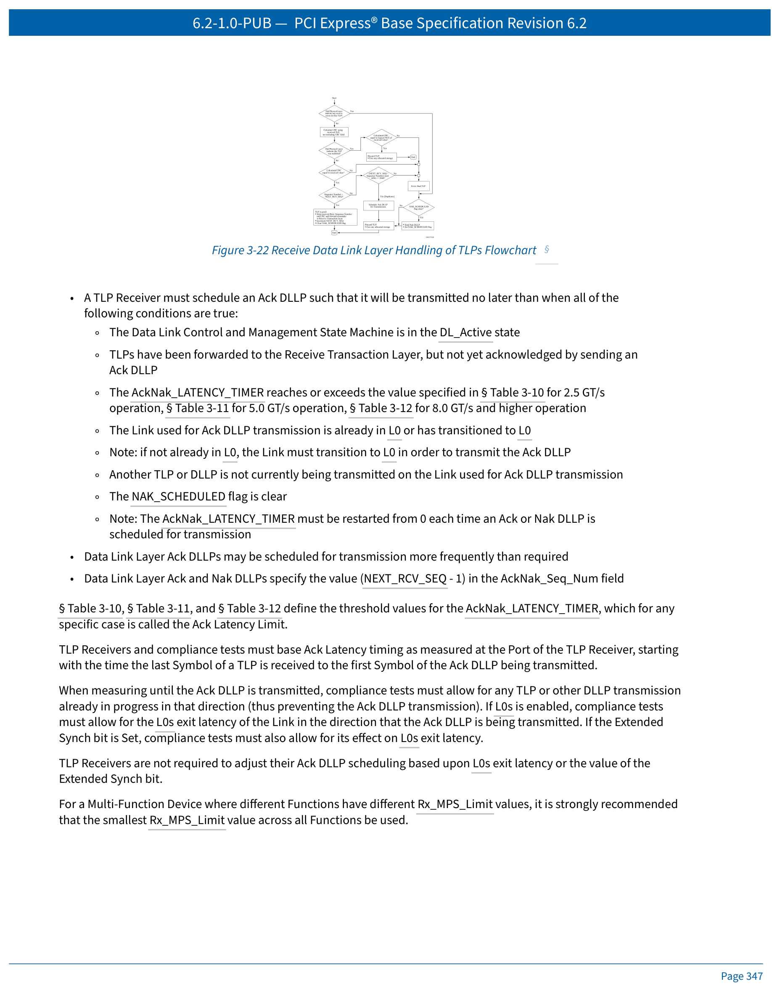
 <em>Figure 3-22: Receive Data Link Layer Handling of TLPs Flowchart / 图3-22：接收数据链路层TLP处理流程图</em>

Processing rules for received TLPs:
1. If Physical Layer indicates a Receiver Error, discard the TLP and schedule Nak if NAK_SCHEDULED is clear
2. If TLP was nullified and LCRC matches logical NOT of calculated value, discard without error
3. Check LCRC: if mismatch, TLP is corrupt — discard and schedule Nak (Bad TLP error)
4. If Sequence Number ≠ NEXT_RCV_SEQ:
   - If `(NEXT_RCV_SEQ - SeqNum) mod 4096 <= 2048`: Duplicate TLP, schedule Ack
   - Otherwise: Out of sequence (lost TLPs), schedule Nak (Bad TLP error)
5. If Sequence Number = NEXT_RCV_SEQ: TLP is good — strip header, forward to Transaction Layer, increment NEXT_RCV_SEQ, clear NAK_SCHEDULED

> 已接收TLP的处理规则：
> 1. 若物理层指示接收错误，丢弃TLP并在NAK_SCHEDULED清零时调度Nak
> 2. 若TLP已被废弃（nullified）且LCRC与计算值的逻辑反匹配，丢弃，不视为错误
> 3. 检查LCRC：若不匹配，TLP损坏——丢弃并调度Nak（Bad TLP错误）
> 4. 若序列号≠NEXT_RCV_SEQ：
>    - 若 `(NEXT_RCV_SEQ - SeqNum) mod 4096 <= 2048`：重复TLP，调度Ack
>    - 否则：序列号错序（丢失TLP），调度Nak（Bad TLP错误）
> 5. 若序列号=NEXT_RCV_SEQ：TLP正确——剥离头部，转发至事务层，递增NEXT_RCV_SEQ，清零NAK_SCHEDULED

Ack Latency Limits are defined in Tables 3-10, 3-11, and 3-12 for 2.5, 5.0, and 8.0+ GT/s data rates respectively. Ack DLLPs must be scheduled such that the AckNak_LATENCY_TIMER does not exceed these limits, which vary by operating width and Rx_MPS_Limit.

> Ack延迟限值分别定义于表3-10（2.5 GT/s）、表3-11（5.0 GT/s）和表3-12（8.0 GT/s及以上数据速率）。Ack DLLP必须被调度，使得AckNak_LATENCY_TIMER不超过这些限值，限值随运行位宽和Rx_MPS_Limit变化。

**Table 3-10: Maximum Ack Latency Limits for 2.5 GT/s (Symbol Times) | 表3-10：2.5 GT/s最大Ack延迟限值（符号时间）**

| Rx_MPS_Limit | x1 | x2 | x4 | x8 | x16 |
|-------------|-----|-----|-----|-----|------|
| 128 | 237 | 128 | 73 | 67 | 48 |
| 256 | 416 | 217 | 118 | 107 | 72 |
| 512 | 559 | 289 | 154 | 86 | 86 |
| 1024 | 1071 | 545 | 282 | 150 | 150 |
| 2048 | 2095 | 1057 | 538 | 278 | 278 |
| 4096 | 4143 | 2081 | 1050 | 534 | 534 |

**Table 3-12: Maximum Ack Latency Limits for 8.0 GT/s and higher (Symbol Times) | 表3-12：8.0 GT/s及以上最大Ack延迟限值（符号时间）**

| Rx_MPS_Limit | x1 | x2 | x4 | x8 | x16 |
|-------------|-----|-----|-----|-----|------|
| 128 | 333 | 224 | 169 | 163 | 144 |
| 256 | 512 | 313 | 214 | 203 | 168 |
| 512 | 655 | 385 | 250 | 182 | 182 |
| 1024 | 1167 | 641 | 378 | 246 | 246 |
| 2048 | 2191 | 1153 | 634 | 374 | 374 |
| 4096 | 4239 | 2177 | 1146 | 630 | 630 |

---

## 术语附录 | Terminology Appendix

| English | 中文 | Notes |
|---------|------|-------|
| ACK (Acknowledgment) | 正确认 | |
| Ack Latency Limit | Ack延迟限值 | |
| CRC (Cyclic Redundancy Check) | 循环冗余校验 | DLLP用16位CRC |
| Data Link Layer | 数据链路层 | 事务层与物理层之间的中间层 |
| DLCMSM | 数据链路控制与管理状态机 | |
| DLLP (Data Link Layer Packet) | 数据链路层包 | |
| DL_Inactive | 数据链路层非活跃状态 | 初始/复位状态 |
| DL_Init | 数据链路层初始化状态 | 流控初始化 |
| DL_Active | 数据链路层活跃状态 | 正常运行状态 |
| DL_Down / DL_Up | 数据链路层断开/连接 | 状态输出 |
| FC (Flow Control) | 流控 | |
| Flit Mode (FM) | Flit模式 | 1b/1b编码，Flit级重放 |
| FLR (Function Level Reset) | 功能级复位 | |
| HdrFC / HdrScale | 头流控信用/缩放因子 | |
| InitFC1 / InitFC2 | 流控初始化DLLP类型1/2 | |
| LCRC (Link CRC) | 链路CRC | TLP用32位LCRC |
| L0p | L0p | 链路宽度变化机制 |
| NAK (Negative Acknowledgment) | 负确认 | 启动重试 |
| NEXT_TRANSMIT_SEQ | 下一发送序列号 | 12位计数器 |
| NEXT_RCV_SEQ | 下一接收序列号 | 12位计数器 |
| NFM (Non-Flit Mode) | 非Flit模式 | 传统编码 |
| NOP / NOP2 | 空操作DLLP | |
| Optimized_Update_FC | 优化的流控更新 | Flit模式特有 |
| PM (Power Management) | 电源管理 | |
| Replay / Retry | 重放/重试 | 重新发送未确认的TLP |
| REPLAY_NUM | 重放次数 | 3位计数器 |
| REPLAY_TIMER | 重放定时器 | |
| Retry Buffer | 重试缓冲区 | 存储已发送的TLP副本 |
| Scaled Flow Control | 缩放流控 | 1x/4x/16x缩放因子 |
| Sequence Number | 序列号 | TLP 12位序列号 |
| Shared Flow Control | 共享流控 | Flit模式特性 |
| TLP (Transaction Layer Packet) | 事务层包 | |
| UpdateFC | 流控更新DLLP | |
| VC (Virtual Channel) | 虚拟通道 | |
| VC0 | 默认虚拟通道0 | |
