# Chapter 4: Physical Layer Logical Block — 第4章：物理层逻辑子层

> 中英文对照翻译 | Chinese-English Parallel Translation
> Source: NCB-PCI Express Base Specification Revision 6.2 (2024-01-25), PDF Pages 351–651 (301 pages)

---

## 快速导航 | Quick Navigation

- [4.1 Introduction — 概述](#41-introduction)
- [4.2 Logical Sub-block — 逻辑子层](#42-logical-sub-block)
  - [4.2.1 8b/10b Encoding (2.5/5.0 GT/s)](#421-8b10b-encoding-for-25-gts-and-50-gts)
  - [4.2.2 128b/130b Encoding (8.0/16.0/32.0 GT/s)](#422-128b130b-encoding-for-80-gts-160-gts-and-320-gts)
  - [4.2.3 Flit Mode / 1b/1b (64.0 GT/s+)](#423-flit-mode-operation--1b1b-encoding-for-640-gts)
  - [4.2.4 Link Equalization (8.0 GT/s+)](#424-link-equalization-procedure)
    - [4.2.4.3 Lane Margining](#4243-lane-margining)
  - [4.2.5 Link Initialization and Training](#425-link-initialization-and-training)
  - [4.2.6 LTSSM Descriptions](#426-ltssm-descriptions)
  - [4.2.7 LTSSM State Rules](#427-ltssm-state-rules)
- [4.3 Retimers — 重定时器](#43-retimers)
- [术语附录 | Terminology Appendix](#术语附录-terminology-appendix)

---

## 4.1 Introduction
## 4.1 概述

The Physical Layer isolates the Transaction and Data Link Layers from the signaling technology used for Link data interchange. The Physical Layer is divided into the logical and electrical sub-blocks (see Figure 4-1). Chapter 4 describes the logical sub-block and Chapter 8 describes the electrical sub-block.

> 物理层将事务层和数据链路层与用于链路数据交换的信令技术隔离开来。物理层分为逻辑子层和电气子层（参见图 4-1）。第 4 章描述逻辑子层，第 8 章描述电气子层。

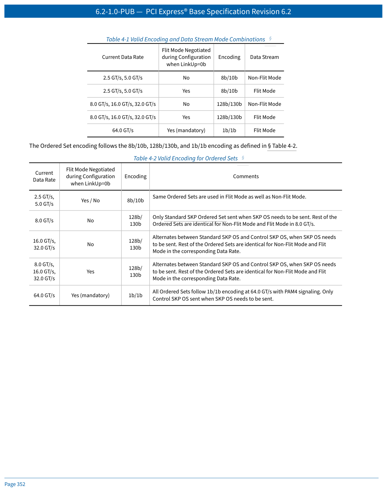
 <em>Figure 4-1: Layering Diagram Highlighting Physical Layer / 图4-1：突出显示物理层的分层图</em>

---

## 4.2 Logical Sub-block
## 4.2 逻辑子层

The logical sub-block has two main sections: a Transmit section that prepares outgoing information passed from the Data Link Layer for transmission by the electrical sub-block, and a Receiver section that identifies and prepares received information before passing it to the Data Link Layer. The logical sub-block directs control and management functions of the Physical Layer.

> 逻辑子层有两个主要部分：发送端部分——准备从数据链路层传递来的外出信息以供电气子层传输；接收端部分——识别并准备接收到的信息，然后传递给数据链路层。逻辑子层引导物理层的控制和管理功能。

PCI Express uses three types of encoding (8b/10b, 128b/130b, and 1b/1b) and two Data Stream modes (Flit Mode and Non-Flit Mode). The encoding is determined by the Data Rate of the Link. The Data Stream mode is determined during initial Link training.

> PCIe 使用三种编码类型（8b/10b、128b/130b 和 1b/1b）和两种数据流模式（Flit 模式和非 Flit 模式）。编码由链路数据速率决定。数据流模式在初始链路训练期间确定。

**Table 4-1: Valid Encoding and Data Stream Mode Combinations | 表4-1：有效编码与数据流模式组合**

| Data Rate | Flit Mode | Encoding | Data Stream |
|-----------|-----------|----------|-------------|
| 2.5, 5.0 GT/s | No | 8b/10b | Non-Flit Mode |
| 2.5, 5.0 GT/s | Yes | 8b/10b | Flit Mode |
| 8.0, 16.0, 32.0 GT/s | No | 128b/130b | Non-Flit Mode |
| 8.0, 16.0, 32.0 GT/s | Yes | 128b/130b | Flit Mode |
| 64.0 GT/s | Yes (mandatory) | 1b/1b | Flit Mode |

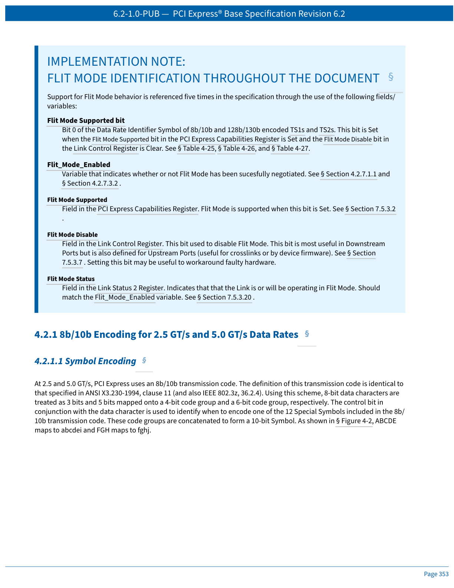
 <em>Table 4-1/4-2: Valid Encoding and Ordered Set Encoding Combinations / 表4-1/4-2：有效编码与有序集编码组合</em>

---

### 4.2.1 8b/10b Encoding for 2.5 GT/s and 5.0 GT/s
### 4.2.1 2.5 GT/s和5.0 GT/s的8b/10b编码

#### 4.2.1.1 Symbol Encoding
#### 4.2.1.1 符号编码

At 2.5 and 5.0 GT/s, PCI Express uses an 8b/10b transmission code (per ANSI X3.230-1994 clause 11 / IEEE 802.3z 36.2.4). 8-bit data characters are treated as 3 bits and 5 bits, mapped onto 4-bit and 6-bit code groups respectively. These are concatenated to form a 10-bit Symbol. The control bit identifies when to encode one of the 12 Special Symbols (K Codes).

> 在 2.5 和 5.0 GT/s 下，PCIe 使用 8b/10b 传输编码（遵循 ANSI X3.230-1994 第 11 条/IEEE 802.3z 第 36.2.4 节）。8 位数据字符被分为 3 位和 5 位，分别映射到 4 位和 6 位码组。这些码组级联形成 10 位符号。控制位标识何时编码 12 个特殊符号（K 码）之一。

Key 8b/10b concepts: **Running Disparity (RD)** for DC balance; **D Characters** — 256 data symbols; **K Characters** — 12 special/control symbols for framing, comma detection, lane de-skew. **COM (K28.5)** is the comma symbol for symbol alignment.

> 8b/10b 关键概念：**运行差异（RD）**—直流平衡机制；**D 字符**—256 个数据符号；**K 字符**—12 个特殊/控制符号用于成帧、逗号检测、Lane 间去偏斜。**COM（K28.5）**是用于符号对齐的逗号符号。

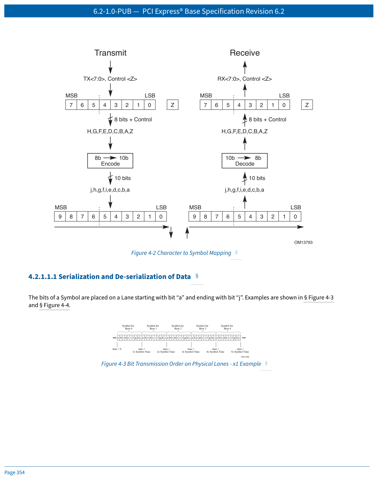
 <em>Figure 4-2: Character to Symbol Mapping / 图4-2：字符到符号的映射</em>

#### 4.2.1.2 Framing of TLPs and DLLPs (Non-Flit Mode)
#### 4.2.1.2 TLP和DLLP的成帧（非Flit模式）

TLPs: **STP** (Start) → TLP Data → **END** (End good) or **EDB** (End bad / nullified)
 DLLPs: **SDP** (Start) → DLLP Data → **END**
 Logical Idle: 00h data fills gaps between packets

> TLP：**STP**（开始）→ TLP 数据 → **END**（结束良好）或**EDB**（结束坏/废弃）
>  DLLP：**SDP**（开始）→ DLLP 数据 → **END**
>  逻辑空闲：00h 数据填充包之间的间隙

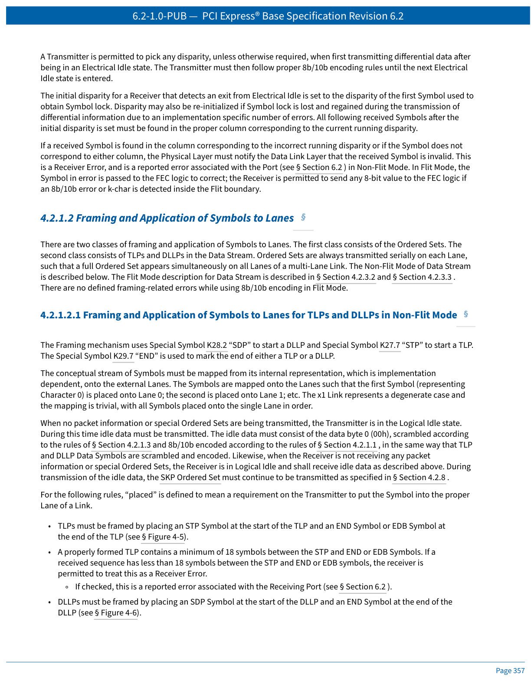
 <em>Figure 4-5: TLP with Framing Symbols Applied / 图4-5：应用成帧符号后的TLP</em>

#### 4.2.1.3 Data Scrambling
#### 4.2.1.3 数据加扰

A 16-bit LFSR with polynomial G(x) = X¹⁶ + X⁵ + X⁴ + X³ + 1 scrambles data before encoding to reduce EMI. The LFSR initializes to FFFFh and advances 8 bits per character. The COM symbol resets the scrambler.

> 16 位 LFSR（多项式 G(x) = X¹⁶ + X⁵ + X⁴ + X³ + 1）在编码前对数据加扰以降低 EMI。LFSR 初始化为 FFFFh，每个字符推进 8 位。COM 符号复位加扰器。

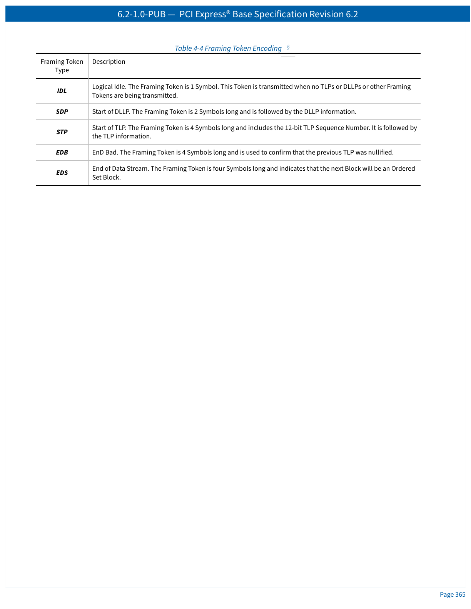
 <em>Figure 4-10: LFSR with 8b/10b Scrambling Polynomial / 图4-10：8b/10b加扰多项式的LFSR</em>

---

### 4.2.2 128b/130b Encoding for 8.0 GT/s, 16.0 GT/s, and 32.0 GT/s
### 4.2.2 8.0、16.0和32.0 GT/s的128b/130b编码

#### 4.2.2.1 Lane Level Encoding
#### 4.2.2.1 Lane级编码

Each Block is 130 bits: a 2-bit Sync Header followed by a 128-bit Payload. The Sync Header is either 01b (Data Block) or 10b (Ordered Set Block). Patterns 00b and 11b are invalid and indicate errors.

> 每个 Block 为 130 位：2 位同步头后跟 128 位载荷。同步头为 01b（数据 Block）或 10b（有序集 Block）。00b 和 11b 模式无效，指示错误。

#### 4.2.2.2 Ordered Set Blocks
#### 4.2.2.2 有序集Block

Ordered Set Blocks carry Training Sequences (TS1/TS2), SKP Ordered Sets (clock compensation), EIOS/EIEOS (electrical idle entry/exit), and SDS (Start of Data Stream).

> 有序集 Block 承载训练序列（TS1/TS2）、SKP 有序集（时钟补偿）、EIOS/EIEOS（电气空闲进入/退出）和 SDS（数据流开始）。

#### 4.2.2.3 Data Blocks — Framing Tokens (Non-Flit Mode)
#### 4.2.2.3 数据Block — 成帧令牌（非Flit模式）

In Non-Flit Mode, Data Blocks use Framing Tokens to convey TLP/DLLP boundaries. Key Framing Token types:

| Token | Encoding | 含义 | Meaning |
|-------|----------|------|---------|
| IDL | 1Eh | 逻辑空闲 | Logical Idle |
| STP | FCh | TLP开始 | Start of TLP |
| SDP | 5Ch | DLLP开始 | Start of DLLP |
| END | F7h | 结束（良好） | End good |
| EDB | F5h | 结束坏（废弃） | End bad / nullified TLP |

 <em>Figure 4-13: Layout of Framing Tokens / 图4-13：成帧令牌布局</em>

#### 4.2.2.4 Scrambling
#### 4.2.2.4 加扰

128b/130b uses a 23-bit LFSR with polynomial G(x) = X²³ + X²¹ + X¹⁶ + X⁸ + X⁵ + X² + 1. The scrambler advances 128 bits per Data Block; it is skipped for Ordered Set Blocks.

> 128b/130b 使用 23 位 LFSR，多项式 G(x) = X²³ + X²¹ + X¹⁶ + X⁸ + X⁵ + X² + 1。每个数据 Block 推进 128 位；有序集 Block 跳过。

#### 4.2.2.5 Precoding (32.0 GT/s)
#### 4.2.2.5 预编码（32.0 GT/s）

At 32.0 GT/s, precoding reduces DFE error propagation. The precoder uses a simple XOR-based feedback loop applied to the scrambled data before transmission.

> 在 32.0 GT/s 下，预编码减少 DFE 错误传播。预编码器使用简单的 XOR 反馈环路，在传输前应用于加扰后的数据。

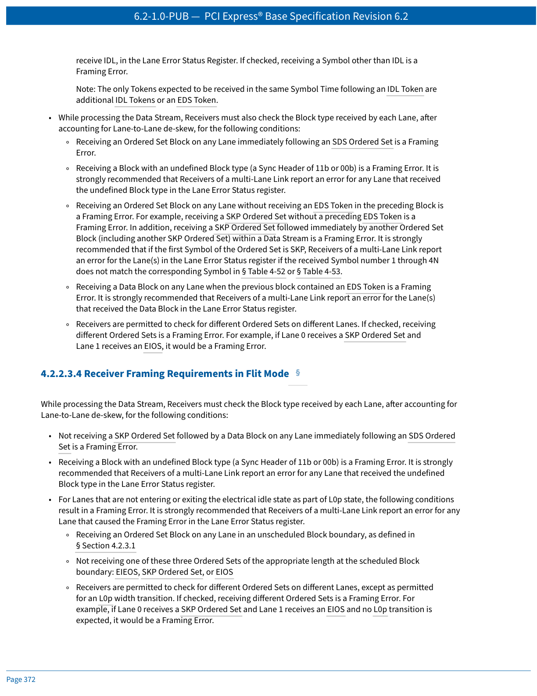
 <em>Figure 4-20: Precoding with the Scrambler/De-scrambler / 图4-20：预编码与加扰器/解扰器</em>

---

### 4.2.3 Flit Mode Operation / 1b/1b Encoding for 64.0 GT/s
### 4.2.3 Flit模式操作 / 64.0 GT/s的1b/1b编码

Flit Mode is mandatory at 64.0 GT/s and optional at lower data rates. In Flit Mode, TLPs and DLLPs are carried inside **Flits** — fixed-size transfer units that integrate CRC, FEC, and sequence numbering at the physical layer level.

> Flit 模式在 64.0 GT/s 下为强制要求，在较低数据速率下为可选。在 Flit 模式下，TLP 和 DLLP 承载在**Flit**内部——Flit 是固定大小的传输单元，在物理层级别集成了 CRC、FEC 和序列编号。

#### 4.2.3.1 PAM4 Signaling (64.0 GT/s)
#### 4.2.3.1 PAM4信令（64.0 GT/s）

At 64.0 GT/s, PAM4 encodes 2 bits per UI using four voltage levels (0, 1, 2, 3). Gray coding ensures adjacent voltage levels differ by only 1 bit, minimizing bit errors. Precoding mitigates DFE error propagation in PAM4.

> 在 64.0 GT/s 下，PAM4 使用四个电压电平（0、1、2、3）每 UI 编码 2 位。格雷码确保相邻电压电平仅相差 1 位，最小化位错误。预编码减轻 PAM4 中的 DFE 错误传播。

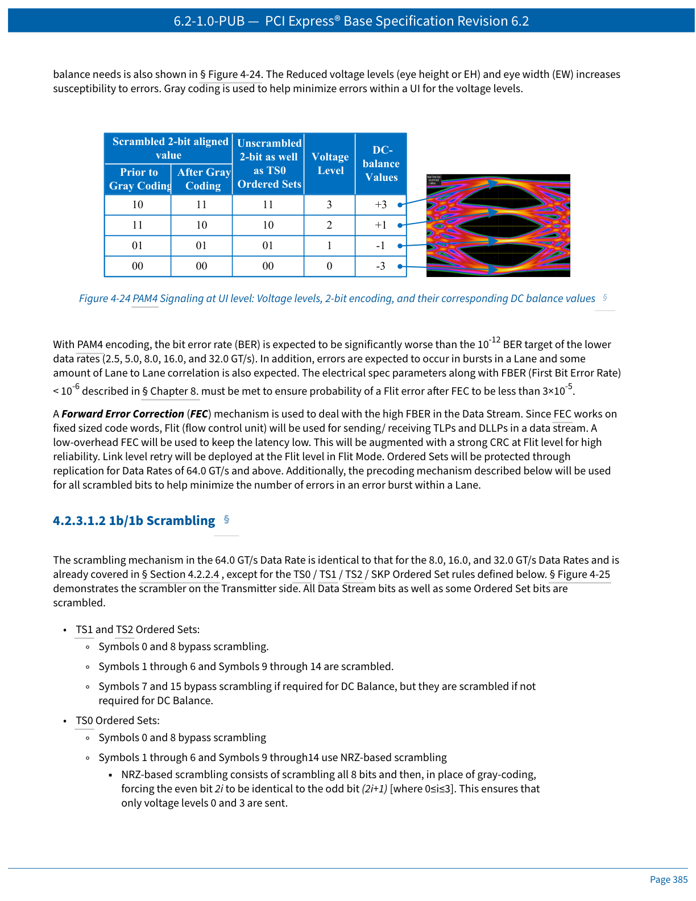
 <em>Figure 4-24: PAM4 Signaling at UI Level — Voltage Levels, 2-bit Encoding, DC Balance / 图4-24：UI级别的PAM4信令 — 电压电平、2位编码和DC平衡值</em>

#### 4.2.3.2 Flit Structure
#### 4.2.3.2 Flit结构

Each Flit contains:
- **TLP Bytes**: Up to 236 DW of TLP data, carrying partial or complete TLPs
- **DLP Bytes**: 4 bytes for DLLP / Optimized_Update_FC / Flit_Marker
- **CRC Bytes**: 4 bytes (CRC-32 matching LCRC polynomial 04C11DB7h)
- **ECC Bytes**: 6 bytes (forward error correction over GF(2⁸))

> 每个 Flit 包含：
> - **TLP 字节**：最多 236 DW TLP 数据，承载部分或完整 TLP
> - **DLP 字节**：4 字节用于 DLLP / Optimized_Update_FC / Flit_Marker
> - **CRC 字节**：8 字节（CRC-32，与 LCRC 多项式 04C11DB7h 一致）
> - **FEC 字节**：6 字节（GF(2⁸)上的前向纠错，Reed-Solomon 编码）
> - **保留字节**：2 字节
>
> 注：Flit 总长度为 256 字节（x16 链路）

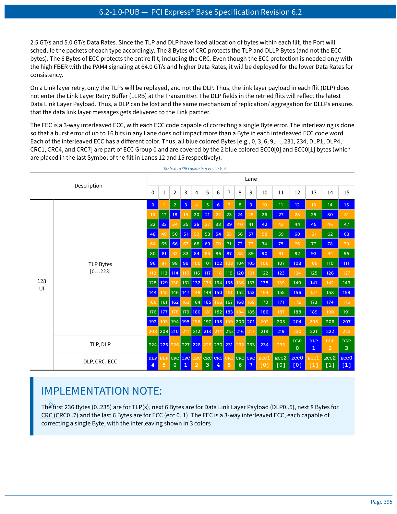
 <em>Table 4-10: Flit Layout in a x16 Link / 表4-10：x16链路中的Flit布局</em>

**Table 4-12: Flit Interleaving in a x4 Link | 表4-12：x4链路中的Flit交错**

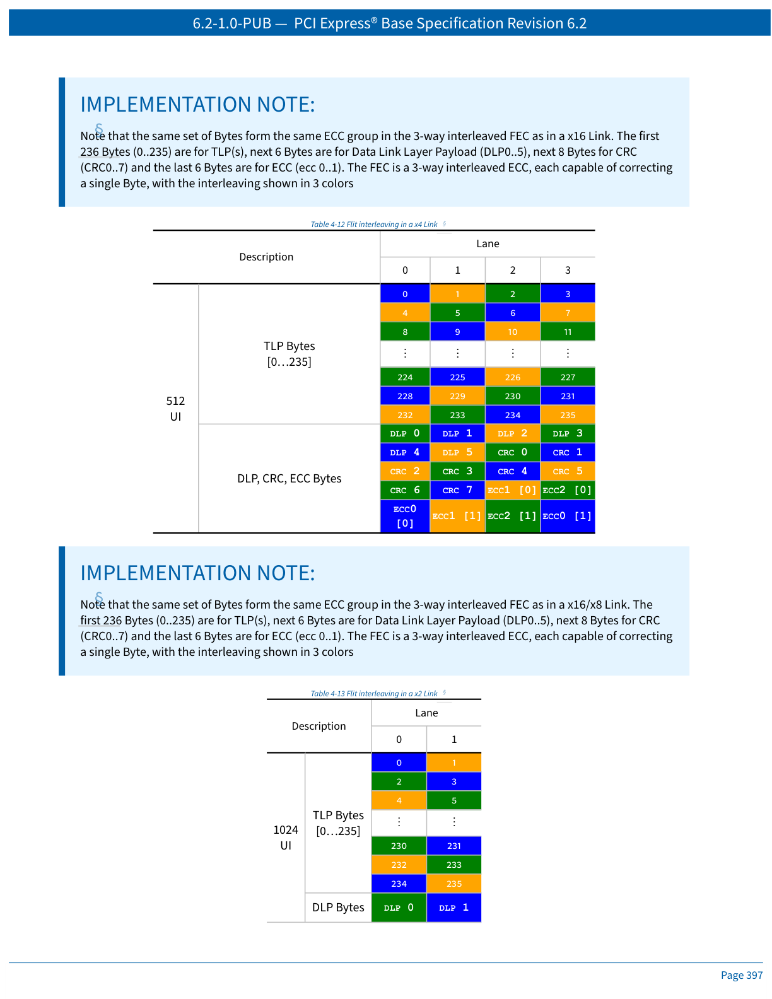
 <em>Table 4-12: Flit Interleaving in a x4 Link / 表4-12：x4链路中的Flit交错</em>

**Table 4-16: Flit Types | 表4-16：Flit类型**

| Encoding | Type | 类型 | Description |
|----------|------|------|-------------|
| 000b | No Data | 无数据 | NOP TLP(s) + DLP; payload is NOP TLPs |
| 001b | Data | 数据 | Valid TLP payload |
| 010b | Retry | 重放 | Replayed Flit (original Flit was corrupted) |
| 011b | IDLE | 空闲 | IDLE state Flit, exchanged during handshake |

#### 4.2.3.3 DLP Bytes: Optimized_Update_FC and Flit_Marker
#### 4.2.3.3 DLP字节：Optimized_Update_FC和Flit_Marker

**Optimized_Update_FC** (Table 4-18): Compact flow control update — 2 bytes carrying VC, credit type, and 8-bit HdrFC/DataFC fields. Lacks HdrScale/DataScale — uses the scale factors advertised during FC initialization.

**Flit_Marker** (Table 4-19): Marks special conditions — Poisoned TLP, Nullified TLP, NAK_WITHDRAWAL.

> **Optimized_Update_FC**（表 4-18）：紧凑的流控更新——2 字节承载 VC、信用类型和 8 位 HdrFC/DataFC 字段。不含 HdrScale/DataScale——使用 FC 初始化期间公布的缩放因子。
>
> **Flit_Marker**（表 4-19）：标记特殊情况——中毒 TLP（Poisoned TLP）、废弃 TLP（Nullified TLP）、Nak 撤回（NAK_WITHDRAWAL）。

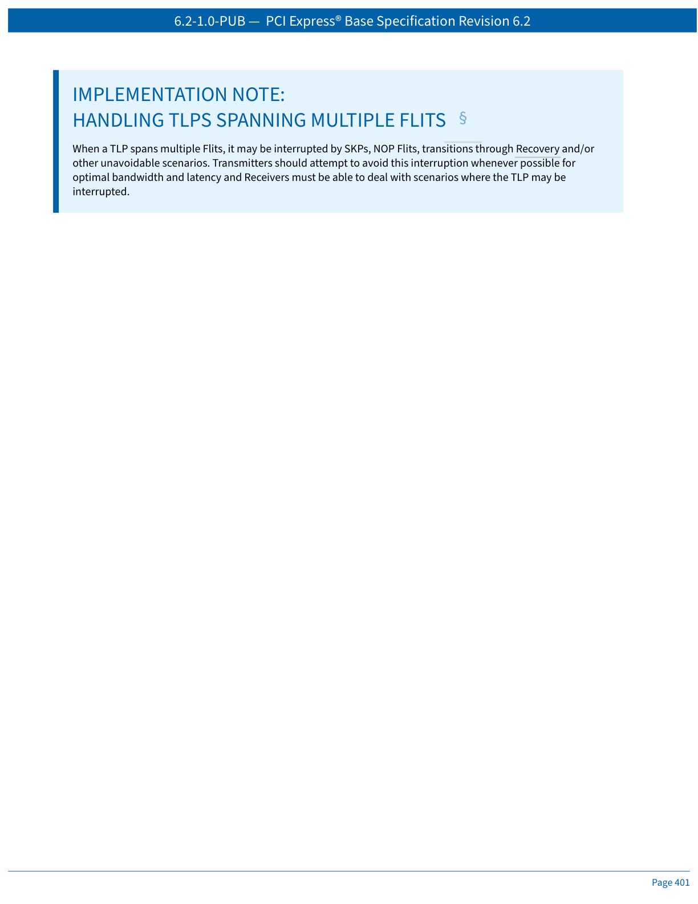
 <em>Figure 4-31: Optimized_Update_FC / Figure 4-32: Flit_Marker / 图4-31/4-32：Optimized_Update_FC与Flit_Marker格式</em>

#### 4.2.3.4 Flit Sequence Number and Retry Mechanism
#### 4.2.3.4 Flit序列号与重放机制

Flit Mode uses a 12-bit sequence number and a replay mechanism operating at the Flit level:

**Handshake phases:**
1. **IDLE Flit Handshake**: Initial sequence number synchronization between Ports
2. **Sequence Number Handshake**: Confirm readiness and initial sequence numbers
3. **Normal Flit Exchange**: Ongoing data transfer with Ack/Nak/Discard processing
4. **Flit Replay**: Retransmission of unacknowledged Flits when Nak received or timer expires

> Flit 模式使用 12 位序列号和运行在 Flit 级别的重放机制：
>
> **握手阶段：**
> 1. **IDLE Flit 握手**：端口间初始序列号同步
> 2. **序列号握手**：确认就绪和初始序列号
> 3. **正常 Flit 交换**：持续数据传输与 Ack/Nak/丢弃处理
> 4. **Flit 重放**：收到 Nak 或定时器超时时重新传输未确认的 Flit

**Key features / 关键特性：**
- **NAK_WITHDRAWAL**: When following Flits are received correctly, pending Naks can be canceled — avoids unnecessary replay / 当后续Flit正确接收时，可取消待处理Nak——避免不必要的重放
- Sequence numbers roll over at 4096 / 序列号在4096处回绕
- Ack/Nak processing uses sliding window protocol / Ack/Nak处理使用滑动窗口协议

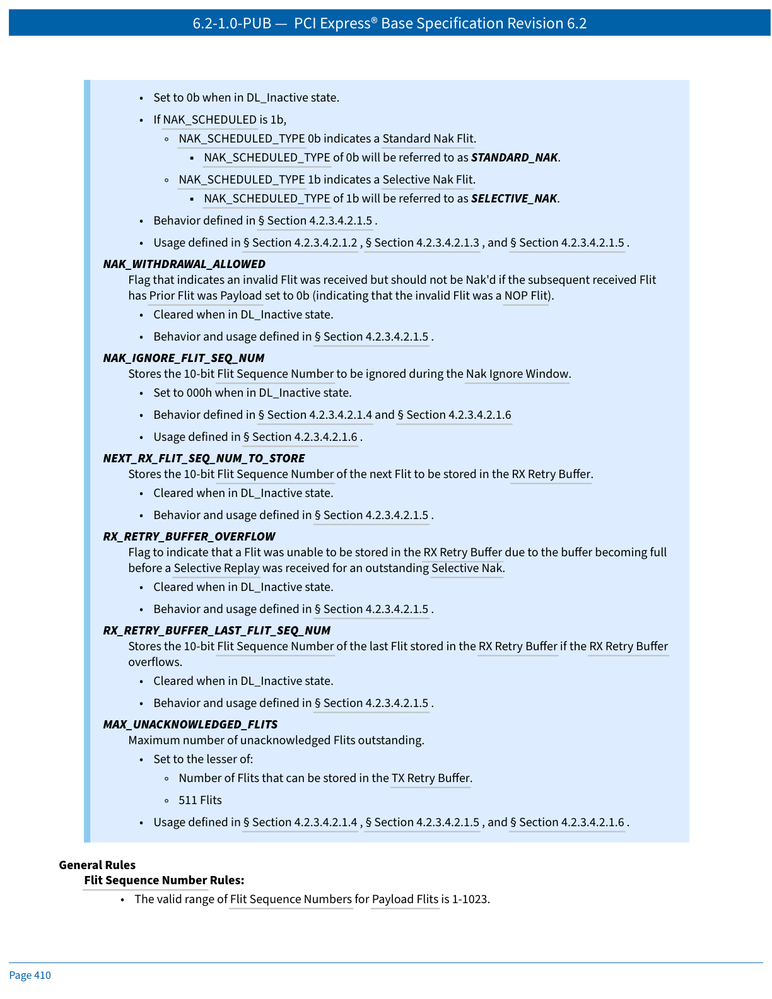
 <em>Figure 4-33: Flit Ack, Nak, and Discard Rules Flow Chart / 图4-33：Flit Ack/Nak/丢弃规则流程图</em>

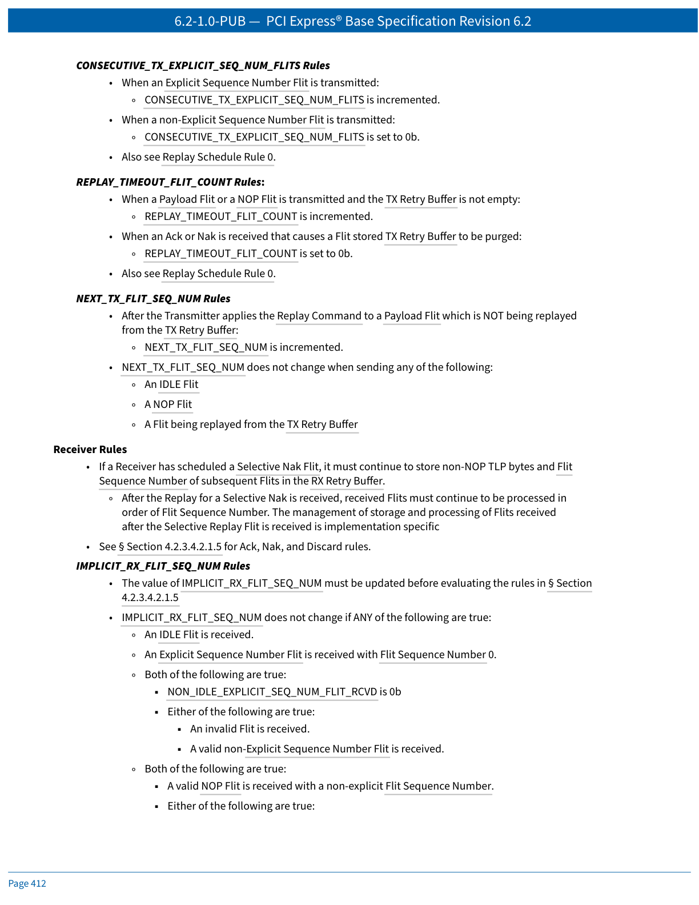
 <em>Figure 4-34: Flit Ack/Nak/Replay Example / 图4-34：Flit Ack/Nak/重放示例</em>

#### 4.2.3.5 CRC and FEC in Flit
#### 4.2.3.5 Flit中的CRC与FEC

The Flit CRC uses the same polynomial as TLP LCRC (04C11DB7h). FEC provides forward error correction using a code over GF(2⁸), enabling correction of single-byte errors without retransmission. The H-matrix (Figure 4-38) defines the FEC code structure.

> Flit CRC 使用与 TLP LCRC 相同的多项式（04C11DB7h）。FEC 使用 GF(2⁸)上的编码提供前向纠错，无需重传即可纠正单字节错误。H 矩阵（图 4-38）定义 FEC 编码结构。

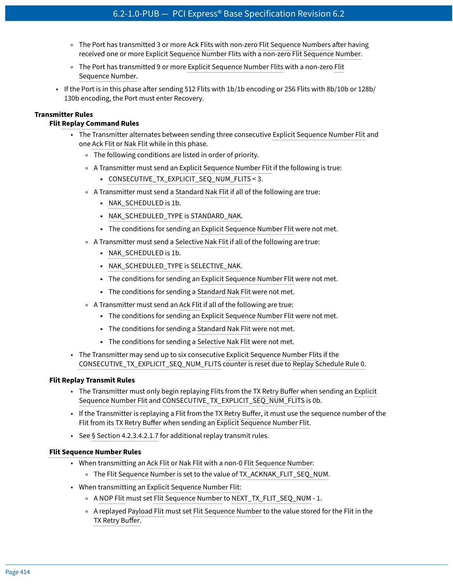
 <em>Figure 4-35: CRC Generation/Checking in Flit / 图4-35：Flit中的CRC生成/检查</em>

---

### 4.2.4 Link Equalization Procedure (8.0 GT/s+)
### 4.2.4 链路均衡过程（8.0 GT/s及以上）

The Link Equalization Procedure allows the Receiver to request the Transmitter to adjust its equalization coefficients (pre-cursor c-1, post-cursor c+1, and at 64.0 GT/s c-2) to optimize the received eye. The procedure uses TS1 Ordered Sets during the Recovery.Equalization LTSSM state. Four phases:

| Phase | 阶段 | Action |
|-------|------|--------|
| **Phase 0** | 阶段0 | Upstream transmits initial presets |
| **Phase 1** | 阶段1 | Downstream adjusts coefficients, Upstream holds |
| **Phase 2** | 阶段2 | Upstream adjusts coefficients, Downstream holds |
| **Phase 3** | 阶段3 | Fine-tuning and finalization of both directions |

> 链路均衡过程允许接收端请求发送端调整均衡系数以优化接收眼图。该过程在 Recovery.Equalization LTSSM 状态中使用 TS1 有序集。四个阶段如上表。

#### 4.2.4.1 Transmitter Coefficient Rules
#### 4.2.4.1 发送端系数规则

Coefficients must support all presets defined in § Chapter 8 (Tables 8-1/8-2). Coefficient constraints: max swing limited to ±unity; c-1, c+1 ≤ 0 (NRZ); c-2 ≥ 0, c-1, c+1 ≤ 0 (PAM4 at 64.0 GT/s).

> 系数必须支持第 8 章（表 8-1/8-2）中定义的所有预设值。系数约束：最大摆幅限制在±unity；c-1、c+1 ≤ 0（NRZ）；c-2 ≥ 0，c-1、c+1 ≤ 0（64.0 GT/s PAM4）。

#### 4.2.4.2 Encoding of Presets
#### 4.2.4.2 预设值编码

Presets are encoded in TS1 Ordered Sets during equalization. Table 4-23 maps preset numbers to the coefficient request fields transmitted during Phase 1, 2, and 3.

> 均衡期间预设值在 TS1 有序集中编码。表 4-23 将预设值编号映射到阶段 1、2、3 期间传输的系数请求字段。

---

### 4.2.5 Link Initialization and Training
### 4.2.5 链路初始化与训练

#### 4.2.5.1 Training Sequences (TS1/TS2)
#### 4.2.5.1 训练序列（TS1/TS2）

TS1 and TS2 Ordered Sets exchange Link number, Lane number, data rate capabilities, and training control bits during Link training. TS1: early training states; TS2: after successful TS1 exchange, confirms readiness.

> TS1 和 TS2 有序集在链路训练期间交换链路编号、Lane 编号、数据速率能力和训练控制位。TS1 用于早期训练状态；TS2 在成功 TS1 交换后使用，确认就绪。

Key TS fields: Link Number, Lane Number, Data Rate Identifier, Training Control (Hot Reset, Disable Link, Loopback, Compliance Receive), Equalization Control (Presets, Coefficients).

> 关键 TS 字段：链路编号、Lane 编号、数据速率标识符、训练控制（热复位、链路禁用、环回、合规接收）、均衡控制（预设值、系数）。

#### 4.2.4.3 Lane Margining
#### 4.2.4.3 Lane裕量化（Lane Margining）

Lane Margining is a receiver-directed feature that allows the host to evaluate link margin by adjusting the receive sampling point in voltage and time. This enables system-level characterization of channel performance beyond standard compliance testing.

> Lane 裕量化是一种接收端导向的功能，允许主机通过调整接收端在电压和时间上的采样点来评估链路裕量。这使得系统级通道性能表征超越标准合规测试。

**Key concepts / 关键概念：**

- **Voltage Margin / 电压裕量**：Adjusts the receiver's threshold voltage up or down to find the pass/fail boundary
- **Time Margin / 时间裕量**：Adjusts the receiver's sampling point earlier or later in the Unit Interval (UI)
- **Margin Type / 裕量类型**：Left/Right (voltage), Up/Down (time in PAM4)
- **Margin Steps / 裕量步进**：Defined steps defined by the spec, typically 1/4 UI for time, defined mV steps for voltage

**Table 4-24: Lane Margining Types | 表4-24：Lane裕量化类型**

| Margin Type | 裕量类型 | Description | 描述 |
|-------------|----------|-------------|------|
| Voltage High | 电压高 | Margining above the nominal center | 在标称中心之上裕量 |
| Voltage Low | 电压低 | Margining below the nominal center | 在标称中心之下裕量 |
| Time Early | 时间早 | Sampling before nominal center | 在标称中心之前采样 |
| Time Late | 时间晚 | Sampling after nominal center | 在标称中心之后采样 |

**Usage / 使用场景：**
- Post-train link quality verification / 训练后链路质量验证
- System Bring-up and debug / 系统启动和调试
- Margin drift monitoring over time / 随时间推移的裕量漂移监测
- CXL and PCIe 6.0+ compliance testing / CXL和PCIe 6.0+合规测试

> 注：Lane 裕量化在 PCIe 6.2 规范中为可选项，其实现取决于系统供应商是否支持。

---

#### 4.2.5.2 Alternate Protocol Negotiation
#### 4.2.5.2 替代协议协商

PCI Express supports Alternate Protocol negotiation via TS1/TS2. This allows protocols such as CXL to negotiate and share the same physical Link.

> PCIe 通过 TS1/TS2 支持替代协议协商。这允许 CXL 等协议协商并共享同一物理链路。

#### 4.2.5.3 Electrical Idle Sequences
#### 4.2.5.3 电气空闲序列

**EIOS** — Enter Electrical Idle. **EIEOS** — Exit Electrical Idle (mandatory at 8.0 GT/s+). EIEOS provides a robust mechanism to distinguish true exit from noise during Electrical Idle.

> **EIOS**：进入电气空闲。**EIEOS**：退出电气空闲（8.0 GT/s 及以上强制）。EIEOS 提供强健的机制将真正的退出与电气空闲期间的噪声区分开来。

#### 4.2.5.9 Reset
#### 4.2.5.9 复位

- **Fundamental Reset**: Cold reset — PERST# assertion, power-on / **基本复位**：冷复位——PERST#断言，上电
- **Hot Reset**: In-band via TS1 Ordered Sets, propagated through Switch hierarchy / **热复位**：通过TS1有序集的带内复位，沿Switch层级传播
- **Warm Reset**: Reset without power removal / **温复位**：不断电复位

#### 4.2.5.10–11 Data Rate, Width, and Lane Negotiation
#### 4.2.5.10–11 数据速率、宽度和Lane协商

Data rate negotiation selects the highest mutually supported data rate via TS1/TS2 Data Rate Identifier fields. Link width (x1/x2/x4/x8/x16) and Lane ordering/reversal are negotiated. Lane reversal is permitted.

> 数据速率协商通过 TS1/TS2 数据速率标识符字段选择最高互支持的数据速率。链路宽度（x1/x2/x4/x8/x16）和 Lane 排序/反转在训练期间协商。允许 Lane 反转。

---

### 4.2.6 LTSSM Descriptions
### 4.2.6 LTSSM（链路训练与状态机）描述

The LTSSM is the core state machine governing Link initialization, training, recovery, and power management:

| State | 状态 | Primary Function | 主要功能 |
|-------|------|-----------------|----------|
| **Detect** | 检测 | Detect receiver at far end | 检测远端接收器 |
| **Polling** | 轮询 | Bit/symbol lock, polarity, data rate | 位/符号锁定、极性、数据速率 |
| **Configuration** | 配置 | Link width, Lane numbering, de-skew | 链路宽度、Lane编号、去偏移 |
| **Recovery** | 恢复 | Retrain, change rate/width, equalization | 重训练、变更速率/宽度、均衡 |
| **L0** | L0 | Normal operation | 正常运行 |
| **L0s** | L0s | Tx low-power standby | Tx低功耗待机 |
| **L1** | L1 | Bidirectional lower power | 双向更低功耗 |
| **L2** | L2 | Deep power saving | 深度省电 |
| **Disabled** | 禁用 | Link disabled by software | 软件禁用链路 |
| **Loopback** | 环回 | Test/debug | 测试/调试 |
| **Hot Reset** | 热复位 | In-band reset | 带内复位 |

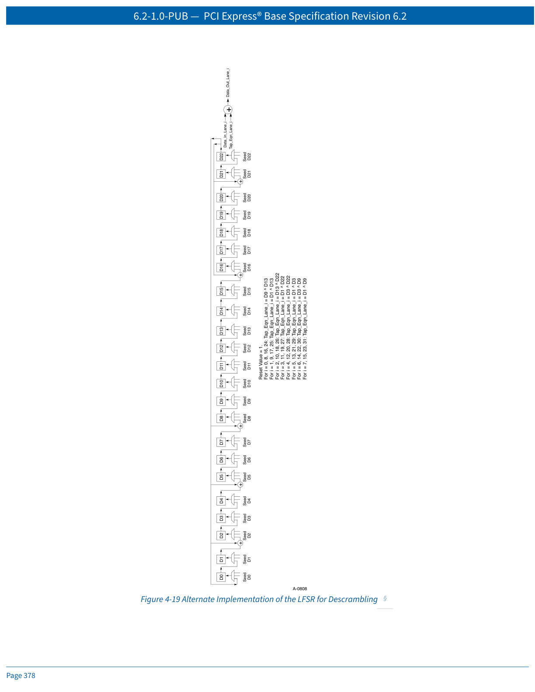
 <em>Figure 4-40: LTSSM Top-Level State Diagram / 图4-40：LTSSM顶层状态图</em>

### 4.2.7 LTSSM State Rules (Detailed)
### 4.2.7 LTSSM状态规则（详细）

Each LTSSM state has detailed rules covering entry/exit conditions, timer management, and error handling. Key timers include: 2 ms Detect timeout; 24 ms Polling timeout; 12 ms Configuration timeout; various Recovery timeouts optimized per data rate.

> 每个 LTSSM 状态都有涵盖进入/退出条件、定时器管理和错误处理的详细规则。关键定时器包括：2ms 检测超时、24ms 轮询超时、12ms 配置超时、以及针对各数据速率优化的各种恢复超时。

**Detect** — Detect.Quiet (initial, wait 2 ms) → Detect.Active (perform Rx detection by measuring RC time constant). Rx detected → Polling; not detected → back to Detect.Quiet.

**Polling** — Polling.Active: Transmit TS1 at highest data rate; achieve bit/symbol/block lock; determine Lane polarity. Exit to Configuration on 8 matching consecutive TS1. Polling.Compliance: Transmit compliance patterns when directed.

**Configuration** — Linkwidth.Start (propose width) → Linkwidth.Accept → Lanenum.Wait → Lanenum.Accept → Complete (send TS2, de-skew, exit to L0). Configuration.Idle for Flit Mode/higher rates.

**Recovery** — RcvrLock (re-establish bit/symbol lock) → RcvrCfg (re-establish Lane numbering) → optionally Speed (change data rate) or Equalization (Phase 0-3 at >= 8.0 GT/s).

**L0** — Normal operation. Exit to Recovery for retraining, L0s/L1 for power management. **L0s**: Tx-only low power, fast exit. **L1**: Bidirectional low power, CLKREQ# used for Refclk restart. **L2**: Deep power saving.

**Loopback** — Entry → Active (loop data back) → Exit (timeout or electrical idle).

**Hot Reset** — Downstream sends TS1 with Hot Reset bit; Upstream propagates upstream. Duration: 2 ms.

> **Detect（检测）** — Detect.Quiet（初始，等待 2ms）→ Detect.Active（通过测量 RC 时间常数执行 Rx 检测）。检测到 Rx → Polling；未检测到 → 回 Detect.Quiet。
>
> **Polling（轮询）** — Polling.Active：以最高数据速率发送 TS1；实现位/符号/Block 锁定；确定 Lane 极性。收到 8 个连续匹配的 TS1 时退出到 Configuration。Polling.Compliance：被指示时发送合规码型。
>
> **Configuration（配置）** — Linkwidth.Start（提议宽度）→ Linkwidth.Accept → Lanenum.Wait → Lanenum.Accept → Complete（发送 TS2、去偏移、退出到 L0）。Configuration.Idle 用于 Flit 模式和更高数据速率。
>
> **Recovery（恢复）** — RcvrLock（重建位/符号锁定）→ RcvrCfg（重建 Lane 编号）→ 可选 Speed（变更数据速率）或 Equalization（≥8.0 GT/s 时阶段 0-3）。
>
> **L0** — 正常运行。退出到 Recovery 进行重训练，退出到 L0s/L1 进行电源管理。**L0s**：仅 Tx 低功耗，快速退出。**L1**：双向低功耗，CLKREQ#用于 Refclk 重启。**L2**：深度省电。
>
> **Loopback（环回）** — Entry → Active（环回数据）→ Exit（超时或电气空闲）。
>
> **Hot Reset（热复位）** — 下游发送 Hot Reset 位置位的 TS1；上游向上游传播。持续时间：2ms。

---

## 4.3 Retimers
## 4.3 重定时器

A Retimer is a physical layer device between two PCI Express components that extends channel reach by recovering, re-timing, and retransmitting the signal — effectively resetting the channel budget. Retimers are protocol-aware and participate in LTSSM state transitions.

> 重定时器（Retimer）是位于两个 PCIe 组件之间的物理层设备，通过恢复、重新定时和重新发送信号来扩展通道传输距离——有效地重置通道预算。Retimer 具有协议感知能力，参与 LTSSM 状态转换。

### Architecture / 架构

A Retimer contains two Pseudo-Ports: an Upstream Pseudo-Port and a Downstream Pseudo-Port. Each Pseudo-Port has its own LTSSM and tracks the state of its associated Link segment.

> Retimer 包含两个伪端口（Pseudo-Port）：上行伪端口和下行伪端口。每个伪端口有其自己的 LTSSM，并跟踪其关联链路段的状态。

### Operation Modes / 运行模式

- **Execute Mode**: Fully decode and re-encode all physical layer information. All mandatory behaviors and LTSSM state transitions are supported in this mode. / **执行模式**：完全解码并重新编码所有物理层信息。此模式支持所有强制行为和LTSSM状态转换。
- **Forward Mode**: Forward symbols without full decoding. Used for features the Retimer does not support. / **转发模式**：不完全解码地转发符号。用于Retimer不支持的功能。
- **Switching between modes**: Transition when encountering unsupported features or returning to supported ones. / **模式间切换**：遇到不支持的功能或返回支持的功能时转换。

### Forwarding Rules (Key Subsets) / 转发规则（关键子集）

Retimer forwarding covers: Electrical Idle exit handling, data rate change support, transmitter settings propagation, Ordered Set modification (TS fields updated), Hot Reset forwarding, Link disable, Loopback passthrough, Compliance Receive, and in-band register access.

> Retimer 转发涵盖：电气空闲退出处理、数据速率变更支持、发送端设置传播、有序集修改（更新 TS 字段）、热复位转发、链路禁用、环回透传、合规接收和带内寄存器访问。

### Latency / 延迟

Retimer adds latency to the Link. Maximum limits are defined in Table 4-64 (non-SRIS) and Table 4-67 (SRIS). Total latency across all Retimers must not exceed specified limits.

> Retimer 给链路增加延迟。最大限值定义于表 4-64（非 SRIS）和表 4-67（SRIS）。所有 Retimer 的总延迟不得超过规定限值。

### Configuration / 配置

Retimers are configured via in-band register access. Parameters include global (entire Retimer) and per-Pseudo-Port settings: receiver impedance, transmitter settings, execution mode, predetermined data rate, L1 PM Substates support.

> Retimer 通过带内寄存器访问进行配置。参数包括全局（整个 Retimer）和每伪端口设置：接收端阻抗、发送端设置、执行模式、预设定数据速率、L1 PM 子状态支持。

---

## 术语附录 | Terminology Appendix

| English | 中文 | Notes |
|---------|------|-------|
| 1b/1b | 1b/1b编码 | 64.0 GT/s PAM4 |
| 8b/10b | 8b/10b编码 | 2.5/5.0 GT/s |
| 128b/130b | 128b/130b编码 | 8.0/16.0/32.0 GT/s |
| Block Alignment | Block对齐 | Sync Header检测 |
| COM (K28.5) | 逗号符号 | 符号对齐基准 |
| Compliance Pattern | 合规码型 | 测试用 |
| CRC (Cyclic Redundancy Check) | 循环冗余校验 | 8字节，CRC-32 |
| Data Stream | 数据流 | TLP/DLLP或Flit的连续集合 |
| DFE (Decision Feedback Equalization) | 判决反馈均衡 | |
| FEC (Forward Error Correction) | 前向纠错 | GF(2⁸) Reed-Solomon编码，6字节 |
| EDB (End Bad) | 结束坏 | 废弃的TLP |
| EIEOS | 电气空闲退出有序集 | |
| EIOS | 电气空闲有序集 | |
| Electrical Idle | 电气空闲 | |
| END (End Good) | 结束良好 | |
| Equalization (EQ) | 均衡 | Phase 0-3 |
| Execute Mode | 执行模式 | Retimer |
| Flit | Flit | FM固定大小传输单元 |
| Flit Mode (FM) | Flit模式 | 64.0 GT/s强制 |
| Flit_Marker | Flit标记 | 中毒/废弃/Nak撤回 |
| Forward Mode | 转发模式 | Retimer |
| Framing Token (FT) | 成帧令牌 | 128b/130b NFM |
| FTS (Fast Training Sequence) | 快速训练序列 | L0s退出用 |
| Gray Coding | 格雷码 | PAM4 |
| IDL (Logical Idle) | 逻辑空闲 | |
| K Code / D Code | K码/D码 | 特殊/数据符号 |
| LFSR | 线性反馈移位寄存器 | 加扰 |
| Lane Margining | Lane裕量化 | 接收端导向的电压/时间裕量评估 |
| LTSSM | 链路训练与状态机 | |
| NAK_WITHDRAWAL | Nak撤回 | Flit模式优化 |
| Non-Flit Mode (NFM) | 非Flit模式 | |
| Optimized_Update_FC | 优化流控更新 | Flit模式 |
| Ordered Set (OS) | 有序集 | TS1/TS2/SKP/EIOS/SDS |
| PAM4 | 四电平脉冲幅度调制 | 64.0 GT/s |
| Precoding | 预编码 | DFE错误传播抑制 |
| Pseudo-Port | 伪端口 | Retimer内部 |
| RD (Running Disparity) | 运行差异 | 8b/10b DC平衡 |
| Recovery | 恢复 | LTSSM状态 |
| Retimer | 重定时器 | 通道扩展 |
| Scrambling | 加扰 | EMI降低 |
| SDP (Start of DLLP) | DLLP开始 | |
| SDS (Start of Data Stream) | 数据流开始有序集 | |
| SKP Ordered Set | SKP有序集 | 时钟补偿 |
| STP (Start of TLP) | TLP开始 | |
| Sync Header | 同步头 | 128b/130b的2位头 |
| TS1 / TS2 | 训练序列1/2 | |
| Skew / De-skew | 偏移/去偏移 | 多Lane对齐 |
