# Chapter 5: Power Management — 第5章：电源管理
> **来源：** PCI Express Base Specification Revision 6.2 (2024-01-25)
> **PDF页码：** 651–706 (共56页)
> **格式：** 中英文段落对照 (Chinese-English Parallel)
---
## 5.1 Overview — 概述
> PDF页码：651
This chapter describes power management (PM) capabilities and protocols. Power Management states are as follows:
- D states are associated with a particular Function: D0 is the operational state and consumes the most power; D1 and D2 are intermediate power saving states; D3Hot is a very low power state; D3Cold is the power off state.
- L states are associated with a particular Link: L0 is the operational state; L0p is a reduced power sub-state of L0; L0s, L1, L1.0, L1.1, and L1.2 are various lower power states.

Other specifications define related power states (e.g., S states). This specification does not describe relationships between those states and D/L states.

> 本章描述电源管理（PM）的能力与协议。电源管理状态如下：
> - **D状态**与特定Function关联：D0为正常工作状态，功耗最高；D1和D2为中间省电状态；D3Hot为极低功耗状态；D3Cold为断电状态。
> - **L状态**与特定Link关联：L0为正常工作状态；L0p为L0的降功耗子状态；L0s、L1、L1.0、L1.1和L1.2为各种低功耗状态。
>
> 其他规范定义了相关的电源状态（如S状态），本规范不描述这些状态与D/L状态之间的关系。

---
PM provides the following services:
1. A mechanism to identify power management capabilities of a given Function
2. The ability to transition a Function into a certain power management state
3. Notification of the current power management state of a Function
4. The option to wakeup the system on a specific event

PM is compatible with the PCI Bus Power Management Interface Specification and the Advanced Configuration and Power Interface Specification. This chapter also defines PCI Express Native Power Management extensions.

> PM提供以下服务：
> 1. 识别给定Function的电源管理能力
> 2. 将Function转换到特定电源管理状态
> 3. 通知当前Function的电源管理状态
> 4. 在特定事件上唤醒系统的选项
>
> PM兼容PCI Bus Power Management Interface Specification和ACPI规范。本章还定义了PCI Express原生电源管理扩展。

---
PM defines Link power management states that a PCI Express physical Link is permitted to enter in response to either software driven D-state transitions or active state Link power management activities. PCI Express Link states are not visible directly to legacy bus driver software, but are derived from the power management state of the components residing on those Links. Defined Link states are L0, L0s, L1, L2, and L3. The power savings increase as the Link state transitions from L0 through L3.

> PM定义了PCIe物理链路可进入的链路电源管理状态——响应软件驱动D-state转换或活跃状态链路电源管理活动。PCIe链路状态对传统总线驱动软件不可见，而是由驻留在这些链路上的组件的电源管理状态派生而来。定义的链路状态为L0、L0s、L1、L2和L3，从L0到L3功耗节省递增。

---
Components may wakeup the system using a wakeup mechanism followed by a power management event (PME) Message. PCI Express systems may provide the optional auxiliary power supply (Vaux) needed for wakeup operation from states where the main power supplies are off.

Unlike earlier mechanisms, the PCI Express-PM PME mechanism separates the following two PME tasks:
- Reactivation (wakeup) of the associated resources (i.e., re-establishing reference clocks and main power rails to the PCI Express components)
- Sending a PME Message to the Root Complex to provide the source of the wakeup event

> 组件可使用唤醒机制后跟PME消息来唤醒系统。PCIe系统可提供可选的辅助电源(Vaux)，用于在主电源关闭状态下进行唤醒操作。
>
> 与早期机制不同，PCIe-PM的PME机制将以下两个PME任务分离开：
> - 重新激活相关资源（即重新建立PCIe组件的参考时钟和主电源轨）
> - 向Root Complex发送PME消息以指明唤醒事件的来源

---
Active State Power Management (ASPM) is an autonomous hardware-based, active state mechanism that enables power savings even when the connected components are in the D0 state. After a period of idle Link time, an ASPM Physical-Layer protocol places the idle Link into a lower power state. Once in the lower-power state, transitions to the fully operative L0 state are triggered by traffic appearing on either side of the Link. ASPM may be disabled by software.

> 主动状态电源管理（ASPM）是一种自主硬件驱动的活跃状态机制，即使连接的组件处于D0状态也能实现省电。在链路空闲一段时间后，ASPM物理层协议将空闲链路置于低功耗状态。进入低功耗状态后，链路任意一侧出现的流量会触发向完全工作L0状态的转换。ASPM可被软件禁用。

---
## 5.2 Link State Power Management — 链路状态电源管理
> PDF页码：652–656
PCI Express defines Link power management states, replacing the bus power management states that were defined by the PCI Bus Power Management Interface Specification. Link states are not visible to PCI-PM legacy compatible software, and are either derived from the power management D-states of the corresponding components connected to that Link or by ASPM protocols.

> PCIe定义了链路电源管理状态，取代PCI总线电源管理接口规范定义的Bus电源管理状态。Link状态对PCI-PM兼容的旧软件不可见，由连接到该Link的对应组件的D-states或ASPM协议派生。

---
### L-State Definitions — L状态定义
#### L0 (including L0p sub-state) — Active State
L0 support is required for both ASPM and PCI-PM compatible power management. All PCI Express transactions and other operations are enabled.

> L0支持对ASPM和PCI-PM兼容电源管理都是必需的。所有PCIe事务和其他操作均启用。

#### L0s — Standby State
A low resume latency, energy saving "standby" state. L0s support is optional for ASPM unless the applicable form factor specification for the Link explicitly requires L0s support. All main power supplies, component reference clocks, and components' internal PLLs must be active at all times during L0s. TLP and DLLP transmission is disabled for a Port whose Link is in Tx_L0s. The Physical Layer provides mechanisms for quick transitions from this state to the L0 state. It is possible for the Transmit side of one component on a Link to be in L0s while the Transmit side of the other component on the Link is in L0.

> 低恢复延迟、节能的"待机"状态。L0s支持对ASPM是可选的，除非适用的外形规格规范明确要求。L0s期间所有主电源、组件参考时钟和内部PLL必须保持活跃。处于Tx_L0s的链路禁止TLP和DLLP传输。物理层提供从L0s快速转换到L0的机制。链路一端的发送端处于L0s时，另一端发送端可以处于L0。
>
> **注意：** L0s仅在Non-Flit Mode下支持，**Retimer不支持L0s**，Flit Mode不支持L0s。

#### L1 — Higher Latency Standby State
L1 support is required for PCI-PM compatible power management. L1 is optional for ASPM unless specifically required by a particular form factor. When L1 PM Substates is enabled, this state is referred to as the L1.0 substate. All main power supplies must remain active during L1. Implementations are explicitly permitted to reduce power by applying techniques such as periodic rather than continuous checking for Electrical Idle exit, checking for Electrical Idle exit on only one Lane, and powering off of unneeded circuits. All platform-provided component reference clocks must remain active during L1, except as permitted by Clock Power Management (using CLKREQ#) and/or L1 PM Substates when enabled. A component's internal PLLs may be shut off during L1, enabling greater power savings at a cost of increased exit latency.

> PCI-PM兼容电源管理必需L1支持。ASPM的L1支持可选。当L1 PM Substates使能时，该状态称为L1.0子状态。L1期间所有主电源必须保持活跃。允许实现采用省电技术——如周期性而非连续检测Electrical Idle退出、仅在一条Lane上检测Electrical Idle退出、关闭不必要电路等。除Clock Power Management(使用CLKREQ#)或L1 PM Substates允许的情况外，所有平台提供的组件参考时钟必须在L1期间保持活跃。内部PLL可在L1期间关闭，以换取更大的省电但增加退出延时。

The L1 state is entered whenever all Functions of a Downstream component on a given Link are programmed to a D-state other than D0. The L1 state also is entered if the Downstream component requests L1 entry (ASPM) and receives positive acknowledgement for the request. Exit from L1 is initiated by an Upstream-initiated transaction targeting a Downstream component, or by the Downstream component's initiation of a transaction heading Upstream. Transition from L1 to L0 is desired to be a few microseconds. TLP and DLLP transmission is disabled for a Link in L1.

> 当下游组件所有Function被编程到非D0状态时，链路进入L1；或者当下游组件请求L1进入（ASPM）并获得正向确认时也进入L1。L1退出由上游发起的目标为下游组件的事务或下游发起向上游的事务触发。L1到L0的转换期望在几微秒内完成。L1状态禁止TLP和DLLP传输。

#### L1 PM Substates (L1.1, L1.2)
Optional L1.1 and L1.2 substates of the L1 low power Link state for PCI-PM and ASPM. In the L1.1 substate, the Link common mode voltages are maintained. In the L1.2 substate, the Link common mode voltages are not required to be maintained. Exit from all L1 PM Substates is initiated when the CLKREQ# signal is asserted.

> 可选的L1.1和L1.2子状态（L1低功耗链路状态的子状态）。L1.1子状态中保持链路共模电压；L1.2子状态中不要求保持链路共模电压。所有L1 PM Substates的退出均由CLKREQ#信号触发。

#### L2/L3 Ready — Staging Point for L2/L3
L2/L3 Ready transition protocol support is required. L2/L3 Ready is a pseudo-state (corresponding to the LTSSM L2 state) that a given Link enters when preparing for the removal of power and clocks from the Downstream component or from both attached components. After the Link enters the L2/L3 Ready state the component(s) are ready for power removal. After main power has been removed, the Link will either transition to L2 if Vaux is provided and used, or it will transition to L3 if no Vaux is provided or used.

> L2/L3 Ready转换协议支持是必需的。L2/L3 Ready是一个伪状态（对应LTSSM L2状态），当准备从下游组件或两端组件移除电源和时钟时，链路进入此状态。链路进入L2/L3 Ready后，组件已准备好断电。主电源移除后，若提供Vaux则进入L2，否则进入L3。

#### L2 — Auxiliary-Powered Sleep State
L2 support is optional, and dependent upon the presence of auxiliary power. A component may only consume auxiliary power if enabled to do so. In L2, the component's main power supply inputs and reference clock inputs are shut off. When in L2, any Link reactivation wakeup logic (Beacon or WAKE#), PME context, and any other "keep alive" logic is powered by auxiliary power. TLP and DLLP transmission is disabled for a Link in L2.

> L2支持可选，取决于辅助电源的存在。组件仅在使能后才可消耗辅助电源。L2中组件的主电源输入和参考时钟输入被切断。L2期间所有链路重激活唤醒逻辑（Beacon或WAKE#）、PME上下文和其他"保活"逻辑由辅助电源供电。L2禁止TLP和DLLP传输。

#### L3 — Link Off State
When no power is present, the component is in the L3 state.

> 无电源时组件处于L3状态。

#### LDn — Transitional Link Down Pseudo-state
This pseudo-state is associated with the LTSSM states Detect, Polling, and Configuration, and, when applicable, Disabled, Loopback, and Hot Reset.

> 该伪状态关联LTSSM的Detect、Polling、Configuration状态，以及适当时的Disabled、Loopback和Hot Reset状态。

---

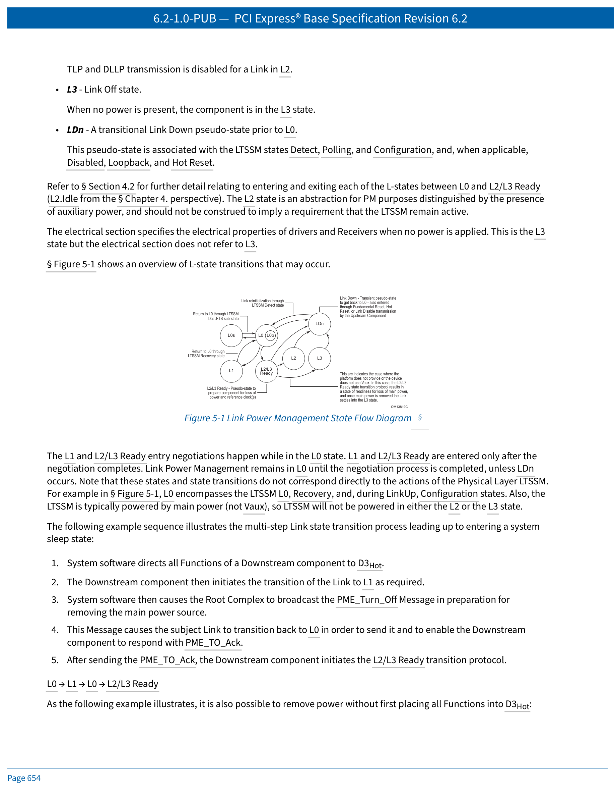
 <em>Figure 5-1: Link Power Management State Flow Diagram / 图5-1：链路电源管理状态流程图</em>

### L-State Summary Table — L状态汇总
| L-State | Description | Used by S/W PM | Used by ASPM | Ref Clocks | Main Power | Internal PLL | Vaux |
|---------|-------------|:---:|:---:|:---:|:---:|:---:|:---:|
| **L0/L0p** | Fully active Link | Yes (D0) | Yes (D0) | On | On | On | On/Off |
| **L0s** | Standby state | No | Yes (opt., D0) | On | On | On | On/Off |
| **L1** | Lower power standby | Yes (D1-D3Hot) | Yes (opt., D0) | On/Off | On | On/Off | On/Off |
| **L2/L3 Ready** | Staging point for power removal | Yes | No | On/Off | On | On/Off | On/Off |
| **L2** | Low power sleep | Yes | No | Off | Off | Off | On |
| **L3** | Off (zero power) | n/a | n/a | Off | Off | Off | Off |
| **LDn** | Transitional preceding L0 | Yes | N/A | On | On | On/Off | On/Off |
---
While the concept of these power states is universal for all Functions in the system, the meaning, or intended functional behavior when transitioned to a given power management state, is dependent upon the type (or class) of the Function.

> 这些电源状态的概念对系统内所有Function是通用的，但转换到给定PM状态时的含义或预期功能行为取决于Function的类型（或类别）。

---
## 5.3 PCI-PM Software Compatible Mechanisms — PCI-PM软件兼容机制
> PDF页码：656–671
### 5.3.1 Device Power Management States (D-States) of a Function — Function的设备电源管理状态
All Functions must support the D0 and D3 states (both D3Hot and D3Cold). The D1 and D2 states are optional.

> 所有Function必须支持D0和D3状态（D3Hot和D3Cold）。D1和D2状态为可选。

---
#### 5.3.1.1 D0 State
All Functions must support the D0 state. D0 is divided into two distinct substates: **D0uninitialized** and **D0active**. When a component comes out of Conventional Reset all Functions enter the D0uninitialized state. When a Function completes FLR, it enters the D0uninitialized state. After configuration is complete a Function enters the D0active state, the fully operational state for a PCI Express Function. A Function enters the D0active state whenever any single or combination of the Function's Memory Space Enable, I/O Space Enable, or Bus Master Enable bits have been Set.

> 所有Function必须支持D0状态。D0分为两个子状态：**D0uninitialized**（未初始化）和**D0active**（活跃）。组件从Conventional Reset退出时所有Function进入D0uninitialized；Function完成FLR后也进入D0uninitialized。配置完成后Function进入D0active，即PCIe Function的完全操作状态——当Memory Space Enable、I/O Space Enable或Bus Master Enable中任一或组合被置位时，Function进入D0active。

---
#### 5.3.1.2 D1 State (Optional)
D1 support is optional. While in the D1 state, a Function must not initiate any Request TLPs on the Link with the exception of Messages. Configuration and Message Requests are the only TLPs accepted by a Function in the D1 state. All other received Requests must be handled as Unsupported Requests, and all received Completions may optionally be handled as Unexpected Completions. If an error caused by a received TLP is detected while in D1, and reporting is enabled, the Link must be returned to L0 if it is not already in L0 and an error Message must be sent. If an error caused by an event other than a received TLP is detected while in D1, an error Message must be sent when the Function is programmed back to the D0 state.

> D1支持可选。D1状态下Function不得发起除Message外的任何Request TLP。仅Configuration和Message Request被接受；其他收到的Request必须作为Unsupported Request处理，收到的Completion可作Unexpected Completion处理。若在D1中检测到由接收TLP引起的错误且报告使能，链路必须返回L0并发送ErrorMessage。若检测到非接收TLP引起的错误（如Completion Timeout），必须在Function被编程回D0时发送ErrorMessage。
>
> > 驱动程序必须确保任何中途TLP（有未完成Completion的Request）在移交控制给系统配置软件以完成D1转换**之前**终止。

---
#### 5.3.1.3 D2 State (Optional)
D2 support is optional. When a Function is not currently being used and probably will not be used for some time, it may be put into D2. This state requires the Function to provide significant power savings while still retaining the ability to fully recover to its previous condition.

While in the D2 state, a Function must not initiate any Request TLPs on the Link with the exception of Messages. Configuration and Message requests are the only TLPs accepted.

System software must restore the Function to the D0active state before memory or I/O space can be accessed. Initiated actions such as bus mastering and interrupt request generation can only commence after the Function has been restored to D0active.

**Minimum recovery time:** 200 μs between D2→D0 programming and the next Request issued to the Function.

> D2支持可选。当Function当前不使用且可能一段时间不使用时可置于D2。此状态要求Function提供显著省电同时保留完全恢复到先前状态的能力。
>
> D2状态下Function不得发起除Message外的任何Request TLP。仅Configuration和Message Request被接受。
>
> 系统软件必须在访问内存或I/O空间之前将Function恢复到D0active。如Bus Mastering和中断请求生成等主动操作只能在恢复到D0active后开始。
>
> **最小恢复时间：** D2→D0编程后到下一条Request发送前至少200μs。

---
#### 5.3.1.4 D3 State (Required)
D3 support is required (both the D3Cold and the D3Hot states).

##### D3Hot State
Functional context is required to be maintained by Functions in the D3Hot state if the No_Soft_Reset field in the PMCSR is Set. In this case, System Software is not required to re-initialize the Function after a transition from D3Hot to D0 (the Function will be in the D0active state). If the No_Soft_Reset bit is Clear, functional context is not required to be maintained, and System Software is required to fully re-initialize the Function (the Function will be in the D0uninitialized state).

The Function will be reset if the Link state has transitioned to the L2/L3 Ready state regardless of the value of the No_Soft_Reset bit.

Unless the Immediate_Readiness_on_Return_to_D0 bit is Set, System Software must allow a minimum recovery time following a D3Hot→D0 transition of at least **10 ms**.

Configuration and Message requests are the only TLPs accepted by a Function in the D3Hot state.

> 若PMCSR中No_Soft_Reset位置位，Function必须在D3Hot中保持功能上下文——从D3Hot转到D0后软件无需重新初始化，Function直接进入D0active。若No_Soft_Reset位清除，功能上下文不要求保持，软件必须完全重新初始化，Function进入D0uninitialized。
>
> 无论No_Soft_Reset位值如何，一旦链路转换到L2/L3 Ready状态，Function将被复位。
>
> 除非Immediate_Readiness_on_Return_to_D0位置位，系统软件必须在D3Hot→D0转换后允许至少**10ms**的恢复时间。
>
> D3Hot状态仅接受Configuration和Message Request。

##### D3Cold State
A Function transitions to the D3Cold state when its main power is removed. A power-on sequence with its associated Cold Reset transitions a Function from the D3Cold state to the D0uninitialized state, and the power-on defaults will be restored to the Function by hardware just as at initial power up. Software must perform a full initialization of the Function.

When PME_En is Set, Functions that support wakeup functionality from D3Cold must maintain their PME context in the PMCSR.

> Function在主电源移除时进入D3Cold。上电序列加Cold Reset将Function从D3Cold转到D0uninitialized，硬件恢复上电默认值。软件必须执行完整的初始化。
>
> 当PME_En置位时，支持从D3Cold唤醒的Function必须在PMCSR中保持其PME上下文。

---
### 5.3.2 PM Software Control of the Link Power Management State — 链路PM状态的软件控制
> PDF页码：661–665
The power management state of a Link is determined by the D-state of its Downstream component. Key rules:
- The Upstream Port of a single-Function device must initiate a Link state transition to L1 based solely upon its Function being programmed to D1, D2, or D3Hot.
- The Upstream Port of a non-ARI Multi-Function Device must not initiate L1 until **all** of its Functions have been programmed to a non-D0 D-state.
- The Upstream Port of an ARI Device must not initiate L1 until at least one Function is in non-D0 AND all Functions are either in non-D0 or D0uninitialized.
- With SR-IOV devices, the Link Power State is controlled solely by the PFs, regardless of VF D-states.

> 链路的电源管理状态由其下游组件的D-state决定。关键规则：
> - 单Function设备的上游Port必须仅基于其Function被编程到D1/D2/D3Hot来发起L1转换。
> - 非ARI Multi-Function Device的Upstream Port必须等到**所有**Function都被编程到非D0状态后才发起L1。
> - ARI Device的Upstream Port必须等到至少一个Function在非D0且所有Function在非D0或D0uninitialized后才发起L1。
> - SR-IOV设备中，链路电源状态仅由PF控制，与VF的D-state无关。

---
#### 5.3.2.1 Entry into the L1 State — 进入L1状态
> PDF页码：662–663
The L1 entry negotiation process (Figure 5-2):

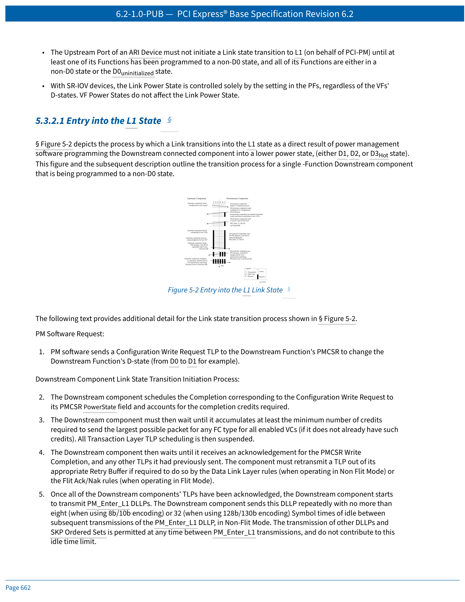
 <em>Figure 5-2: Entry into the L1 Link State / 图5-2：进入L1链路状态</em>

1. **PM Software:** Sends Configuration Write Request to change Downstream Function's D-state.
2. **Downstream Component:** Schedules completion, waits for minimum credits required to send the largest possible packet for any FC type for all enabled VCs, then suspends all TLP scheduling.
3. **Downstream Component:** Waits for acknowledgment of PMCSR Write Completion and all previously sent TLPs.
4. **Downstream Component:** Once all TLPs are acknowledged, repeatedly sends PM_Enter_L1 DLLPs with no more than 8 (8b/10b) or 32 (128b/130b) Symbol times of idle between transmissions.
5. **Upstream Component:** Upon receiving PM_Enter_L1 DLLP, blocks scheduling of all TLP transmissions, waits for last TLP acknowledgment.
6. **Upstream Component:** Sends PM_Request_Ack DLLPs Downstream repeatedly until it observes its receive Lanes enter Electrical Idle.
7. **Downstream Component:** Once PM_Request_Ack DLLP captured, disables DLLP transmission and brings Physical Layer to Electrical Idle.
8. **Upstream Component:** When receive Lanes enter Electrical Idle, stops PM_Request_Ack DLLPs, disables DLLP transmission, brings Transmit Lanes to Electrical Idle — **L1 entry complete**.

> L1进入协商过程（图5-2）：
>
> 1. **PM软件：** 发送Configuration Write Request修改下游Function的D-state。
> 2. **下游组件：** 调度Completion，等待积累对所有已使能VC的任意FC类型发送最大可能包所需的最小信用量，然后挂起所有TLP调度。
> 3. **下游组件：** 等待PMCSR Write Completion及所有先前发送TLP的确认。
> 4. **下游组件：** 所有TLP确认后，重复发送PM_Enter_L1 DLLPs，两次发送之间不超过8个（8b/10b编码）或32个（128b/130b编码）Symbol时间的空闲。
> 5. **上游组件：** 收到PM_Enter_L1 DLLP后，阻塞所有TLP传输调度，等待最后TLP的确认。
> 6. **上游组件：** 重复发送PM_Request_Ack DLLPs向下游，直到观察到接收Lanes进入Electrical Idle。
> 7. **下游组件：** 捕获到PM_Request_Ack DLLP后，禁用DLLP传输并将物理层置于Electrical Idle。
> 8. **上游组件：** 接收Lanes进入Electrical Idle时，停止PM_Request_Ack DLLPs，禁用DLLP传输，发送Lanes进入Electrical Idle——**L1进入完成**。

---
#### 5.3.2.2 Exit from L1 State — 退出L1状态
> PDF页码：664

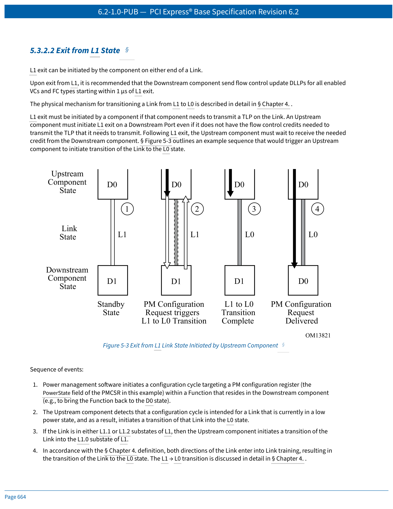
 <em>Figure 5-3: Exit from L1 Link State Initiated by Upstream Component / 图5-3：上游组件发起的L1退出</em>

L1 exit can be initiated by the component on either end of a Link. Exit scenarios:
1. PM software initiates a configuration cycle targeting a PM configuration register within a Function in the Downstream component.
2. The Upstream component detects that a configuration cycle is intended for a Link currently in low power state and initiates L1→L0 transition.
3. If the Link is in L1.1 or L1.2, the Upstream component first transitions to L1.0.
4. Both directions of the Link enter Link training, resulting in L0.
5. Once both directions are back to L0, the Upstream Port sends the configuration Packet Downstream.

> L1退出可由链路任一端组件发起。退出场景：
> 1. PM软件发起配置周期，目标为下游组件内Function的PM配置寄存器。
> 2. 上游组件检测到配置周期目标Link当前处于低功耗状态，发起L1→L0转换。
> 3. 若Link处于L1.1或L1.2，上游组件先转换到L1.0。
> 4. 链路双向进入Link training，最终到L0。
> 5. 双向回到L0后，上游Port向下游发送配置包。

---
#### 5.3.2.3 Entry into the L2/L3 Ready State — 进入L2/L3 Ready状态
> PDF页码：665
L2/L3 Ready entry follows a process similar to L1 entry with these differences:
- L2/L3 ready entry does not immediately result in L2 or L3 — it is effectively a handshake to establish the Downstream component's readiness for power removal.
- Timing indicated by completion of the PME_Turn_Off/PME_TO_Ack handshake.
- Uses the PM_Enter_L23 DLLP instead of PM_Enter_L1 DLLP.
- PM_Enter_L23 DLLPs are sent continuously until acknowledgment is received or power is removed.

> L2/L3 Ready进入过程类似L1进入，区别如下：
> - L2/L3 ready进入不会立即使Link到L2或L3——它是确认下游组件已准备好断电的握手。
> - 时机由PME_Turn_Off/PME_TO_Ack握手完成标记。
> - 使用PM_Enter_L23 DLLP而非PM_Enter_L1 DLLP。
> - PM_Enter_L23 DLLPs连续发送直到收到确认或电源移除。

---
### 5.3.3 Power Management Event Mechanisms — 电源管理事件机制
> PDF页码：665–671
#### 5.3.3.1 Motivation — 动机
The PCI Express PME generation mechanism is broken into two components:
1. **Waking** a non-communicating Hierarchy (wakeup) — required only if the Upstream Link of the device originating the PME is in the non-communicating L2 state.
2. **Sending a PM_PME Message** to the root of the Hierarchy.

PME indications that originate from PCI Express Endpoints are propagated to the Root Complex in the form of TLP messages. PM_PME Messages identify the requesting agent within the Hierarchy via the Requester ID.

> PCIe PME生成机制分为两个组件：
> 1. **唤醒**非通信中的Hierarchy（wakeup）——仅在发起PME设备的上游Link处于非通信L2状态时需要。
> 2. **发送PM_PME消息**到Hierarchy根部。
>
> 来自PCIe Endpoint的PME指示以TLP Message形式传播到Root Complex。PM_PME消息通过Requester ID标识Hierarchy中的请求agent。

---
#### 5.3.3.2 Link Wakeup — 链路唤醒

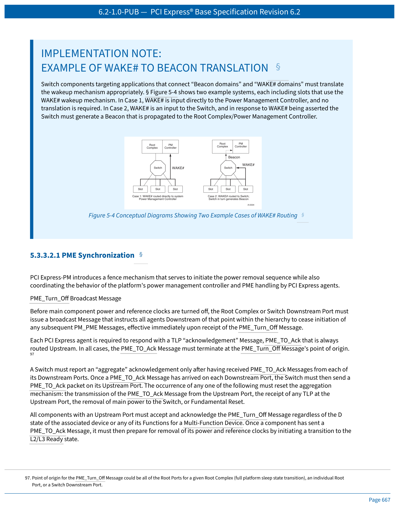
 <em>Figure 5-4: Conceptual Diagrams of WAKE# Routing / 图5-4：WAKE#路由概念图</em>

Two defined wakeup mechanisms: **Beacon** (in-band signaling) and **WAKE#** (sideband open-drain signal). Specific form factor specifications determine which is required. Before using any wakeup mechanism, a Function must be enabled by software via setting the PME_En bit.

Systems that allow PME generation from D3Cold must provide auxiliary power to support Link wakeup. A component may only consume auxiliary power if software has enabled it.

Regardless of the wakeup mechanism used, once the Link has been re-activated and trained, the requesting agent propagates a PM_PME Message Upstream to the Root Complex.

> 两种唤醒机制：**Beacon**（带内信令）和**WAKE#**（边带开漏信号）。具体外形规格决定使用哪种。在使用任一机制前，软件必须通过置位PME_En使能Function。
>
> 允许从D3Cold产生PME的系统必须提供辅助电源支持链路唤醒。组件仅在软件使能后才可消耗辅助电源。
>
> 无论使用何种唤醒机制，一旦链路重新激活和训练完成，请求agent向上游Root Complex传播PM_PME消息。

---
#### 5.3.3.2.1 PME Synchronization — PME同步
PME_Turn_Off Broadcast Message: Before main component power and reference clocks are turned off, the Root Complex or Switch Downstream Port must issue a broadcast Message instructing all agents Downstream to cease initiation of any subsequent PM_PME Messages, effective immediately.

Each PCI Express agent must respond with a PME_TO_Ack TLP Message routed Upstream. A Switch must report an "aggregate" acknowledgment only after having received PME_TO_Ack from each of its Downstream Ports. Once all active Downstream Ports receive a PME_TO_Ack, the Switch sends a single PME_TO_Ack Upstream as a proxy on behalf of the entire sub-hierarchy.

> PME_Turn_Off广播消息：在切断组件主电源和参考时钟之前，Root Complex或Switch Downstream Port必须发送广播消息，指示所有下游agent立即停止发起后续PM_PME消息。
>
> 每个PCIe agent必须响应一个PME_TO_Ack TLP Message向上游路由。Switch必须在所有Downstream Port收到PME_TO_Ack后才报告聚合确认——一旦所有活跃Downstream Port收到PME_TO_Ack，Switch代表整个子层次向上游发送单个PME_TO_Ack。

---
To avoid deadlock, the power manager must implement a timeout (recommended 1 ms to 10 ms). The power delivery manager must wait a minimum of **100 ns** after observing all Links enter L2/L3 Ready before removing the components' reference clock and main power.

> 为避免死锁，电源管理器必须实现超时（建议1ms到10ms）。电源管理器必须在观察到所有Link进入L2/L3 Ready后至少等待**100ns**才可移除组件参考时钟和主电源。

---
#### 5.3.3.3 PM_PME Messages
PM_PME Messages are posted TLP Messages that inform PM software which agent requests a PM state change. PM_PME Messages use TC0, and are always routed in the direction of the Root Complex.

> PM_PME消息是Posted TLP Message，通知PM软件哪个agent请求PM状态变更。PM_PME消息使用TC0，始终向Root Complex方向路由。

---
#### 5.3.3.3.1 PM_PME "Backpressure" Deadlock Avoidance — PM_PME反压死锁避免
The Root Complex has limited buffering for PM_PME Messages. Deadlock can occur when:
1. PM_PME Messages fill the Root Complex's temporary storage
2. Root Complex issues a Configuration Read Request to the PME requester's PMCSR
3. The split Completion packet must push all previously posted PM_PME Messages ahead of it (per producer/consumer ordering)
4. The PME service routine cannot make progress — deadlock

**Solution:** The Root Complex must accept PM_PME Messages that posted queue FC credits allow for, and **discard** any PM_PME Messages that create an overflow condition.

**PME Service Timeout:** All PME-capable agents must implement a PME Service Timeout mechanism (100 ms +50%/-5%). If PME_Status has not been cleared, the agent re-sends the PM_PME Message.

> Root Complex仅有有限的PM_PME消息缓冲。死锁可能发生在在产消者排序规则下Completion包必须将所有之前Posted的PM_PME推到前面但队列满的情况下。
>
> **解决方案：** Root Complex必须接受FC信用量允许的PM_PME消息，并**丢弃**溢出的PM_PME消息。
>
> **PME服务超时：** 所有支持PME的agent必须实现PME服务超时（100ms +50%/-5%）。若PME_Status未被清除，agent重新发送PM_PME消息。

---
#### 5.3.3.4 PME Rules — PME规则摘要
**EN:**
- All device Functions must implement the PCI-PM PMC Register and PMCSR.
- PME capable Functions must implement PME_Status bit.
- When a Function initiates Link wakeup or issues a PM_PME Message, it must set its PME_Status bit.
- Switches must route PM_PME received on any Downstream Port to their Upstream Port.
- On receiving a PME_Turn_Off Message, the device must block PM_PME transmission and transmit PME_TO_Ack Upstream.
- Before a Link transitions to a non-communicating state, a PME_Turn_Off Message must be broadcast Downstream.

**ZH:**
- 所有设备Function必须实现PCI-PM的PMC寄存器和PMCSR。
- 支持PME的Function必须实现PME_Status位。
- Function发起链路唤醒或发出PM_PME消息时，必须置位其PME_Status位。
- Switch必须将任一Downstream Port收到的PM_PME路由到其Upstream Port。
- 收到PME_Turn_Off消息后，设备必须阻止PM_PME传输并向上游发送PME_TO_Ack。
- 在链路转换到非通信状态之前必须先向下游广播PME_Turn_Off消息。

---
#### 5.3.3.5 PM_PME Delivery State Machine — PM_PME传递状态机
> PDF页码：670–671

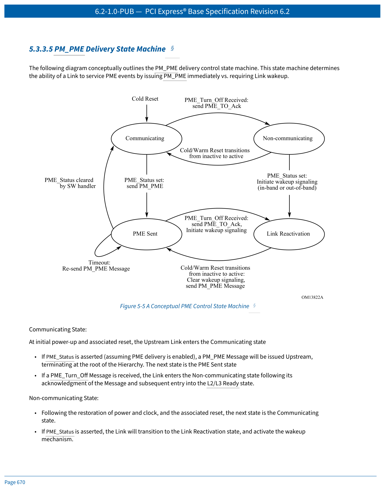
 <em>Figure 5-5: A Conceptual PME Control State Machine / 图5-5：PME控制状态机概念图</em>

The PM_PME delivery control state machine has four states:

| State | Description |
|-------|-------------|
| **Communicating** | Link is up; PME_Status asserted → send PM_PME → go to PME Sent. PME_Turn_Off received → Non-communicating via L2/L3 Ready. |
| **Non-communicating** | Power/clock restoration + reset → Communicating. PME_Status asserted → Link Reactivation, activate wakeup. |
| **PME Sent** | PME_Status cleared → Communicating (PME capable again). PME service timeout → re-send PM_PME. PME_Turn_Off while PME_Status still set → Link Reactivation + activate wakeup after sending PME_TO_Ack. |
| **Link Reactivation** | Power/clock restoration + reset → clear wakeup signaling → send PM_PME → PME Sent. |
> PM_PME传递控制状态机有四个状态：

| 状态 | 描述 |
|------|------|
| **通信中 (Communicating)** | 链路up；PME_Status置位→发送PM_PME→进入PME Sent。收到PME_Turn_Off→通过L2/L3 Ready进入Non-communicating。 |
| **非通信中 (Non-communicating)** | 电源/时钟恢复+复位→Communicating。PME_Status置位→Link Reactivation，激活唤醒。 |
| **PME已发送 (PME Sent)** | PME_Status清除→Communicating。PME服务超时→重发PM_PME。PME_Status仍置位时收到PME_Turn_Off→发送PME_TO_Ack后进入Link Reactivation并激活唤醒。 |
| **链路重激活 (Link Reactivation)** | 电源/时钟恢复+reset→清除唤醒信号→发送PM_PME→PME Sent。 |
---
## 5.4 Native PCI Express Power Management Mechanisms — PCIe原生电源管理机制
> PDF页码：671–688
The following sections define power management features that require new software. While the presence of these features in new PCI Express designs will not break legacy software compatibility, taking the full advantage of them requires new code.

All Ports not associated with an Internal Root Complex Link or system Egress Port are required to support the minimum requirements defined herein for Active State Link PM.

> 以下各节定义需要新软件的电源管理特性。这些特性不会破坏旧软件的兼容性，但充分利用需要新代码。
>
> 所有不关联Internal Root Complex Link或system Egress Port的Port都必须支持ASPM的最低要求。

---
### 5.4.1 Active State Power Management (ASPM) — 主动状态电源管理
> PDF页码：671–688
Components in the D0 state normally keep their Upstream Link in the active L0 state. ASPM defines a protocol for components in the D0 state to reduce Link power by placing their Links into a low power state — hardware-autonomous, dynamic Link power reduction beyond what is achievable by software-only controlled (PCI-PM software driven) power management.

In Non-Flit Mode: two low power "standby" Link states defined for ASPM — L0s and L1.
In Flit Mode: L0p effectively replaces L0s, and L1 remains as a "standby" Link state for ASPM.

> 处于D0状态的组件通常保持其上游Link在活跃L0。ASPM定义了D0状态下组件降低Link功耗的协议——硬件自主、动态Link降功耗，超越纯软件控制（PCI-PM软件驱动）的电源管理。
>
> Non-Flit Mode：两个"待机"Link状态——L0s和L1。
> Flit Mode：L0p有效替代L0s，L1保持为ASPM"待机"Link状态。

---
Key ASPM rules:
- Each component must report ASPM support level in ASPM Support field, and L0s/L1 exit latency.
- Endpoint Functions must also report worst-case latency they can withstand before risking internal FIFO overruns.
- For ARI Devices, ASPM Control is determined solely by Function 0's setting.
- For non-ARI Multi-Function Devices: ASPM policy = most active common denominator among all D0 Functions. Functions in non-D0 are ignored.
- ASPM Control negotiation rules among MFD Functions are determined by the most restrictive setting.

> ASPM关键规则：
> - 每个组件必须在ASPM Support字段报告支持级别及L0s/L1退出延时。
> - Endpoint Function还必须报告可容忍的最坏情况延时（避免内部FIFO溢出）。
> - ARI设备：ASPM Control仅由Function 0决定。
> - 非ARI MFD：ASPM策略=所有D0 Function中"最active的共同分母"；非D0 Function被忽略。

---
#### 5.4.1.1 L0s ASPM State — L0s状态
L0s is optimized for short entry and exit latencies. Entry into L0s is managed separately for each direction of the Link. Software must not enable L0s in either direction unless components on both sides of the Link each support L0s.

**L0s Invocation Policy:** Ports enabled for L0s entry generally should transition to L0s if the defined idle conditions are met for a period of time, recommended not to exceed 7 μs.

**Definition of Idle for non-Switch Port:** No TLP pending to transmit or no FC credits available, and no DLLPs pending.

> L0s针对短进入和退出延时优化。链路每个方向的L0s进入独立管理。软件不得在链路两端组件不支持L0s时使能L0s。
>
> **L0s调用策略：** L0s使能的Port在空闲条件满足一段建议不超过7μs的时间后应当转换到L0s。
>
> **非Switch Port的空闲定义：** 无TLP待发送或FC信用量不可用，且无DLLP待发送。

---
#### 5.4.1.3 ASPM L1 State — ASPM L1状态
L1 provides greater power savings at the expense of longer exit latency. Three PM messages support ASPM L1:
- PM_Active_State_Request_L1 (DLLP)
- PM_Request_Ack (DLLP)
- PM_Active_State_Nak (TLP)

A Downstream Port must accept a request to enter L1 if: the Port supports ASPM L1 entry and it is enabled; no TLP is scheduled for transmission; no Ack/Nak DLLP is scheduled for transmission (Non-Flit Mode); no Flit Ack/Nak is scheduled for transmission (Flit Mode).

> L1以更长的退出延时换取更大的省电。三个PM消息支持ASPM L1：
> - PM_Active_State_Request_L1 (DLLP)
> - PM_Request_Ack (DLLP)
> - PM_Active_State_Nak (TLP)
>
> Downstream Port必须接受L1进入请求，条件为：支持ASPM L1进入且已使能、无TLP待发送、无Ack/Nak DLLP待发送(Non-Flit Mode)、无Flit Ack/Nak待发送(Flit Mode)。

---
#### 5.4.1.4 ASPM Configuration — ASPM配置
Software can enable or disable ASPM using the process described in Section 5.4.1.4.1. Power management software enables or disables ASPM in each Port by programming the ASPM Control field.

**Software Flow for Enabling/Disabling ASPM:**
1. Read the ASPM Support field to determine supported levels
2. Read Endpoint L0s/L1 Acceptable Latency to ensure acceptable performance
3. Verify both Link partners support the desired ASPM level
4. Program the ASPM Control field — enable Upstream component first, then Downstream; disable Downstream first, then Upstream

> 软件通过编程ASPM Control字段使能或禁用每个Port的ASPM。
>
> **使能/禁用ASPM的软件流程：**
> 1. 读取ASPM Support字段确定支持级别
> 2. 读取Endpoint L0s/L1 Acceptable Latency确保可接受的性能
> 3. 验证链路两端伙伴支持所需的ASPM级别
> 4. 编程ASPM Control字段——先使能上游、后下游；先禁用下游、后上游。

---
## 5.5 L1 PM Substates — L1 PM子状态
> PDF页码：688–700
L1 PM Substates (L1.1 and L1.2) are optional substates of L1 that provide even lower power. Key differences:

| Feature | L1.0 | L1.1 | L1.2 |
|---------|------|------|------|
| Common mode voltages | Maintained | Maintained | Not required |
| Reference clock | Active (except CLKREQ#) | May be off | May be off |
| Internal PLL | May be off | May be off | May be off |
| Exit triggered by | TLP or Electrical Idle exit | CLKREQ# | CLKREQ# |
| Power savings | Baseline | Deeper | Deepest |
| Exit latency | Shortest | Longer | Longest |
Entry into L1.1 or L1.2 always goes through L1.0 first. Exit from all L1 PM Substates is initiated when CLKREQ# is asserted.

> L1 PM子状态（L1.1和L1.2）是L1的可选子状态，提供更低的功耗：

| 特性 | L1.0 | L1.1 | L1.2 |
|------|------|------|------|
| 共模电压 | 保持 | 保持 | 不要求 |
| 参考时钟 | 活跃（除CLKREQ#） | 可关闭 | 可关闭 |
| 内部PLL | 可关闭 | 可关闭 | 可关闭 |
| 退出触发 | TLP或Electrical Idle退出 | CLKREQ# | CLKREQ# |
| 省电程度 | 基线 | 更深 | 最深 |
| 退出延迟 | 最短 | 更长 | 最长 |
进入L1.1或L1.2始终通过L1.0。所有L1 PM Substates的退出均由CLKREQ#信号触发。

---

### L1 PM Substates Key Figures — L1 PM子状态关键图示

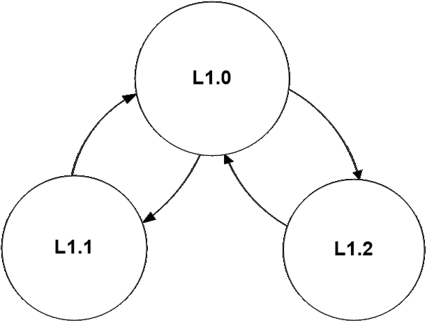
 <em>Figure 5-9: State Diagram for L1 PM Substates / 图5-9：L1 PM子状态状态图</em>

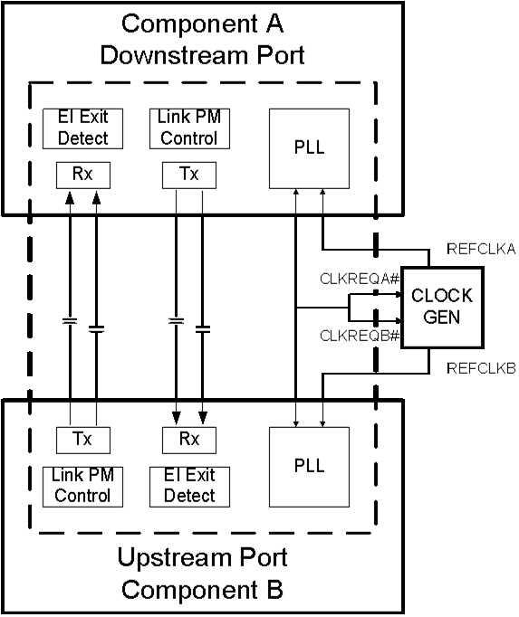
 <em>Figure 5-10: CLKREQ# Connection Topologies | 图5-10：CLKREQ#连接拓扑</em>

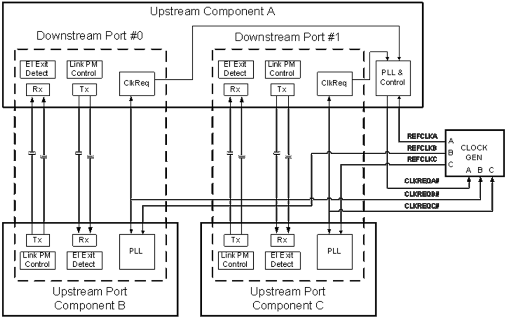
 <em>Figure 5-11: CLKREQ# Configuration Example | 图5-11：CLKREQ#配置示例</em>

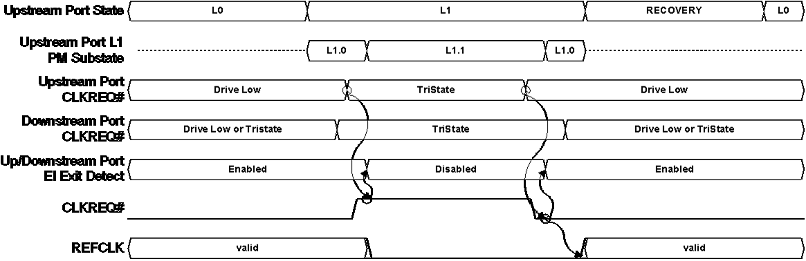
 <em>Figure 5-12: L1 PM Substates Exit Flow Diagram | 图5-12：L1 PM子状态退出流程图</em>

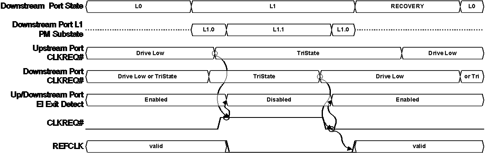
 <em>Figure 5-13: Example L1.1 Waveforms Illustrating Downstream Port Initiated Exit / 图5-13：L1.1波形示例（下游Port发起退出）</em>

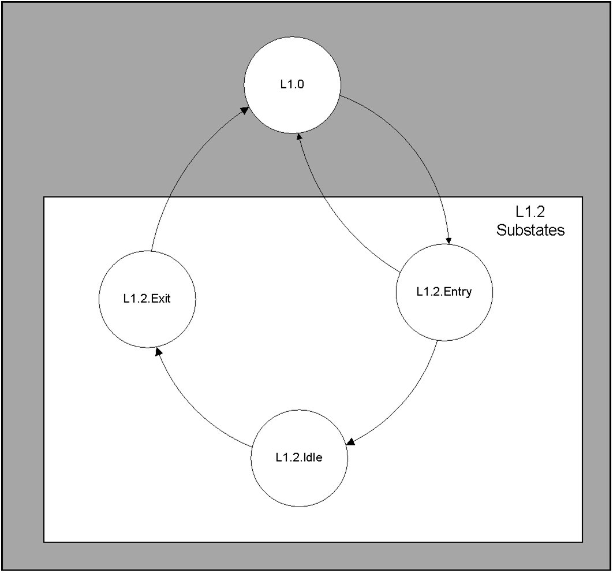
 <em>Figure 5-14: L1.2 Substates / 图5-14：L1.2子状态</em>

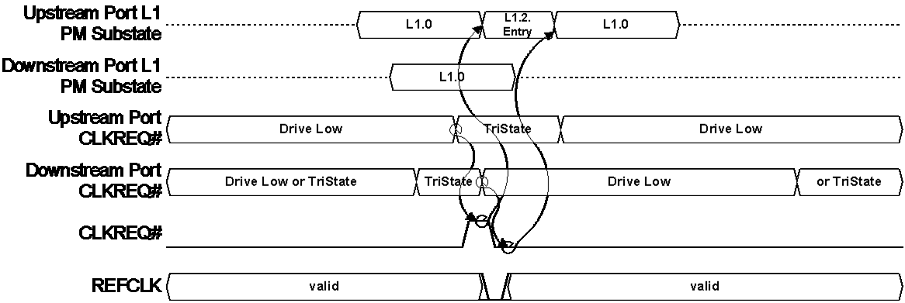
 <em>Figure 5-15: Boundary Condition due to Different Sampling of CLKREQ# / 图5-15：CLKREQ#不同采样导致的边界条件</em>

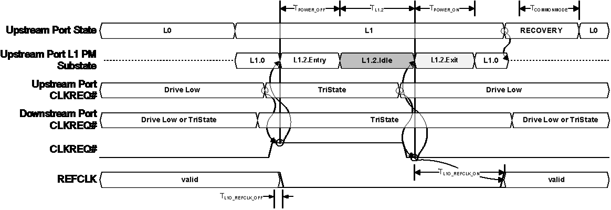
 <em>Figure 5-16: L1.2 Exit Mechanism | 图5-16：L1.2退出机制</em>

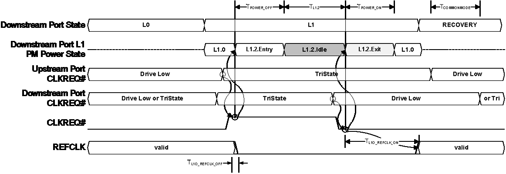
 <em>Figure 5-17: Example L1.2 Waveforms Illustrating Downstream Port Initiated Exit / 图5-17：L1.2波形示例（下游Port发起退出）</em>

---

### L1 PM Substates Configuration — 配置
The L1 PM Substates Extended Capability (see Section 7.8.3) contains:
- L1 PM Substates Capabilities Register
- L1 PM Substates Control 1/2 Registers
- L1 PM Substates Status Register

Key timing parameters (LTR_L1.2_THRESHOLD, T_POWER_ON, T_COMMONMODE, etc.) are configured through these registers. The LTR_L1.2_THRESHOLD can be used by hardware to make an autonomous decision about entering L1.2 based on the LTR value reported by the device.

> L1 PM Substates Extended Capability（见7.8.3节）包含：
> - L1 PM Substates Capabilities Register
> - L1 PM Substates Control 1/2 Registers
> - L1 PM Substates Status Register
>
> 关键时间参数（LTR_L1.2_THRESHOLD、T_POWER_ON、T_COMMONMODE等）通过这些寄存器配置。硬件可使用LTR_L1.2_THRESHOLD基于设备报告的LTR值自主决定是否进入L1.2。

---
## 5.6 Auxiliary Power Support — 辅助电源支持
> PDF页码：700–701
A component may only consume auxiliary power if enabled to do so by software. Two enabling mechanisms:
1. **PME_En** bit in PMCSR — enables PME assertion from D3Cold
2. **Aux Power PM Enable** bit in Device Control Register — enables auxiliary power consumption for other purposes

Software must enable auxiliary power in all components participating in Link wakeup, including those that must propagate the Beacon signal.

> 组件仅在软件使能后才可消耗辅助电源。两个使能机制：
> 1. PMCSR中的**PME_En**位——使能从D3Cold断言PME
> 2. Device Control Register中的**Aux Power PM Enable**位——使能为其他目的消耗辅助电源
>
> 软件必须使能所有参与Link wakeup的组件的辅助电源消耗，包括必须传播Beacon信号的组件。

---
## 5.7 Power Management System Messages and DLLPs — PM系统消息与DLLP
> PDF页码：701–702
| Message/DLLP | Type | Direction | Purpose |
|-------------|------|-----------|---------|
| PM_Active_State_Request_L1 | DLLP | Downstream | ASPM L1 entry request |
| PM_Request_Ack | DLLP | Upstream | Acknowledge L1 entry request |
| PM_Active_State_Nak | TLP | Upstream | Reject L1 entry request |
| PM_PME | TLP Message | Upstream | Power Management Event notification |
| PME_Turn_Off | TLP Message | Downstream (broadcast) | Prepare for power removal |
| PME_TO_Ack | TLP Message | Upstream | Acknowledge PME_Turn_Off |
| PM_Enter_L1 | DLLP | Downstream | PCI-PM L1 entry initiation |
| PM_Enter_L23 | DLLP | Downstream | L2/L3 Ready entry initiation |
---
## 5.8 PCI Function Power State Transitions — PCI Function电源状态转换
> PDF页码：702
Describes the rules governing transitions between Function Power States. The recovery from D3Hot to D0 requires at least 10 ms (unless Immediate Readiness is Set) and from D2 to D0 requires at least 200 μs.

> 描述Function电源状态间转换的规则。D3Hot到D0恢复需至少10ms（除非Immediate Readiness置位），D2到D0需至少200μs。

---
## 5.9 State Transition Recovery Time Requirements — 状态转换恢复时间要求
> PDF页码：702
Minimum recovery times are required after D-state transitions before the Function can be accessed:

| Transition | Minimum Recovery Time | Exception |
|------------|----------------------|-----------|
| D3Hot → D0 | 10 ms | Immediate_Readiness_on_Return_to_D0 bit Set |
| D2 → D0 | 200 μs | — |
| D1 → D0 | Implementation specific | — |
| D0 → D3Hot | 10 ms (before removing power/clock) | — |
> D-state转换后访问Function前所需的最小恢复时间：

| 转换 | 最小恢复时间 | 例外 |
|------|-------------|------|
| D3Hot → D0 | 10 ms | Immediate_Readiness_on_Return_to_D0位置位 |
| D2 → D0 | 200 μs | — |
| D1 → D0 | 实现特定 | — |
| D0 → D3Hot | 10 ms（移除电源/时钟前） | — |
---
## 5.10 SR-IOV Power Management — SR-IOV电源管理
> PDF页码：702–704
With SR-IOV devices:
- **PF:** Controls the Link Power State; all PM registers must be implemented per the Base Specification.
- **VF:** Must support D0 and D3Hot states; D1 and D2 are optional. VF D-states do not affect the Link Power State. VFs must implement a simplified PM capability.

When a VF is in D3Hot, it must not issue any TLPs (except for automatically generated Messages if enabled). PF drivers are responsible for quiescing VF transactions before changing the PF D-state or Link state.

> SR-IOV设备：
> - **PF：** 控制Link Power State；所有PM寄存器必须按Base规范实现。
> - **VF：** 必须支持D0和D3Hot；D1和D2可选。VF的D-state不影响Link Power State。VF必须实现简化的PM能力。
>
> VF处于D3Hot时不得发起任何TLP（除使能的自动生成的Message）。PF驱动负责在变更PF D-state或Link state之前停止VF事务。

---
## 5.11 PCI Bridges and Power Management — PCI桥与电源管理
> PDF页码：704–705
Switches and PCI Express to PCI Bridges have special power management considerations. The PM state of a Switch's Upstream Port must be at least as active as the most active Downstream Port. Switches must ensure proper translation of PM messages across PCI Express-to-PCI boundaries.

> Switch和PCIe到PCI的桥有特殊的PM考虑。Switch Upstream Port的PM状态必须至少与其最活跃Downstream Port一样活跃。Switch必须确保PM消息在PCIe-to-PCI边界正确转换。

---
## 5.12 Power Management Events — 电源管理事件
> PDF页码：705–706
Defines the relationship between hardware events and PM software actions. Events such as Hot-Plug, Attention Button presses, and power faults may generate PMEs. The specific handling depends on system and form factor design.

> 定义硬件事件与PM软件动作之间的关系。Hot-Plug、Attention Button按下、电源故障等事件可产生PME。具体处理取决于系统和外形规格设计。

---
## Summary of Key Rules — 关键规则总结
| Topic | Rule |
|-------|------|
| **D-state requirements** | All Functions: D0 + D3 (both Hot/Cold). D1/D2 optional. |
| **L-state requirements** | L0 required. L1 required for PCI-PM. L0s optional. L2/L3 Ready protocol required. L2 optional (needs Vaux). |
| **ASPM** | L0p replaces L0s in Flit Mode. L0s not supported with Retimers. L0s not supported in Flit Mode. |
| **Multi-Function Devices** | Non-ARI: all Functions must be in non-D0 before L1 entry. ARI: Function 0 controls ASPM. |
| **SR-IOV** | PF controls Link PM state. VF D-states don't affect Link. |
| **PME** | PME_Status sticky. PME Service Timeout: 100 ms +50%/-5%. PME_Turn_Off handshake required before power removal. |
| **Recovery Times** | D3Hot→D0: 10ms. D2→D0: 200μs. After L2/L3 Ready: ≥100ns before power removal. |
| **Auxiliary Power** | Only consume if PME_En or Aux Power PM Enable set. Required for wakeup from D3Cold. |
