# PCI Express Base Specification Revision 6.2 — Chapter 6

# PCI Express 基础规范 修订版 6.2 — 第6章

**Chinese-English Parallel Translation / 中英对照翻译**

**Chapter 6: System Architecture / 第6章：系统架构**

---

> **Translator's Note / 译者说明**:
> - Paragraph-level Chinese-English parallel translation. 段落级中英对照翻译。
> - Page images are embedded inline for visual reference. 页面截图内嵌在文中以供参考。
> - Key technical terms are preserved in English on first occurrence with Chinese translations. 关键术语首次出现时保留英文及中文翻译。

---

## 6. System Architecture / 系统架构

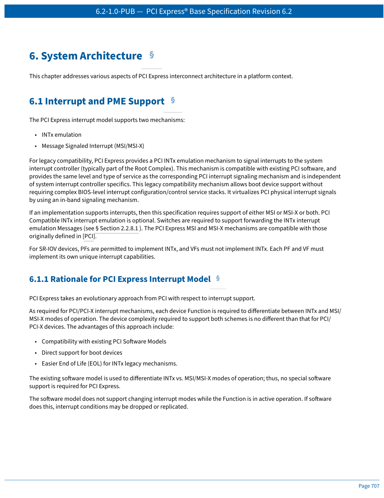

This chapter addresses various aspects of PCI Express interconnect architecture in a platform context.

>
> 本章讨论平台环境中 PCI Express 互连架构的各个方面。
>

---

### 6.1 Interrupt and PME Support / 中断与 PME 支持

The PCI Express interrupt model supports two mechanisms:

>
> PCI Express 中断模型支持两种机制：
>

- INTx emulation / INTx 仿真
- Message Signaled Interrupt (MSI/MSI-X) / 消息信号中断（MSI/MSI-X）

For legacy compatibility, PCI Express provides a PCI INTx emulation mechanism to signal interrupts to the system interrupt controller (typically part of the Root Complex). This mechanism is compatible with existing PCI software, and provides the same level and type of service as the corresponding PCI interrupt signaling mechanism and is independent of system interrupt controller specifics. This legacy compatibility mechanism allows boot device support without requiring complex BIOS-level interrupt configuration/control service stacks. It virtualizes PCI physical interrupt signals by using an in-band signaling mechanism.

>
> 为了传统兼容性，PCI Express 提供了 PCI INTx 仿真机制，向系统中断控制器（通常是根复合体的一部分）发送中断信号。该机制与现有 PCI 软件兼容，提供与相应 PCI 中断信号机制相同级别和类型的服务，并且独立于系统中断控制器的具体实现。这种传统兼容性机制允许引导设备支持，而无需复杂的 BIOS 级中断配置/控制服务栈。它通过使用带内信号机制来虚拟化 PCI 物理中断信号。
>

If an implementation supports interrupts, then this specification requires support of either MSI or MSI-X or both. PCI Compatible INTx interrupt emulation is optional. Switches are required to support forwarding the INTx interrupt emulation Messages (see Section 2.2.8.1). The PCI Express MSI and MSI-X mechanisms are compatible with those originally defined in [PCI].

>
> 如果实现支持中断，则本规范要求支持 MSI 或 MSI-X 或两者。PCI 兼容的 INTx 中断仿真是可选的。交换机必须支持转发 INTx 中断仿真消息（见第 2.2.8.1 节）。PCI Express MSI 和 MSI-X 机制与 [PCI] 中最初定义的机制兼容。
>

For SR-IOV devices, PFs are permitted to implement INTx, and VFs must not implement INTx. Each PF and VF must implement its own unique interrupt capabilities.

>
> 对于 SR-IOV 设备，PF 允许实现 INTx，而 VF 不得实现 INTx。每个 PF 和 VF 必须实现其各自唯一的中断能力。
>

#### 6.1.1 Rationale for PCI Express Interrupt Model / PCI Express 中断模型的原理

PCI Express takes an evolutionary approach from PCI with respect to interrupt support.

>
> PCI Express 在中断支持方面采取了从 PCI 演进的方法。
>

As required for PCI/PCI-X interrupt mechanisms, each device Function is required to differentiate between INTx and MSI/MSI-X modes of operation. The device complexity required to support both schemes is no different than that for PCI/PCI-X devices. The advantages of this approach include:

>
> 正如 PCI/PCI-X 中断机制所要求的，每个设备功能需要区分 INTx 和 MSI/MSI-X 操作模式。支持这两种方案所需的设备复杂性与 PCI/PCI-X 设备相同。这种方法的优点包括：
>

- Compatibility with existing PCI Software Models / 与现有 PCI 软件模型兼容
- Direct support for boot devices / 直接支持引导设备
- Easier End of Life (EOL) for INTx legacy mechanisms / 更容易实现 INTx 传统机制的终止（EOL）

The existing software model is used to differentiate INTx vs. MSI/MSI-X modes of operation; thus, no special software support is required for PCI Express.

>
> 使用现有软件模型来区分 INTx 与 MSI/MSI-X 操作模式；因此，PCI Express 不需要特殊的软件支持。
>

The software model does not support changing interrupt modes while the Function is in active operation. If software does this, interrupt conditions may be dropped or replicated.

>
> 软件模型不支持在功能处于活动操作期间更改中断模式。如果软件这样做，中断条件可能会被丢弃或重复。
>

#### 6.1.2 PCI-compatible INTx Emulation / PCI 兼容的 INTx 仿真

PCI Express emulates the PCI interrupt mechanism including the Interrupt Pin and Interrupt Line registers of the PCI Configuration Space for PCI device Functions. PCI Express non-Switch devices may optionally support these registers for backwards compatibility. Switch devices are required to support them. Actual interrupt signaling uses in-band Messages rather than being signaled using physical pins.

>
> PCI Express 仿真 PCI 中断机制，包括 PCI 设备功能的 PCI 配置空间中的中断引脚（Interrupt Pin）和中断线（Interrupt Line）寄存器。PCI Express 非交换设备可以选择性支持这些寄存器以实现向后兼容。交换设备必须支持它们。实际的中断信号使用带内消息，而不是通过物理引脚发出信号。
>

Two types of Messages are defined, Assert_INTx and Deassert_INTx, for emulation of PCI INTx signaling, where x is A, B, C, and D for respective PCI interrupt signals. These Messages are used to provide "virtual wires" for signaling interrupts across a Link. Switches collect these virtual wires and present a combined set at the Switch's Upstream Port. Ultimately, the virtual wires are routed to the Root Complex which maps the virtual wires to system interrupt resources. Devices must use assert/deassert Messages in pairs to emulate PCI interrupt level-triggered signaling. Actual mapping of PCI Express INTx emulation to system interrupts is implementation specific as is mapping of physical interrupt signals in conventional PCI.

>
> 定义了两种类型的消息——Assert_INTx 和 Deassert_INTx，用于仿真 PCI INTx 信号，其中 x 为 A、B、C 和 D，分别对应 PCI 中断信号。这些消息用于提供跨链路发送中断信号的"虚拟线路"。交换机收集这些虚拟线路，并在交换机的上行端口呈现组合集合。最终，虚拟线路被路由到根复合体，根复合体将虚拟线路映射到系统中断资源。设备必须成对使用 assert/deassert 消息来仿真 PCI 中断电平触发信号。PCI Express INTx 仿真到系统中断的实际映射是特定于实现的，正如传统 PCI 中物理中断信号的映射一样。
>

The legacy INTx emulation mechanism may be deprecated in a future version of this specification.

>
> 传统 INTx 仿真机制可能在本规范的未来版本中被弃用。
>

#### 6.1.3 INTx Emulation Software Model / INTx 仿真软件模型

The software model for legacy INTx emulation matches that of PCI. The system BIOS reporting of chipset/platform interrupt mapping and the association of each device Function's interrupt with PCI interrupt lines is handled in exactly the same manner as with conventional PCI systems. Legacy software reads from each device Function's Interrupt Pin register to determine if the Function is interrupt driven. A value between 01h and 04h indicates that the Function uses an emulated interrupt pin to generate an interrupt.

>
> 传统 INTx 仿真的软件模型与 PCI 的软件模型一致。系统 BIOS 报告的芯片组/平台中断映射以及每个设备功能的中断与 PCI 中断线的关联，以与传统 PCI 系统完全相同的方式处理。传统软件从每个设备功能的中断引脚寄存器读取，以确定该功能是否为中断驱动。值在 01h 到 04h 之间表示该功能使用仿真中断引脚来生成中断。
>

Note that similarly to physical interrupt signals, the INTx emulation mechanism may potentially cause spurious interrupts that must be handled by the system software.

>
> 注意，与物理中断信号类似，INTx 仿真机制可能会产生虚假中断，必须由系统软件处理。
>

#### 6.1.4 MSI and MSI-X Operation / MSI 与 MSI-X 操作

Message Signaled Interrupts (MSI) is an optional feature that enables a device Function to request service by writing a system-specified data value to a system-specified address (using a DWORD Memory Write transaction). System software initializes the message address and message data (from here on referred to as the "vector") during device configuration, allocating one or more vectors to each MSI-capable Function.

>
> 消息信号中断（MSI）是一个可选功能，使设备功能能够通过向系统指定的地址写入系统指定的数据值（使用 DWORD 存储器写事务）来请求服务。系统软件在设备配置期间初始化消息地址和消息数据（以下称为"向量"），为每个支持 MSI 的功能分配一个或多个向量。
>

Interrupt latency (the time from interrupt signaling to interrupt servicing) is system dependent. Consistent with current interrupt architectures, Message Signaled Interrupts do not provide interrupt latency time guarantees.

>
> 中断延迟（从中断信号到中断服务的时间）取决于系统。与当前中断架构一致，消息信号中断不提供中断延迟时间保证。
>

MSI-X defines a separate optional extension to basic MSI functionality. Compared to MSI, MSI-X supports a larger maximum number of vectors per Function, the ability for software to control aliasing when fewer vectors are allocated than requested, plus the ability for each vector to use an independent address and data value, specified by a table that resides in Memory Space. However, most of the other characteristics of MSI-X are identical to those of MSI.

>
> MSI-X 定义了基本 MSI 功能的一个独立可选扩展。与 MSI 相比，MSI-X 支持每个功能更多的最大向量数、当分配的向量少于请求时软件控制别名化的能力，以及每个向量使用独立地址和数据值的能力（由驻留在存储器空间的表指定）。然而，MSI-X 的大多数其他特性与 MSI 相同。
>

For the sake of software backward compatibility, MSI and MSI-X use separate and independent Capability structures. On Functions that support both MSI and MSI-X, system software that supports only MSI can still enable and use MSI without any modification. MSI functionality is managed exclusively through the MSI Capability structure, and MSI-X functionality is managed exclusively through the MSI-X Capability structure.

>
> 为了软件向后兼容，MSI 和 MSI-X 使用独立的能力结构。在同时支持 MSI 和 MSI-X 的功能上，仅支持 MSI 的系统软件仍然可以启用和使用 MSI，无需任何修改。MSI 功能完全通过 MSI 能力结构管理，MSI-X 功能完全通过 MSI-X 能力结构管理。
>

A Function is permitted to implement both MSI and MSI-X, but system software is prohibited from enabling both at the same time. If system software enables both at the same time, the behavior is undefined.

>
> 功能可以同时实现 MSI 和 MSI-X，但禁止系统软件同时启用两者。如果系统软件同时启用两者，行为是未定义的。
>

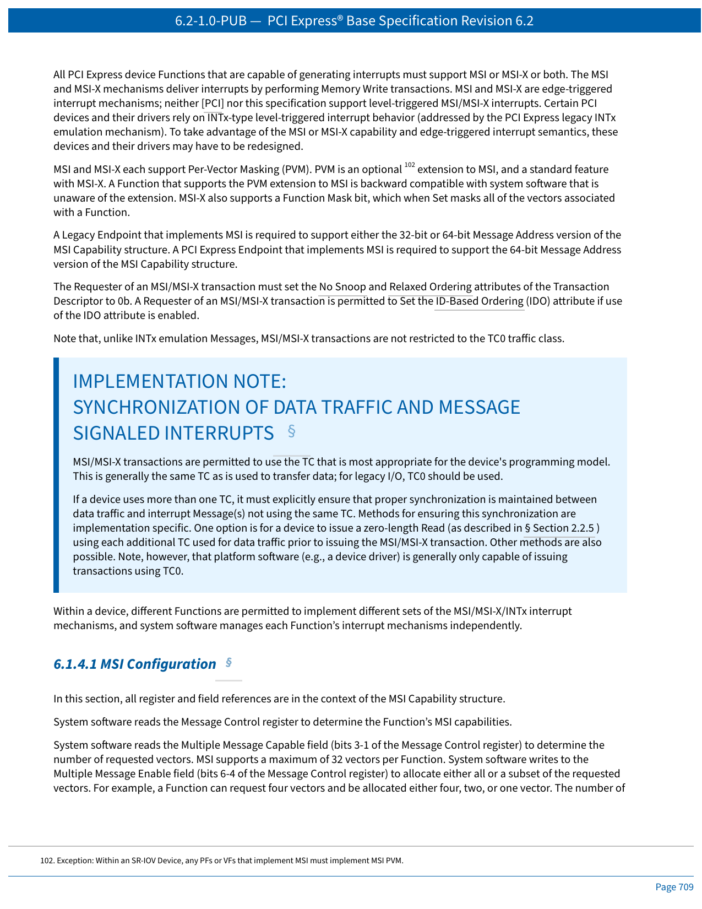

All PCI Express device Functions that are capable of generating interrupts must support MSI or MSI-X or both. The MSI and MSI-X mechanisms deliver interrupts by performing Memory Write transactions. MSI and MSI-X are edge-triggered interrupt mechanisms; neither [PCI] nor this specification support level-triggered MSI/MSI-X interrupts. Certain PCI devices and their drivers rely on INTx-type level-triggered interrupt behavior (addressed by the PCI Express legacy INTx emulation mechanism). To take advantage of the MSI or MSI-X capability and edge-triggered interrupt semantics, these devices and their drivers may have to be redesigned.

>
> 所有能够生成中断的 PCI Express 设备功能必须支持 MSI 或 MSI-X 或两者。MSI 和 MSI-X 机制通过执行存储器写事务来传递中断。MSI 和 MSI-X 是边沿触发的中断机制；[PCI] 和本规范都不支持电平触发的 MSI/MSI-X 中断。某些 PCI 设备及其驱动程序依赖 INTx 类型的电平触发中断行为（由 PCI Express 传统 INTx 仿真机制解决）。为了利用 MSI 或 MSI-X 能力以及边沿触发中断语义，这些设备及其驱动程序可能需要重新设计。
>

MSI and MSI-X each support Per-Vector Masking (PVM). PVM is an optional extension to MSI, and a standard feature with MSI-X. A Function that supports the PVM extension to MSI is backward compatible with system software that is unaware of the extension. MSI-X also supports a Function Mask bit, which when Set masks all of the vectors associated with a Function.

>
> MSI 和 MSI-X 各支持每向量屏蔽（PVM）。PVM 是 MSI 的可选扩展，并且是 MSI-X 的标准功能。支持 MSI PVM 扩展的功能与不知道该扩展的系统软件向后兼容。MSI-X 还支持功能屏蔽位（Function Mask bit），当置位时屏蔽与该功能关联的所有向量。
>

A Legacy Endpoint that implements MSI is required to support either the 32-bit or 64-bit Message Address version of the MSI Capability structure. A PCI Express Endpoint that implements MSI is required to support the 64-bit Message Address version of the MSI Capability structure.

>
> 实现 MSI 的传统端点需要支持 MSI 能力结构的 32 位或 64 位消息地址版本。实现 MSI 的 PCI Express 端点需要支持 MSI 能力结构的 64 位消息地址版本。
>

The Requester of an MSI/MSI-X transaction must set the No Snoop and Relaxed Ordering attributes of the Transaction Descriptor to 0b. A Requester of an MSI/MSI-X transaction is permitted to Set the ID-Based Ordering (IDO) attribute if use of the IDO attribute is enabled.

>
> MSI/MSI-X 事务的请求者必须将事务描述符的 No Snoop 和 Relaxed Ordering 属性设置为 0b。如果启用了 IDO 属性的使用，允许 MSI/MSI-X 事务的请求者设置 ID-Based Ordering（IDO）属性。
>

Note that, unlike INTx emulation Messages, MSI/MSI-X transactions are not restricted to the TC0 traffic class.

>
> 注意，与 INTx 仿真消息不同，MSI/MSI-X 事务不限于 TC0 流量类别。
>

Within a device, different Functions are permitted to implement different sets of the MSI/MSI-X/INTx interrupt mechanisms, and system software manages each Function's interrupt mechanisms independently.

>
> 在一个设备内，不同的功能可以实现不同的 MSI/MSI-X/INTx 中断机制集，系统软件独立管理每个功能的中断机制。
>

**Implementation Note: Synchronization of Data Traffic and Message Signaled Interrupts** / 实现说明：数据流量与消息信号中断的同步

MSI/MSI-X transactions are permitted to use the TC that is most appropriate for the device's programming model. This is generally the same TC as is used to transfer data; for legacy I/O, TC0 should be used. If a device uses more than one TC, it must explicitly ensure that proper synchronization is maintained between data traffic and interrupt Message(s) not using the same TC. Methods for ensuring this synchronization are implementation specific. One option is for a device to issue a zero-length Read (as described in Section 2.2.5) using each additional TC used for data traffic prior to issuing the MSI/MSI-X transaction. Other methods are also possible. Note, however, that platform software (e.g., a device driver) is generally only capable of issuing transactions using TC0.

>
> MSI/MSI-X 事务可以使用最适合设备编程模型的 TC。这通常是与传输数据相同的 TC；对于传统 I/O，应使用 TC0。如果设备使用多个 TC，它必须显式确保在不使用相同 TC 的数据流量和中断消息之间保持适当的同步。确保这种同步的方法取决于具体实现。一种选择是设备在发出 MSI/MSI-X 事务之前，使用每个用于数据流量的附加 TC 发出一个零长度读（如第 2.2.5 节所述）。其他方法也是可能的。但请注意，平台软件（例如设备驱动程序）通常只能使用 TC0 发出事务。
>

##### 6.1.4.1 MSI Configuration / MSI 配置

In this section, all register and field references are in the context of the MSI Capability structure.

>
> 在本节中，所有寄存器和字段引用均在 MSI 能力结构的上下文中。
>

System software reads the Message Control register to determine the Function's MSI capabilities.

>
> 系统软件读取消息控制寄存器以确定功能的 MSI 能力。
>

System software reads the Multiple Message Capable field (bits 3-1 of the Message Control register) to determine the number of requested vectors. MSI supports a maximum of 32 vectors per Function. System software writes to the Multiple Message Enable field (bits 6-4 of the Message Control register) to allocate either all or a subset of the requested vectors. For example, a Function can request four vectors and be allocated either four, two, or one vector. The number of vectors requested and allocated is aligned to a power of two (that is, a Function that requires three vectors must request four).

>
> 系统软件读取多消息能力字段（消息控制寄存器的第3-1位）以确定请求的向量数。MSI 支持每个功能最多 32 个向量。系统软件写入多消息启用字段（消息控制寄存器的第6-4位）以分配全部或部分请求的向量。例如，一个功能可以请求四个向量，并被分配四个、两个或一个向量。请求和分配的向量数对齐到2的幂（即，需要三个向量的功能必须请求四个）。
>

If the Per-Vector Masking Capable bit (bit 8 of the Message Control register) is Set and system software supports Per-Vector Masking, system software may mask one or more vectors by writing to the Mask Bits register.

>
> 如果每向量屏蔽能力位（消息控制寄存器的第8位）置位且系统软件支持每向量屏蔽，系统软件可以通过写入屏蔽位寄存器来屏蔽一个或多个向量。
>

If the 64-bit Address Capable bit (bit 7 of the Message Control register) is Set, system software initializes the MSI Capability structure's Message Address register (specifying the lower 32 bits of the message address) and the Message Upper Address register (specifying the upper 32 bits of the message address) with a system-specified message address. System software may program the Message Upper Address register to zero so that the Function uses a 32-bit address for the MSI transaction. If this bit is Clear, system software initializes the MSI Capability structure's Message Address register (specifying a 32-bit message address) with a system specified message address.

>
> 如果64位地址能力位（消息控制寄存器的第7位）置位，系统软件使用系统指定的消息地址初始化 MSI 能力结构的消息地址寄存器（指定消息地址的低32位）和消息高地址寄存器（指定消息地址的高32位）。系统软件可以将消息高地址寄存器编程为零，以便功能使用32位地址进行 MSI 事务。如果该位清零，系统软件使用系统指定的消息地址初始化 MSI 能力结构的消息地址寄存器（指定32位消息地址）。
>

System software initializes the MSI Capability structure's Message Data register with the lower 16 bits of a system specified data value. When the Extended Message Data Capable bit is Clear, care must be taken to initialize only the Message Data register (i.e., a 2-byte value) and not modify the upper two bytes of that DWORD location.

>
> 系统软件使用系统指定数据值的低16位初始化 MSI 能力结构的消息数据寄存器。当扩展消息数据能力位清零时，必须注意只初始化消息数据寄存器（即2字节值），而不修改该 DWORD 位置的高两字节。
>

If the Extended Message Data Capable bit is Set and system software supports 32-bit vector values, system software may initialize the MSI capability structure's Extended Message Data register with the upper 16 bits of a system specified data value, and then Set the Extended Message Data Enable bit.

>
> 如果扩展消息数据能力位置位且系统软件支持32位向量值，系统软件可以使用系统指定数据值的高16位初始化 MSI 能力结构的扩展消息数据寄存器，然后置位扩展消息数据启用位。
>

##### 6.1.4.2 MSI-X Configuration / MSI-X 配置

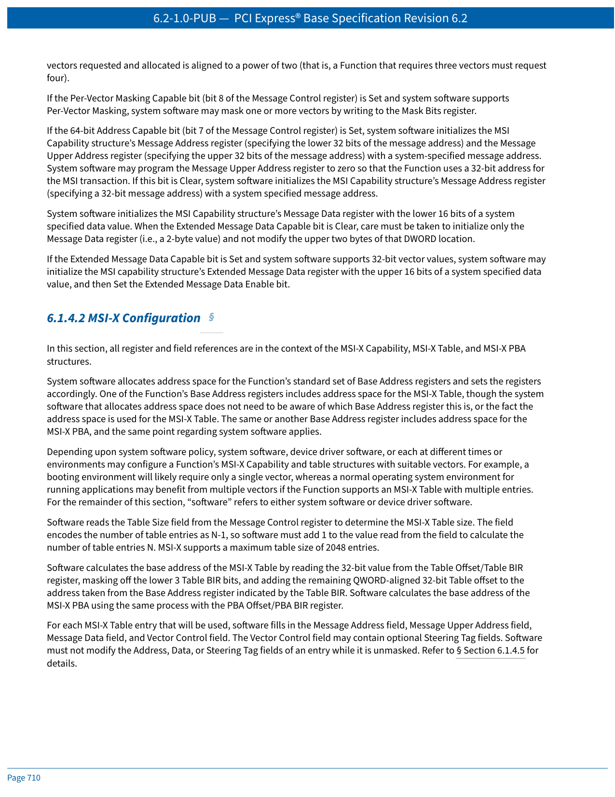

In this section, all register and field references are in the context of the MSI-X Capability, MSI-X Table, and MSI-X PBA structures.

>
> 在本节中，所有寄存器和字段引用均在 MSI-X 能力、MSI-X 表和 MSI-X PBA 结构的上下文中。
>

System software allocates address space for the Function's standard set of Base Address registers and sets the registers accordingly. One of the Function's Base Address registers includes address space for the MSI-X Table, though the system software that allocates address space does not need to be aware of which Base Address register this is, or the fact the address space is used for the MSI-X Table. The same or another Base Address register includes address space for the MSI-X PBA, and the same point regarding system software applies.

>
> 系统软件为功能的标准基地址寄存器组分配地址空间并进行相应设置。功能的一个基地址寄存器包含 MSI-X 表的地址空间，但分配地址空间的系统软件不需要知道这是哪个基地址寄存器，也不需要知道该地址空间用于 MSI-X 表。同一个或另一个基地址寄存器包含 MSI-X PBA 的地址空间，关于系统软件的同样说明也适用于此。
>

Depending upon system software policy, system software, device driver software, or each at different times or environments may configure a Function's MSI-X Capability and table structures with suitable vectors. For example, a booting environment will likely require only a single vector, whereas a normal operating system environment for running applications may benefit from multiple vectors if the Function supports an MSI-X Table with multiple entries. For the remainder of this section, "software" refers to either system software or device driver software.

>
> 根据系统软件策略，系统软件、设备驱动程序软件，或在不同时间或环境下各自配置功能的 MSI-X 能力和表结构为适当的向量。例如，引导环境可能只需要一个向量，而运行应用程序的正常操作系统环境可能从多个向量中受益，如果功能支持具有多个条目 MSI-X 表的话。在本节余下部分，"软件"指系统软件或设备驱动程序软件。
>

Software reads the Table Size field from the Message Control register to determine the MSI-X Table size. The field encodes the number of table entries as N-1, so software must add 1 to the value read from the field to calculate the number of table entries N. MSI-X supports a maximum table size of 2048 entries.

>
> 软件从消息控制寄存器读取表大小字段以确定 MSI-X 表大小。该字段将表条目数编码为 N-1，因此软件必须将从该字段读取的值加1以计算表条目数 N。MSI-X 支持最大表大小为 2048 个条目。
>

Software calculates the base address of the MSI-X Table by reading the 32-bit value from the Table Offset/Table BIR register, masking off the lower 3 Table BIR bits, and adding the remaining QWORD-aligned 32-bit Table offset to the address taken from the Base Address register indicated by the Table BIR. Software calculates the base address of the MSI-X PBA using the same process with the PBA Offset/PBA BIR register.

>
> 软件通过从表偏移/表 BIR 寄存器读取32位值，屏蔽低3位表 BIR 位，并将剩余的 QWORD 对齐的32位表偏移加到由表 BIR 指示的基地址寄存器中获取的地址来计算 MSI-X 表的基地址。软件使用相同的过程通过 PBA Offset/PBA BIR 寄存器计算 MSI-X PBA 的基地址。
>

For each MSI-X Table entry that will be used, software fills in the Message Address field, Message Upper Address field, Message Data field, and Vector Control field. The Vector Control field may contain optional Steering Tag fields. Software must not modify the Address, Data, or Steering Tag fields of an entry while it is unmasked. Refer to Section 6.1.4.5 for details.

>
> 对于每个将要使用的 MSI-X 表条目，软件填写消息地址字段、消息高地址字段、消息数据字段和向量控制字段。向量控制字段可能包含可选的方向标签（Steering Tag）字段。软件不得在条目取消屏蔽时修改其地址、数据或方向标签字段。详情参考第 6.1.4.5 节。
>

For potential use by future specifications, the Reserved bits in the Vector Control field must have their default values preserved by software. If software does not preserve their values, the result is undefined.

>
> 为了未来规范的可能使用，向量控制字段中的保留位必须由软件保持其默认值。如果软件不保持其值，结果是未定义的。
>

For each MSI-X Table entry that software chooses not to configure for generating messages, software can simply leave the entry in its default state of being masked.

>
> 对于软件选择不配置用于生成消息的每个 MSI-X 表条目，软件可以简单地让该条目保持其默认的屏蔽状态。
>

Software is permitted to configure multiple MSI-X Table entries with the same vector, and this may indeed be necessary when fewer vectors are allocated than requested.

>
> 软件可以使用相同向量配置多个 MSI-X 表条目，并且当分配的向量少于请求时，这确实是必要的。
>

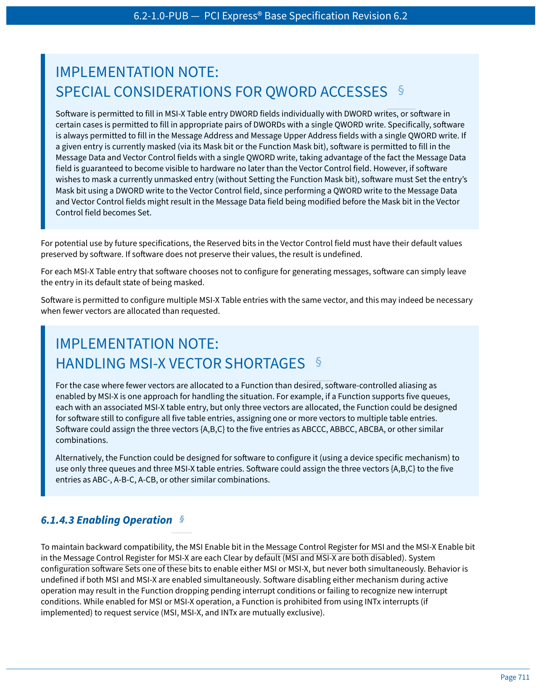

**Implementation Note: Special Considerations for QWORD Accesses** / 实现说明：QWORD 访问的特殊考虑

Software is permitted to fill in MSI-X Table entry DWORD fields individually with DWORD writes, or software in certain cases is permitted to fill in appropriate pairs of DWORDs with a single QWORD write. Specifically, software is always permitted to fill in the Message Address and Message Upper Address fields with a single QWORD write. If a given entry is currently masked (via its Mask bit or the Function Mask bit), software is permitted to fill in the Message Data and Vector Control fields with a single QWORD write, taking advantage of the fact the Message Data field is guaranteed to become visible to hardware no later than the Vector Control field. However, if software wishes to mask a currently unmasked entry (without Setting the Function Mask bit), software must Set the entry's Mask bit using a DWORD write to the Vector Control field, since performing a QWORD write to the Message Data and Vector Control fields might result in the Message Data field being modified before the Mask bit in the Vector Control field becomes Set.

>
> 软件允许分别用 DWORD 写填充 MSI-X 表条目的各个 DWORD 字段，或在某些情况下允许用单个 QWORD 写填充适当的 DWORD 对。具体来说，软件总是允许用单个 QWORD 写填充消息地址和消息高地址字段。如果给定条目当前被屏蔽（通过其屏蔽位或功能屏蔽位），软件允许用单个 QWORD 写填充消息数据和向量控制字段，利用消息数据字段保证不晚于向量控制字段对硬件可见的事实。但是，如果软件希望屏蔽当前未屏蔽的条目（而不设置功能屏蔽位），软件必须使用对向量控制字段的 DWORD 写来设置条目的屏蔽位，因为对消息数据和向量控制字段执行 QWORD 写可能在向量控制字段中的屏蔽位被置位之前导致消息数据字段被修改。
>

**Implementation Note: Handling MSI-X Vector Shortages** / 实现说明：处理 MSI-X 向量不足

For the case where fewer vectors are allocated to a Function than desired, software-controlled aliasing as enabled by MSI-X is one approach for handling the situation. For example, if a Function supports five queues, each with an associated MSI-X table entry, but only three vectors are allocated, the Function could be designed for software still to configure all five table entries, assigning one or more vectors to multiple table entries. Software could assign the three vectors {A,B,C} to the five entries as ABCCC, ABBCC, ABCBA, or other similar combinations. Alternatively, the Function could be designed for software to configure it (using a device specific mechanism) to use only three queues and three MSI-X table entries. Software could assign the three vectors {A,B,C} to the five entries as ABC--, A-B-C, A-CB, or other similar combinations.

>
> 对于分配给功能的向量少于所需的情况，由 MSI-X 启用的软件控制别名化是处理这种情况的一种方法。例如，如果一个功能支持五个队列，每个队列关联一个 MSI-X 表条目，但只分配了三个向量，功能可以设计为让软件仍然配置所有五个表条目，将一个或多个向量分配给多个表条目。软件可以将三个向量 {A,B,C} 分配给五个条目为 ABCCC、ABBCC、ABCBA 或其他类似组合。或者，功能可以设计为让软件配置它（使用设备特定机制）只使用三个队列和三个 MSI-X 表条目。软件可以将三个向量 {A,B,C} 分配给五个条目为 ABC--、A-B-C、A-CB 或其他类似组合。
>

##### 6.1.4.3 Enabling Operation / 启用操作

To maintain backward compatibility, the MSI Enable bit in the Message Control Register for MSI and the MSI-X Enable bit in the Message Control Register for MSI-X are each Clear by default (MSI and MSI-X are both disabled). System configuration software Sets one of these bits to enable either MSI or MSI-X, but never both simultaneously. Behavior is undefined if both MSI and MSI-X are enabled simultaneously. Software disabling either mechanism during active operation may result in the Function dropping pending interrupt conditions or failing to recognize new interrupt conditions. While enabled for MSI or MSI-X operation, a Function is prohibited from using INTx interrupts (if implemented) to request service (MSI, MSI-X, and INTx are mutually exclusive).

>
> 为了保持向后兼容，MSI 的消息控制寄存器中的 MSI 启用位和 MSI-X 的消息控制寄存器中的 MSI-X 启用位默认均为清零（MSI 和 MSI-X 都被禁用）。系统配置软件设置其中之一以启用 MSI 或 MSI-X，但从不同时启用两者。如果同时启用 MSI 和 MSI-X，行为是未定义的。在活动操作期间软件禁用任一机制可能导致功能丢弃挂起的中断条件或无法识别新的中断条件。当启用 MSI 或 MSI-X 操作时，禁止功能使用 INTx 中断（如果实现了的话）来请求服务（MSI、MSI-X 和 INTx 是互斥的）。
>

##### 6.1.4.4 Sending Messages / 发送消息

Once MSI or MSI-X is enabled (the appropriate bit in one of the Message Control registers is Set), and one or more vectors is unmasked, the Function is permitted to send messages. To send a message, a Function does a DWORD Memory Write to the appropriate message address with the appropriate message data.

>
> 一旦 MSI 或 MSI-X 被启用（相应消息控制寄存器中的适当位被置位），并且一个或多个向量取消屏蔽，功能就可以发送消息。为了发送消息，功能使用适当的消息数据向适当的消息地址执行 DWORD 存储器写。
>

For MSI when the Extended Message Data Enable bit is Clear, the DWORD that is written is made up of the value in the MSI Message Data register in the lower two bytes and zeros in the upper two bytes. For MSI when the Extended Message Data Enable bit is Set, the DWORD that is written is made up of the value in the MSI Message Data register in the lower two bytes and the value in the Extended Message Data register in the upper two bytes.

>
> 对于 MSI，当扩展消息数据启用位清零时，写入的 DWORD 由低两字节的 MSI 消息数据寄存器中的值和上两字节的零组成。对于 MSI，当扩展消息数据启用位置位时，写入的 DWORD 由低两字节的 MSI 消息数据寄存器中的值和高两字节的扩展消息数据寄存器中的值组成。
>

For MSI-X, the DWORD that is written is taken from the appropriate Table entry's Message Data field. If multiple unmasked vectors are used, they can all use the same message address or an independent message address for each vector.

>
> 对于 MSI-X，写入的 DWORD 取自适当表条目的消息数据字段。如果使用多个取消屏蔽的向量，它们可以都使用相同的消息地址，或者每个向量使用独立的消息地址。
>

##### 6.1.4.5 Per-vector Masking and Function Masking / 每向量屏蔽和功能屏蔽

For MSI-X, a Function is permitted to cache Address and Data values from unmasked MSI-X Table entries. However, when software updates the Address and/or Data fields for an unmasked entry, the Function might use either the old or new value for any message it sends. Therefore, software must mask an entry before updating its Address or Data fields, and must not unmask the entry until the updates are complete.

>
> 对于 MSI-X，功能可以从取消屏蔽的 MSI-X 表条目缓存地址和数据值。然而，当软件更新未屏蔽条目的地址和/或数据字段时，功能可能对其发送的任何消息使用旧值或新值。因此，软件必须在更新条目的地址或数据字段之前屏蔽该条目，并且在更新完成之前不得取消屏蔽该条目。
>

For MSI, the Mask Bits and Pending Bits registers provide Per-Vector Masking functionality. For MSI-X, each Table entry has a Mask bit in its Vector Control field, and there is a Function Mask bit in the Message Control register.

>
> 对于 MSI，屏蔽位和挂起位寄存器提供每向量屏蔽功能。对于 MSI-X，每个表条目在其向量控制字段中有一个屏蔽位，并且在消息控制寄存器中有一个功能屏蔽位。
>

##### 6.1.4.6 Hardware/Software Synchronization / 硬件/软件同步

When software updates the Address and/or Data fields of an MSI-X Table entry, the following sequence must be observed:
1. Mask the entry by Setting its Mask bit
2. Update the Address and/or Data fields
3. Ensure the updates are globally visible
4. Clear the entry's Mask bit to unmask it

>
> 当软件更新 MSI-X 表条目的地址和/或数据字段时，必须遵守以下顺序：
> 1. 通过设置其屏蔽位来屏蔽该条目
> 2. 更新地址和/或数据字段
> 3. 确保更新是全局可见的
> 4. 清除条目的屏蔽位以取消屏蔽
>

Similarly, when software updates multiple MSI-X Table entries, it should mask them all, update them, and then unmask them.

>
> 类似地，当软件更新多个 MSI-X 表条目时，它应该全部屏蔽它们，更新它们，然后全部取消屏蔽。
>

##### 6.1.4.7 Message Transaction Reception and Ordering Requirements / 消息事务接收和排序要求

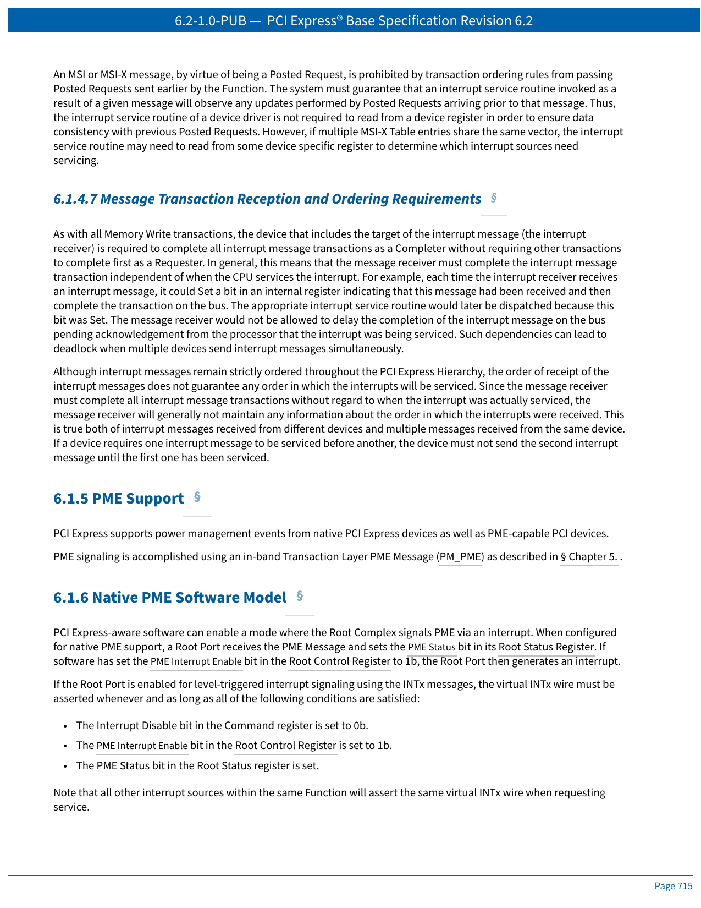

An MSI or MSI-X message, by virtue of being a Posted Request, is prohibited by transaction ordering rules from passing any earlier Posted Request. This preserves the ordering of data versus interrupts.

>
> MSI 或 MSI-X 消息，作为一种 Posted 请求，根据事务排序规则，禁止超越任何先前的 Posted 请求。这保持了数据与中断的排序。
>

#### 6.1.5 PME Support / PME 支持

The PCI Express power management event (PME) signaling mechanism uses in-band Messages to emulate the PCI PME signal. This mechanism is compatible with existing PCI PME software.

>
> PCI Express 电源管理事件（PME）信号机制使用带内消息来仿真 PCI PME 信号。该机制与现有 PCI PME 软件兼容。
>

#### 6.1.6 Native PME Software Model / 原生 PME 软件模型

The native PME software model uses the PME Status bit and PME En bit in the Power Management Control/Status register in PCI Express Capability, along with the Root Complex Event Collector, to manage PME signaling.

>
> 原生 PME 软件模型使用 PCI Express 能力中电源管理控制/状态寄存器的 PME 状态位和 PME 启用位，以及根复合体事件收集器来管理 PME 信号。
>

#### 6.1.7 Legacy PME Software Model / 传统 PME 软件模型

The legacy PME software model provides backward compatibility with PCI PME handling through the PCI Power Management Capability structure.

>
> 传统 PME 软件模型通过 PCI 电源管理能力结构提供与 PCI PME 处理的向后兼容。
>

#### 6.1.8 Operating System Power Management Notification / 操作系统电源管理通知

PCI Express provides mechanisms for the operating system to receive notification of power management events from devices, supporting both the native and legacy PME models.

>
> PCI Express 为操作系统提供从设备接收电源管理事件通知的机制，支持原生和传统 PME 模型。
>

#### 6.1.9 PME Routing Between PCI Express and PCI Hierarchies / PCI Express 与 PCI 层次结构之间的 PME 路由

PME messages can be routed between PCI Express and PCI hierarchies through PCI Express to PCI/PCI-X Bridges, providing end-to-end PME support across mixed topologies.

>
> PME 消息可以通过 PCI Express 到 PCI/PCI-X 桥在 PCI Express 和 PCI 层次结构之间路由，提供跨混合拓扑的端到端 PME 支持。
>

---

### 6.2 Error Signaling and Logging / 错误信号与记录

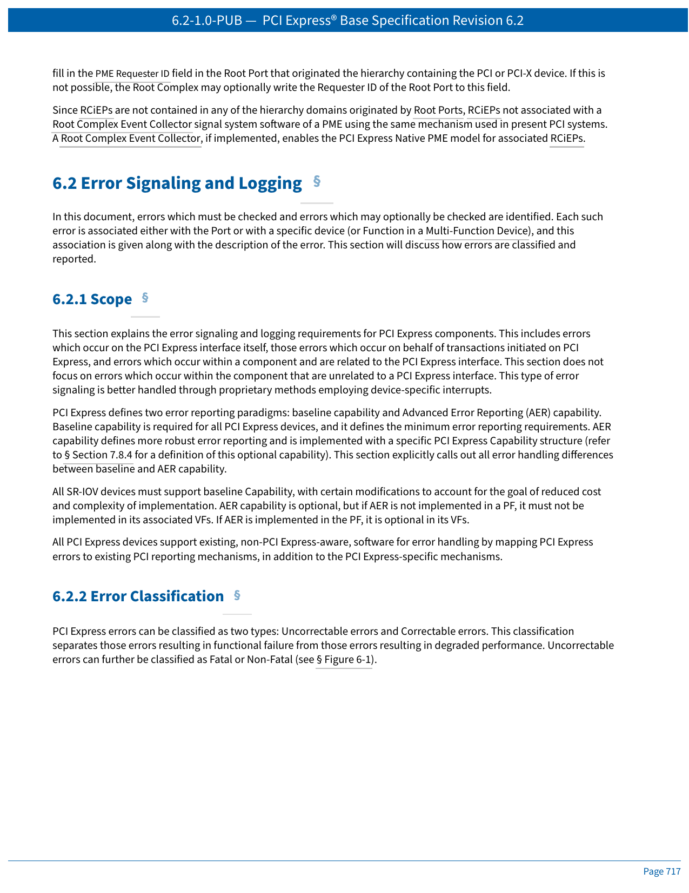

#### 6.2.1 Scope / 范围

This section describes the error handling mechanisms for PCI Express. The error handling architecture includes error classification, error signaling, error logging, and error recovery mechanisms.

>
> 本节描述 PCI Express 的错误处理机制。错误处理架构包括错误分类、错误信号、错误记录和错误恢复机制。
>

#### 6.2.2 Error Classification / 错误分类

PCI Express errors are classified into two major categories:

>
> PCI Express 错误分为两大类：
>

##### 6.2.2.1 Correctable Errors / 可纠正错误

Correctable errors are those that can be corrected by hardware without any loss of information and without software intervention. These errors may impact performance but do not affect the functional operation of the Link.

>
> 可纠正错误是那些可以由硬件纠正而不丢失任何信息且无需软件干预的错误。这些错误可能会影响性能，但不会影响链路的功能操作。
>

##### 6.2.2.2 Uncorrectable Errors / 不可纠正错误

Uncorrectable errors are those that cannot be corrected by hardware. These errors are further subdivided into:

>
> 不可纠正错误是那些无法由硬件纠正的错误。这些错误进一步细分为：
>

- **Fatal Errors** / 致命错误 — Errors that are severe enough to make the hardware unreliable. The Link or Function may no longer be functional.
严重到足以使硬件不可靠的错误。链路或功能可能不再正常工作。

- **Non-Fatal Errors** / 非致命错误 — Errors that do not cause the hardware to be unreliable but may result in data loss or require software intervention to recover.
不会导致硬件不可靠，但可能导致数据丢失或需要软件干预才能恢复的错误。

#### 6.2.3 Error Signaling / 错误信号

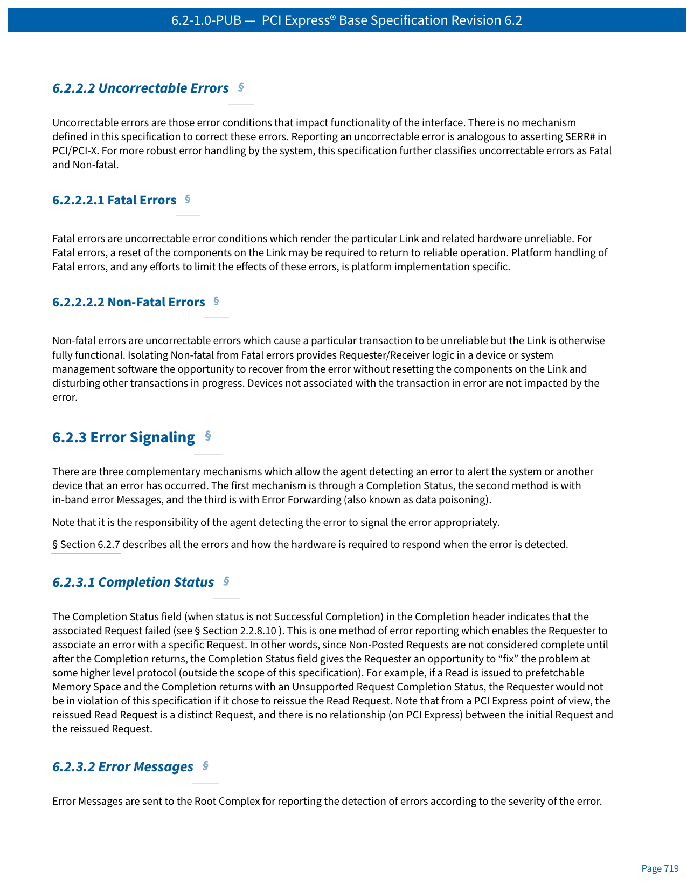

PCI Express uses three primary mechanisms for error signaling:

>
> PCI Express 使用三种主要机制进行错误信号：
>

##### 6.2.3.1 Completion Status / 完成状态

The Completion Status field in a Completion TLP indicates the outcome of a Request. Status values include Successful Completion (SC), Unsupported Request (UR), and Completer Abort (CA).

>
> 完成 TLP 中的完成状态字段指示请求的结果。状态值包括成功完成（SC）、不支持的请求（UR）和完成者中止（CA）。
>

##### 6.2.3.2 Error Messages / 错误消息

Error Messages are used to signal errors that are not associated with a specific Completion. These include:
- ERR_COR (Correctable Error) / 可纠正错误
- ERR_NONFATAL (Non-Fatal Error) / 非致命错误
- ERR_FATAL (Fatal Error) / 致命错误

>
> 错误消息用于发送与特定完成无关的错误信号。这些包括：
> - ERR_COR（可纠正错误）
> - ERR_NONFATAL（非致命错误）
> - ERR_FATAL（致命错误）
>

###### 6.2.3.2.1 Uncorrectable Error Severity Programming (Advanced Error Reporting) / 不可纠正错误严重程度编程

The severity of uncorrectable errors can be programmed through the Uncorrectable Error Severity register in the AER Extended Capability.

>
> 不可纠正错误的严重程度可以通过 AER 扩展能力中的不可纠正错误严重程度寄存器进行编程。
>

###### 6.2.3.2.2 Masking Individual Errors / 屏蔽个别错误

Individual error types can be masked through the Correctable Error Mask register and Uncorrectable Error Mask register.

>
> 可以通过可纠正错误屏蔽寄存器和不可纠正错误屏蔽寄存器屏蔽个别错误类型。
>

###### 6.2.3.2.3 Error Pollution / 错误污染

When a TLP with an error is forwarded, subsequent components may log additional errors. To avoid confusion, error pollution rules define when a received error should not be logged again.

>
> 当带有错误的 TLP 被转发时，后续组件可能会记录额外的错误。为了避免混淆，错误污染规则定义了何时不应再次记录接收到的错误。
>

###### 6.2.3.2.4 Advisory Non-Fatal Error Cases / 咨询性非致命错误情况

Several specific Advisory Non-Fatal error cases are defined to provide guidance for error handling in situations where an error may or may not be significant.

>
> 定义了几个特定的咨询性非致命错误情况，为错误可能重要也可能不重要的情境提供错误处理指导。
>

**6.2.3.2.4.1 Completer Sending a Completion with UR/CA Status** / 完成者发送带有 UR/CA 状态的完成

When a Completer sends a Completion with UR or CA status, this is signaled as an Advisory Non-Fatal Error.

>
> 当完成者发送带有 UR 或 CA 状态的完成时，这作为咨询性非致命错误发出信号。
>

**6.2.3.2.4.2 Intermediate Receiver** / 中间接收者

An intermediate Receiver (e.g., Switch) that detects an error in a TLP may log the error as an Advisory Non-Fatal Error.

>
> 检测到 TLP 中错误的中间接收者（如交换机）可以将该错误记录为咨询性非致命错误。
>

**6.2.3.2.4.3 Ultimate PCI Express Receiver of a Poisoned TLP** / 中毒 TLP 的最终 PCI Express 接收者

The ultimate PCI Express Receiver of a poisoned TLP signals the error as an Advisory Non-Fatal Error.

>
> 中毒 TLP 的最终 PCI Express 接收者将错误作为咨询性非致命错误发出信号。
>

**6.2.3.2.4.4 Requester with Completion Timeout** / 具有完成超时的请求者

A Requester that experiences a Completion Timeout signals this as an Advisory Non-Fatal Error.

>
> 经历完成超时的请求者将此作为咨询性非致命错误发出信号。
>

**6.2.3.2.4.5 Receiver of an Unexpected Completion** / 意外完成的接收者

The Receiver of an Unexpected Completion (a Completion for which there is no outstanding Request) logs it as an Advisory Non-Fatal Error.

>
> 意外完成（没有未完成请求的完成）的接收者将其记录为咨询性非致命错误。
>

**6.2.3.2.5 Requester Receiving a Completion with UR/CA Status** / 请求者接收带有 UR/CA 状态的完成

A Requester that receives a Completion with UR or CA status must handle it appropriately, typically by reporting the error to its device driver.

>
> 接收带有 UR 或 CA 状态的完成的请求者必须适当处理，通常通过向其设备驱动程序报告错误。
>

##### 6.2.3.3 Error Forwarding (Data Poisoning) / 错误转发（数据中毒）

Error forwarding, also known as data poisoning, is used to flag TLPs that contain data with known errors. The EP bit in the TLP header is Set to indicate the TLP is poisoned.

>
> 错误转发，也称为数据中毒，用于标记包含已知错误数据的 TLP。TLP 头中的 EP 位置位表示 TLP 已中毒。
>

##### 6.2.3.4 Optional Error Checking / 可选错误检查

Optional error checking mechanisms, such as ECRC, provide additional layers of error detection beyond the standard Link-level CRC.

>
> 可选的错误检查机制（如 ECRC）提供了标准链路级 CRC 之外的其他错误检测层。
>

#### 6.2.4 Error Logging / 错误记录

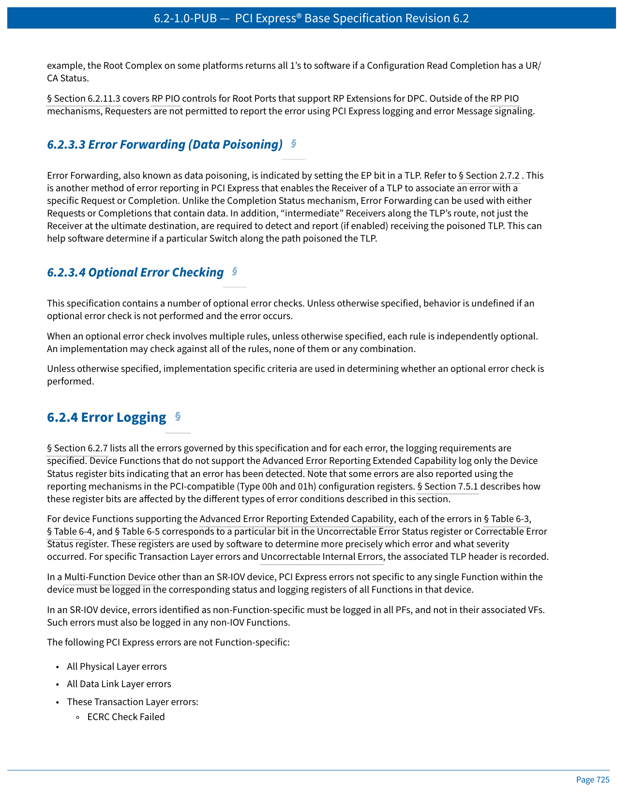

PCI Express provides several registers for error logging:

>
> PCI Express 提供了几个用于错误记录的寄存器：
>

##### 6.2.4.1 Root Complex Considerations (Advanced Error Reporting) / 根复合体考虑事项（高级错误报告）

The Root Complex plays a special role in error handling, as it is typically the entity that reports errors to the operating system.

>
> 根复合体在错误处理中扮演特殊角色，因为它通常是向操作系统报告错误的实体。
>

**6.2.4.1.1 Error Source Identification** / 错误源识别

The Root Complex identifies the source of errors through the Requester ID or by tracking which Root Port received the error message.

>
> 根复合体通过请求者 ID 或跟踪哪个根端口接收了错误消息来识别错误源。
>

**6.2.4.1.2 Interrupt Generation** / 中断生成

The Root Complex generates system interrupts to report errors to the operating system, using the error interrupt mechanisms configured through AER.

>
> 根复合体使用通过 AER 配置的错误中断机制生成系统中断，向操作系统报告错误。
>

##### 6.2.4.2 Multiple Error Handling (Advanced Error Reporting Extended Capability) / 多重错误处理（高级错误报告扩展能力）

When multiple errors occur, the AER Capability structure provides the First Error Pointer and multiple error status registers to help software identify and manage multiple concurrent error conditions.

>
> 当发生多个错误时，AER 能力结构提供首个错误指针和多个错误状态寄存器，以帮助软件识别和管理多个并发的错误条件。
>

##### 6.2.4.3 Advisory Non-Fatal Error Logging / 咨询性非致命错误记录

Advisory Non-Fatal Errors are logged in the AER Capability structure but typically do not generate system interrupts by default.

>
> 咨询性非致命错误记录在 AER 能力结构中，但通常默认不生成系统中断。
>

##### 6.2.4.4 End-End TLP Prefix Logging — Non-Flit Mode / 端到端 TLP 前缀记录 — 非 Flit 模式

In Non-Flit Mode, End-End TLP Prefixes are logged as part of the Header Log registers when an error is detected.

>
> 在非 Flit 模式下，当检测到错误时，端到端 TLP 前缀作为头日志寄存器的一部分被记录。
>

#### 6.2.5 Sequence of Device Error Signaling and Logging Operations / 设备错误信号和记录操作序列

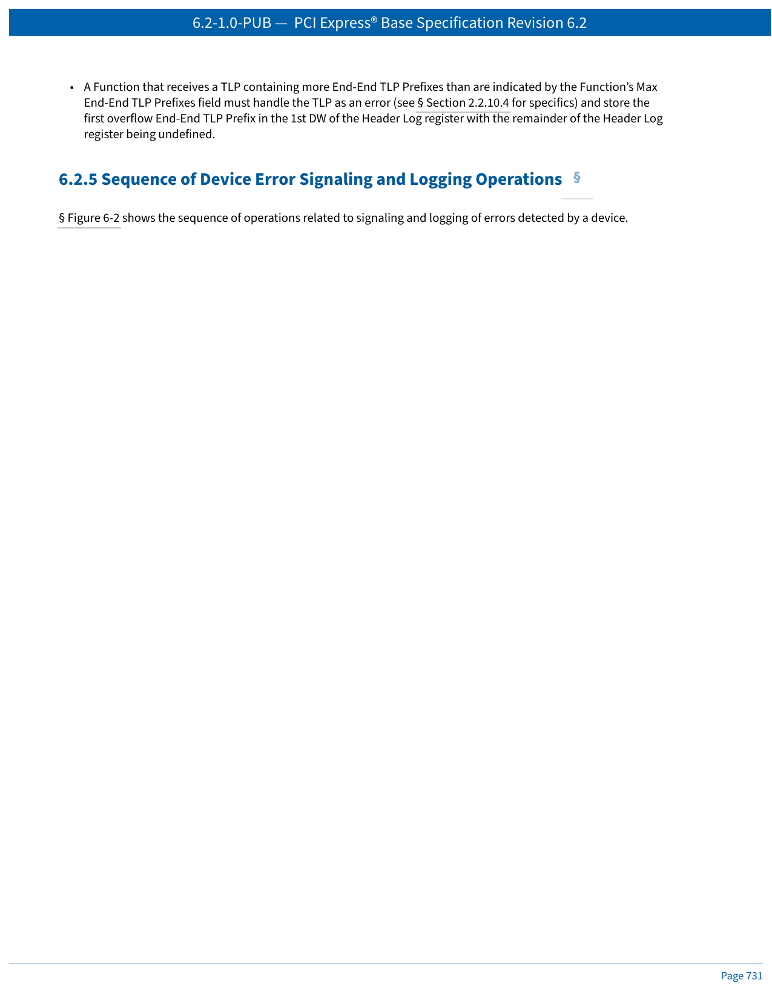

The sequence of error signaling and logging operations is defined to ensure consistent behavior across implementations:
1. Error is detected by the device
2. Error status register is updated
3. If the error is not masked, the First Error Pointer is updated (if this is the first error)
4. If error signaling is enabled:
   - For correctable errors: ERR_COR Message is generated (if enabled)
   - For uncorrectable errors: ERR_NONFATAL or ERR_FATAL Message is generated
5. Header Log register captures the TLP header
6. If enabled, an interrupt is generated

>
> 错误信号和记录操作的顺序被定义为确保跨实现的一致行为：
> 1. 设备检测到错误
> 2. 更新错误状态寄存器
> 3. 如果错误未被屏蔽，则更新首个错误指针（如果是第一个错误）
> 4. 如果启用了错误信号：
>    - 对于可纠正错误：生成 ERR_COR 消息（如果启用）
>    - 对于不可纠正错误：生成 ERR_NONFATAL 或 ERR_FATAL 消息
> 5. 头日志寄存器捕获 TLP 头
> 6. 如果启用，生成中断
>

#### 6.2.6 Error Message Controls / 错误消息控制

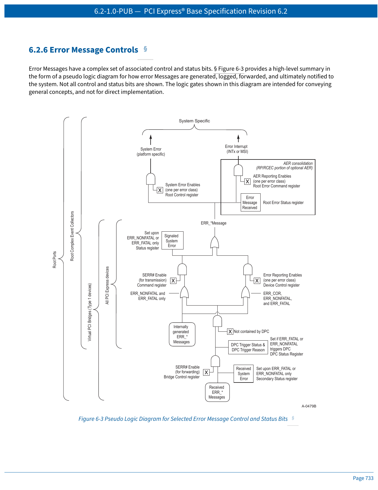

Error messages are controlled through several mechanisms:
- The SERR Enable bit controls forwarding of error messages by Bridges
- The PCI Express Capability Device Control register provides additional error message enables
- The Root Error Command register in AER controls error reporting by Root Ports

>
> 错误消息通过几种机制控制：
> - SERR 启用位控制桥对错误消息的转发
> - PCI Express 能力设备控制寄存器提供额外的错误消息启用
> - AER 中的根错误命令寄存器控制根端口的错误报告
>

#### 6.2.7 Error Listing and Rules / 错误列表与规则

This section provides a comprehensive listing of all PCI Express error types and the rules governing their detection, signaling, and logging.

>
> 本节提供了所有 PCI Express 错误类型的全面列表以及管理其检测、信号和记录的规则。
>

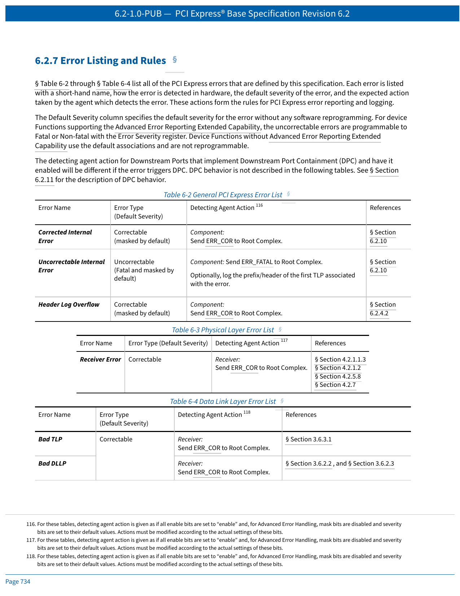

Errors are categorized by their functional source:
- **Physical Layer Errors** / 物理层错误 — Receiver errors, framing errors, etc.
- **Data Link Layer Errors** / 数据链路层错误 — LCRC errors, sequence number errors, replay timeouts, etc.
- **Transaction Layer Errors** / 事务层错误 — Malformed TLP, Unsupported Request, Completer Abort, Unexpected Completion, etc.
- **Configuration Errors** / 配置错误 — Errors detected during configuration space access

>
> 错误按其功能来源分类：
> - **物理层错误** — 接收器错误、定帧错误等
> - **数据链路层错误** — LCRC 错误、序列号错误、重放超时等
> - **事务层错误** — 畸形 TLP、不支持的请求、完成者中止、意外完成等
> - **配置错误** — 在配置空间访问期间检测到的错误
>

##### 6.2.7.1 Conventional PCI Mapping / 传统 PCI 映射

PCI Express error types are mapped to conventional PCI error reporting mechanisms (SERR, PERR) for backward compatibility with legacy software.

>
> PCI Express 错误类型映射到传统 PCI 错误报告机制（SERR、PERR），以与旧软件向后兼容。
>

#### 6.2.8 Virtual PCI Bridge Error Handling / 虚拟 PCI 桥错误处理

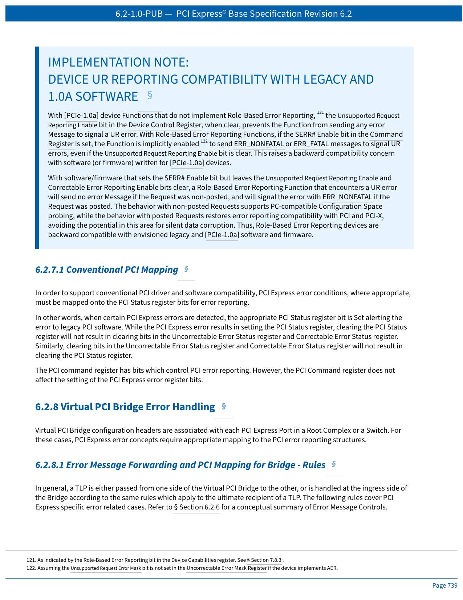

##### 6.2.8.1 Error Message Forwarding and PCI Mapping for Bridge — Rules / 桥的错误消息转发和 PCI 映射 — 规则

Virtual PCI Bridges in Switches and Root Ports follow specific rules for forwarding error messages and mapping PCI Express errors to PCI-compatible error signaling.

>
> 交换机和根端口中的虚拟 PCI 桥遵循特定规则来转发错误消息并将 PCI Express 错误映射到 PCI 兼容的错误信号。
>

#### 6.2.9 SR-IOV Baseline Error Handling / SR-IOV 基线错误处理

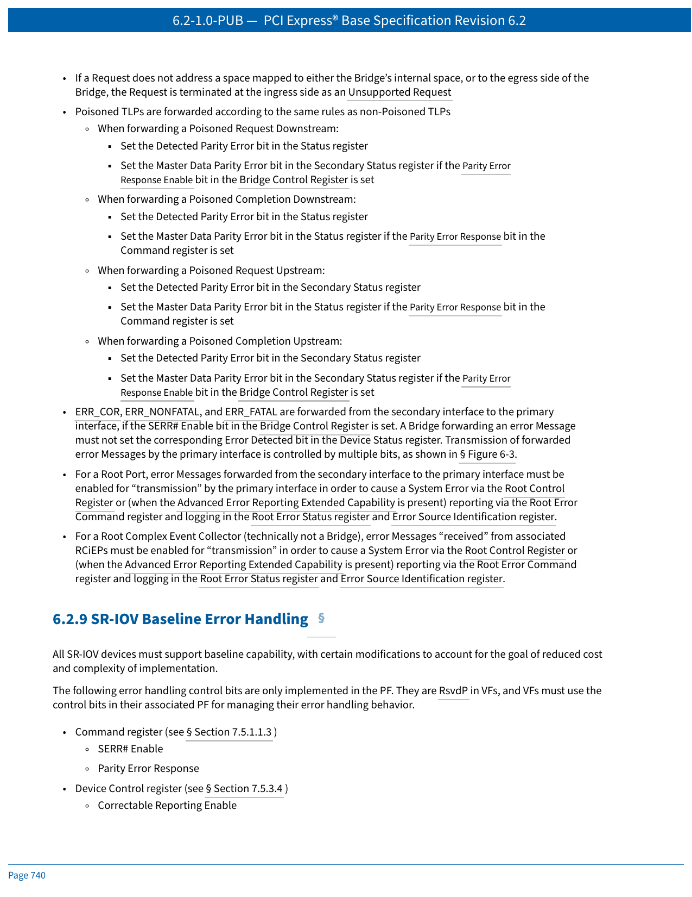

For SR-IOV devices, error handling must account for the separation of Physical Functions (PFs) and Virtual Functions (VFs). Each VF has its own set of error status registers, and errors must be properly attributed to the correct Function.

>
> 对于 SR-IOV 设备，错误处理必须考虑到物理功能（PF）和虚拟功能（VF）的分离。每个 VF 都有自己的一组错误状态寄存器，错误必须正确归因于正确的功能。
>

#### 6.2.10 Internal Errors / 内部错误

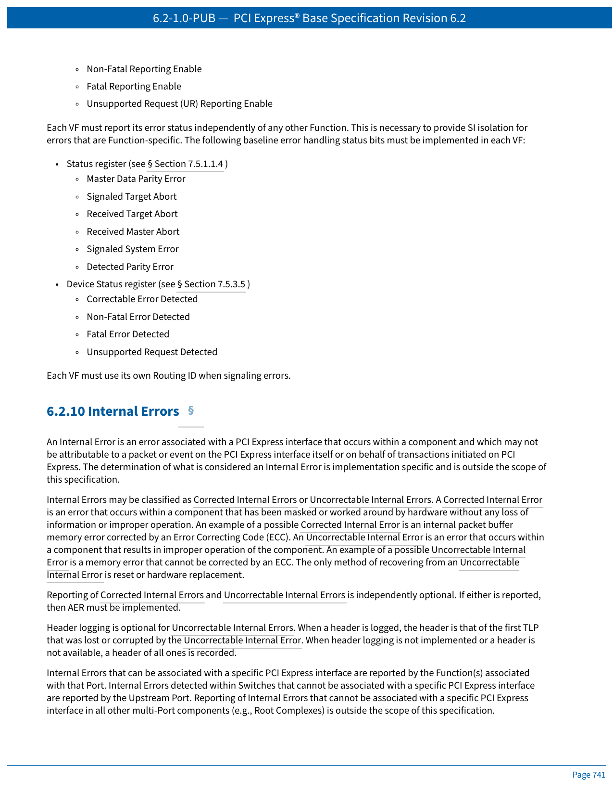

Internal errors are device-specific errors that are not caused by TLPs received from the Link. These are typically reported through the AER Capability structure.

>
> 内部错误是由于设备特定原因而非从链路接收的 TLP 引起的错误。这些通常通过 AER 能力结构报告。
>

#### 6.2.11 Downstream Port Containment (DPC) / 下行端口遏制（DPC）

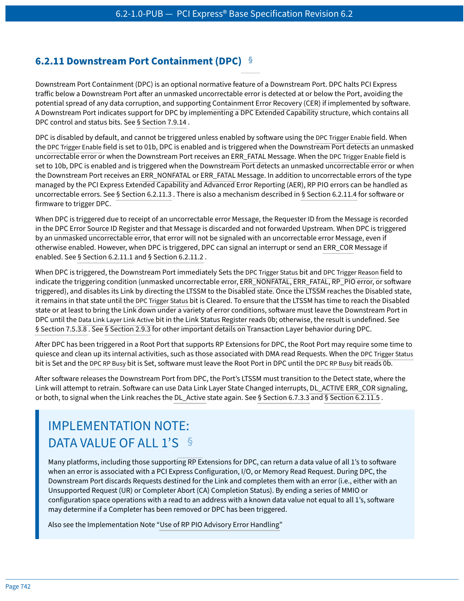

Downstream Port Containment (DPC) is an optional Extended Capability that provides automatic error containment for uncorrectable errors detected at a Downstream Port. When an uncorrectable error is detected:
1. The Downstream Port disables the Link, preventing the propagation of corrupted data
2. The error is logged
3. Optionally, an interrupt is generated to notify software
4. Software can then take recovery actions

>
> 下行端口遏制（DPC）是一个可选的扩展能力，为在下行端口检测到的不可纠正错误提供自动错误遏制。当检测到不可纠正错误时：
> 1. 下行端口禁用链路，防止损坏数据的传播
> 2. 记录错误
> 3. 可选地，生成中断以通知软件
> 4. 软件然后可以采取恢复操作
>

##### 6.2.11.1 DPC Interrupts / DPC 中断

DPC provides interrupt generation mechanisms to notify software when DPC has been triggered and when the containment status changes.

>
> DPC 提供中断生成机制，在 DPC 被触发时以及遏制状态更改时通知软件。
>

##### 6.2.11.2 DPC ERR_COR Signaling / DPC ERR_COR 信号

DPC can be configured to signal correctable errors through the ERR_COR message mechanism.

>
> DPC 可以配置为通过 ERR_COR 消息机制发送可纠正错误信号。
>

##### 6.2.11.3 Root Port Programmed I/O (RPPIO) Error Controls / 根端口编程 I/O（RPPIO）错误控制

Root Ports provide additional error control mechanisms for programmed I/O operations.

>
> 根端口为编程 I/O 操作提供额外的错误控制机制。
>

##### 6.2.11.4 Software Triggering of DPC / DPC 的软件触发

Software can trigger DPC for testing or recovery purposes by writing to the DPC Control register.

>
> 软件可以通过写入 DPC 控制寄存器来触发 DPC 以进行测试或恢复。
>

##### 6.2.11.5 DL_Active ERR_COR Signaling / DL_Active ERR_COR 信号

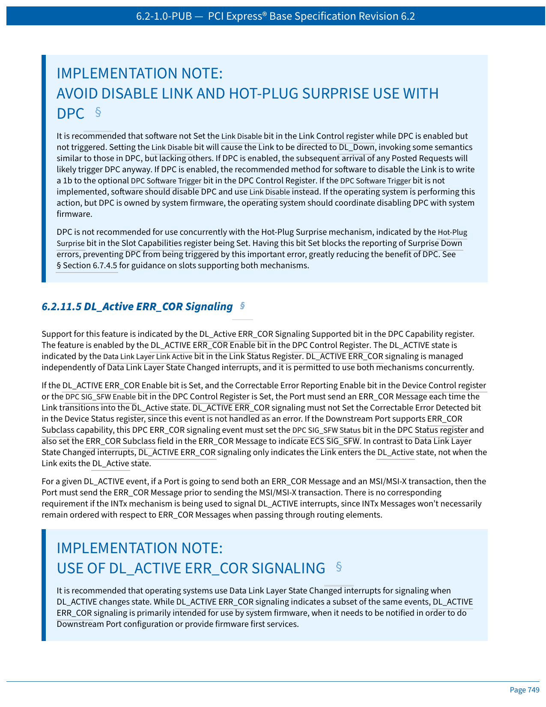

Support for this feature is indicated by the DL_Active ERR_COR Signaling Supported bit in the DPC Capability register. The feature is enabled by the DL_ACTIVE ERR_COR Enable bit in the DPC Control Register. The DL_ACTIVE state is indicated by the Data Link Layer Link Active bit in the Link Status Register. DL_ACTIVE ERR_COR signaling is managed independently of Data Link Layer State Changed interrupts, and it is permitted to use both mechanisms concurrently.

>
> 此功能的支持由 DPC 能力寄存器中的 DL_Active ERR_COR Signaling Supported 位指示。该功能由 DPC 控制寄存器中的 DL_ACTIVE ERR_COR Enable 位启用。DL_ACTIVE 状态由链路状态寄存器中的数据链路层链路活动位指示。DL_ACTIVE ERR_COR 信号独立于数据链路层状态更改中断进行管理，并且允许同时使用这两种机制。
>

If the DL_ACTIVE ERR_COR Enable bit is Set, and the Correctable Error Reporting Enable bit in the Device Control register or the DPC SIG_SFW Enable bit in the DPC Control Register is Set, the Port must send an ERR_COR Message each time the Link transitions into the DL_Active state. DL_ACTIVE ERR_COR signaling must not Set the Correctable Error Detected bit in the Device Status register, since this event is not handled as an error. If the Downstream Port supports ERR_COR Subclass capability, this DPC ERR_COR signaling event must set the DPC SIG_SFW Status bit in the DPC Status register and also set the ERR_COR Subclass field in the ERR_COR Message to indicate ECS SIG_SFW. In contrast to Data Link Layer State Changed interrupts, DL_ACTIVE ERR_COR signaling only indicates the Link enters the DL_Active state, not when the Link exits the DL_Active state.

>
> 如果 DL_ACTIVE ERR_COR Enable 位置位，且设备控制寄存器中的可纠正错误报告启用位或 DPC 控制寄存器中的 DPC SIG_SFW Enable 位置位，则每次链路转换到 DL_Active 状态时，端口必须发送 ERR_COR 消息。DL_ACTIVE ERR_COR 信号不得设置设备状态寄存器中的可纠正错误检测位，因为此事件不作为错误处理。如果下行端口支持 ERR_COR 子类能力，此 DPC ERR_COR 信号事件必须设置 DPC 状态寄存器中的 DPC SIG_SFW 状态位，并设置 ERR_COR 消息中的 ERR_COR 子类字段以指示 ECS SIG_SFW。与数据链路层状态更改中断相比，DL_ACTIVE ERR_COR 信号仅指示链路进入 DL_Active 状态，而不指示链路退出 DL_Active 状态。
>

For a given DL_ACTIVE event, if a Port is going to send both an ERR_COR Message and an MSI/MSI-X transaction, then the Port must send the ERR_COR Message prior to sending the MSI/MSI-X transaction. There is no corresponding requirement if the INTx mechanism is being used to signal DL_ACTIVE interrupts, since INTx Messages won't necessarily remain ordered with respect to ERR_COR Messages when passing through routing elements.

>
> 对于给定的 DL_ACTIVE 事件，如果端口要同时发送 ERR_COR 消息和 MSI/MSI-X 事务，则端口必须在发送 MSI/MSI-X 事务之前发送 ERR_COR 消息。如果使用 INTx 机制来发送 DL_ACTIVE 中断信号，则没有相应的要求，因为 INTx 消息在通过路由元素时不一定与 ERR_COR 消息保持排序。
>

> **Implementation Note: Avoid Disable Link and Hot-Plug Surprise Use with DPC** / 避免将链路禁用和热插拔意外与 DPC 一起使用
>
> It is recommended that software not Set the Link Disable bit in the Link Control register while DPC is enabled but not triggered. If DPC is enabled, the recommended method for software to disable the Link is to write a 1b to the optional DPC Software Trigger bit in the DPC Control Register. DPC is not recommended for use concurrently with the Hot-Plug Surprise mechanism. 建议软件在 DPC 已启用但未触发时不要设置链路控制寄存器中的链路禁用位。如果启用了 DPC，软件禁用链路的推荐方法是将 1b 写入 DPC 控制寄存器中的可选 DPC Software Trigger 位。不建议将 DPC 与热插拔意外机制同时使用。

> **Implementation Note: Use of DL_ACTIVE ERR_COR Signaling** / DL_ACTIVE ERR_COR 信号的使用
>
> It is recommended that operating systems use Data Link Layer State Changed interrupts for signaling when DL_ACTIVE changes state. DL_ACTIVE ERR_COR signaling is primarily intended for use by system firmware. 建议操作系统在 DL_ACTIVE 状态更改时使用数据链路层状态更改中断进行信号通知。DL_ACTIVE ERR_COR 信号主要用于系统固件。

---

### 6.3 Virtual Channel Support / 虚拟通道支持

#### 6.3.1 Introduction and Scope / 引言与范围

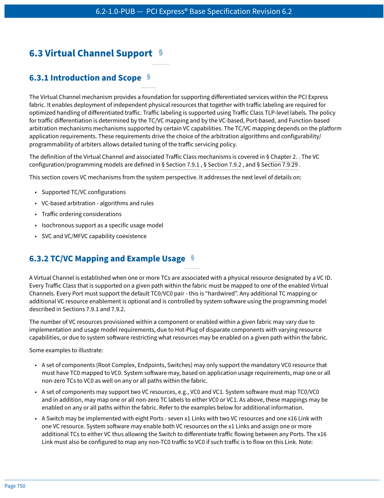

The Virtual Channel mechanism provides a foundation for supporting differentiated services within the PCI Express fabric. It enables deployment of independent physical resources that together with traffic labeling are required for optimized handling of differentiated traffic. Traffic labeling is supported using Traffic Class TLP-level labels. The policy for traffic differentiation is determined by the TC/VC mapping and by the VC-based, Port-based, and Function-based arbitration mechanisms supported by certain VC capabilities. The TC/VC mapping depends on the platform application requirements. These requirements drive the choice of the arbitration algorithms and configurability/programmability of arbiters allows detailed tuning of the traffic servicing policy.

>
> 虚拟通道机制为在 PCI Express 结构中支持差异化服务提供了基础。它支持部署独立的物理资源，这些资源与流量标记一起是优化处理差异化流量所必需的。流量标记使用流量类别（TC）TLP 级标签来支持。流量差异化策略由 TC/VC 映射以及由某些 VC 能力支持的基于 VC、基于端口和基于功能的仲裁机制来确定。TC/VC 映射取决于平台应用需求。这些需求驱动着仲裁算法的选择，而仲裁器的可配置性/可编程性允许对流量服务策略进行精细调优。
>

The definition of the Virtual Channel and associated Traffic Class mechanisms is covered in Chapter 2. The VC configuration/programming models are defined in Section 7.9.1, Section 7.9.2, and Section 7.9.29. This section covers VC mechanisms from the system perspective. It addresses the next level of details on: Supported TC/VC configurations, VC-based arbitration algorithms and rules, Traffic ordering considerations, Isochronous support as a specific usage model, and SVC and VC/MF VC capability coexistence.

>
> 虚拟通道和关联的流量类别机制的定义见第 2 章。VC 配置/编程模型定义在第 7.9.1 节、第 7.9.2 节和第 7.9.29 节。本节从系统角度讨论 VC 机制。它涉及以下方面的更深层次细节：支持的 TC/VC 配置、基于 VC 的仲裁算法和规则、流量排序考虑、作为特定使用模型的同步支持，以及 SVC 和 VC/MF VC 能力共存。
>

#### 6.3.2 TC/VC Mapping and Example Usage / TC/VC 映射与使用示例

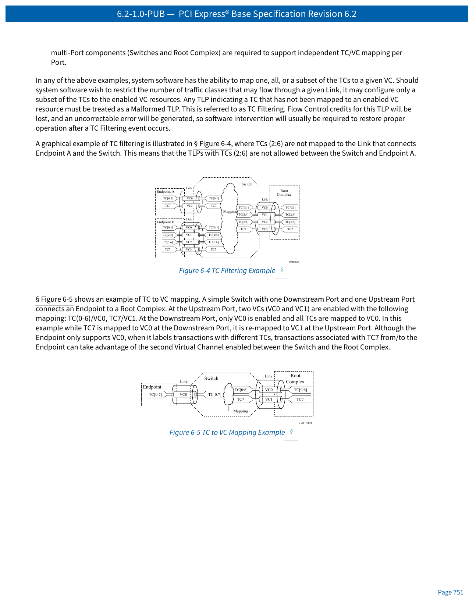

A Virtual Channel is established when one or more TCs are associated with a physical resource designated by a VC ID. Every Traffic Class that is supported on a given path within the fabric must be mapped to one of the enabled Virtual Channels. Every Port must support the default TC0/VC0 pair — this is "hardwired". Any additional TC mapping or additional VC resource enablement is optional and is controlled by system software using the programming model described in Sections 7.9.1 and 7.9.2.

>
> 当一个或多个 TC 与由 VC ID 指定的物理资源关联时，即建立了一个虚拟通道。在结构内给定路径上支持的每个流量类别必须映射到一个已启用的虚拟通道。每个端口必须支持默认的 TC0/VC0 对——这是"硬连线的"。任何额外的 TC 映射或额外的 VC 资源启用都是可选的，由系统软件使用第 7.9.1 节和第 7.9.2 节中描述的编程模型控制。
>

In any of the above examples, system software has the ability to map one, all, or a subset of the TCs to a given VC. Should system software wish to restrict the number of traffic classes that may flow through a given Link, it may configure only a subset of the TCs to the enabled VC resources. Any TLP indicating a TC that has not been mapped to an enabled VC resource must be treated as a Malformed TLP. This is referred to as TC Filtering. Flow Control credits for this TLP will be lost, and an uncorrectable error will be generated, so software intervention will usually be required to restore proper operation after a TC Filtering event occurs.

>
> 在上述任何示例中，系统软件都能够将一个、所有或部分 TC 映射到给定的 VC。如果系统软件希望限制可以通过给定链路的流量类别数量，它可以仅将部分 TC 配置到已启用的 VC 资源。任何指示未映射到已启用 VC 资源的 TC 的 TLP 必须被视为畸形 TLP。这被称为 TC 过滤。此 TLP 的流控制信用将丢失，并将生成不可纠正错误，因此在发生 TC 过滤事件后通常需要软件干预来恢复正常操作。
>

Multi-Port components (Switches and Root Complex) are required to support independent TC/VC mapping per Port.

>
> 多端口组件（交换机和根复合体）需要支持每个端口的独立 TC/VC 映射。
>

#### 6.3.3 VC Arbitration / VC 仲裁

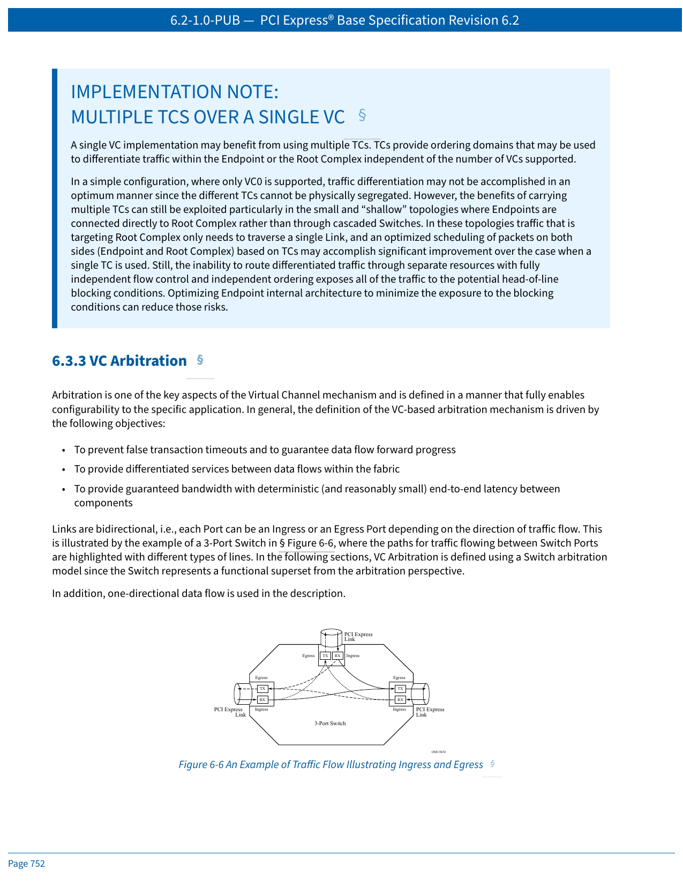

Arbitration is one of the key aspects of the Virtual Channel mechanism and is defined in a manner that fully enables configurability to the specific application. In general, the definition of the VC-based arbitration mechanism is driven by the following objectives: To prevent false transaction timeouts and to guarantee data flow forward progress; To provide differentiated services between data flows within the fabric; To provide guaranteed bandwidth with deterministic (and reasonably small) end-to-end latency between components.

>
> 仲裁是虚拟通道机制的关键方面之一，其定义方式完全支持针对特定应用的可配置性。一般来说，基于 VC 的仲裁机制的定义由以下目标驱动：防止虚假事务超时并保证数据流的前向进展；在结构内的数据流之间提供差异化服务；在组件之间提供具有确定性（且合理小的）端到端延迟的保证带宽。
>

##### 6.3.3.1 Traffic Flow and Switch Arbitration Model / 流量与交换机仲裁模型

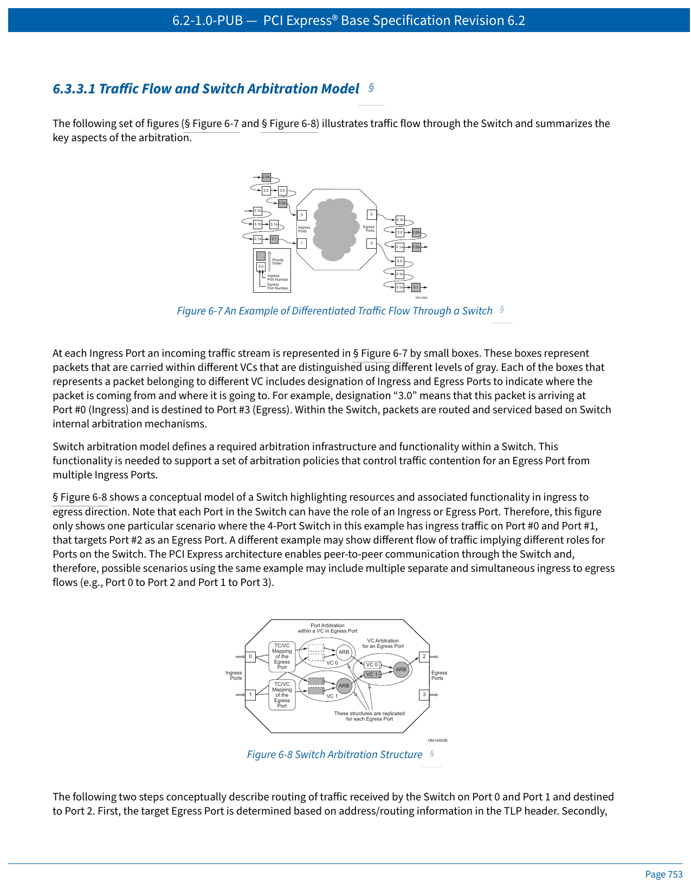

The Switch arbitration model defines a required arbitration infrastructure and functionality within a Switch. This functionality is needed to support a set of arbitration policies that control traffic contention for an Egress Port from multiple Ingress Ports. The following two steps conceptually describe routing of traffic received by the Switch: First, the target Egress Port is determined based on address/routing information in the TLP header. Second, the target VC of the Egress Port is determined based on the TC/VC map of the Egress Port. Transactions that target the same VC in the Egress Port but are from different Ingress Ports must be arbitrated before they can be forwarded to the corresponding resource in the Egress Port. This arbitration is referred to as Port Arbitration. Once the traffic reaches the destination VC resource in the Egress Port, it is subject to arbitration for the shared Link. This stage of arbitration between different VCs at an Egress Port is called VC Arbitration of the Egress Port.

>
> 交换机仲裁模型定义了交换机内必需的仲裁基础设施和功能。此功能是支持一组仲裁策略所必需的，这些策略控制来自多个入口端口对出口端口的流量竞争。以下两个步骤概念上描述了交换机接收的流量的路由：首先，根据 TLP 头中的地址/路由信息确定目标出口端口。其次，根据出口端口的 TC/VC 映射确定出口端口的目标 VC。目标为出口端口中相同 VC 但来自不同入口端口的事务在被转发到出口端口中相应资源之前必须进行仲裁。此仲裁称为端口仲裁。一旦流量到达出口端口中的目标 VC 资源，它将受到共享链路的仲裁。在出口端口的不同 VC 之间进行的这一仲裁阶段称为出口端口的 VC 仲裁。
>

> **Implementation Note: VC Control Logic at the Egress Port** / 出口端口的 VC 控制逻辑
>
> VC control logic at every Egress Port includes VC Flow Control logic and VC Ordering Control logic. Flow control credits are exchanged between two Ports connected to the same Link. Availability of flow control credits is one of the qualifiers that VC control logic must use to decide when a VC is allowed to compete for the shared Link resource. If a candidate packet cannot be submitted due to the lack of an adequate number of flow control credits, VC control logic must mask the presence of pending packet to prevent blockage of traffic from other VCs. 每个出口端口的 VC 控制逻辑包括 VC 流控制逻辑和 VC 排序控制逻辑。流控制信用在连接到同一链路的两个端口之间交换。流控制信用的可用性是 VC 控制逻辑必须用于决定何时允许 VC 竞争共享链路资源的限定条件之一。如果候选数据包因缺乏足够数量的流控制信用而无法提交，VC 控制逻辑必须屏蔽挂起数据包的存在，以防止阻塞来自其他 VC 的流量。

##### 6.3.3.2 VC Arbitration — Arbitration Between VCs / VC 仲裁 — VC 之间的仲裁

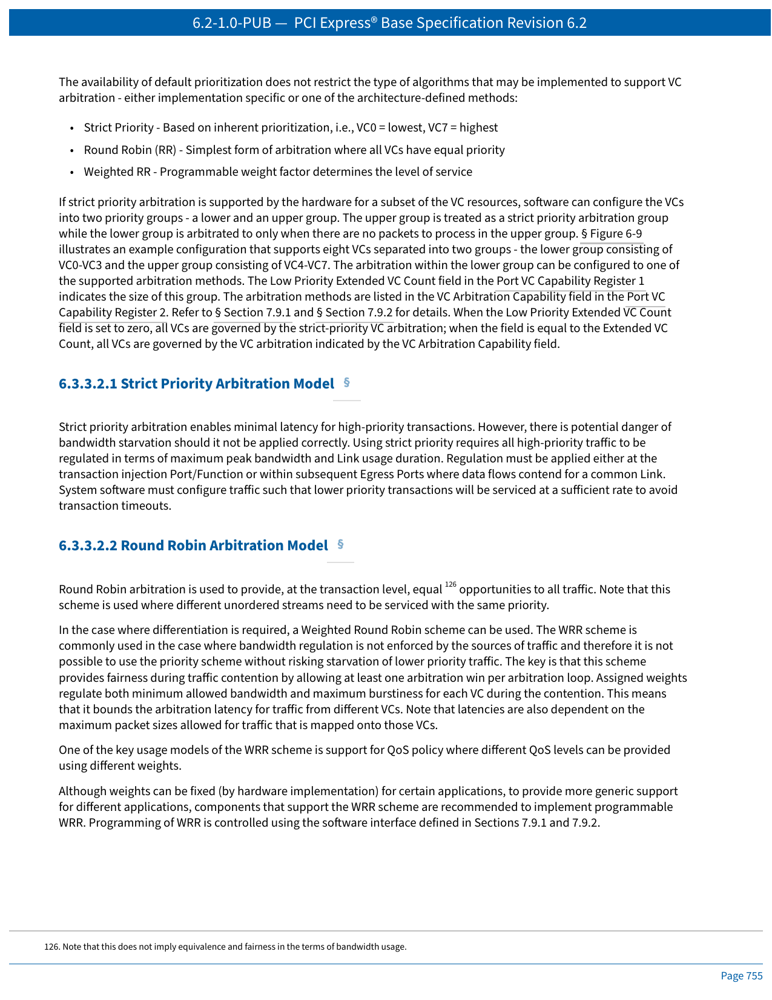

The availability of default prioritization does not restrict the type of algorithms that may be implemented to support VC arbitration — either implementation specific or one of the architecture-defined methods: Strict Priority (based on inherent prioritization, i.e., VC0 = lowest, VC7 = highest), Round Robin (RR — simplest form of arbitration where all VCs have equal priority), and Weighted RR (programmable weight factor determines the level of service).

>
> 默认优先级的存在并不限制为支持 VC 仲裁而可能实现的算法类型——可以是实现特定的，也可以是架构定义的方法之一：严格优先级（基于固有优先级，即 VC0 = 最低，VC7 = 最高）、轮询（RR — 最简单的仲裁形式，所有 VC 具有相等的优先级）和加权轮询（可编程权重因子决定服务级别）。
>

Strict priority arbitration enables minimal latency for high-priority transactions. However, there is potential danger of bandwidth starvation should it not be applied correctly. Using strict priority requires all high-priority traffic to be regulated in terms of maximum peak bandwidth and Link usage duration. Round Robin arbitration is used to provide, at the transaction level, equal opportunities to all traffic. In the case where differentiation is required, a Weighted Round Robin scheme can be used. The key is that this scheme provides fairness during traffic contention by allowing at least one arbitration win per arbitration loop.

>
> 严格优先级仲裁能为高优先级事务提供最小延迟。但是，如果应用不当，可能存在带宽饥饿的潜在危险。使用严格优先级要求所有高优先级流量在最大峰值带宽和链路使用持续时间方面受到管制。轮询仲裁用于在事务级别为所有流量提供平等机会。在需要差异化的情况下，可以使用加权轮询方案。关键在于该方案通过允许每个仲裁循环至少获得一次仲裁胜利，在流量竞争期间提供公平性。
>

##### 6.3.3.3 Port Arbitration — Arbitration Within VC / 端口仲裁 — VC 内的仲裁

For Switches, Port Arbitration refers to the arbitration at an Egress Port between traffic coming from other Ingress Ports that is mapped to the same VC. Traffic from different Ports can be arbitrated using: Hardware-fixed arbitration scheme (e.g., Round Robin), Programmable WRR arbitration scheme, or Programmable Time-based WRR arbitration scheme. Hardware-fixed RR or RR-like scheme is the simplest to implement since it does not require any programmability. Programmable WRR allows flexibility. A Time-based WRR is used for applications where not only different allocation of bandwidth is required but also a tight control of usage of that bandwidth.

>
> 对于交换机，端口仲裁是指在出口端口对来自其他入口端口且映射到相同 VC 的流量进行仲裁。来自不同端口的流量可以使用以下方案进行仲裁：硬件固定仲裁方案（如轮询）、可编程 WRR 仲裁方案或可编程基于时间的 WRR 仲裁方案。硬件固定的 RR 或类 RR 方案最简单，因为它不需要任何可编程性。可编程 WRR 提供了灵活性。基于时间的 WRR 用于不仅需要不同带宽分配，而且需要严格控制该带宽使用的应用。
>

##### 6.3.3.4 Multi-Function Devices and Function Arbitration / 多功能设备与功能仲裁

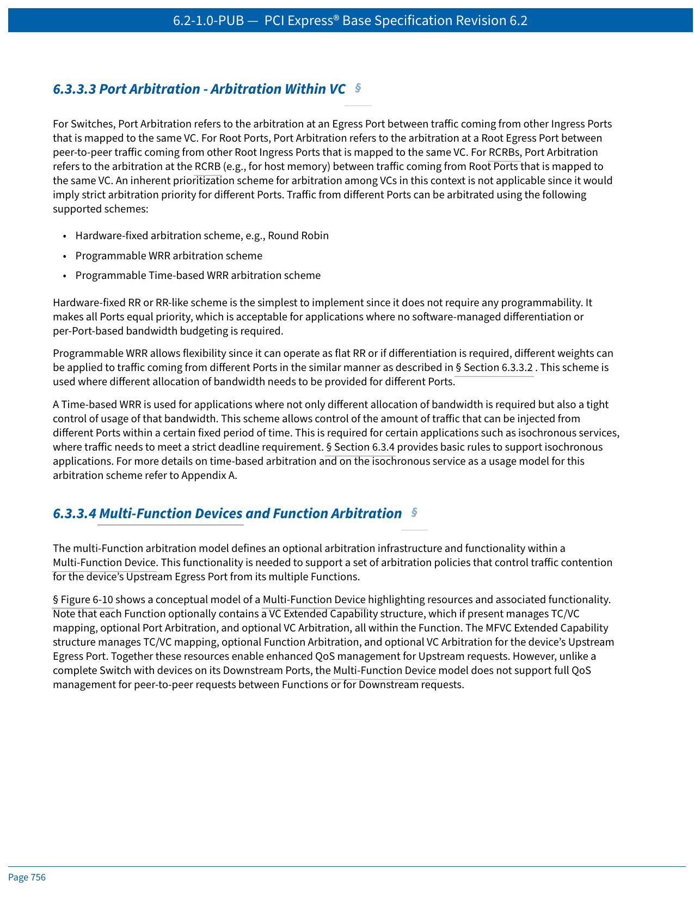

The multi-Function arbitration model defines an optional arbitration infrastructure and functionality within a Multi-Function Device. This functionality is needed to support a set of arbitration policies that control traffic contention for the device's Upstream Egress Port from its multiple Functions. QoS for an Upstream request originating at a Function is managed as follows: First, a Function-specific mechanism applies a TC to the request. Next, if the Function contains a VC Extended Capability structure, it specifies the TC/VC mapping to one of the Function's VC resources. If the Function supports VC arbitration, this mechanism manages how the Function's multiple VC resources arbitrate for the conceptual internal link to the MF VC resources. Once a request packet conceptually arrives at MF VC resources, address/routing information in the TLP header determines whether the request goes Upstream or peer-to-peer to another Function. Finally, if the MF VC Extended Capability structure supports VC Arbitration, this mechanism governs how the MF VC's multiple VCs compete for the device's Upstream Egress Port.

>
> 多功能仲裁模型定义了多功能设备内的可选仲裁基础设施和功能。此功能是支持一组仲裁策略所必需的，这些策略控制来自多个功能对设备上行出口端口的流量竞争。对于起源于某功能的上行请求，QoS 管理如下：首先，功能特定的机制将 TC 应用于该请求。接下来，如果功能包含 VC 扩展能力结构，则它指定 TC/VC 映射到该功能的一个 VC 资源。如果功能支持 VC 仲裁，此机制管理该功能的多个 VC 资源如何为连接到 MF VC 资源的概念内部链路进行仲裁。一旦请求数据包概念上到达 MF VC 资源，TLP 头中的地址/路由信息将确定请求是上行还是对等到另一个功能。最后，如果 MF VC 扩展能力结构支持 VC 仲裁，此机制管理 MF VC 的多个 VC 如何竞争设备的上行出口端口。
>

#### 6.3.4 Isochronous Support / 同步支持

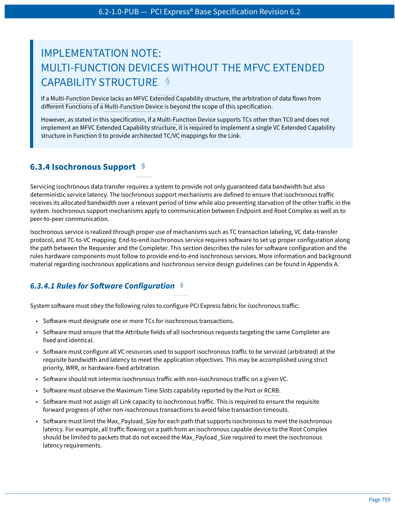

Servicing isochronous data transfer requires a system to provide not only guaranteed data bandwidth but also deterministic service latency. The isochronous support mechanisms are defined to ensure that isochronous traffic receives its allocated bandwidth over a relevant period of time while also preventing starvation of the other traffic in the system. Isochronous support mechanisms apply to communication between Endpoint and Root Complex as well as to peer-to-peer communication.

>
> 服务同步数据传输要求系统不仅要提供保证的数据带宽，还要提供确定性的服务延迟。同步支持机制的制定旨在确保同步流量在相关时间段内获得其分配的带宽，同时防止系统中其他流量的饥饿。同步支持机制适用于端点与根复合体之间的通信以及端到端通信。
>

System software must obey the following rules to configure PCI Express fabric for isochronous traffic: designate one or more TCs for isochronous transactions; ensure that the Attribute fields of all isochronous requests targeting the same Completer are fixed and identical; configure all VC resources used to support isochronous traffic to be serviced at the requisite bandwidth and latency; not intermix isochronous traffic with non-isochronous traffic on a given VC; observe the Maximum Time Slots capability reported by the Port or RCRB; not assign all Link capacity to isochronous traffic (required to ensure forward progress of non-isochronous transactions to avoid false transaction timeouts); limit the Max_Payload_Size for each path that supports isochronous.

>
> 系统软件必须遵守以下规则以配置 PCI Express 结构用于同步流量：为同步事务指定一个或多个 TC；确保所有目标为相同完成者的同步请求的属性字段是固定且相同的；配置所有用于支持同步流量的 VC 资源以按所需带宽和延迟进行服务；不要在给定 VC 上将同步流量与非同步流量混合；遵守端口或 RCRB 报告的最大时隙能力；不要将所有链路容量分配给同步流量（需要确保非同步事务的前向进展，以避免虚假事务超时）；限制每个支持同步的路径的 Max_Payload_Size。
>

#### 6.3.5 SVC and VC/MF VC Capability Coexistence / SVC 与 VC/MF VC 能力共存

The SVC (Single VC) and VC/MF VC capability coexistence rules ensure proper operation when components with different VC capabilities are interconnected. Components that support only the default VC0 must still be able to interoperate with components that support multiple VCs, with traffic being mapped appropriately.

>
> SVC（单 VC）与 VC/MF VC 能力共存规则确保在具有不同 VC 能力的组件互连时能够正确操作。仅支持默认 VC0 的组件仍必须能够与支持多个 VC 的组件互操作，流量需要被适当映射。
>

---

### 6.4 Device Synchronization / 设备同步

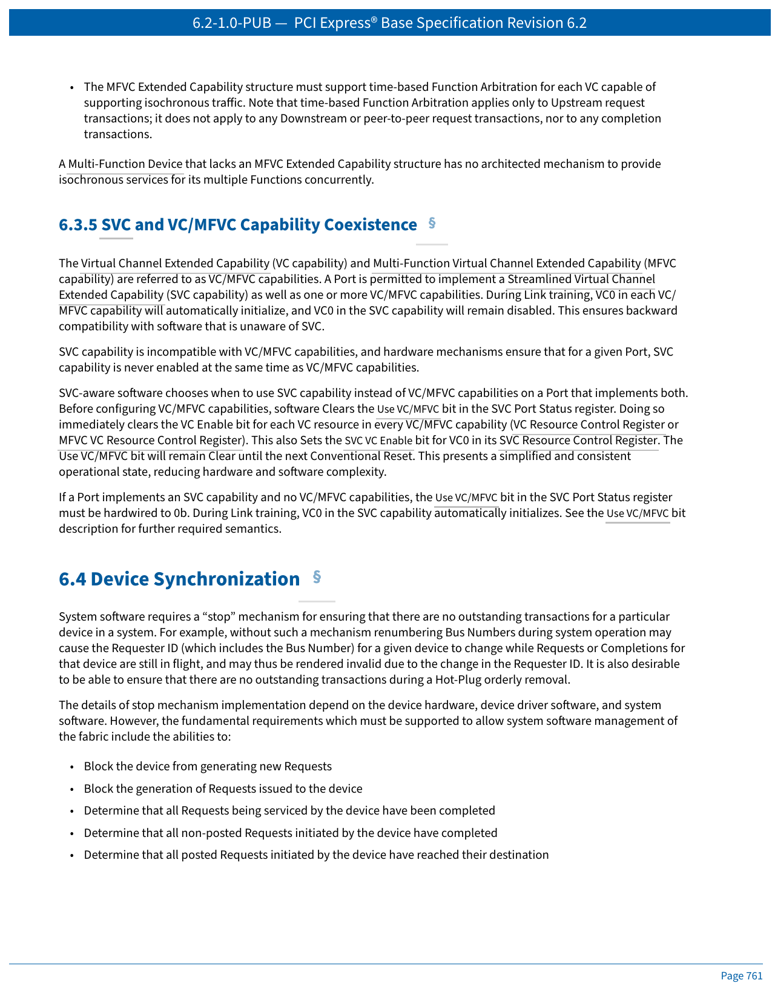

Device Synchronization mechanisms ensure proper coordination between hardware and software during device state transitions. This includes mechanisms for ensuring that all outstanding transactions are completed before a device enters a low-power state or undergoes a reset.

>
> 设备同步机制确保在设备状态转换期间硬件和软件之间的适当协调。这包括确保在设备进入低功耗状态或经历复位之前完成所有未完成事务的机制。
>

---

### 6.5 Locked Transactions / 锁定事务

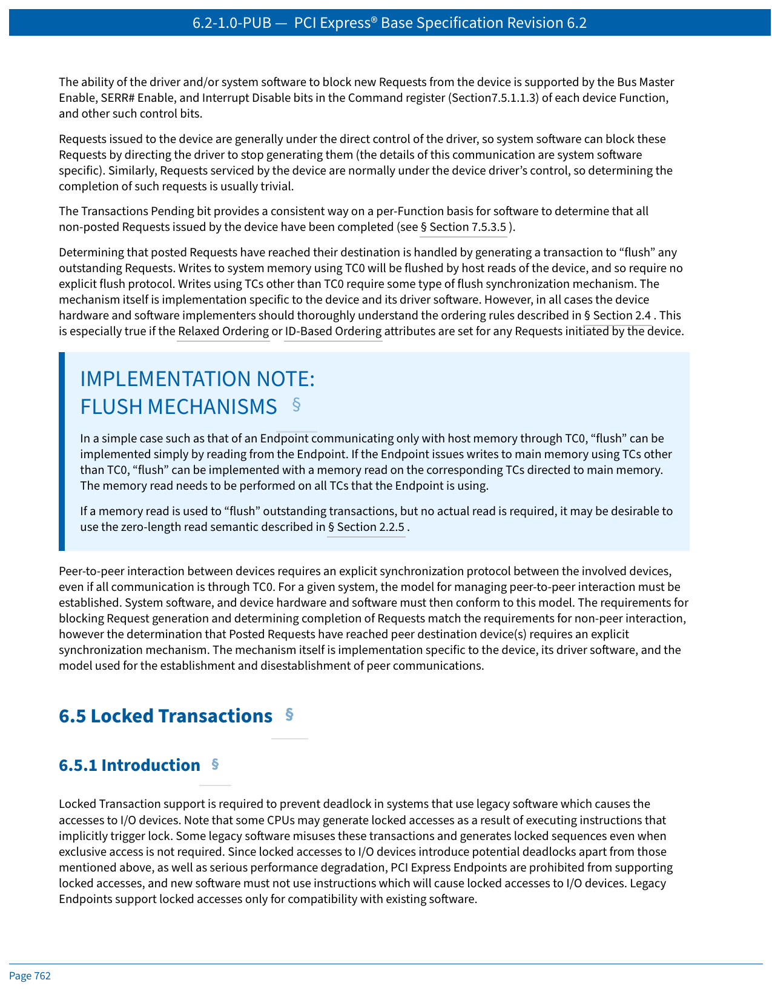

Locked Transactions support atomic read-modify-write sequences across the PCI Express fabric. This section defines the initiation and propagation of Locked Transactions, including rules for Switches, PCI Express/PCI Bridges, Root Complex, Legacy Endpoints, and PCI Express Endpoints.

>
> 锁定事务支持跨 PCI Express 结构的原子读-改-写序列。本节定义了锁定事务的发起和传播，包括交换机、PCI Express/PCI 桥、根复合体、传统端点和 PCI Express 端点的规则。
>

Key rules include: Only Legacy Endpoints may support Lock semantics as a Completer; PCI Express Endpoints must not support Locked Requests; Switches must forward Locked Requests according to specified rules; Root Complexes must not support Lock semantics as a Completer but may generate Locked Requests as a Requester.

>
> 关键规则包括：只有传统端点可以作为完成者支持锁定语义；PCI Express 端点不得支持锁定请求；交换机必须按照指定规则转发锁定请求；根复合体不得作为完成者支持锁定语义，但可以作为请求者生成锁定请求。
>

---

### 6.6 PCI Express Reset — Rules / PCI Express 复位 — 规则

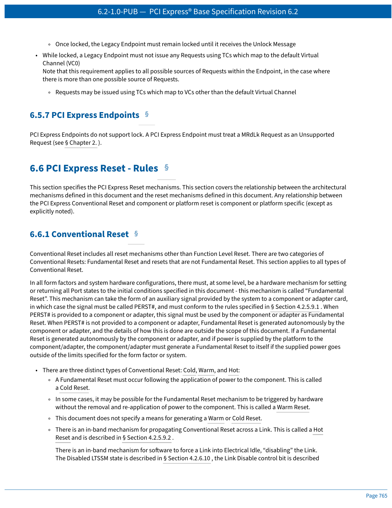

PCI Express defines two primary reset mechanisms: Conventional Reset (including Fundamental Reset and Hot Reset) and Function Level Reset (FLR). Conventional Reset affects the entire device and resets all Functions to their initial state. FLR allows software to reset individual Functions within a Multi-Function Device without affecting other Functions.

>
> PCI Express 定义了两种主要的复位机制：传统复位（包括基本复位和热复位）和功能级复位（FLR）。传统复位影响整个设备，将所有功能重置为其初始状态。FLR 允许软件重置多功能设备中的个别功能，而不影响其他功能。
>

Fundamental Reset is asserted through a hardware sideband signal (PERST#). Hot Reset is propagated in-band through the Link using Training Sequences. FLR is initiated by software writing to the Function's control registers. After any reset, all PCI Express Configuration Space registers return to their default values, and all state machines return to their initial conditions.

>
> 基本复位通过硬件边带信号（PERST#）断言。热复位使用训练序列通过链路带内传播。FLR 由软件写入功能的控制寄存器启动。在任何复位之后，所有 PCI Express 配置空间寄存器返回到其默认值，所有状态机返回到其初始条件。
>

---

### 6.7 PCI Express Native Hot-Plug / PCI Express 原生热插拔

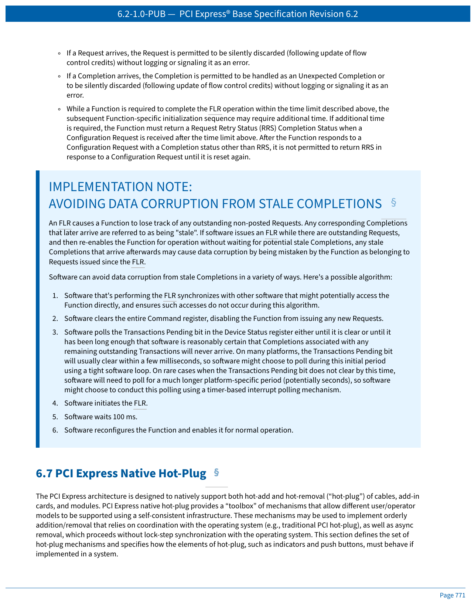

PCI Express Native Hot-Plug provides a standardized mechanism for adding and removing devices from a running system without requiring system power-down. Elements of Hot-Plug include: Indicators (Attention Indicator, Power Indicator), Manually-operated Retention Latch (MRL), MRL Sensor, Electromechanical Interlock, Attention Button, Software User Interface, Slot Numbering, and Power Controller.

>
> PCI Express 原生热插拔提供了一种标准化机制，用于在运行中的系统上添加和移除设备，而无需系统断电。热插拔的要素包括：指示灯（注意指示灯、电源指示灯）、手动操作固定闩锁（MRL）、MRL 传感器、机电互锁、注意按钮、软件用户界面、插槽编号和电源控制器。
>

Hot-Plug events include: Slot Events (Attention Button pressed, MRL opened/closed, Presence Detect changed), Command Completed Events, Data Link Layer State Changed Events, and Software Notification of Hot-Plug Events.

>
> 热插拔事件包括：插槽事件（注意按钮按下、MRL 打开/关闭、存在检测更改）、命令完成事件、数据链路层状态更改事件以及热插拔事件的软件通知。
>

The System Firmware Intermediary (SFI) support provides mechanisms for firmware to manage Hot-Plug operations, including SFI ERR_COR Event Signaling, SFI Downstream Port Filtering (DPF), and SFI Suppression of Hot-Plug Surprise Functionality. Async Removal support allows devices to be removed without prior notification.

>
> 系统固件中介（SFI）支持为固件管理热插拔操作提供机制，包括 SFI ERR_COR 事件信号、SFI 下行端口过滤（DPF）和 SFI 抑制热插拔意外功能。异步移除支持允许在没有事先通知的情况下移除设备。
>

---

### 6.8 Power Budgeting Mechanism / 电源预算机制

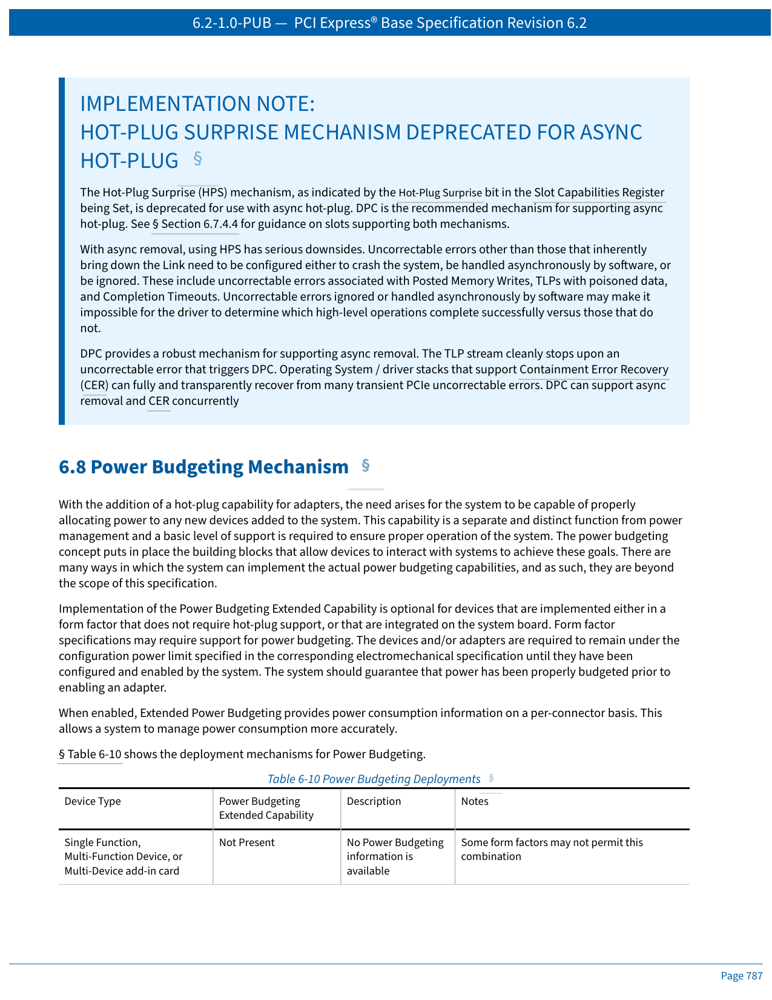

The Power Budgeting Mechanism provides a standardized way for devices to report their power consumption characteristics and for system software to manage power allocation across multiple devices. This includes the System Power Budgeting Process Recommendations, Device Power Considerations, and Power Limit Mechanisms.

>
> 电源预算机制提供了一种标准化的方式，让设备报告其功耗特性，并让系统软件管理跨多个设备的电源分配。这包括系统电源预算过程建议、设备电源考虑和功率限制机制。
>

---

### 6.9 Slot Power Limit Control / 插槽功率限制控制

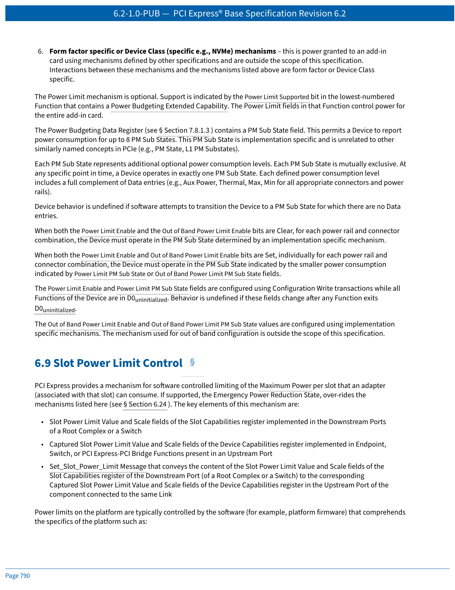

Slot Power Limit Control provides mechanisms for limiting the maximum power that can be consumed by a device in a slot. The Slot Power Limit value is communicated to the device during configuration, and the device must respect this limit. This mechanism is critical for ensuring system power integrity and preventing over-current conditions.

>
> 插槽功率限制控制提供了限制插槽中设备最大功耗的机制。插槽功率限制值在配置期间传达给设备，设备必须遵守此限制。此机制对于确保系统电源完整性和防止过流情况至关重要。
>

---

### 6.10 Root Complex Topology Discovery / 根复合体拓扑发现

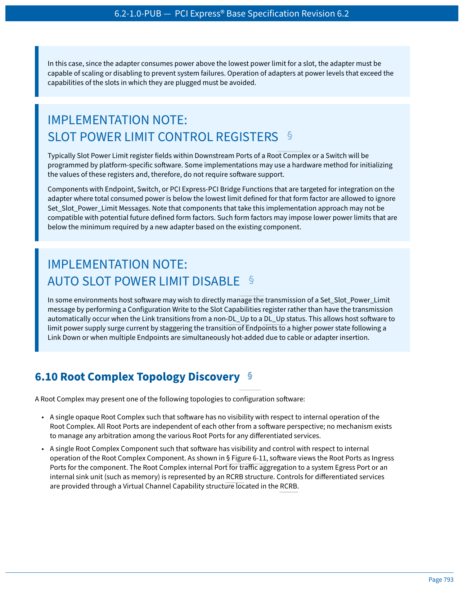

Root Complex Topology Discovery defines the process by which system software discovers the internal topology of a Root Complex. This is important for understanding how PCI Express hierarchy domains are organized and for proper routing of transactions.

>
> 根复合体拓扑发现定义了系统软件发现根复合体内部拓扑的过程。这对于理解 PCI Express 层次结构域的组织方式以及正确路由事务非常重要。
>

---

### 6.11 Link Speed Management / 链路速度管理

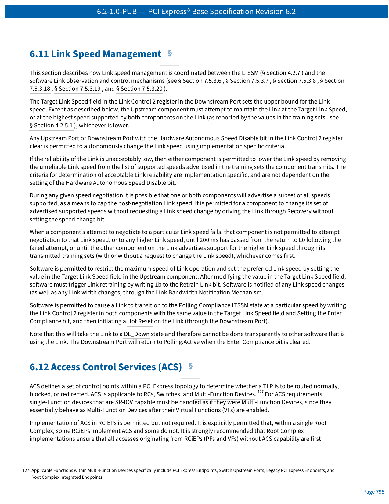

Link Speed Management provides mechanisms for managing the operational speed of PCI Express Links. This includes capabilities for autonomous Link speed changes based on power management policies and bandwidth requirements.

>
> 链路速度管理提供管理 PCI Express 链路操作速度的机制。这包括基于电源管理策略和带宽需求的自主链路速度更改能力。
>

---

### 6.12 Access Control Services (ACS) / 访问控制服务（ACS）

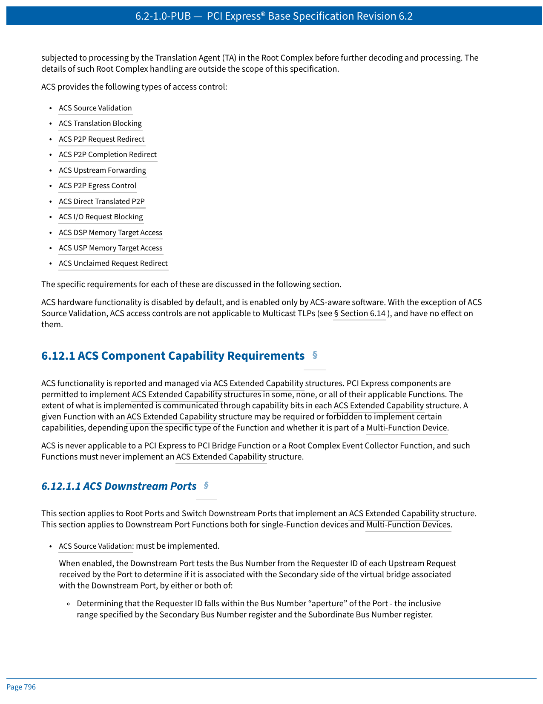

Access Control Services (ACS) provide mechanisms for controlling peer-to-peer transactions within a PCI Express fabric. ACS defines component capability requirements, including: ACS Downstream Ports, Functions in SR-IOV Capable and Multi-Function Devices, and Functions in Single-Function Devices. Key features include: ACS Peer-to-Peer Control Interactions, ACS Enhanced Capability, ACS Violation Error Handling, and ACS Redirection Impacts on Ordering Rules.

>
> 访问控制服务（ACS）提供了控制 PCI Express 结构内对等事务的机制。ACS 定义了组件能力要求，包括：ACS 下行端口、SR-IOV 能力和多功能设备中的功能，以及单功能设备中的功能。关键功能包括：ACS 对等控制交互、ACS 增强能力、ACS 违规错误处理以及 ACS 重定向对排序规则的影响。
>

ACS is essential for enabling secure virtualization environments by preventing unauthorized peer-to-peer data transfers between Functions. It supports configuration of redirection and blocking rules for various transaction types.

>
> ACS 对于通过阻止功能之间未经授权的对等数据传输来启用安全虚拟化环境至关重要。它支持对各种事务类型的重定向和阻塞规则的配置。
>

---

### 6.13 Alternative Routing-ID Interpretation (ARI) / 替代路由 ID 解释（ARI）

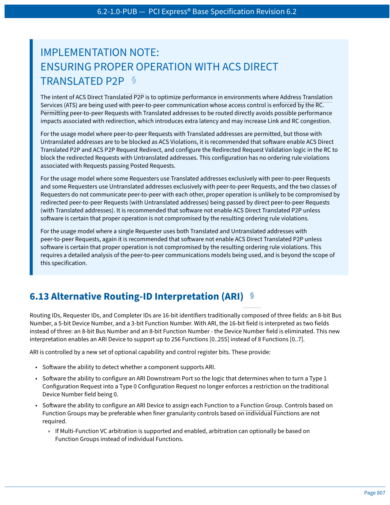

Alternative Routing-ID Interpretation (ARI) extends the number of Functions that can be supported by a single Device beyond the traditional limit of 8. ARI enables each Function to use an 8-bit Function Number, supporting up to 256 Functions per Device. This is particularly important for SR-IOV devices that may need to expose many Virtual Functions.

>
> 替代路由 ID 解释（ARI）将单个设备可支持的功能数量扩展到传统 8 个限制之外。ARI 使每个功能可以使用 8 位功能号，每个设备最多支持 256 个功能。这对于可能需要公开许多虚拟功能的 SR-IOV 设备尤为重要。
>

---

### 6.14 Multicast Operations / 多播操作

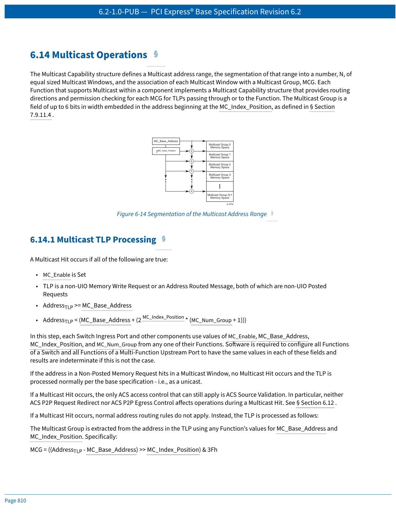

Multicast Operations allow a single TLP to be delivered to multiple recipients simultaneously. This is particularly useful for applications such as data replication and simultaneous firmware updates. The Multicast Capability structure defines multicast groups and the rules for processing multicast TLPs, including the MC_Overlay Mechanism for efficient multicast routing.

>
> 多播操作允许单个 TLP 同时传递给多个接收者。这对于数据复制和同时固件更新等应用特别有用。多播能力结构定义了多播组和处理多播 TLP 的规则，包括用于高效多播路由的 MC_Overlay 机制。
>

---

### 6.15 Atomic Operations (AtomicOps) / 原子操作

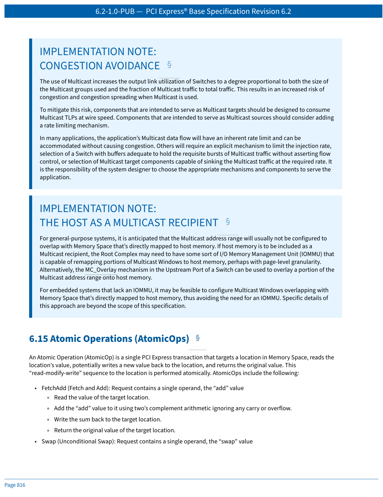

Atomic Operations (AtomicOps) provide hardware-supported atomic transaction types including FetchAdd (fetch and add), Swap (unconditional swap), and CAS (compare and swap). These operations are essential for efficient implementation of synchronization primitives, lock-free data structures, and parallel algorithms in multi-core and multi-device environments.

>
> 原子操作（AtomicOps）提供硬件支持的原子事务类型，包括 FetchAdd（读取并加）、Swap（无条件交换）和 CAS（比较并交换）。这些操作对于在多核和多设备环境中高效实现同步原语、无锁数据结构和并行算法至关重要。
>

AtomicOps are supported by Endpoints, Switches, and Root Complexes, with specific routing and Completer capabilities defined for each component type. The Root Complex may support AtomicOp Completer and Requester capabilities to enable system-level atomic operations.

>
> 端点、交换机和根复合体都支持 AtomicOps，每种组件类型都有特定的路由和完成者能力。根复合体可以支持 AtomicOp 完成者和请求者能力，以启用系统级原子操作。
>

---

### 6.16 Dynamic Power Allocation (DPA) / 动态功率分配（DPA）

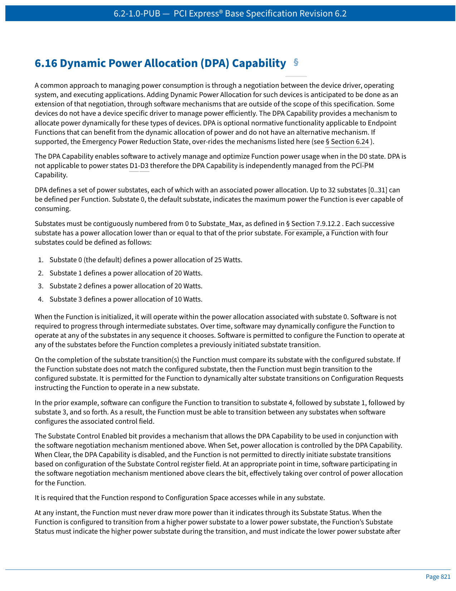

Dynamic Power Allocation (DPA) Capability allows a device to dynamically adjust its power consumption across different subsystems. DPA enables finer-grained power management by allowing power to be redistributed among a device's internal resources based on workload demands.

>
> 动态功率分配（DPA）能力允许设备动态调整其在不同子系统之间的功耗。DPA 通过允许根据工作负载需求在设备的内部资源之间重新分配功率，实现更细粒度的电源管理。
>

---

### 6.17 TLP Processing Hints (TPH) / TLP 处理提示（TPH）

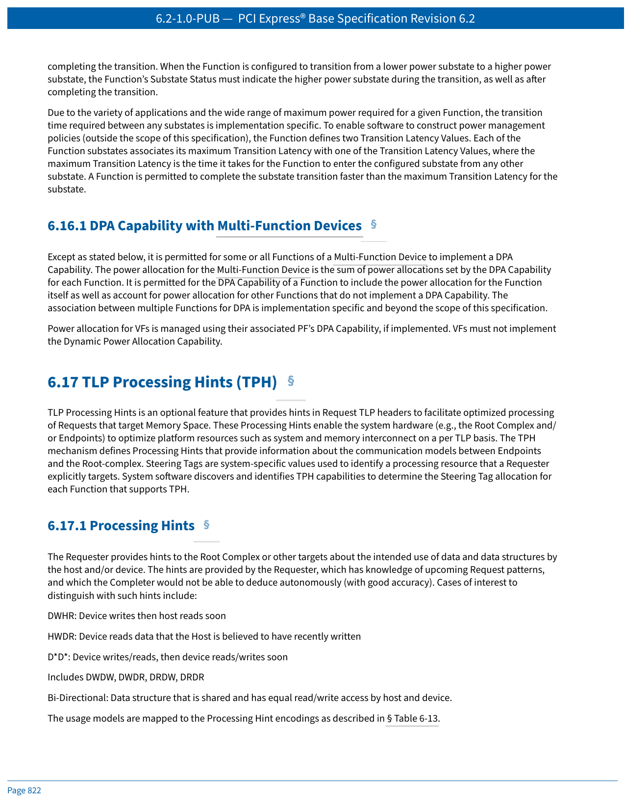

TLP Processing Hints (TPH) provide mechanisms for a Requester to convey caching and processing hints to the Completer and intermediate routing elements. Processing Hints indicate how the associated data should be cached or processed. Steering Tags direct data to specific processing resources. TPH improves system performance by enabling optimized cache utilization and data placement.

>
> TLP 处理提示（TPH）为请求者向完成者和中间路由元素传达缓存和处理提示提供机制。处理提示指示关联数据应如何缓存或处理。转向标签将数据定向到特定的处理资源。TPH 通过启用优化的缓存利用和数据放置来提升系统性能。
>

---

### 6.18 Latency Tolerance Reporting (LTR) / 延迟容忍报告（LTR）

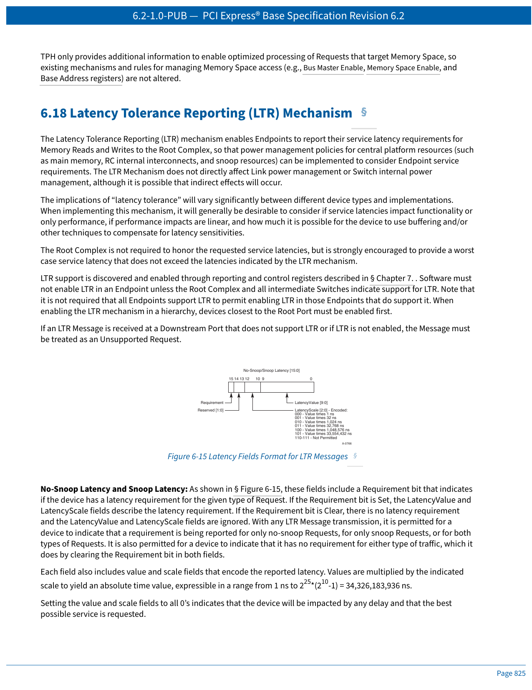

Latency Tolerance Reporting (LTR) enables Endpoints to report their latency tolerance to the Root Complex. This information allows the platform to optimize power management policies by determining how long an Endpoint can tolerate delays in service. LTR is critical for enabling aggressive platform power management without impacting device functionality.

>
> 延迟容忍报告（LTR）使端点能够向根复合体报告其延迟容忍度。此信息允许平台通过确定端点可以容忍多长的服务延迟来优化电源管理策略。LTR 对于在不影响设备功能的情况下实现激进的平台电源管理至关重要。
>

---

### 6.19 Optimized Buffer Flush/Fill (OBFF) / 优化缓冲刷新/填充（OBFF）

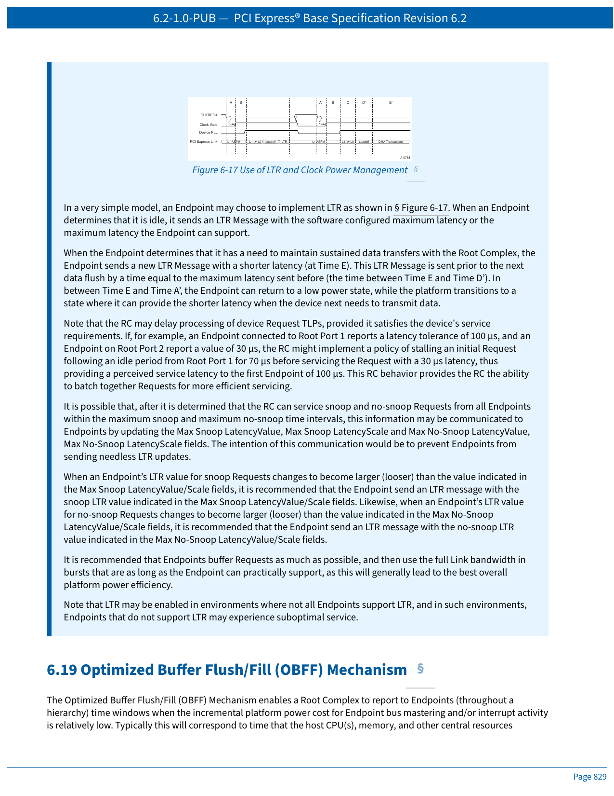

Optimized Buffer Flush/Fill (OBFF) provides a mechanism for the platform to inform Endpoints about optimal times for performing buffer flush and fill operations. This enables Endpoints to align their internal power management with platform-level power states, reducing overall system power consumption.

>
> 优化缓冲刷新/填充（OBFF）为平台向端点通知执行缓冲刷新和填充操作的最佳时机提供机制。这使端点能够将其内部电源管理与平台级电源状态对齐，从而降低整体系统功耗。
>

---

### 6.20 PASID / 进程地址空间 ID（PASID）

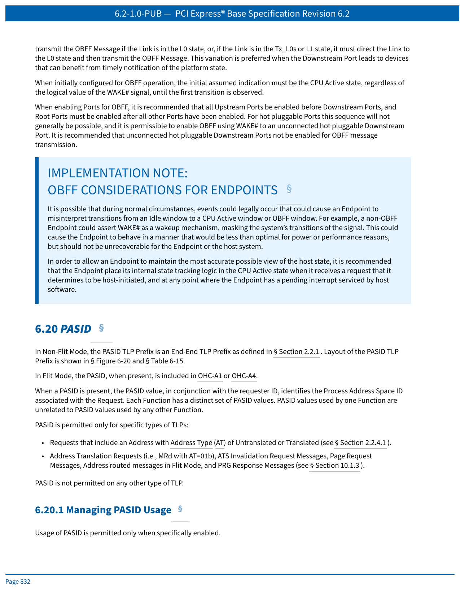

Process Address Space ID (PASID) is a mechanism that enables multiple process address spaces to be distinguished on a single device Function. PASID is carried in the PASID TLP Prefix (Non-Flit Mode) or OHC (Flit Mode) containing the Process Address Space ID value. This is essential for enabling Shared Virtual Memory (SVM) and efficient accelerator integration, allowing each process to have its own virtual address space on a shared device.

>
> 进程地址空间 ID（PASID）是一种机制，使多个进程地址空间能够在单个设备功能上被区分。PASID 携带在包含进程地址空间 ID 值的 PASID TLP 前缀（非 Flit 模式）或 OHC（Flit 模式）中。这对于启用共享虚拟内存（SVM）和高效的加速器集成至关重要，允许每个进程在共享设备上拥有自己的虚拟地址空间。
>

---

### 6.21 Precision Time Measurement (PTM) / 精确时间测量（PTM）

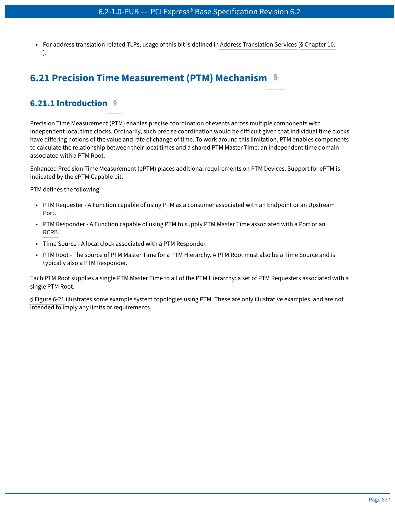

Precision Time Measurement (PTM) enables precise distribution of a master clock time across a PCI Express fabric. PTM defines the roles of PTM Requester, PTM Responder, and PTM Time Source (for Switches). This mechanism is critical for applications requiring tight timing coordination across multiple devices, such as audio/video synchronization, industrial control, and distributed data acquisition.

>
> 精确时间测量（PTM）能够在 PCI Express 结构中实现主时钟时间的精确分发。PTM 定义了 PTM 请求者、PTM 响应者和 PTM 时间源（用于交换机）的角色。此机制对于需要跨多个设备进行紧确定时协调的应用至关重要，例如音视频同步、工业控制和分布式数据采集。
>

---

### 6.22 Readiness Notifications (RN) / 就绪通知（RN）

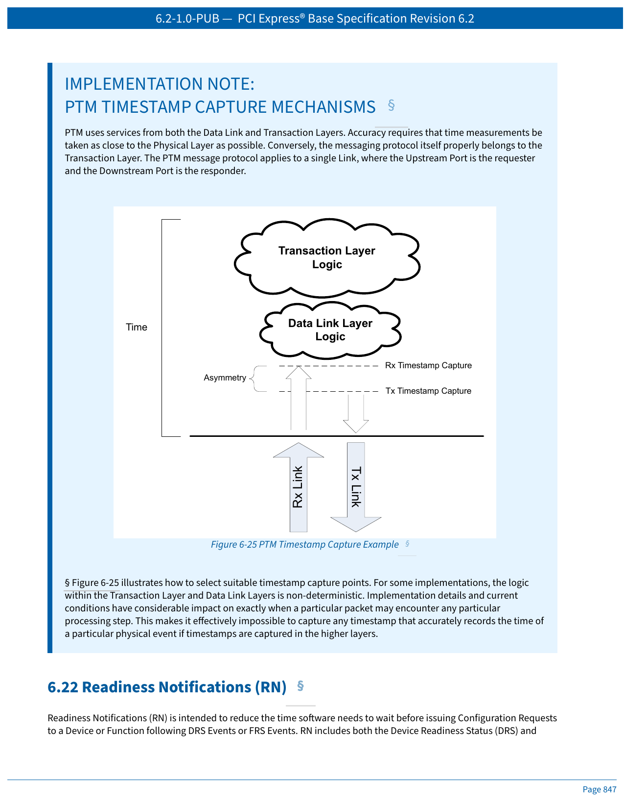

Readiness Notifications (RN) provide mechanisms for Functions to report their operational readiness to system software. This includes Device Readiness Status (DRS), Function Readiness Status (FRS), and FRS Queuing mechanisms. RN enables more efficient device initialization by allowing software to wait for device readiness without polling.

>
> 就绪通知（RN）为功能向系统软件报告其操作就绪状态提供机制。这包括设备就绪状态（DRS）、功能就绪状态（FRS）和 FRS 排队机制。RN 通过允许软件等待设备就绪而无需轮询，实现了更高效的设备初始化。
>

---

### 6.23 Enhanced Allocation / 增强分配

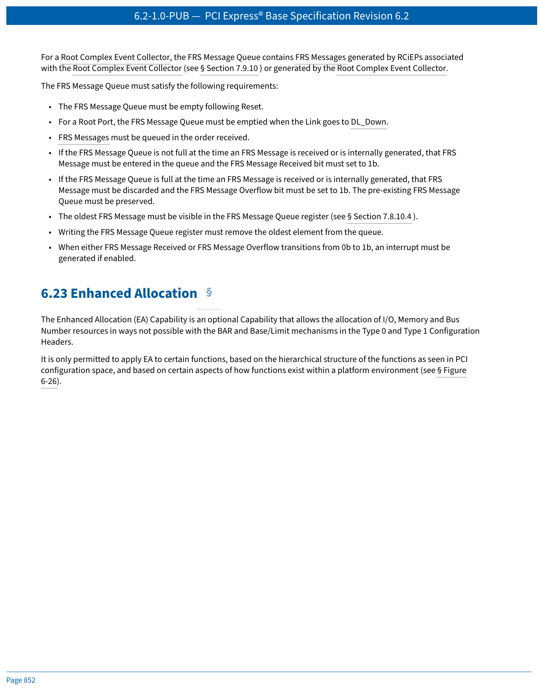

Enhanced Allocation provides mechanisms for devices to request specific types and locations of memory resources from system firmware. This enables devices to express their resource requirements more precisely, leading to more efficient system resource allocation and improved compatibility with platform constraints.

>
> 增强分配为设备向系统固件请求特定类型和位置的存储器资源提供机制。这使设备能够更精确地表达其资源需求，从而实现更高效的系统资源分配，并提高与平台约束的兼容性。
>

---

### 6.24 Emergency Power Reduction State / 紧急降功耗状态

Emergency Power Reduction State provides a mechanism for the platform to request that devices immediately reduce their power consumption to a minimal level. This is used in situations such as thermal emergencies or when backup power sources are engaged, allowing the system to maintain critical operations while reducing overall power draw.

>
> 紧急降功耗状态为平台请求设备立即将其功耗降低到最低水平提供机制。这在散热紧急情况或备用电源启用等情况下使用，允许系统在降低总体功耗的同时维持关键操作。
>

---

### 6.25 Hierarchy ID Message / 层次结构 ID 消息

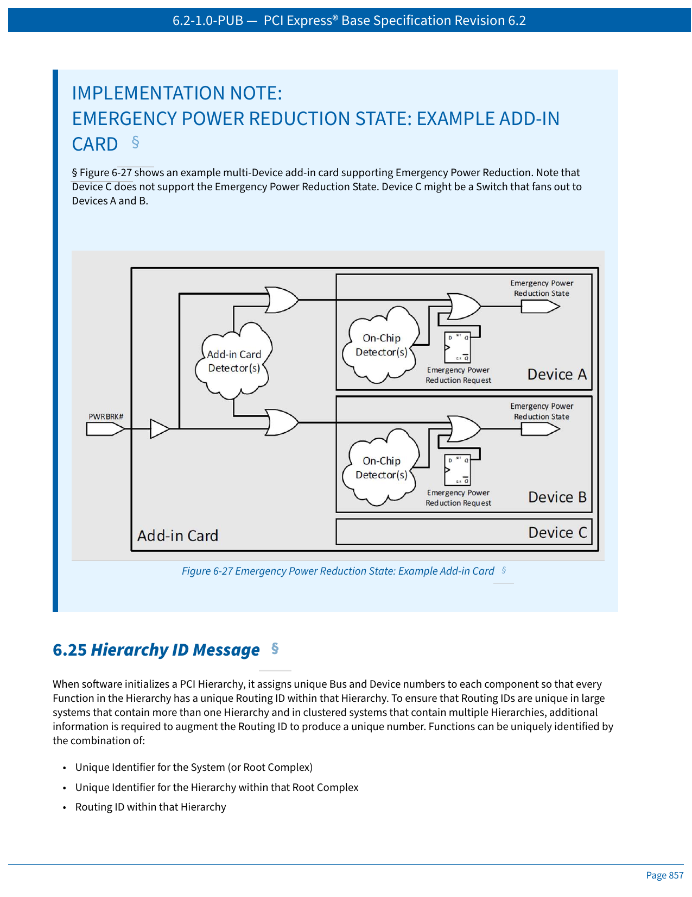

The Hierarchy ID Message provides a mechanism for components to discover and communicate their hierarchy domain identity. This message enables components within a PCI Express fabric to determine which hierarchy domain they belong to, which is important for proper routing and management in complex multi-hierarchy topologies.

>
> 层次结构 ID 消息为组件发现和传达其层次结构域身份提供了机制。此消息使 PCI Express 结构内的组件能够确定它们属于哪个层次结构域，这对于在复杂的多层次结构拓扑中进行正确的路由和管理非常重要。
>

---

> **[End of Chapter 6 / 第6章结束]**
>
> *Chapter 6: System Architecture — Complete Translation 第6章：系统架构 — 完整翻译*
>
> *Covering all 25 sections: 6.1 Interrupt and PME Support through 6.25 Hierarchy ID Message. 涵盖全部25个小节：从6.1中断与PME支持到6.25层次结构ID消息。*
