# Chapter 8: Electrical Sub-Block
# 第8章：电气子层

> 中英文对照翻译 | Chinese-English Parallel Translation
> Source: NCB-PCI Express Base Specification Revision 6.2 (2024-01-25), PDF Pages 1409–1522 (114 pages)
> 来源：PCI Express Base规范修订版6.2 (2024-01-25)，PDF页码：1409–1522（共114页）

---

## 快速导航 | Quick Navigation

- [8.1 Electrical Specification Introduction — 电气规范概述](#81-electrical-specification-introduction)
- [8.2 Interoperability Criteria — 互操作性准则](#82-interoperability-criteria)
  - [8.2.1 Data Rates — 数据速率](#821-data-rates)
  - [8.2.2 Refclk Architectures — 参考时钟架构](#822-refclk-architectures)
- [8.3 Transmitter Specification — 发送端规范](#83-transmitter-specification)
  - [8.3.1 Measurement Setup — 测量设置](#831-measurement-setup)
  - [8.3.2 Voltage Level Definitions — 电压电平定义](#832-voltage-level-definitions)
  - [8.3.3 Tx Voltage Parameters — 发送端电压参数](#833-tx-voltage-parameters)
  - [8.3.4 Transmitter Margining — 发送端裕量](#834-transmitter-margining)
  - [8.3.5 Tx Jitter Parameters — 发送端抖动参数](#835-tx-jitter-parameters)
  - [8.3.6 Data Rate Dependent Parameters — 数据速率相关参数](#836-data-rate-dependent-parameters)
  - [8.3.7 Tx and Rx Return Loss — 发送和接收回波损耗](#837-tx-and-rx-return-loss)
  - [8.3.8 Tx and Rx Return Loss for 64.0 GT/s — 64.0 GT/s回波损耗](#838-tx-and-rx-return-loss-for-640-gts)
  - [8.3.9 Transmitter PLL Bandwidth and Peaking — 发送端PLL带宽和峰值](#839-transmitter-pll-bandwidth-and-peaking)
  - [8.3.10 Data Rate Independent Tx Parameters — 数据速率无关参数](#8310-data-rate-independent-tx-parameters)
- [8.4 Receiver Specifications — 接收端规范](#84-receiver-specifications)
  - [8.4.1 Receiver Stressed Eye Specification — 接收端压力眼图规范](#841-receiver-stressed-eye-specification)
- [8.5 Channel Tolerancing — 通道容差](#85-channel-tolerancing)
  - [8.5.1 Channel Compliance Testing — 通道合规测试](#851-channel-compliance-testing)
- [8.6 Refclk Specifications — 参考时钟规范](#86-refclk-specifications)
  - [8.6.1 Refclk Test Setup — 参考时钟测试设置](#861-refclk-test-setup)
  - [8.6.2 REFCLK AC Specifications — 参考时钟AC规范](#862-refclk-ac-specifications)
  - [8.6.3 Data Rate Independent Refclk Parameters — 数据速率无关参考时钟参数](#863-data-rate-independent-refclk-parameters)
  - [8.6.4 Refclk Architectures Supported — 支持的参考时钟架构](#864-refclk-architectures-supported)
  - [8.6.5 Filtering Functions — 滤波函数](#865-filtering-functions)
  - [8.6.6 Common Refclk Rx Architecture — 公共参考时钟接收架构](#866-common-refclk-rx-architecture)
  - [8.6.7 Jitter Limits for Refclk Architectures — 参考时钟架构的抖动限制](#867-jitter-limits-for-refclk-architectures)
  - [8.6.8 Form Factor Requirements — 形态规格要求](#868-form-factor-requirements)
- [术语附录 | Terminology Appendix](#术语附录-terminology-appendix)

---

## 8.1 Electrical Specification Introduction
## 8.1 电气规范概述

Key attributes of the Electrical Specification include:
- Support for NRZ signaling at 2.5, 5.0, 8.0, 16.0, 32.0 GT/s, and PAM4 signaling at 64.0 GT/s data rates
- Support for common and separate independent reference clock architectures
- Support for Spread Spectrum clocking
- Reduced swing mode for lower power Link operation
- In-band receiver detection and electrical idle detection
- Channel compliance methodology
- Adaptive transmitter equalization and reference receiver equalization allowing closed eye channel support at 8.0, 16.0, 32.0 GT/s, and 64.0 GT/s
- Lane margining
- AC coupled channel

> 电气规范的关键属性包括：
> - 支持2.5、5.0、8.0、16.0、32.0 GT/s的NRZ信令和64.0 GT/s的PAM4信令数据速率
> - 支持公共和分离独立参考时钟架构
> - 支持扩频时钟
> - 用于低功耗链路操作的降摆幅模式
> - 带内接收器检测和电气空闲检测
> - 通道合规方法论
> - 自适应发送端均衡和参考接收端均衡，支持8.0、16.0、32.0 GT/s和64.0 GT/s的闭眼通道
> - Lane裕量化（Lane Margining）
> - AC耦合通道

Please note that throughout this specification, the term GT/s is used to refer to the number of encoded bits transferred in a second on a direction of a lane. In PAM4 signaling, two bits are encoded in one UI with four voltage levels (§ Section 4.2.3.1.1). Consequently, the Nyquist frequency is 16 GHz for both 32.0 GT/s NRZ and 64.0 GT/s PAM4.

> 请注意，在本规范全文中，术语GT/s用于指代沿一个通道方向每秒传输的编码比特数。在PAM4信令中，一个UI内用四个电压电平编码两个比特（参见第4.2.3.1.1节）。因此，32.0 GT/s NRZ和64.0 GT/s PAM4的奈奎斯特频率均为16 GHz。

Because of four voltage levels and reduced amplitude for each voltage level, 64.0 GT/s PAM4 signaling is sensitive to noise and burst errors. The Bit Error Rate (BER), also referred as First Bit Error Rate (FBER) in § Chapter 4 for 64.0 GT/s is 10⁻⁶. FBER refers to Bit Error Rate without accounting for any burst error. For 2.5, 5.0, 8.0, 16.0, and 32.0 GT/s data rates, BER of 10⁻¹² implicitly assumes FBER of 10⁻¹² and does not account for any types of burst error.

> 由于有四个电压电平且每个电压电平的幅度减小，64.0 GT/s PAM4信令对噪声和突发错误敏感。64.0 GT/s的误比特率（BER），在第4章中也称为首次误比特率（FBER），为10⁻⁶。FBER指不考虑任何突发错误的误比特率。对于2.5、5.0、8.0、16.0和32.0 GT/s的数据速率，10⁻¹²的BER隐含着10⁻¹²的FBER，且未考虑任何类型的突发错误。

The 6.0 version of the PCI Express Electrical Specification is organized into separate sections for the Transmitter, Receiver, the Channel, and the Refclk. In this version most parameters have been regularized such that a common set of parameters is used to define compliance at all data rates.

> PCIe 6.0版本的电气规范按发送端（Transmitter）、接收端（Receiver）、通道（Channel）和参考时钟（Refclk）分别组织。在本版本中，大多数参数已规范化，使得所有数据速率均使用一组公共参数来定义合规性。

---

## 8.2 Interoperability Criteria
## 8.2 互操作性准则

### 8.2.1 Data Rates
### 8.2.1 数据速率

A device must support 2.5 GT/s and is not permitted to skip support for any data rates between 2.5 GT/s and the highest supported rate.

> 设备必须支持2.5 GT/s，且不允许跳过2.5 GT/s至其最高支持速率之间的任何数据速率。

### 8.2.2 Refclk Architectures
### 8.2.2 参考时钟架构

PCIe supports two Refclk data architectures: Common Refclk, and Independent Refclk. These are described in detail in § Section 8.6. A PCIe device may support one or more of these architectures.

> PCIe支持两种参考时钟架构：公共参考时钟（Common Refclk）和独立参考时钟（Independent Refclk）。它们的详细描述参见第8.6节。PCIe设备可支持其中一种或多种架构。

---

## 8.3 Transmitter Specification
## 8.3 发送端规范

### 8.3.1 Measurement Setup for Characterizing Transmitters
### 8.3.1 用于表征发送端的测量设置

The PCI Express electrical specification references all measurements to the device's pin. However, the pin of a device under test (DUT) is not generally accessible, and the closest accessible point is usually a pair of microwave-type coaxial connectors separated from the DUT pins by several inches of PCB trace, called the breakout channel on a silicon test board. On a test board with many Lanes the minimum breakout channel length is constrained by the need to route to many coaxial connectors. Typically, this limitation holds true for both the Tx and the Rx pins. Figure 8-1 illustrates a typical test connection to a DUT, showing a single Tx Lane breakout.

A low jitter Refclk source is used when the silicon supports using an external reference clock in order that the jitter measurements for the DUT include only contributions from the Transmitter.

When testing a Transmitter it is desirable to have as many other PCI Express Lanes sending or receiving the compliance pattern as is feasible. Similarly, if the device supports other I/O it should also be sending or receiving on these interfaces. The goal is to have the Tx test environment replicate that found in a real system as closely as possible.

> PCIe电气规范将所有测量引用至器件的引脚。然而，被测器件（DUT）的引脚通常不可直接触及，最接近的可触及点通常是一对微波型同轴连接器，它们通过数英寸的PCB走线（被称为硅测试板上的引出通道，breakout channel）与DUT引脚分离。在多Lane的测试板上，最小引出通道长度受限于布设到众多同轴连接器的需求。通常，这一限制对Tx和Rx引脚均适用。图8-1展示了典型的DUT测试连接，图中显示了一条单一的Tx Lane引出。
>
> 当硅芯片支持使用外部参考时钟时，应使用低抖动参考时钟源，以确保DUT的抖动测量仅包含来自发送端的贡献。
>
> 测试发送端时，应尽可能让尽可能多的其他PCIe Lane发送或接收合规性码型。同样，如果设备支持其他I/O，也应在其上进行发送或接收。目标是在Tx测试环境中尽可能接近真实系统的实际情况。

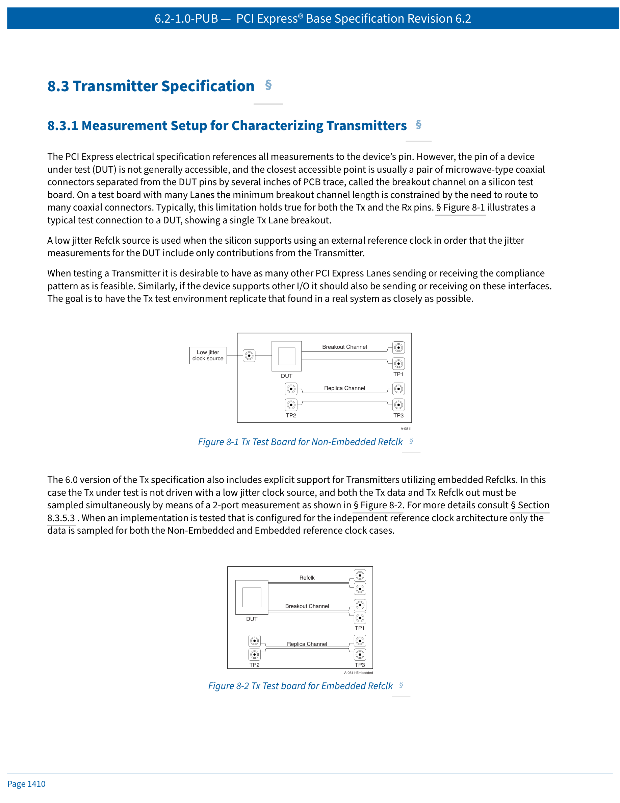
 <em>Figure 8-1: Tx Test Board for Non-Embedded Refclk / 图8-1：非嵌入式参考时钟Tx测试板</em>

The 6.0 version of the Tx specification also includes explicit support for Transmitters utilizing embedded Refclks. In this case the Tx under test is not driven with a low jitter clock source, and both the Tx data and Tx Refclk out must be sampled simultaneously by means of a 2-port measurement as shown in Figure 8-2. For more details consult § Section 8.3.5.3. When an implementation is tested that is configured for the independent reference clock architecture only the data is sampled for both the Non-Embedded and Embedded reference clock cases.

> Tx规范6.0版本还明确支持使用嵌入式参考时钟的发送端。在这种情况下，被测Tx不使用低抖动时钟源驱动，Tx数据和Tx Refclk输出必须通过双端口测量同时采样，如图8-2所示。更多详细信息请参见第8.3.5.3节。当测试配置为独立参考时钟架构的实现时，对于非嵌入式和嵌入式参考时钟两种情况，均仅对数据进行采样。

 <em>Figure 8-2: Tx Test Board for Embedded Refclk / 图8-2：嵌入式参考时钟Tx测试板</em>

#### 8.3.1.1 Breakout and Replica Channels
#### 8.3.1.1 引出通道与复制通道

In order to specify a Transmitter with a uniform set of Tx parameters it is necessary to establish a one-to-one correspondence between what is measurable at TP1 and the corresponding Tx voltage or jitter at the pin. This may be achieved by means of a breakout channel and a replica channel. The replica channel reproduces the electrical characteristics of the breakout channel as closely as possible, matching its length, layer transitions, etc., making it possible to de-embed Tx measurements to the pin of the DUT. All voltage parameters are de-embedded to the pins unless otherwise specified.

> 为用一组统一的Tx参数来规定发送端，有必要在TP1处可测量的值与引脚上相应的Tx电压或抖动之间建立一一对应关系。这可通过引出通道和复制通道来实现。复制通道尽可能精确地复现引出通道的电气特性（匹配其长度、层转换等），使得Tx测量能够去嵌入到DUT引脚。除非另有规定，所有电压参数均去嵌入到引脚。

While the specification does not define precise electrical characteristics for the replica and breakout channels, it is advisable to adhere to the following guidelines:
- Breakout channels should be the same length for each Lane and routed on as few layers as possible, thereby reducing the number of replica channels that need to be built and measured.
- Each routing layer on a test board should have a separate breakout channel where the via and pad structures of the breakout and replica channels on respective layers match as closely as possible.
- Breakout and replica channels should be designed to have an insertion loss of less than 2 dB at the Nyquist frequency (4 dB at Nyquist if the maximum signaling rate is 16.0 GT/s, 32.0 GT/s, and 64.0 GT/s) and a return loss of greater than 15 dB to Nyquist, which may require use of low loss dielectric, wide signal traces and back-drilling of break-out vias or use of micro-via technology.
- The impedance targets for the breakout channel are 100Ω differential and 50Ω single-ended. For best accuracy the actual breakout channel impedance should be within ±5% of these values.

> 虽然本规范未为复制通道和引出通道定义精确的电气特性，但建议遵守以下指导原则：
> - 每个Lane的引出通道长度应相同，并布设在尽可能少的层上，从而减少需要构建和测量的复制通道数量。
> - 测试板上每个布线层应有独立的引出通道，各层上引出通道和复制通道的过孔和焊盘结构应尽可能匹配。
> - 引出通道和复制通道应设计为在奈奎斯特频率处插入损耗低于2 dB（若最高信号速率为16.0 GT/s、32.0 GT/s和64.0 GT/s，则奈奎斯特频率处为4 dB），且在奈奎斯特频率范围内回波损耗大于15 dB，这可能需要使用低损耗介质、宽信号走线以及引出过孔的反钻或微过孔技术。
> - 引出通道的阻抗目标值为100Ω差模和50Ω单端。为获得最佳精度，实际引出通道阻抗应在这些值的±5%以内。

### 8.3.2 Voltage Level Definitions
### 8.3.2 电压电平定义

A differential voltage is defined by taking the voltage difference between two conductors. In this specification, a differential signal or differential pair is comprised of a voltage on a positive conductor, VD+, and a negative conductor, VD-. The differential voltage (VDIFF) is defined as the difference of the positive conductor voltage and the negative conductor voltage (VDIFF = VD+ - VD-). The Common Mode Voltage (VCM) is defined as the average or mean voltage present on the same differential pair (VCM = [VD+ + VD-]/2).

> 差分电压通过取两个导体之间的电压差来定义。在本规范中，差分信号或差分对由正导体上的电压VD+和负导体上的电压VD-组成。差分电压（VDIFF）定义为正导体电压与负导体电压之差（VDIFF = VD+ - VD-）。共模电压（VCM）定义为同一差分对上存在的平均电压（VCM = [VD+ + VD-]/2）。

This document's electrical specifications often refer to common mode peak-to-peak measurements or peak measurements, which are defined by the following equations.

VDIFFp-p = (2 × max|VD+ - VD-|)  (This applies to a symmetric differential swing)

VTX-AC-CM-PP = max(VD+ + VD-)/2 - min(VD+ + VD-)/2

Equation 8-1: VDIFFp-p | 方程式8-1：VDIFFp-p

Equation 8-2: VTX-AC-CM-PP | 方程式8-2：VTX-AC-CM-PP

> 本文档的电气规范经常引用共模峰峰值测量或峰值测量，其定义如下所示。
>
> VDIFFp-p = (2 × max| VD+ - VD-|) （适用于对称差分摆幅）
>
> VTX-AC-CM-PP = max(VD+ + VD-)/2 - min(VD+ + VD-)/2

Note: The maximum value is calculated on a per unit interval evaluation with unit interval boundaries determined by the behavioral CDR. The maximum function as described is implicit for all peak-to-peak and peak common mode equations throughout the rest of this chapter.

In this section, DC is defined as all frequency components below FDC = 30 kHz. AC is defined as all frequency components at or above FDC = 30 kHz. These definitions pertain to all voltage and current specifications.

> 注：最大值是在每单位区间（UI）评估的基础上计算的，单位区间边界由行为CDR确定。上述最大值函数隐含适用于本章其余部分的所有峰峰值和峰值共模方程。
>
> 在本节中，DC定义为所有低于FDC = 30 kHz的频率分量。AC定义为所有等于或高于FDC = 30 kHz的频率分量。这些定义适用于所有电压和电流规范。

An example waveform is shown in Figure 8-3. In this waveform the differential voltage (defined as D+ - D-) is approximately 800 mVPP, and the single-ended voltage for both D+ and D- is approximately 400 mVPP for each. Note that while the center crossing point for both D+ and D- is nominally at 200 mV, the corresponding crossover point for the differential voltage is at 0.0 V.

> 图8-3展示了一个示例波形。在这个波形中，差分电压（定义为D+ - D-）约为800 mVPP，而D+和D-的单端电压各约为400 mVPP。注意，虽然D+和D-的中心交叉点标称为200 mV，但对应的差分电压交叉点位于0.0 V。

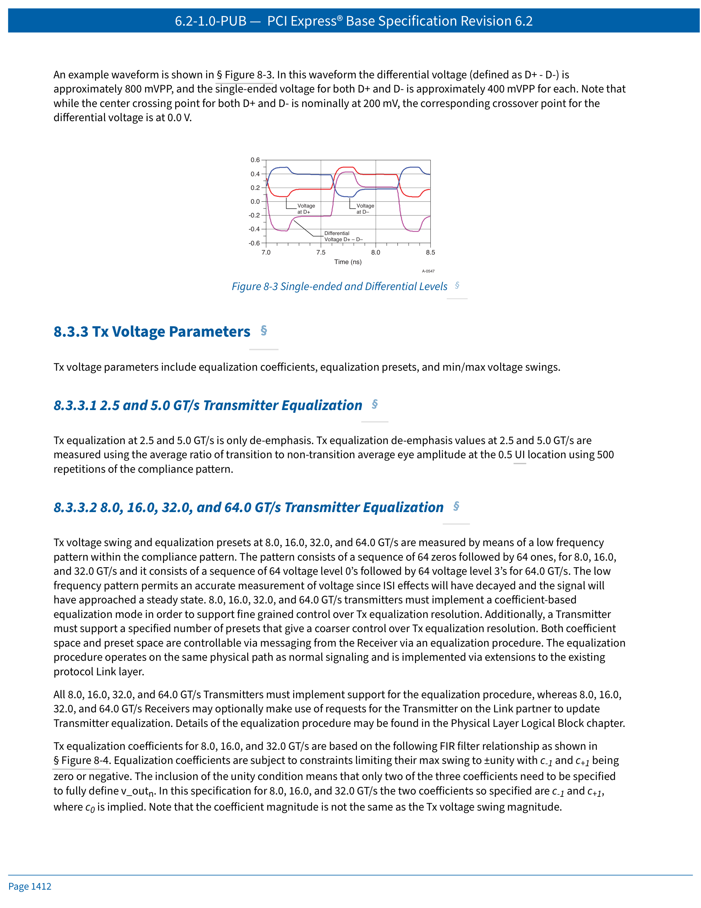
 <em>Figure 8-3: Single-ended and Differential Levels / 图8-3：单端与差分电平</em>

### 8.3.3 Tx Voltage Parameters
### 8.3.3 发送端电压参数

Tx voltage parameters include equalization coefficients, equalization presets, and min/max voltage swings.

> Tx电压参数包括均衡系数、均衡预设值以及最小/最大电压摆幅。

#### 8.3.3.1 2.5 and 5.0 GT/s Transmitter Equalization
#### 8.3.3.1 2.5和5.0 GT/s发送端均衡

Tx equalization at 2.5 and 5.0 GT/s is only de-emphasis. Tx equalization de-emphasis values at 2.5 and 5.0 GT/s are measured using the average ratio of transition to non-transition average eye amplitude at the 0.5 UI location using 500 repetitions of the compliance pattern.

> 2.5和5.0 GT/s下的Tx均衡仅为去加重。2.5和5.0 GT/s下的Tx均衡去加重值，通过使用500次合规码型重复，在0.5 UI位置处测量跳变与非跳变平均眼图幅度的平均比值得出。

#### 8.3.3.2 8.0, 16.0, 32.0, and 64.0 GT/s Transmitter Equalization
#### 8.3.3.2 8.0、16.0、32.0和64.0 GT/s发送端均衡

Tx voltage swing and equalization presets at 8.0, 16.0, 32.0, and 64.0 GT/s are measured by means of a low frequency pattern within the compliance pattern. The pattern consists of a sequence of 64 zeros followed by 64 ones for 8.0, 16.0, and 32.0 GT/s, and a sequence of 64 voltage level 0's followed by 64 voltage level 3's for 64.0 GT/s. The low frequency pattern permits an accurate measurement of voltage since ISI effects will have decayed and the signal will have approached a steady state.

> 8.0、16.0、32.0和64.0 GT/s下的Tx电压摆幅和均衡预设值，通过合规码型中的低频码型来测量。对于8.0、16.0和32.0 GT/s，该码型由64个连续的0后跟64个连续的1组成；对于64.0 GT/s，则由64个电压电平0后跟64个电压电平3组成。低频码型允许精确测量电压，因为ISI效应将已衰减且信号将趋近于稳态。

8.0, 16.0, 32.0, and 64.0 GT/s transmitters must implement a coefficient-based equalization mode in order to support fine grained control over Tx equalization resolution. Additionally, a Transmitter must support a specified number of presets that give a coarser control over Tx equalization resolution. Both coefficient space and preset space are controllable via messaging from the Receiver via an equalization procedure. The equalization procedure operates on the same physical path as normal signaling and is implemented via extensions to the existing protocol Link layer.

> 8.0、16.0、32.0和64.0 GT/s发送端必须实现基于系数的均衡模式，以支持对Tx均衡分辨率的细粒度控制。此外，发送端必须支持指定数量的预设值，以提供对Tx均衡分辨率较粗粒度的控制。系数空间和预设空间均可通过接收端经由均衡过程的消息来控制。均衡过程在与正常信令相同的物理路径上运行，并通过现有协议链路层的扩展来实现。

All 8.0, 16.0, 32.0, and 64.0 GT/s Transmitters must implement support for the equalization procedure, whereas 8.0, 16.0, 32.0, and 64.0 GT/s Receivers may optionally make use of requests for the Transmitter on the Link partner to update Transmitter equalization. Details of the equalization procedure may be found in the Physical Layer Logical Block chapter.

> 所有8.0、16.0、32.0和64.0 GT/s发送端必须支持均衡过程，而8.0、16.0、32.0和64.0 GT/s接收端可选择性地使用对链路伙伴发送端的请求来更新发送端均衡。均衡过程的详细内容见物理层逻辑子层章节。

Tx equalization coefficients for 8.0, 16.0, and 32.0 GT/s are based on the following FIR filter relationship as shown in Figure 8-4. Equalization coefficients are subject to constraints limiting their max swing to ±unity with c-1 and c+1 being zero or negative. The inclusion of the unity condition means that only two of the three coefficients need to be specified to fully define v_outn.

> 8.0、16.0和32.0 GT/s的Tx均衡系数基于图8-4所示的FIR滤波器关系。均衡系数受限于将其最大摆幅限制在±unity以内，其中c-1和c+1为零或负值。纳入unity条件意味着仅需指定三个系数中的两个即可完全定义v_outn。

Tx equalization coefficients for 64.0 GT/s are based on the FIR filter relationship as shown in Figure 8-5. Equalization coefficients are subject to constraints limiting their max swing to ±unity with c-2 being zero or positive, c-1 and c+1 being zero or negative.

> 64.0 GT/s的Tx均衡系数基于图8-5所示的FIR滤波器关系。均衡系数受限于将其最大摆幅限制在±unity以内，其中c-2为零或正值，c-1和c+1为零或负值。

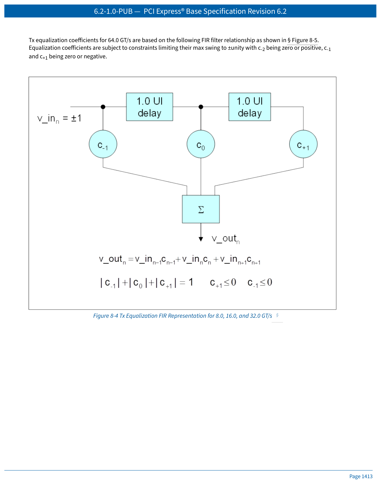
 <em>Figure 8-4: Tx Equalization FIR Representation for 8.0, 16.0, and 32.0 GT/s / 图8-4：8.0、16.0、32.0 GT/s Tx均衡FIR表示</em>

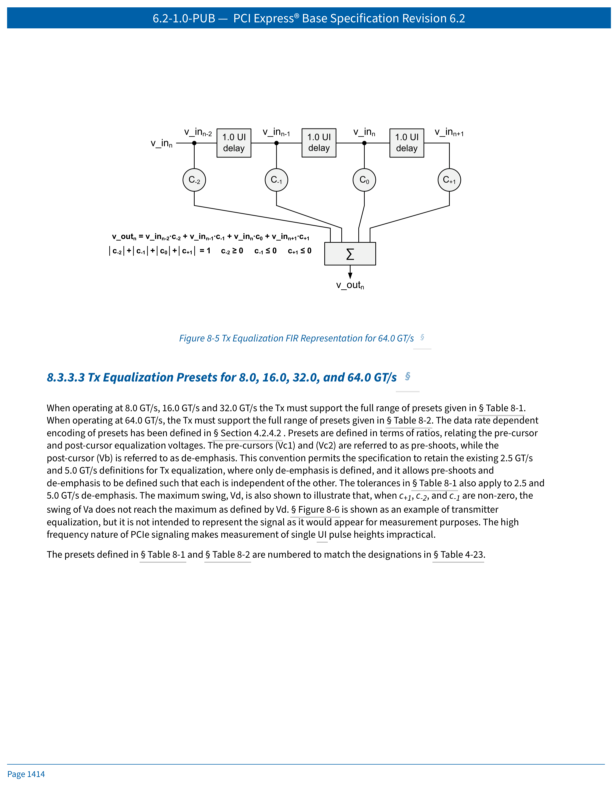
 <em>Figure 8-5: Tx Equalization FIR Representation for 64.0 GT/s / 图8-5：64.0 GT/s Tx均衡FIR表示</em>

#### 8.3.3.3 Tx Equalization Presets for 8.0, 16.0, 32.0, and 64.0 GT/s
#### 8.3.3.3 8.0、16.0、32.0和64.0 GT/s的Tx均衡预设值

When operating at 8.0 GT/s, 16.0 GT/s and 32.0 GT/s the Tx must support the full range of presets given in Table 8-1. When operating at 64.0 GT/s, the Tx must support the full range of presets given in Table 8-2. The data rate dependent encoding of presets has been defined in § Section 4.2.4.2.

> 在8.0 GT/s、16.0 GT/s和32.0 GT/s速率下运行时，Tx必须支持表8-1中给出的全部预设值。在64.0 GT/s速率下运行时，Tx必须支持表8-2中给出的全部预设值。预设值的数据速率相关编码已在第4.2.4.2节中定义。

Presets are defined in terms of ratios, relating the pre-cursor and post-cursor equalization voltages. The pre-cursors (Vc1) and (Vc2) are referred to as pre-shoots, while the post-cursor (Vb) is referred to as de-emphasis. This convention permits the specification to retain the existing 2.5 GT/s and 5.0 GT/s definitions for Tx equalization, where only de-emphasis is defined, and it allows pre-shoots and de-emphasis to be defined such that each is independent of the other.

> 预设值以比率形式定义，关联前标（pre-cursor）和后标（post-cursor）均衡电压。前标（Vc1和Vc2）被称为预加重（pre-shoot），而后标（Vb）被称为去加重（de-emphasis）。这种约定使规范能够保留现有的2.5 GT/s和5.0 GT/s Tx均衡定义（其中仅定义了去加重），并允许预加重和去加重各自独立定义。

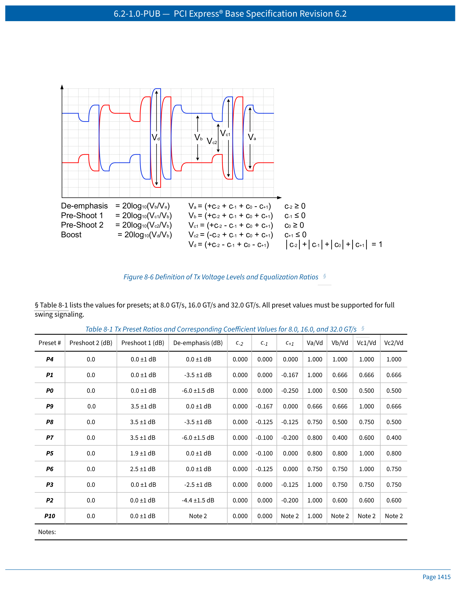
 <em>Figure 8-6: Definition of Tx Voltage Levels and Equalization Ratios / 图8-6：Tx电压电平和均衡比率定义</em>

Table 8-1 lists the values for presets at 8.0 GT/s, 16.0 GT/s and 32.0 GT/s. All preset values must be supported for full swing signaling.

**Table 8-1: Tx Preset Ratios and Corresponding Coefficient Values for 8.0, 16.0, and 32.0 GT/s | 表8-1：8.0、16.0和32.0 GT/s的Tx预设比率及对应系数值**

| Preset # | Preshoot 2 (dB) | Preshoot 1 (dB) | De-emphasis (dB) | c-2 | c-1 | c+1 | Va/Vd | Vb/Vd | Vc1/Vd | Vc2/Vd |
|----------|-----------------|-----------------|-------------------|-----|------|------|--------|--------|---------|---------|
| P4 | 0.0 | 0.0 ±1 dB | 0.0 ±1 dB | 0.000 | 0.000 | 0.000 | 1.000 | 1.000 | 1.000 | 1.000 |
| P1 | 0.0 | 0.0 ±1 dB | -3.5 ±1 dB | 0.000 | 0.000 | -0.167 | 1.000 | 0.666 | 0.666 | 0.666 |
| P0 | 0.0 | 0.0 ±1 dB | -6.0 ±1.5 dB | 0.000 | 0.000 | -0.250 | 1.000 | 0.500 | 0.500 | 0.500 |
| P9 | 0.0 | 3.5 ±1 dB | 0.0 ±1 dB | 0.000 | -0.167 | 0.000 | 0.666 | 0.666 | 1.000 | 0.666 |
| P8 | 0.0 | 3.5 ±1 dB | -3.5 ±1 dB | 0.000 | -0.125 | -0.125 | 0.750 | 0.500 | 0.750 | 0.500 |
| P7 | 0.0 | 3.5 ±1 dB | -6.0 ±1.5 dB | 0.000 | -0.100 | -0.200 | 0.800 | 0.400 | 0.600 | 0.400 |
| P5 | 0.0 | 1.9 ±1 dB | 0.0 ±1 dB | 0.000 | -0.100 | 0.000 | 0.800 | 0.800 | 1.000 | 0.800 |
| P6 | 0.0 | 2.5 ±1 dB | 0.0 ±1 dB | 0.000 | -0.125 | 0.000 | 0.750 | 0.750 | 1.000 | 0.750 |
| P3 | 0.0 | 0.0 ±1 dB | -2.5 ±1 dB | 0.000 | 0.000 | -0.125 | 1.000 | 0.750 | 0.750 | 0.750 |
| P2 | 0.0 | 0.0 ±1 dB | -4.4 ±1.5 dB | 0.000 | 0.000 | -0.200 | 1.000 | 0.600 | 0.600 | 0.600 |
| P10 | 0.0 | 0.0 ±1 dB | Note 2 | 0.000 | 0.000 | Note 2 | 1.000 | Note 2 | Note 2 | Note 2 |

Notes:
1. Reduced swing signaling must implement presets P4, P1, P9, P5, P6, and P3. Full swing signaling must implement all the above presets.
2. P10 boost limits are not fixed, since its de-emphasis level is a function of the LF level that the Tx advertises during training (see § Section 4.2.4.1). P10 is used for testing the boost limit of Transmitter at full swing. P1 is used for testing the boost limit of Transmitter at reduced swing.

> 注：
> 1. 降摆幅信令必须实现预设值P4、P1、P9、P5、P6和P3。全摆幅信令必须实现上述所有预设值。
> 2. P10的boost限制不是固定的，因为其去加重量水平取决于Tx在训练期间公布的LF水平（参见第4.2.4.1节）。P10用于在全摆幅下测试发送端的boost限制。P1用于在降摆幅下测试发送端的boost限制。

Table 8-2 lists the values for presets at 64.0 GT/s. All preset values must be supported for full swing signaling.

**Table 8-2: Tx Preset Ratios and Corresponding Coefficient Values for 64.0 GT/s | 表8-2：64.0 GT/s的Tx预设比率及对应系数值**

| Preset # | Preshoot 2 (dB) | Preshoot 1 (dB) | De-emphasis (dB) | c-2 | c-1 | c+1 | Va/Vd | Vb/Vd | Vc1/Vd | Vc2/Vd |
|----------|-----------------|-----------------|-------------------|------|------|------|--------|--------|---------|---------|
| Q0 | 0.0 ±0.5 dB | 0.0 ±0.5 dB | 0.0 ±0.5 dB | 0.000 | 0.000 | 0.000 | 1.000 | 1.000 | 1.000 | 1.000 |
| Q1 | 0.0 ±0.5 dB | 1.6 ±0.5 dB | 0.0 ±0.5 dB | 0.000 | -0.083 | 0.000 | 0.834 | 0.834 | 1.000 | 0.834 |
| Q2 | 0.0 ±0.5 dB | 3.5 ±0.5 dB | 0.0 ±0.5 dB | 0.000 | -0.167 | 0.000 | 0.666 | 0.666 | 1.000 | 0.666 |
| Q3 | 0.0 ±0.5 dB | 0.0 ±0.5 dB | -1.6 ±0.5 dB | 0.000 | 0.000 | -0.083 | 1.000 | 0.834 | 0.834 | 0.834 |
| Q4 | 0.0 ±0.5 dB | 0.0 ±0.5 dB | -3.5 ±0.5 dB | 0.000 | 0.000 | -0.167 | 1.000 | 0.666 | 0.666 | 0.666 |
| Q5 | -1.3 ±0.5 dB | 4.7 ±1.0 dB | 0.0 ±0.5 dB | 0.042 | -0.208 | 0.000 | 0.584 | 0.584 | 1.000 | 0.500 |
| Q6 | -1.6 ±0.5 dB | 3.5 ±0.5 dB | -3.5 ±0.5 dB | 0.042 | -0.125 | -0.125 | 0.750 | 0.500 | 0.750 | 0.416 |
| Q7 | -2.9 ±0.5 dB | 4.7 ±1.0 dB | 0.0 ±0.5 dB | 0.083 | -0.208 | 0.000 | 0.584 | 0.584 | 1.000 | 0.418 |
| Q8 | -3.5 ±0.5 dB | 6.0 ±1.0 dB | 0.0 ±0.5 dB | 0.083 | -0.250 | 0.000 | 0.500 | 0.500 | 1.000 | 0.334 |
| Q9 | -4.4 ±1.0 dB | 6.9 ±1.0 dB | -1.6 ±0.5 dB | 0.083 | -0.250 | -0.042 | 0.500 | 0.416 | 0.916 | 0.250 |
| Q10 | 0.0 ±0.5 dB | 0.0 ±0.5 dB | Note 2 | 0.000 | 0.000 | Note 2 | 1.000 | Note 2 | Note 2 | Note 2 |

Notes:
1. Reduced swing signaling must implement presets Q0, Q1, Q2, Q3, and Q4. Full swing signaling must implement all the above presets.
2. Q10 boost limits are not fixed, since its de-emphasis level is a function of the LF level that the Tx advertises during training. Q10 is used for testing the boost limit of Transmitter at full swing. Q4 is used for testing the boost limit of Transmitter at reduced swing.

> 注：
> 1. 降摆幅信令必须实现预设值Q0、Q1、Q2、Q3和Q4。全摆幅信令必须实现上述所有预设值。
> 2. Q10的boost限制不是固定的，因为其去加重量水平取决于Tx在训练期间公布的LF水平。Q10用于在全摆幅下测试发送端的boost限制。Q4用于在降摆幅下测试发送端的boost限制。

#### 8.3.3.4 Measuring Tx Equalization for 2.5 GT/s and 5.0 GT/s
#### 8.3.3.4 2.5和5.0 GT/s Tx均衡测量

Tx equalization de-emphasis values at 2.5 and 5.0 GT/s are measured using the average ratio of transition to non-transition eye heights at the 0.5 UI location using 500 repetitions of the compliance pattern.

> 2.5和5.0 GT/s的Tx均衡去加重值，在0.5 UI位置处使用500次合规码型重复，通过跳变眼图高度与非跳变眼图高度的平均比值来测量。

#### 8.3.3.5 Measuring Presets at 8.0, 16.0, 32.0, and 64.0 GT/s
#### 8.3.3.5 8.0、16.0、32.0和64.0 GT/s预设值测量

Figure 8-7 illustrates the methodology for measuring Tx equalization coefficients and presets. For a Tx preset to be measured, the DUT Tx transmits a Compliance Pattern with the corresponding Tx equalization coefficients. The equalized Compliance Pattern is captured by a real-time oscilloscope and the post-processing software extracts an equalized step response waveform. The DUT Tx also transmits a Compliance Pattern with no Tx equalization. The unequalized Compliance Pattern is captured by the real-time oscilloscope and the post-processing software applies Tx equalization coefficients c-2, c-1, c0, and c+1 to construct an equalized step response waveform. The Tx preset coefficients are the best fit Tx equalization coefficients c-2, c-1, c0, and c+1 that minimize the Mean Square Error (MSE) between the measured equalized step response waveform and the reconstructed equalized step response waveform.

> 图8-7展示了测量Tx均衡系数和预设值的方法。为测量一个Tx预设值，DUT Tx以相应的Tx均衡系数发送合规码型。均衡后的合规码型由实时示波器捕获，后处理软件提取均衡阶跃响应波形。DUT Tx还发送一个无Tx均衡的合规码型。未均衡的合规码型由实时示波器捕获，后处理软件应用Tx均衡系数c-2、c-1、c0和c+1构建均衡阶跃响应波形。Tx预设系数是使实测均衡阶跃响应波形与重构均衡阶跃响应波形之间的均方误差（MSE）最小化的最佳拟合Tx均衡系数c-2、c-1、c0和c+1。

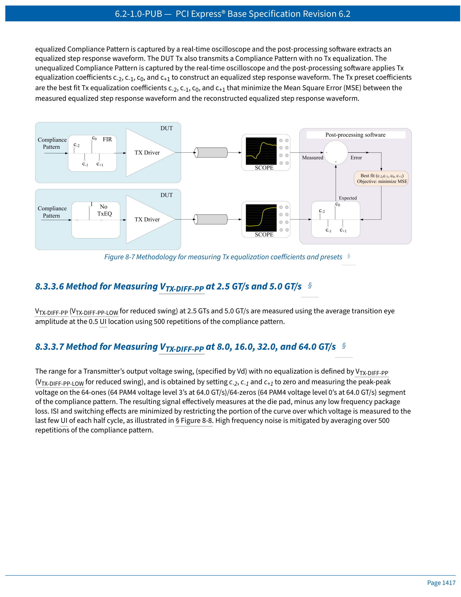
 <em>Figure 8-7: Methodology for Measuring Tx Equalization Coefficients and Presets / 图8-7：Tx均衡系数和预设值测量方法</em>

#### 8.3.3.6 Method for Measuring VTX-DIFF-PP at 2.5 GT/s and 5.0 GT/s
#### 8.3.3.6 2.5和5.0 GT/s下的VTX-DIFF-PP测量方法

VTX-DIFF-PP (VTX-DIFF-PP-LOW for reduced swing) at 2.5 GT/s and 5.0 GT/s are measured using the average transition eye amplitude at the 0.5 UI location using 500 repetitions of the compliance pattern.

> 2.5 GT/s和5.0 GT/s下的VTX-DIFF-PP（降摆幅时为VTX-DIFF-PP-LOW），在0.5 UI位置处使用500次合规码型重复，通过平均跳变眼图幅度来测量。

#### 8.3.3.7 Method for Measuring VTX-DIFF-PP at 8.0, 16.0, 32.0, and 64.0 GT/s
#### 8.3.3.7 8.0、16.0、32.0和64.0 GT/s下的VTX-DIFF-PP测量方法

The range for a Transmitter's output voltage swing (specified by Vd) with no equalization is defined by VTX-DIFF-PP (VTX-DIFF-PP-LOW for reduced swing), and is obtained by setting c-2, c-1 and c+1 to zero and measuring the peak-peak voltage on the 64-ones (64 PAM4 voltage level 3's at 64.0 GT/s)/64-zeros (64 PAM4 voltage level 0's at 64.0 GT/s) segment of the compliance pattern. The resulting signal effectively measures at the die pad, minus any low frequency package loss. ISI and switching effects are minimized by restricting the portion of the curve over which voltage is measured to the last few UI of each half cycle, as illustrated in Figure 8-8. High frequency noise is mitigated by averaging over 500 repetitions of the compliance pattern.

> 发送端在无均衡时的输出电压摆幅范围（由Vd指定）由VTX-DIFF-PP（降摆幅时为VTX-DIFF-PP-LOW）定义，通过将c-2、c-1和c+1设为零并在合规码型的64个1（64.0 GT/s时为64个PAM4电平3）/64个0（64.0 GT/s时为64个PAM4电平0）段上测量峰峰值电压来获得。所得信号有效地在die pad处测量，减去任何低频封装损耗。如图8-8所示，通过将电压测量限制在每个半周期的最后几个UI内，ISI和开关效应被最小化。通过对500次合规码型重复进行平均来降低高频噪声。

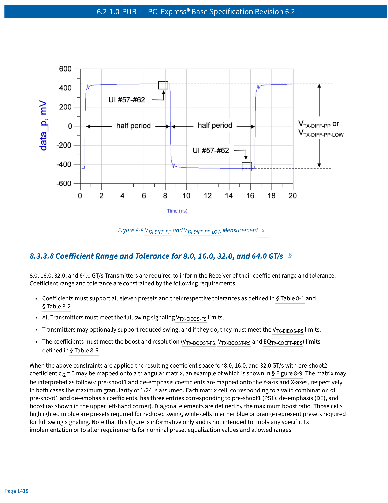
 <em>Figure 8-8: VTX-DIFF-PP and VTX-DIFF-PP-LOW Measurement / 图8-8：VTX-DIFF-PP和VTX-DIFF-PP-LOW测量</em>

#### 8.3.3.8 Coefficient Range and Tolerance for 8.0, 16.0, 32.0, and 64.0 GT/s
#### 8.3.3.8 8.0、16.0、32.0和64.0 GT/s的系数范围和容差

8.0, 16.0, 32.0, and 64.0 GT/s Transmitters are required to inform the Receiver of their coefficient range and tolerance. Coefficient range and tolerance are constrained by the following requirements:
- Coefficients must support all presets and their respective tolerances as defined in Table 8-1 and Table 8-2
- All Transmitters must meet the full swing signaling VTX-EIEOS-FS limits
- Transmitters may optionally support reduced swing, and if they do, they must meet the VTX-EIEOS-RS limits
- The coefficients must meet the boost and resolution (VTX-BOOST-FS, VTX-BOOST-RS and EQTX-COEFF-RES) limits defined in Table 8-6

> 8.0、16.0、32.0和64.0 GT/s发送端需要向接收端告知其系数范围和容差。系数范围和容差受以下要求约束：
> - 系数必须支持表8-1和表8-2中定义的所有预设值及其各自的容差
> - 所有发送端必须满足全摆幅信令的VTX-EIEOS-FS限制
> - 发送端可选支持降摆幅，如支持则必须满足VTX-EIEOS-RS限制
> - 系数必须满足表8-6中定义的boost和分辨率（VTX-BOOST-FS、VTX-BOOST-RS和EQTX-COEFF-RES）限制

When the above constraints are applied the resulting coefficient space for 8.0, 16.0, and 32.0 GT/s with pre-shoot2 coefficient c-2 = 0 may be mapped onto a triangular matrix, an example of which is shown in Figure 8-9. The matrix may be interpreted as follows: pre-shoot1 and de-emphasis coefficients are mapped onto the Y-axis and X-axes, respectively. In both cases the maximum granularity of 1/24 is assumed. Each matrix cell has three entries corresponding to pre-shoot1 (PS1), de-emphasis (DE), and boost. Diagonal elements are defined by the maximum boost ratio. Cells highlighted in blue are presets required for reduced swing, while cells in either blue or orange represent presets required for full swing signaling.

> 在施加上述约束后，8.0、16.0和32.0 GT/s的系数空间（其中预加重2系数c-2 = 0）可映射到一个三角矩阵，其示例如图8-9所示。矩阵可解读如下：预加重1和去加重系数分别映射到Y轴和X轴。两者均假定最大粒度为1/24。每个矩阵单元格有三个条目，分别对应预加重1（PS1）、去加重（DE）和boost。对角线元素由最大boost比率定义。蓝色高亮单元格为降摆幅所需的预设值，而蓝色或橙色单元格为全摆幅信令所需的预设值。

Note: This figure is informative only and is not intended to imply any specific Tx implementation or to alter requirements for nominal preset equalization values and allowed ranges.

> 注：本图仅为信息性参考，不旨在隐含任何特定Tx实现或更改标称预设均衡值及其允许范围的要求。

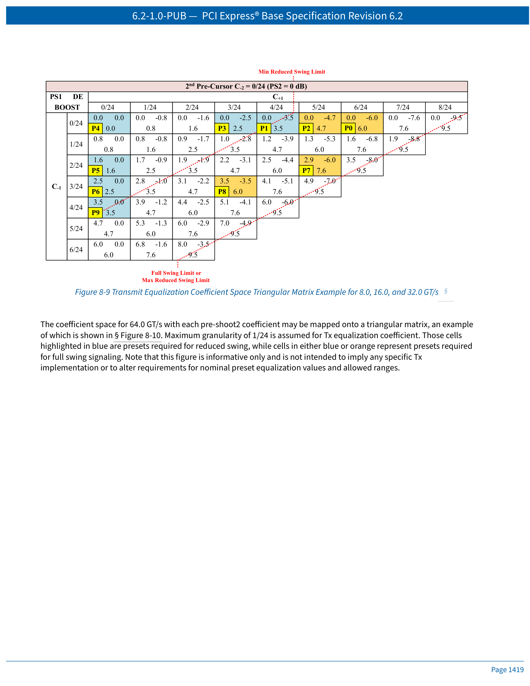
 <em>Figure 8-9: Transmit Equalization Coefficient Space Triangular Matrix Example for 8.0, 16.0, and 32.0 GT/s / 图8-9：8.0、16.0和32.0 GT/s的Tx均衡系数空间三角矩阵示例</em>

#### 8.3.3.9 EIEOS and VTX-EIEOS-FS and VTX-EIEOS-RS Limits
#### 8.3.3.9 EIEOS以及VTX-EIEOS-FS和VTX-EIEOS-RS限制

EIEOS (Electrical Idle Exit Ordered Set) signaling specifications define voltage limits for full swing (VTX-EIEOS-FS) and reduced swing (VTX-EIEOS-RS) operation. These limits ensure that the EIEOS ordered set is transmitted with sufficient amplitude for reliable detection by the Receiver.

> EIEOS（电气空闲退出有序集）信令规范定义了全摆幅（VTX-EIEOS-FS）和降摆幅（VTX-EIEOS-RS）操作的电压限制。这些限制确保EIEOS有序集以足够幅度发送，以便接收端可靠检测。

Figure 8-11 illustrates the measurement for VTX-EIEOS-FS and VTX-EIEOS-RS at 8.0 GT/s, where the signal level for EIEOS is measured over the last few UI of each half cycle similar to the VTX-DIFF-PP measurement.

> 图8-11展示了8.0 GT/s下VTX-EIEOS-FS和VTX-EIEOS-RS的测量方法，其中EIEOS的信号电平在每个半周期的最后几个UI内测量，类似于VTX-DIFF-PP的测量方式。

#### 8.3.3.10 Reduced Swing Signaling
#### 8.3.3.10 降摆幅信令

Reduced swing mode allows for lower power Link operation. A Transmitter supporting reduced swing signaling must meet the reduced swing voltage parameters VTX-DIFF-PP-LOW and the associated EIEOS limits.

> 降摆幅模式允许更低功耗的链路操作。支持降摆幅信令的发送端必须满足降摆幅电压参数VTX-DIFF-PP-LOW及对应的EIEOS限制。

#### 8.3.3.11 Effective Tx Package Loss at 8.0, 16.0, 32.0, and 64.0 GT/s
#### 8.3.3.11 8.0、16.0、32.0和64.0 GT/s的有效Tx封装损耗

The effective Tx package loss parameter characterizes the package loss between the silicon die pad and the device pin at the fundamental frequency of the compliance pattern. This loss is used to de-embed measurements from the die pad to the device pin. Figure 8-12 shows the compliance pattern and resulting package loss test waveform.

> 有效Tx封装损耗参数表征了在合规码型基频处硅die pad与器件引脚之间的封装损耗。该损耗用于将测量从die pad去嵌入到器件引脚。图8-12展示了合规码型及由此产生的封装损耗测试波形。

Table 8-3 identifies the cases where reference packages and the ps21TX parameter are normative.

**Table 8-3: Cases that the Reference Packages and ps21TX Parameter are Normative | 表8-3：参考封装和ps21TX参数为规范性的情况**

#### 8.3.3.12 Transmitter Signal-to-Noise and Distortion Ratio (SNDRTX) for 64.0 GT/s
#### 8.3.3.12 64.0 GT/s发送端信噪失真比（SNDRTX）

SNDR is defined for PAM4 signaling at 64.0 GT/s. SNDR captures both noise and distortion in the transmitted signal. The SNDR is computed from the measured signal statistics as follows:

σL,i: standard deviation of the ith PAM4 level
μL,i: mean of the ith PAM4 level
σL: average of the standard deviations
σn: RMS of all noise observed
SNDR = 20 × log10(Vd / σn)

> SNDR（信噪失真比）定义用于64.0 GT/s的PAM4信令。SNDR捕获发送信号中的噪声和失真。SNDR由测量的信号统计按下式计算：
>
> σL,i：第i个PAM4电平的标准差
> μL,i：第i个PAM4电平的均值
> σL：各标准差的平均值
> σn：所有观测噪声的RMS
> SNDR = 20 × log10(Vd / σn)

Equations 8-3 through 8-7 define the SNDR computation in detail.

> 方程式8-3至方程式8-7详细定义了SNDR的计算。

#### 8.3.3.13 Transmitter Ratio of Level Mismatch (RLM-TX) for 64.0 GT/s
#### 8.3.3.13 64.0 GT/s发送端电平失配比（RLM-TX）

RLM for the Transmitter is defined for PAM4 at 64.0 GT/s. RLM is defined as:

RLM = 1 - (VL / Vd)

where VL captures the deviation of the average PAM4 levels from their ideal equally-spaced positions.

> 发送端的RLM（电平失配比）定义用于64.0 GT/s的PAM4。RLM定义为：
>
> RLM = 1 - (VL / Vd)
>
> 其中VL捕获平均PAM4电平偏离其理想等间距位置的偏差。

Equations 8-8 and 8-9 define RLM and VL in detail.

> 方程式8-8和方程式8-9详细定义了RLM和VL。

### 8.3.4 Transmitter Margining
### 8.3.4 发送端裕量

Transmitter margining allows a Receiver to request a Transmitter to change the Transmitter voltage ratio in small increments so that the Receiver can determine the margin in the received signal that it is seeing. Margining at 2.5 and 5.0 GT/s is defined by a set of voltage levels and codes as shown in Figure 8-13.

> 发送端裕量允许接收端请求发送端以小增量更改发送端电压比率，以便接收端确定其接收信号中所见的裕量。2.5和5.0 GT/s的裕量由图8-13所示的一组电压电平和编码定义。

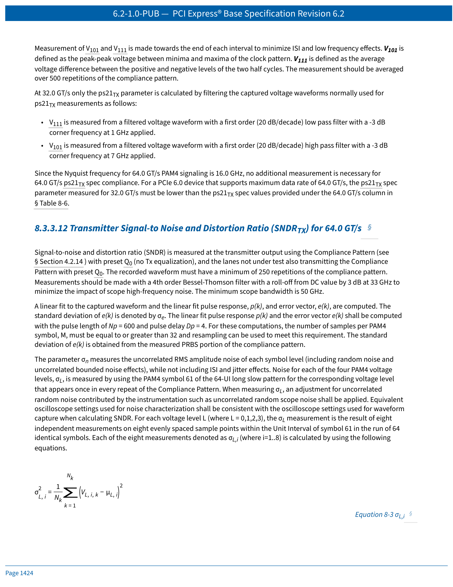
 <em>Figure 8-13: 2.5 and 5.0 GT/s Transmitter Margining Voltage Levels and Codes / 图8-13：2.5和5.0 GT/s发送端裕量电压电平和编码</em>

For 8.0, 16.0, 32.0, and 64.0 GT/s, Lane margining is defined as part of the Lane Margining at the Receiver feature described in the Physical Layer Logical Block chapter.

> 对于8.0、16.0、32.0和64.0 GT/s，Lane裕量化定义为接收端Lane裕量功能的一部分，详见物理层逻辑子层章节。

### 8.3.5 Tx Jitter Parameters
### 8.3.5 Tx抖动参数

This section defines the measurement and characterization of Tx jitter. The jitter parameters have been redefined for 6.0 to conform to a more consistent and rigorous statistical framework.

> 本节定义了Tx抖动的测量和表征。在6.0版本中，抖动参数已重新定义，以符合更一致和更严格的统计框架。

#### 8.3.5.1 Post Processing Steps to Extract Jitter
#### 8.3.5.1 提取抖动的后处理步骤

Jitter extraction requires specific post-processing steps: time-base correction, pattern alignment, and application of behavioral CDR transfer functions.

> 抖动提取需要特定的后处理步骤：时基校正、码型对齐以及行为CDR传递函数的应用。

#### 8.3.5.2 Applying CTLE or De-embedding
#### 8.3.5.2 应用CTLE或去嵌入

Before jitter analysis, the measured signal may require CTLE (Continuous Time Linear Equalization) or de-embedding to reference the measurement to the device pin. Table 8-4 provides recommended de-embedding configurations.

> 在抖动分析之前，测量的信号可能需要CTLE（连续时间线性均衡）或去嵌入，以将测量引用到器件引脚。表8-4提供了推荐的去嵌入配置。

**Table 8-4: Recommended De-embedding | 表8-4：推荐去嵌入**

#### 8.3.5.3 Independent Refclk Measurement and Post Processing
#### 8.3.5.3 独立参考时钟的测量和后处理

For independent Refclk architectures, specific measurement and post-processing procedures apply. Table 8-5 summarizes the Tx measurement and post processing for different Refclk architectures.

**Table 8-5: Tx Measurement and Post Processing for Different Refclks | 表8-5：不同参考时钟的Tx测量和后处理**

> 对于独立参考时钟架构，适用特定的测量和后处理程序。表8-5总结了不同参考时钟架构的Tx测量和后处理方式。

#### 8.3.5.4 Embedded and Non-Embedded Refclk Measurement and Post Processing
#### 8.3.5.4 嵌入式和非嵌入式参考时钟的测量和后处理

For embedded Refclk configurations, a 2-port measurement approach is used where both Tx data and Refclk out are sampled simultaneously. For non-embedded Refclk, only the Tx data is sampled.

> 对于嵌入式参考时钟配置，使用双端口测量方法，Tx数据和Refclk输出同时采样。对于非嵌入式参考时钟，仅采样Tx数据。

#### 8.3.5.5 Behavioral CDR Characteristics
#### 8.3.5.5 行为CDR特性

Behavioral CDR (Clock Data Recovery) transfer functions are defined for each data rate and Refclk architecture. These functions model the PLL bandwidth and peaking of a reference CDR and are used in the jitter analysis to account for the tracking behavior of a Receiver.

Figure 8-14 illustrates the first-order Common Refclk behavioral CDR transfer functions at various data rates.

> 行为CDR（时钟数据恢复）传递函数针对每种数据速率和参考时钟架构定义。这些函数模拟参考CDR的PLL带宽和峰值，并用于抖动分析中以考虑接收端的跟踪行为。
>
> 图8-14展示了在各种数据速率下一阶公共参考时钟行为CDR传递函数。

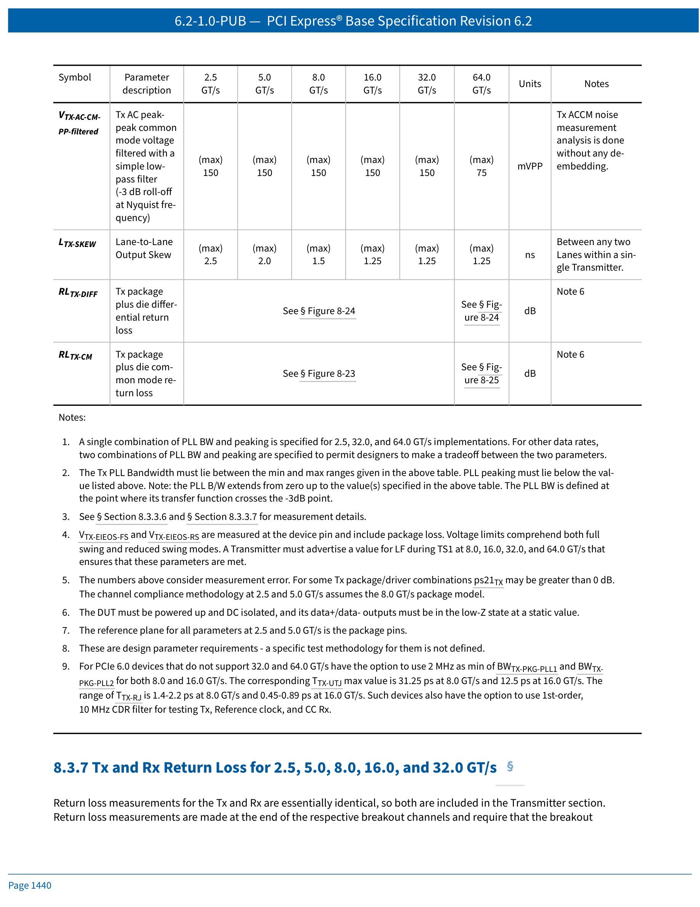
 <em>Figure 8-14: First Order CC Behavioral CDR Transfer Functions / 图8-14：一阶CC行为CDR传递函数</em>

Figures 8-15 through 8-17 show behavioral CDR transfer functions for SRIS (Separate Reference Independent Spread) and CC (Common Clock) architectures at higher data rates.

Equations 8-10 through 8-13 define the behavioral CDR transfer functions and parameters.

> 图8-15至图8-17展示了SRIS（分离参考独立扩频）和CC（公共时钟）架构在更高数据速率下的行为CDR传递函数。
>
> 方程式8-10至方程式8-13定义了行为CDR传递函数和参数。

#### 8.3.5.6 Data Dependent and Uncorrelated Jitter
#### 8.3.5.6 数据相关抖动与非相关抖动

Jitter is broken down into data dependent jitter (DDJ) and uncorrelated jitter. Data dependent jitter is deterministic and arises from ISI and other data pattern effects. Uncorrelated jitter includes random and deterministic components that are not correlated with the data pattern.

> 抖动分为数据相关抖动（DDJ）和非相关抖动。数据相关抖动是确定性的，源于ISI和其他数据码型效应。非相关抖动包括与数据码型不相关的随机和确定性分量。

#### 8.3.5.7 Data Dependent Jitter
#### 8.3.5.7 数据相关抖动

DDJ is extracted by analyzing the average edge positions for each data pattern. Figure 8-18 illustrates the relationship between data edge PDFs and the recovered data clock.

> DDJ通过分析每种数据码型的平均边沿位置来提取。图8-18展示了数据边沿PDF与恢复数据时钟之间的关系。

#### 8.3.5.8 Uncorrelated Total Jitter and Deterministic Jitter (Dual Dirac Model)
#### 8.3.5.8 非相关总抖动和确定性抖动（双Dirac模型）

TTX-UTJ (Uncorrelated Total Jitter) and TTX-UDJDD (Uncorrelated Deterministic Jitter, Dual Dirac model) characterize the uncorrelated jitter components. The Dual Dirac model is used to separate deterministic and random jitter components from the uncorrelated jitter distribution.

Figure 8-19 illustrates the derivation of TTX-UTJ and TTX-UDJDD.

> TTX-UTJ（非相关总抖动）和TTX-UDJDD（非相关确定性抖动，双Dirac模型）表征非相关抖动分量。双Dirac模型用于从非相关抖动分布中分离确定性和随机抖动分量。
>
> 图8-19展示了TTX-UTJ和TTX-UDJDD的推导。

#### 8.3.5.9 Random Jitter (TTX-RJ) (informative)
#### 8.3.5.9 随机抖动（TTX-RJ，信息性）

TTX-RJ is an informative parameter that estimates the RMS random jitter from the uncorrelated jitter distribution.

> TTX-RJ是一个信息性参数，从非相关抖动分布中估计RMS随机抖动。

#### 8.3.5.10 Uncorrelated Total and Deterministic PWJ
#### 8.3.5.10 非相关总PWJ和确定性PWJ

PWJ (Pulse Width Jitter) relative to consecutive edges 1 UI apart is defined and measured as shown in Figure 8-20 and Figure 8-21. TTX-UPW-TJ and TTX-UPW-DJDD capture uncorrelated total and deterministic PWJ.

> PWJ（脉宽抖动）相对于间隔1 UI的连续边沿定义和测量，如图8-20和图8-21所示。TTX-UPW-TJ和TTX-UPW-DJDD捕获非相关总PWJ和确定性PWJ。

### 8.3.6 Data Rate Dependent Parameters
### 8.3.6 数据速率相关参数

**Table 8-6: Data Rate Dependent Transmitter Parameters | 表8-6：数据速率相关发送端参数**

Table 8-6 provides a comprehensive set of data rate dependent transmitter parameters for all supported data rates from 2.5 GT/s to 64.0 GT/s.

Key parameters include:

| Parameter | Description (English) | 描述（中文） |
|-----------|----------------------|--------------|
| UI | Unit Interval | 单元间隔 |
| VTX-DIFF-PP | Differential Peak-to-Peak Output Voltage | 差分峰峰值输出电压 |
| VTX-DIFF-PP-LOW | Low Swing Differential Peak-to-Peak Output Voltage | 低摆幅差分峰峰值输出电压 |
| VTX-EIEOS-FS | EIEOS Full Swing Voltage | EIEOS全摆幅电压 |
| VTX-EIEOS-RS | EIEOS Reduced Swing Voltage | EIEOS降摆幅电压 |
| TTX-UTJ | Uncorrelated Total Jitter | 非相关总抖动 |
| TTX-UDJDD | Uncorrelated Deterministic Jitter (Dual Dirac) | 非相关确定性抖动（双Dirac） |
| TTX-UPW-TJ | Uncorrelated Total PWJ | 非相关总PWJ |
| TTX-UPW-DJDD | Uncorrelated Deterministic PWJ | 非相关确定性PWJ |
| VTX-BOOST-FS | Full Swing Boost | 全摆幅Boost |
| VTX-BOOST-RS | Reduced Swing Boost | 降摆幅Boost |
| EQTX-COEFF-RES | Tx Equalization Coefficient Resolution | Tx均衡系数分辨率 |
| SNDRTX | Tx Signal-to-Noise and Distortion Ratio | Tx信噪失真比 |
| RLM-TX | Tx Ratio of Level Mismatch | Tx电平失配比 |

> 表8-6提供了一个全面的数据速率相关发送端参数集，涵盖从2.5 GT/s到64.0 GT/s的所有支持数据速率。
>
> 需要特别注意的是，2.5、5.0、8.0、16.0和32.0 GT/s下的BER = 10⁻¹²隐含着FBER同样为10⁻¹²。对于64.0 GT/s的FBER = 10⁻⁶，这意味着在计入所有突发错误之前，错误率比前几代高出六个数量级——这是PAM4信令的一个基本权衡。

Many of these are design parameter requirements - a specific test methodology for them is not defined.

> 其中许多参数是设计参数要求——未定义针对它们的具体测试方法。

### 8.3.7 Tx and Rx Return Loss for 2.5, 5.0, 8.0, 16.0, and 32.0 GT/s
### 8.3.7 2.5、5.0、8.0、16.0和32.0 GT/s的Tx和Rx回波损耗

Return loss specifications ensure impedance matching and minimize signal reflections. Differential and common mode return loss masks are defined for both Tx and Rx.

> 回波损耗规范确保阻抗匹配并最小化信号反射。差分和共模回波损耗掩模针对Tx和Rx均有定义。

Figure 8-22 shows the Tx and Rx differential return loss mask with a 50Ω reference.

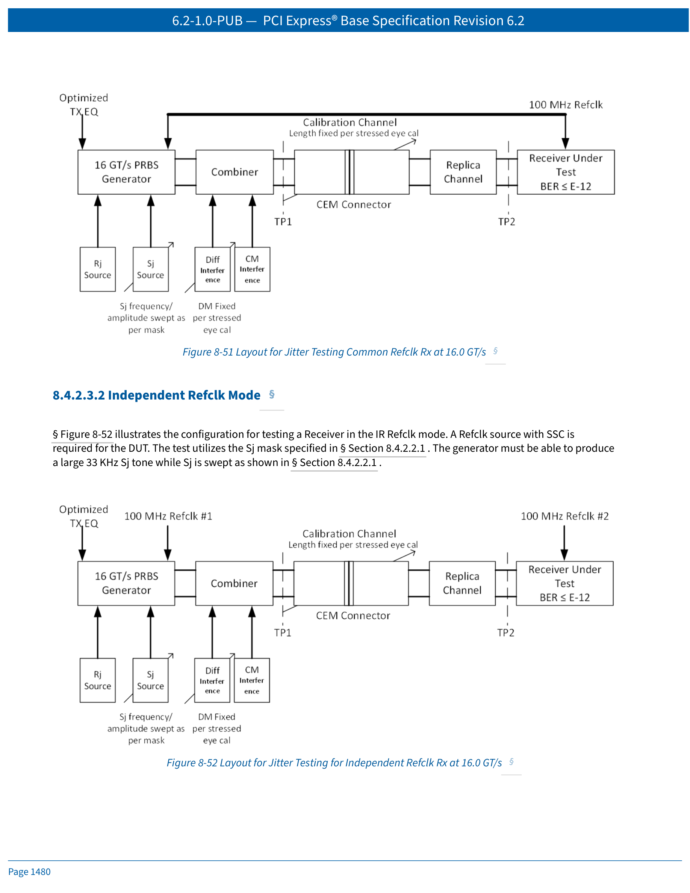
 <em>Figure 8-22: Tx, Rx Differential Return Loss Mask with 50 Ω Reference / 图8-22：50Ω参考下的Tx、Rx差分回波损耗掩模</em>

Figure 8-23 shows the Tx and Rx common mode return loss mask.

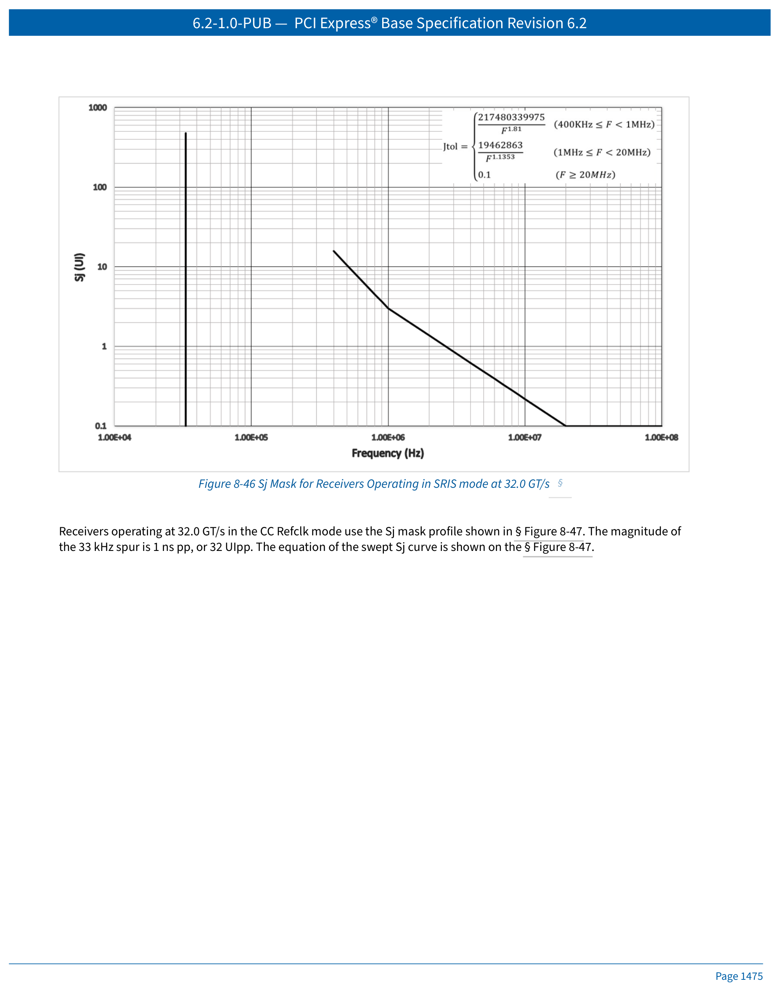
 <em>Figure 8-23: Tx, Rx Common Mode Return Loss Mask with 50 Ω Reference / 图8-23：50Ω参考下的Tx、Rx共模回波损耗掩模</em>

### 8.3.8 Tx and Rx Return Loss for 64.0 GT/s
### 8.3.8 64.0 GT/s的Tx和Rx回波损耗

Return loss specifications for 64.0 GT/s PAM4 signaling have distinct masks due to the wider bandwidth requirements.

> 64.0 GT/s PAM4信令的回波损耗规范具有不同的掩模，这是因为其更宽的带宽要求。

Figure 8-24: 64.0 GT/s Tx, Rx Differential Return Loss Mask | 图8-24：64.0 GT/s Tx、Rx差分回波损耗掩模

Figure 8-25: 64.0 GT/s Tx, Rx Common Mode Return Loss Mask | 图8-25：64.0 GT/s Tx、Rx共模回波损耗掩模

### 8.3.9 Transmitter PLL Bandwidth and Peaking
### 8.3.9 发送端PLL带宽和峰值

Tx PLL bandwidth and peaking define the jitter transfer characteristics of the transmitter PLL. Separate specifications apply for 2.5/5.0 GT/s and for 8.0/16.0/32.0/64.0 GT/s.

> Tx PLL带宽和峰值定义了发送端PLL的抖动传递特性。针对2.5/5.0 GT/s和8.0/16.0/32.0/64.0 GT/s分别适用不同的规范。

#### 8.3.9.1 2.5 GT/s and 5.0 GT/s Tx PLL Bandwidth and Peaking
#### 8.3.9.1 2.5 GT/s和5.0 GT/s Tx PLL带宽和峰值

For 2.5 and 5.0 GT/s, the Tx PLL must have a bandwidth between 1.5 MHz and 22 MHz and peaking less than 3 dB.

> 对于2.5和5.0 GT/s，Tx PLL必须具有1.5 MHz至22 MHz之间的带宽，且峰值低于3 dB。

#### 8.3.9.2 8.0 GT/s, 16.0 GT/s, 32.0 GT/s, and 64.0 GT/s Tx PLL Bandwidth and Peaking
#### 8.3.9.2 8.0、16.0、32.0和64.0 GT/s Tx PLL带宽和峰值

For these data rates, specific PLL bandwidths and peaking limits are defined to ensure compatibility with the Receiver's CDR.

> 对于这些数据速率，定义了特定的PLL带宽和峰值限值，以确保与接收端CDR的兼容性。

#### 8.3.9.3 Series Capacitors
#### 8.3.9.3 串联电容

AC coupling capacitors are required on the Transmitter side of the Link. The specification defines the capacitance range between 176 nF and 265 nF for PCI Express.

> AC耦合电容在链路的发送端一侧是必需的。规范定义了PCI Express的电容范围在176 nF至265 nF之间。

### 8.3.10 Data Rate Independent Tx Parameters
### 8.3.10 数据速率无关Tx参数

**Table 8-7: Data Rate Independent Tx Parameters | 表8-7：数据速率无关Tx参数**

| Parameter | Description (English) | 描述（中文） |
|-----------|----------------------|--------------|
| ZTX-DIFF-DC | Tx Differential DC Impedance | Tx差分DC阻抗 |
| ZTX-DC | Tx DC Common Mode Impedance | Tx DC共模阻抗 |
| CTX | AC Coupling Capacitor | AC耦合电容 |
| VTX-DIFF-DC | DC Differential Voltage | DC差分电压 |
| VTX-CM-DC-ACTIVE-IDLE-DELTA | Absolute Delta Between DC CM Voltages | 电气空闲和活跃状态下DC共模电压间的绝对差值 |
| VTX-IDLE-DIFF-AC-p | Peak AC Differential Voltage During Electrical Idle | 电气空闲期间的峰化AC差分电压 |
| VTX-RCV-DETECT | Voltage Change Allowed During Receiver Detection | 接收端检测期间允许的电压变化 |
| ITX-SHORT | Tx Short Circuit Current Limit | Tx短路电流限制 |
| ZTX-DIFF-DC-PW | Tx Differential Impedance During Power-Down | 关电状态下的Tx差分阻抗 |

> 表8-7提供了适用于所有数据速率的数据速率无关Tx参数。

---

## 8.4 Receiver Specifications
## 8.4 接收端规范

### 8.4.1 Receiver Stressed Eye Specification
### 8.4.1 接收端压力眼图规范

The stressed eye methodology is used to test Receiver performance. A stressed signal with known impairments (jitter, noise, ISI) is applied to the Rx input, and the BER performance is measured.

> 压力眼图方法用于测试接收端性能。将具有已知损伤（抖动、噪声、ISI）的压力信号施加到Rx输入端，然后测量BER性能。

#### 8.4.1.1 Breakout and Replica Channels
#### 8.4.1.1 引出通道与复制通道

Similar to the Tx measurement setup, Rx testing uses breakout and replica channels to reference measurements to the device pin.

> 与Tx测量设置类似，Rx测试使用引出通道和复制通道将测量引用到器件引脚。

Figure 8-26 illustrates the Rx test board topology for 16.0 and 32.0 GT/s.

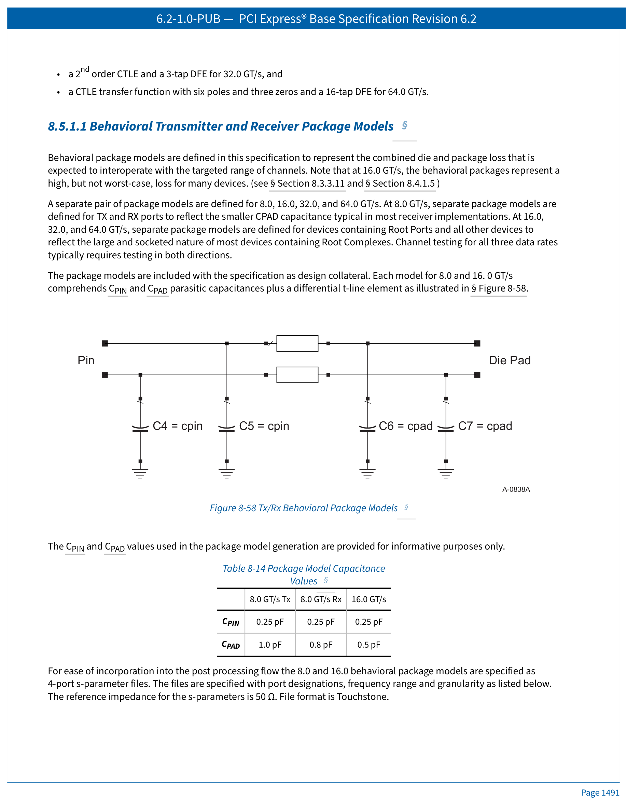
 <em>Figure 8-26: Rx Test Board Topology for 16.0 and 32.0 GT/s / 图8-26：16.0和32.0 GT/s Rx测试板拓扑</em>

#### 8.4.1.2 Calibration Channel Insertion Loss Characteristics
#### 8.4.1.2 校准通道插入损耗特性

The calibration channel is used to adjust the stressed signal to have known characteristics at the Rx pin. Table 8-8 specifies the calibration channel IL limits.

**Table 8-8: Calibration Channel IL Limits | 表8-8：校准通道插入损耗限制**

> 校准通道用于调整压力信号，使其在Rx引脚处具有已知的特性。表8-8规定了校准通道的插入损耗限值。

Figure 8-27: Example Calibration Channel IL Mask Excluding Rx Package for 8.0 GT/s | 图8-27：8.0 GT/s下不含Rx封装的校准通道插入损耗掩模示例

Figures 8-28 through 8-33 provide detailed examples of calibration channels and stackups for 16.0 GT/s and 32.0 GT/s.

> 图8-28至图8-33提供了16.0 GT/s和32.0 GT/s校准通道和叠层的详细示例。

#### 8.4.1.3 Behavioral CTLE Transfer Functions
#### 8.4.1.3 行为CTLE传递函数

Behavioral CTLE (Continuous Time Linear Equalization) models are defined for 8.0, 16.0, 32.0, and 64.0 GT/s. These CTLE functions are applied in the stressed eye generation process.

Figure 8-34 illustrates the CTLE transfer function for 8.0 GT/s, while Figures 8-35 through 8-37 show the corresponding loss curves.

> 行为CTLE（连续时间线性均衡）模型针对8.0、16.0、32.0和64.0 GT/s定义。这些CTLE函数应用于压力眼图的生成过程中。
>
> 图8-34展示了8.0 GT/s的CTLE传递函数，图8-35至图8-37展示了相应的损耗曲线。

The behavioral CTLE at 32.0 GT/s is defined by Equation 8-14:

H(s) = A × (s + ωz1)(s + ωz2) / [(s + ωp1)(s + ωp2)]

The behavioral CTLE at 64.0 GT/s is defined by Equation 8-15.

> 32.0 GT/s下的行为CTLE由方程式8-14定义：
>
> H(s) = A × (s + ωz1)(s + ωz2) / [(s + ωp1)(s + ωp2)]
>
> 64.0 GT/s下的行为CTLE由方程式8-15定义。

#### 8.4.1.4 Stressed Eye Calibration
#### 8.4.1.4 压力眼图校准

The stressed eye signal is calibrated to meet specific jitter and voltage parameters at the Rx pin. The calibration involves iteratively adjusting the stress parameters until the target eye characteristics are achieved.

> 压力眼图信号被校准以满足Rx引脚处特定的抖动和电压参数。校准过程包括迭代调整压力参数，直到达到目标眼图特性。

#### 8.4.1.5 Jitter Tolerance
#### 8.4.1.5 抖动容限

Rx jitter tolerance defines the amount of jitter a Receiver must tolerate while maintaining a BER of 10⁻¹² (10⁻⁶ for 64.0 GT/s). Specific jitter tolerance masks are defined for each data rate and Refclk architecture.

> Rx抖动容限定义了接收端在维持10⁻¹² BER（64.0 GT/s为10⁻⁶）的同时必须能容忍的抖动量。针对每种数据速率和参考时钟架构定义了特定的抖动容限掩模。

---

## 8.5 Channel Tolerancing
## 8.5 通道容差

### 8.5.1 Channel Compliance Testing
### 8.5.1 通道合规测试

Channel compliance testing verifies that a channel meets the required electrical performance for a given data rate. The channel includes the PCB traces, connectors, vias, and packages that make up the complete end-to-end path between Transmitter and Receiver.

> 通道合规测试验证通道是否满足给定数据速率所需的电气性能。通道包括PCB走线、连接器、过孔和封装，它们共同构成发送端与接收端之间完整的端到端路径。

#### 8.5.1.1 Behavioral Transmitter and Receiver Package Models
#### 8.5.1.1 行为发送端和接收端封装模型

Behavioral package models are used in channel simulation to account for the package effects on signal integrity. Reference package models are defined for various form factors.

> 行为封装模型用于通道仿真中，以考虑封装对信号完整性的影响。针对各种形态规格定义了参考封装模型。

#### 8.5.1.2 Measuring Package Performance (16.0 GT/s only)
#### 8.5.1.2 封装性能测量（仅限16.0 GT/s）

For 16.0 GT/s, specific package performance measurement procedures are defined to characterize package insertion loss, return loss, and crosstalk.

> 对于16.0 GT/s，定义了特定的封装性能测量程序，以表征封装插入损耗、回波损耗和串扰。

#### 8.5.1.3 Simulation Tool Requirements
#### 8.5.1.3 仿真工具要求

Channel compliance uses simulation tools to predict eye diagram characteristics. The simulation tool chain must meet specific requirements for inputs, processing steps, and outputs.

> 通道合规使用仿真工具来预测眼图特性。仿真工具链必须在输入、处理步骤和输出方面满足特定要求。

##### 8.5.1.3.1 Simulation Tool Chain Inputs
##### 8.5.1.3.1 仿真工具链输入

The simulation inputs include channel S-parameters, behavioral Tx/Rx models, package models, and compliance pattern data.

> 仿真输入包括通道S参数、行为Tx/Rx模型、封装模型和合规码型数据。

##### 8.5.1.3.2 Processing Steps
##### 8.5.1.3.2 处理步骤

The processing involves convolving the channel impulse response with the behavioral models and computing the resulting eye diagram.

> 处理过程包括将通道冲激响应与行为模型进行卷积，并计算所得的眼图。

##### 8.5.1.3.3 Simulation Tool Outputs
##### 8.5.1.3.3 仿真工具输出

Outputs include eye height, eye width, and eye diagram statistics that are compared against compliance limits.

> 输出包括眼图高度、眼图宽度和与合规限值比较的眼图统计数据。

##### 8.5.1.3.4 Open Source Simulation Tool
##### 8.5.1.3.4 开源仿真工具

An open source simulation tool reference implementation is available for channel compliance testing. This tool implements the required algorithms and can be used for verifying commercial tool results.

> 开源仿真工具参考实现可用于通道合规测试。该工具实现了所需的算法，可用于验证商业工具的结果。

#### 8.5.1.4 Behavioral Transmitter Parameters
#### 8.5.1.4 行为发送端参数

##### 8.5.1.4.1 Deriving Voltage and Jitter Parameters
##### 8.5.1.4.1 推导电压和抖动参数

Behavioral Tx parameters including voltage swing, jitter, and equalization are derived from measurements or specification limits. Table 8-15 and Figure 8-78 provide the jitter/voltage parameter set used in channel tolerancing.

**Table 8-15: Jitter/Voltage Parameters for Channel Tolerancing | 表8-15：通道容差的抖动/电压参数**

> 行为Tx参数包括电压摆幅、抖动和均衡，从测量值或规范限值导出。表8-15和图8-78提供了通道容差中使用的抖动/电压参数集。

##### 8.5.1.4.2 Optimizing Tx/Rx Equalization (8.0, 16.0, 32.0, and 64.0 GT/s only)
##### 8.5.1.4.2 Tx/Rx均衡优化（仅限8.0、16.0、32.0和64.0 GT/s）

For higher data rates, the simulation tool optimizes Tx FFE (Feed-Forward Equalization) and Rx CTLE + DFE (Decision Feedback Equalization) settings to maximize the eye opening.

> 对于更高的数据速率，仿真工具优化Tx FFE（前馈均衡）和Rx CTLE + DFE（判决反馈均衡）设置，以最大化眼图张开度。

##### 8.5.1.4.3 Pass/Fail Eye Characteristics
##### 8.5.1.4.3 合格/不合格眼图特性

Table 8-16 and Figure 8-79 define the pass/fail eye mask values for channel compliance. The eye mask specifies minimum eye height (EH) and eye width (EW) at specific BER levels.

**Table 8-16: Channel Tolerancing Eye Mask Values | 表8-16：通道容差眼图掩模值**

> 表8-16和图8-79定义了通道合规的合格/不合格眼图掩模值。眼图掩模规定了在特定BER级别下的最小眼图高度（EH）和眼图宽度（EW）。

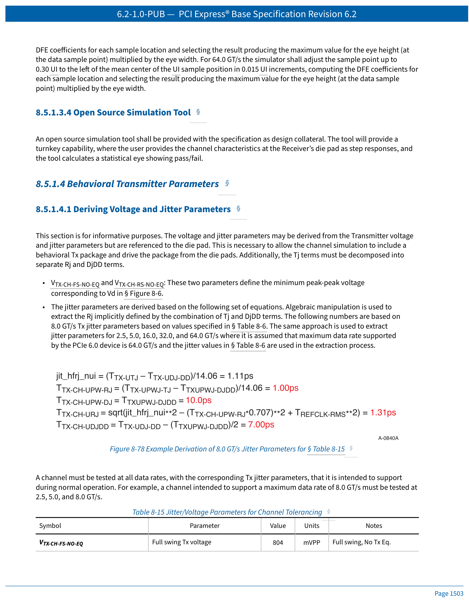
 <em>Figure 8-79: EH, EW Mask / 图8-79：EH、EW掩模</em>

##### 8.5.1.4.4 Characterizing Channel Common Mode Noise
##### 8.5.1.4.4 通道共模噪声表征

Channel common mode noise is characterized to ensure it does not exceed levels that would cause Receiver errors.

> 通道共模噪声的表征确保其不超过会导致接收端错误的水平。

##### 8.5.1.4.5 Verifying VCH-IDLE-DET-DIFF-pp
##### 8.5.1.4.5 验证VCH-IDLE-DET-DIFF-pp

The channel must support electrical idle detection, verified by ensuring VCH-IDLE-DET-DIFF-pp is below the specified threshold.

**Table 8-17: EIEOS Signaling Parameters | 表8-17：EIEOS信令参数**

> 通道必须支持电气空闲检测，通过确保VCH-IDLE-DET-DIFF-pp低于规定阈值来验证。表8-17提供了EIEOS信令参数。

---

## 8.6 Refclk Specifications
## 8.6 参考时钟规范

### 8.6.1 Refclk Test Setup
### 8.6.1 参考时钟测试设置

Figure 8-80 illustrates the oscilloscope Refclk test setup for all cases except jitter at 32.0 and 64.0 GT/s.

> 图8-80展示了除32.0和64.0 GT/s抖动外的所有情况下的示波器参考时钟测试设置。

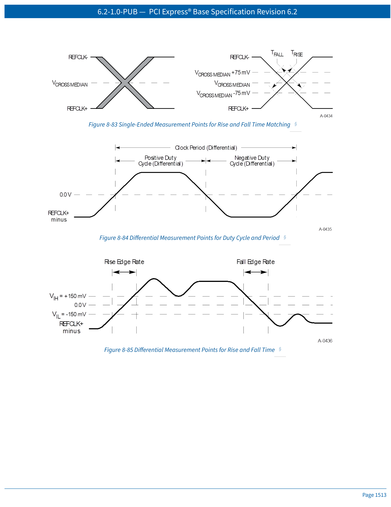
 <em>Figure 8-80: Oscilloscope Refclk Test Setup / 图8-80：示波器参考时钟测试设置</em>

### 8.6.2 REFCLK AC Specifications
### 8.6.2 参考时钟AC规范

**Table 8-18: REFCLK DC Specifications and AC Timing Requirements | 表8-18：REFCLK DC规范和AC时序要求**

| Parameter | Description (English) | 描述（中文） |
|-----------|----------------------|--------------|
| VREFCLK-DIFF-PP | REFCLK Differential Peak-to-Peak Voltage | REFCLK差分峰峰值电压 |
| VREFCLK-CM | REFCLK Common Mode Voltage | REFCLK共模电压 |
| FREFCLK | REFCLK Frequency | REFCLK频率 |
| TREFCLK-STABLE | REFCLK Stabilization Time | REFCLK稳定时间 |
| TREFCLK-DUTY-CYCLE | REFCLK Duty Cycle | REFCLK占空比 |
| TREFCLK-RISE | REFCLK Rise Time | REFCLK上升时间 |
| TREFCLK-FALL | REFCLK Fall Time | REFCLK下降时间 |

Figures 8-81 through 8-86 define various single-ended and differential measurement points for the Refclk.

> 图8-81至图8-86定义了Refclk的各种单端和差分测量点。

### 8.6.3 Data Rate Independent Refclk Parameters
### 8.6.3 数据速率无关参考时钟参数

**Table 8-19: Data Rate Independent Refclk Parameters | 表8-19：数据速率无关参考时钟参数**

| Parameter | Description (English) | 描述（中文） |
|-----------|----------------------|--------------|
| VREFCLK-ABS-CROSS-POINT | Absolute Crossing Point Voltage | 绝对交叉点电压 |
| VREFCLK-DELTA-CROSS-POINT | Delta Crossing Point Voltage | Delta交叉点电压 |
| TREFCLK-RISE-FALL-MATCH | Rise/Fall Time Matching | 上升/下降时间匹配 |
| TREFCLK-PERIOD | REFCLK Period | REFCLK周期 |
| VREFCLK-RINGBACK | REFCLK Ringback | REFCLK振铃 |

#### 8.6.3.1 Low Frequency Refclk Jitter Limits
#### 8.6.3.1 低频参考时钟抖动限制

Low frequency Refclk jitter limits are specified for different Refclk architectures. Figure 8-87 shows the limits for phase jitter from a reference clock with 5000 ppm SSC (Spread Spectrum Clocking).

> 低频参考时钟抖动限制针对不同的参考时钟架构规定。图8-87展示了具有5000 ppm SSC（扩频时钟）的参考时钟相位抖动限制。

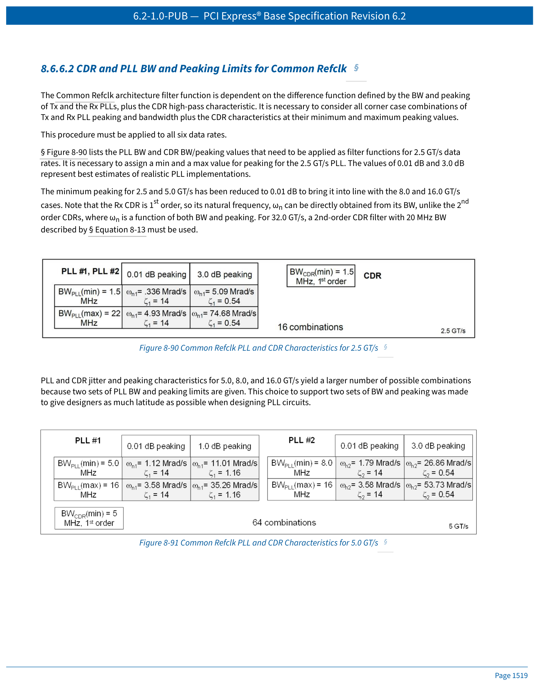
 <em>Figure 8-87: Limits for Phase Jitter from Reference with 5000 ppm SSC / 图8-87：5000 ppm SSC参考时钟相位抖动限值</em>

### 8.6.4 Refclk Architectures Supported
### 8.6.4 支持的参考时钟架构

This specification supports three Refclk architectures:
1. **Common Refclk (CC)** — The same reference clock is distributed to both Transmitter and Receiver
2. **Separate Reference Independent Spread (SRIS)** — Separate reference clocks with independent SSC
3. **Separate Reference No Spread (SRNS)** — Separate reference clocks with no SSC

> 本规范支持三种参考时钟架构：
> 1. **公共参考时钟（CC）** — 同一参考时钟分发到发送端和接收端
> 2. **分离参考独立扩频（SRIS）** — 具有独立SSC的分离参考时钟
> 3. **分离参考无扩频（SRNS）** — 无SSC的分离参考时钟

### 8.6.5 Filtering Functions Applied to Raw Data
### 8.6.5 应用于原始数据的滤波函数

#### 8.6.5.1 PLL Filter Transfer Function Example
#### 8.6.5.1 PLL滤波器传递函数示例

Figure 8-88 illustrates a 5 MHz PLL transfer function example used to filter the raw jitter data. Equation 8-16 defines the relationship between PLL bandwidth and the filter response.

> 图8-88展示了一个用于过滤原始抖动数据的5 MHz PLL传递函数示例。方程式8-16定义了PLL带宽与滤波器响应之间的关系。

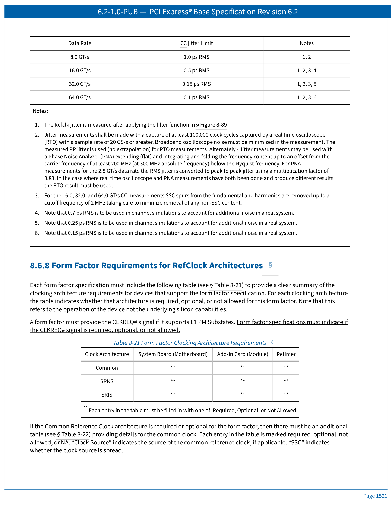
 <em>Figure 8-88: 5 MHz PLL Transfer Function Example / 图8-88：5 MHz PLL传递函数示例</em>

#### 8.6.5.2 CDR Transfer Function Examples
#### 8.6.5.2 CDR传递函数示例

Various CDR transfer function examples are provided for different data rates and Refclk architectures.

> 针对不同数据速率和参考时钟架构，提供了各种CDR传递函数示例。

### 8.6.6 Common Refclk Rx Architecture (CC)
### 8.6.6 公共参考时钟接收架构（CC）

The Common Refclk architecture is illustrated in Figure 8-89. In this architecture, the same Refclk source drives both the Transmitter and Receiver PLLs, allowing tracking of common low-frequency jitter.

> 公共参考时钟架构如图8-89所示。在此架构中，同一参考时钟源驱动发送端和接收端PLL，允许跟踪公共的低频抖动。

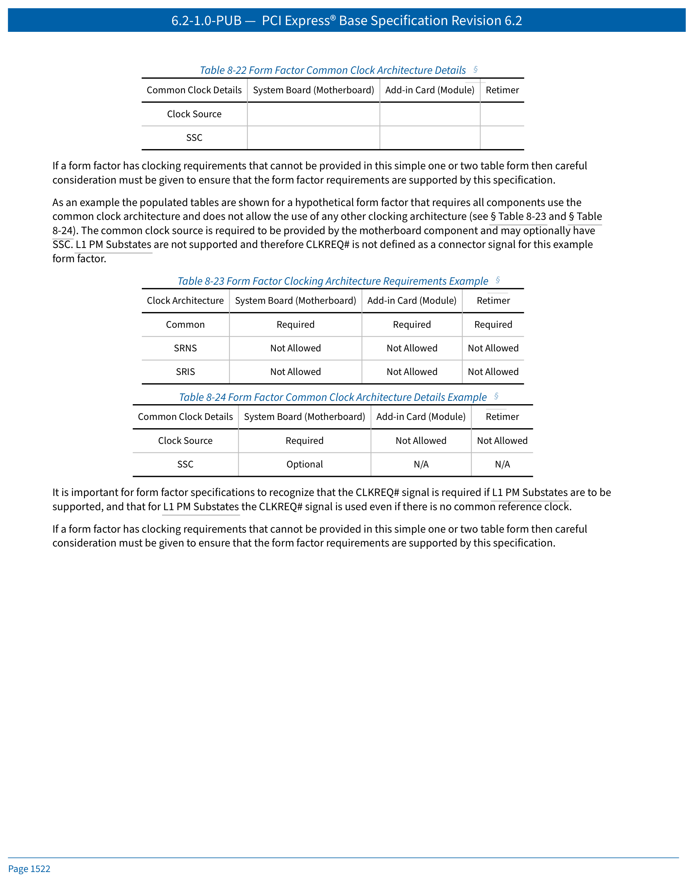
 <em>Figure 8-89: Common Refclk Rx Architecture for All Data Rates Except 32.0 and 64.0 GT/s / 图8-89：除32.0和64.0 GT/s外所有数据速率的公共参考时钟Rx架构</em>

#### 8.6.6.1 Determining the Number of PLL BW and Peaking Combinations
#### 8.6.6.1 确定PLL带宽和峰值组合的数量

The number of PLL bandwidth and peaking combinations that must be tested depends on the data rate and Refclk architecture.

> 必须测试的PLL带宽和峰值组合数量取决于数据速率和参考时钟架构。

#### 8.6.6.2 CDR and PLL BW and Peaking Limits for Common Refclk
#### 8.6.6.2 公共参考时钟的CDR和PLL带宽与峰值限制

Figures 8-90 through 8-94 illustrate the CDR and PLL BW and peaking characteristics for Common Refclk at data rates from 2.5 GT/s to 64.0 GT/s.

> 图8-90至图8-94展示了公共参考时钟在从2.5 GT/s到64.0 GT/s的各种数据速率下的CDR和PLL带宽与峰值特性。

### 8.6.7 Jitter Limits for Refclk Architectures
### 8.6.7 参考时钟架构的抖动限制

**Table 8-20: Jitter Limits for CC Architecture | 表8-20：CC架构的抖动限制**

| Refclk Architecture | Jitter Parameter | Description | 描述 |
|---------------------|------------------|-------------|------|
| CC | TREFCLK-CC-RJ | Random Jitter | 随机抖动 |
| CC | TREFCLK-CC-DJ | Deterministic Jitter | 确定性抖动 |
| CC | TREFCLK-CC-TJ | Total Jitter | 总抖动 |

> 表8-20提供了公共时钟（CC）架构的抖动限值。

In cases where real-time oscilloscope and PNA measurements both produce different results, the specification defines which takes precedence.

> 在实时示波器和PNA测量两者产生不同结果的情况下，规范定义了以何者为优先。

### 8.6.8 Form Factor Requirements for RefClock Architectures
### 8.6.8 参考时钟架构的形态规格要求

**Table 8-21: Form Factor Clocking Architecture Requirements | 表8-21：形态规格时钟架构要求**

The specification supports CC, SRIS, and SRNS architectures differently depending on form factor. For example:
- System boards must support CC
- Add-in cards may support CC, SRIS, or SRNS
- Retimers have specific clocking requirements

> 本规范根据不同形态规格差别支持CC、SRIS和SRNS架构。例如：
> - 系统主板必须支持CC
> - 插卡可支持CC、SRIS或SRNS
> - Retimer具有特定的时钟要求

**Table 8-22: Form Factor Common Clock Architecture Details | 表8-22：形态规格公共时钟架构详情**

**Table 8-23: Form Factor Clocking Architecture Requirements Example | 表8-23：形态规格时钟架构要求示例**

**Table 8-24: Form Factor Common Clock Architecture Details Example | 表8-24：形态规格公共时钟架构详情示例**

> 表8-22至表8-24提供了各种形态规格配置的详细时钟架构详情和示例。

It is important for form factor specifications to recognize that the CLKREQ# signal is required if L1 PM Substates are to be supported, and that for L1 PM Substates the CLKREQ# signal is used even if there is no common reference clock.

If a form factor has clocking requirements that cannot be provided in this simple one or two table form then careful consideration must be given to ensure that the form factor requirements are supported by this specification.

> 形态规格规范需要认识到，如果要支持L1 PM子状态，CLKREQ#信号是必需的，并且对于L1 PM子状态，即使没有公共参考时钟，也会使用CLKREQ#信号。
>
> 如果某个形态规格的时钟要求无法用这种简单的一两张表形式来表达，则必须仔细考虑以确保该形态规格的要求得到本规范的支持。

---

## 术语附录 | Terminology Appendix

| English | 中文 | Notes |
|---------|------|-------|
| AC Coupling | 交流耦合 | |
| Adaptive Equalization | 自适应均衡 | |
| Behavioral CDR | 行为CDR（时钟数据恢复） | |
| BER (Bit Error Rate) | 误比特率 | |
| Breakout Channel | 引出通道 | |
| Calibration Channel | 校准通道 | |
| CC (Common Clock / Common Refclk) | 公共时钟／公共参考时钟 | |
| CDR (Clock Data Recovery) | 时钟数据恢复 | |
| Channel Compliance | 通道合规 | |
| CLKREQ# | 时钟请求信号 | 低电平有效 |
| Common Mode | 共模 | |
| Compliance Pattern | 合规码型 | |
| CTLE (Continuous Time Linear Equalization) | 连续时间线性均衡 | |
| DC (Direct Current) | 直流 | < 30 kHz |
| DDJ (Data Dependent Jitter) | 数据相关抖动 | |
| De-emphasis | 去加重 | |
| De-embedding | 去嵌入 | |
| DFE (Decision Feedback Equalization) | 判决反馈均衡 | |
| Differential | 差分 | |
| DUT (Device Under Test) | 被测器件 | |
| EIEOS (Electrical Idle Exit Ordered Set) | 电气空闲退出有序集 | |
| Electrical Idle | 电气空闲 | |
| Embedded Refclk | 嵌入式参考时钟 | |
| Equalization (EQ) | 均衡 | |
| Eye Diagram | 眼图 | |
| FBER (First Bit Error Rate) | 首次误比特率 | |
| FFE (Feed-Forward Equalization) | 前馈均衡 | |
| FIR (Finite Impulse Response) | 有限冲激响应 | |
| Form Factor | 形态规格 | |
| GT/s (Giga-Transfers per second) | 每秒千兆次传输 | |
| Insertion Loss (IL) | 插入损耗 | |
| ISI (Inter-Symbol Interference) | 码间干扰 | |
| Jitter | 抖动 | |
| Lane Margining | Lane裕量化 | |
| MSE (Mean Square Error) | 均方误差 | |
| NRZ (Non-Return-to-Zero) | 不归零编码 | |
| Nyquist Frequency | 奈奎斯特频率 | |
| PAM4 (Pulse Amplitude Modulation 4-level) | 四电平脉冲幅度调制 | |
| PCB (Printed Circuit Board) | 印刷电路板 | |
| PLL (Phase-Locked Loop) | 锁相环 | |
| PNA (Phase Noise Analyzer) | 相位噪声分析仪 | |
| Pre-shoot | 预加重 | |
| Preset | 预设值 | |
| PWJ (Pulse Width Jitter) | 脉宽抖动 | |
| Refclk (Reference Clock) | 参考时钟 | |
| Replica Channel | 复制通道 | |
| Return Loss | 回波损耗 | |
| RJ (Random Jitter) | 随机抖动 | |
| RLM (Ratio of Level Mismatch) | 电平失配比 | |
| Rx (Receiver) | 接收端 | |
| SNDR (Signal-to-Noise and Distortion Ratio) | 信噪失真比 | |
| SRIS (Separate Refclk Independent Spread) | 分离参考独立扩频 | |
| SRNS (Separate Refclk No Spread) | 分离参考无扩频 | |
| SSC (Spread Spectrum Clocking) | 扩频时钟 | |
| Stressed Eye | 压力眼图 | |
| TJ (Total Jitter) | 总抖动 | |
| TP1 / TP2 / TP3 | 测试点1 / 2 / 3 | |
| Tx (Transmitter) | 发送端 | |
| UI (Unit Interval) | 单位间隔 | |
| VCM (Common Mode Voltage) | 共模电压 | |
| VDIFF (Differential Voltage) | 差分电压 | |
| Vd (Maximum Voltage Swing) | 最大电压摆幅 | |
