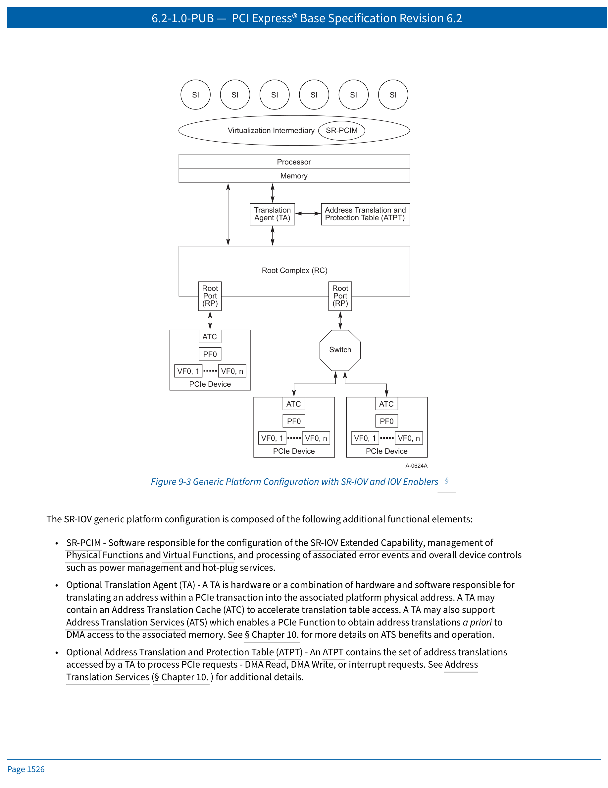
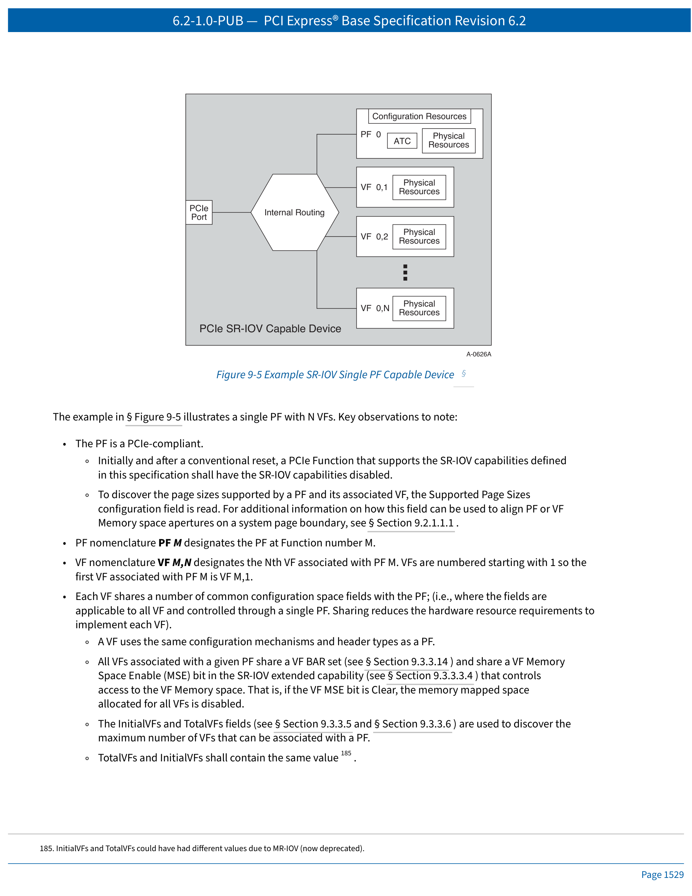
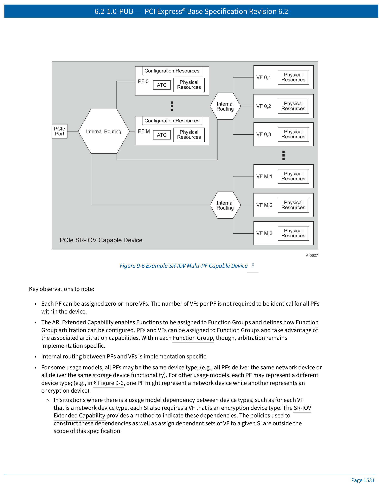
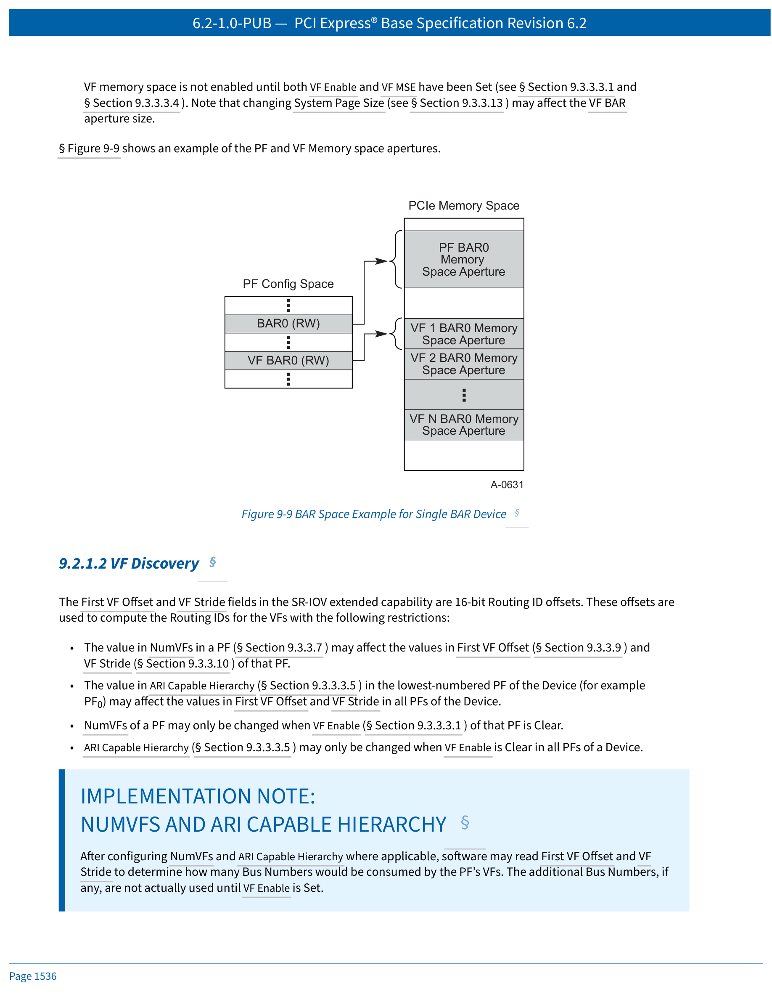
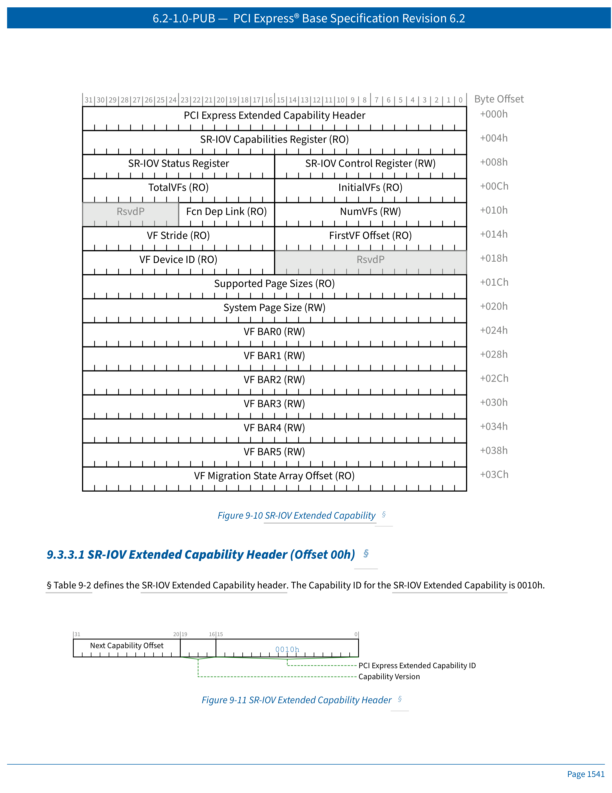
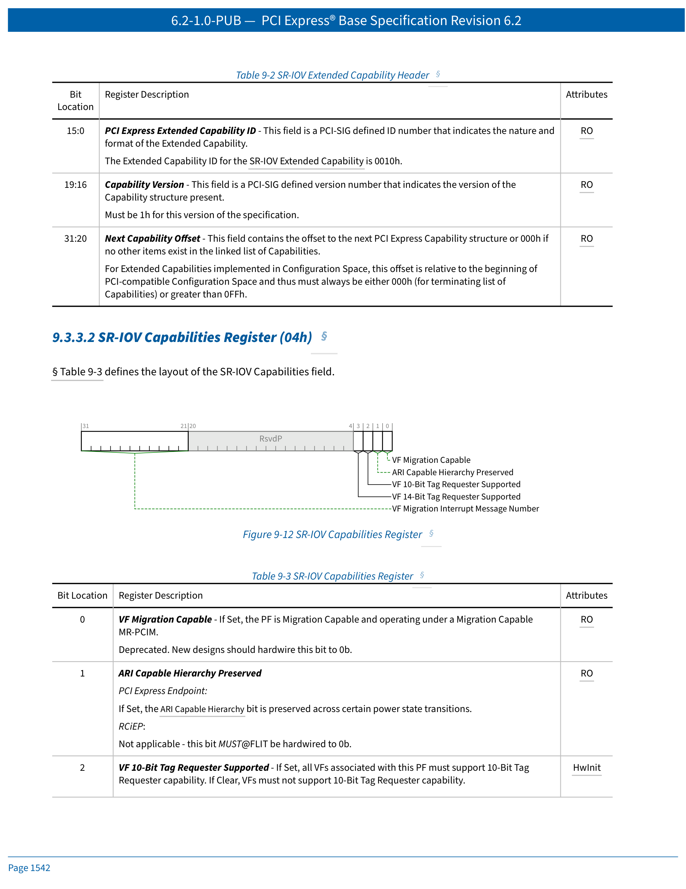
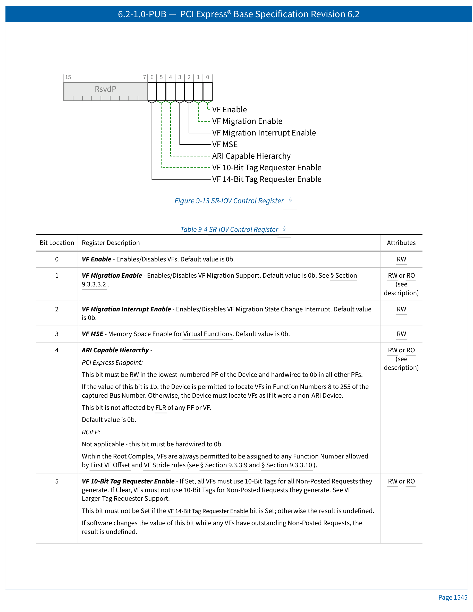

# PCI Express Base Specification 6.2 — Chapter 9
# Single Root I/O Virtualization and Sharing (SR-IOV)
# 单根 I/O 虚拟化与共享

> 中英文对照翻译 | Chinese-English Parallel Translation
>
> Source: NCB-PCI_Express_Base_6.2-2024-01-25.pdf, Pages 1523–1558

---

## Chapter 9. Single Root I/O Virtualization and Sharing
## 第 9 章 单根 I/O 虚拟化与共享

---

## 快速导航 | Quick Navigation

| 章节 | Section | 内容 |
|------|---------|------|
| [9.1](#91-sr-iov-architectural-overview) | Architectural Overview | SR-IOV 架构概述、PF/VF 概念、平台配置 |
| [9.2](#92-sr-iov-initialization-and-resource-allocation) | Initialization & Resource Allocation | 资源发现、VF BAR 机制、VF 发现、函数依赖、复位 |
| [9.3](#93-configuration) | Configuration | SR-IOV 扩展能力寄存器（15 个子寄存器详解） |

---

## 9.1 SR-IOV Architectural Overview
## 9.1 SR-IOV 架构概述

Within the industry, significant effort has been expended to increase the effective hardware resource utilization through the use of virtualization technology. **Single Root I/O Virtualization and Sharing (SR-IOV)** enables multiple System Images (SI) to share PCI hardware resources.

> 业界已投入大量精力通过虚拟化技术来提高硬件资源的有效利用率。**单根 I/O 虚拟化与共享（SR-IOV）** 使多个系统映像（SI）能够共享 PCI 硬件资源。

---

The generic platform configuration is composed of:

- PCIe Root Complex (RC): Processor, Memory, RCiEPs, Root Ports (each RP = separate hierarchy)
- PCIe Switch: I/O fan-out and connectivity
- PCIe Device: multiple I/O device types (network, storage, etc.)
- System Image (SI): software such as an OS used to execute applications or trusted services

> 通用平台配置包括：
>
> - PCIe 根复合体（RC）：处理器、内存、RCiEP、根端口（每个 RP 代表一个独立层级）
> - PCIe 交换机：I/O 扇出和连接
> - PCIe 设备：多种 I/O 设备类型（网络、存储等）
> - 系统映像（SI）：用于执行应用程序或可信服务的操作系统等软件

---

In order to increase hardware utilization without hardware modifications, multiple SI can be executed. Software termed a **Virtualization Intermediary (VI)** is interposed between the hardware and the SI. The VI takes sole ownership of the underlying hardware and abstracts it to present each SI with its own virtual system. However, for I/O intensive workloads, each I/O operation must be intercepted and processed by the VI, adding significant platform resource overhead.

> 为了在不需要硬件修改的情况下提高硬件利用率，可以运行多个 SI。一种称为**虚拟化中介（VI）** 的软件被插入到硬件和 SI 之间。VI 独占底层硬件并对其进行抽象，为每个 SI 呈现其自己的虚拟系统。然而，对于 I/O 密集型工作负载，每个 I/O 操作都必须被 VI 拦截和处理，从而增加了显著的平台资源开销。

---

### SR-IOV Benefits | SR-IOV 的优势

SR-IOV provides tools to reduce platform resource overheads:

1. **Eliminate VI involvement** in main data movement actions — DMA, Memory space access, interrupt processing, etc.
2. **Standardized method** to control SR-IOV resource configuration and management through **SR-PCIM** (Single Root PCI Manager).
3. **Reduce hardware requirements** and associated cost with provisioning a potentially significant number of I/O Functions within a device.
4. **Integrate with other I/O virtualization technologies** such as ATS, ATPT, and interrupt remapping to create robust, complete I/O virtualization solutions.

> SR-IOV 提供了减少平台资源开销的工具：
>
> 1. **消除 VI 参与**主要数据移动操作 — DMA、内存空间访问、中断处理等。
> 2. **标准化方法**通过 **SR-PCIM**（单根 PCI 管理器）控制 SR-IOV 资源配置和管理。
> 3. **减少硬件需求**及在设备内配置大量 I/O 功能的相关成本。
> 4. **与其他 I/O 虚拟化技术集成**，如 ATS、ATPT 和中断重映射，以创建健壮、完整的 I/O 虚拟化解决方案。

---

<p align="center">

<br><em>Figure 9-3 Generic Platform Configuration with SR-IOV and IOV Enablers | 图 9-3 SR-IOV 通用平台配置</em>
</p>

---

### SR-IOV Platform Functional Elements | SR-IOV 平台功能元素

- **SR-PCIM** — Software responsible for SR-IOV Extended Capability configuration, PF/VF management, error events, power management, and hot-plug services.
- **Translation Agent (TA)** — Hardware (or HW+SW) for translating PCIe transaction addresses into platform physical addresses. May contain ATC and support ATS.
- **Address Translation and Protection Table (ATPT)** — Contains address translations accessed by TA to process DMA and interrupt requests.
- **Address Translation Cache (ATC)** — Accelerates translation lookups within RC or Device.
- **Access Control Services (ACS)** — Control points to determine if a TLP should be routed normally, blocked, or redirected.
- **Physical Function (PF)** — PCIe Function supporting SR-IOV Extended Capability, accessible to SR-PCIM, VI, or SI.
- **Virtual Function (VF)** — "Light-weight" PCIe Function directly accessible by an SI.

> - **SR-PCIM** — 负责 SR-IOV 扩展能力配置、PF/VF 管理、错误事件以及电源管理和热插拔服务的软件。
> - **转换代理（TA）** — 负责将 PCIe 事务地址转换为平台物理地址的硬件（或硬件+软件组合）。可包含 ATC 并支持 ATS。
> - **地址转换与保护表（ATPT）** — 包含 TA 用于处理 DMA 和中断请求的地址转换。
> - **地址转换缓存（ATC）** — 在 RC 或设备内加速转换查找。
> - **访问控制服务（ACS）** — 用于确定 TLP 是否应正常路由、阻止或重定向的控制点。
> - **物理功能（PF）** — 支持 SR-IOV 扩展能力的 PCIe 功能，对 SR-PCIM、VI 或 SI 可访问。
> - **虚拟功能（VF）** — 可由 SI 直接访问的"轻量级"PCIe 功能。

---

### Key VF Properties | VF 关键属性

- Minimally, resources associated with main data movement are available to the SI. Configuration resources should be restricted to a trusted software component (VI or SR-PCIM).
- A VF can be serially shared by different SI (assigned to one SI, then reset and assigned to another).
- A VF can be optionally migrated from one PF to another PF.
- **All VFs associated with a PF must be the same device type as the PF.**

> - 最小的要求是，与主要数据移动相关的资源对 SI 可用。配置资源应仅限于可信软件组件（VI 或 SR-PCIM）。
> - VF 可由不同的 SI 串行共享（分配给一个 SI，然后复位并分配给另一个 SI）。
> - VF 可选择性地从一个 PF 迁移到另一个 PF。
> - **与 PF 关联的所有 VF 必须与 PF 具有相同的设备类型。**

---

### Naming Conventions | 命名约定

- **PF nomenclature**: PF M designates the PF at Function number M.
- **VF nomenclature**: VF M,N designates the Nth VF associated with PF M. VFs are numbered starting with 1.

> - **PF 命名**: PF M 表示功能号 M 处的 PF。
> - **VF 命名**: VF M,N 表示与 PF M 关联的第 N 个 VF。VF 编号从 1 开始。

---

### Device Architecture Examples | 设备架构示例

<p align="center">

<br><em>Figure 9-5 Single PF Device | 图 9-5 单 PF 设备</em>
</p>

---

Key observations for Single PF device (Figure 9-5):

- Initially and after a conventional reset, SR-IOV capabilities are disabled.
- Each VF shares common configuration space fields with the PF, reducing hardware resource requirements.
- All VFs associated with a given PF share a VF BAR set and share a VF Memory Space Enable (MSE) bit.
- InitialVFs and TotalVFs shall contain the same value.
- Each VF contains non-shared physical resources (work queues, data buffers, etc.) directly accessible by an SI.

> 单 PF 设备的关键观察点（图 9-5）：
>
> - 初始状态和常规复位后，SR-IOV 能力处于禁用状态。
> - 每个 VF 与 PF 共享通用配置空间字段，减少了实现每个 VF 的硬件资源需求。
> - 与给定 PF 关联的所有 VF 共享一个 VF BAR 集，并共享一个 VF 内存空间使能（MSE）位。
> - InitialVFs 和 TotalVFs 应包含相同的值。
> - 每个 VF 包含可由 SI 直接访问的非共享物理资源（工作队列、数据缓冲区等）。

---

<p align="center">

<br><em>Figure 9-6 Multi-PF Device | 图 9-6 多 PF 设备</em>
</p>

---

Key observations for Multi-PF device (Figure 9-6):

- Each PF can be assigned zero or more VFs; counts need not be identical across PFs.
- ARI Extended Capability enables Functions to be assigned to Function Groups.
- Internal routing between PFs and VFs is implementation specific.
- Each PF may represent a different device type (e.g., network vs. encryption).

> 多 PF 设备的关键观察点（图 9-6）：
>
> - 每个 PF 可分配零个或多个 VF；各 PF 的 VF 数量不必相同。
> - ARI 扩展能力使功能可分配到功能组。
> - PF 和 VF 之间的内部路由是实现特定的。
> - 每个 PF 可代表不同的设备类型（如网络 vs. 加密）。

---

### Device Function Mix | 设备功能组合

- Using ARI capability, a device may support up to **256 PFs**.
- A PF can only be associated with the Device's captured Bus Number.
- SR-IOV Devices may consume more than one Bus Number — enabling support for a very large number of VFs.
- Function 0 may be a PF; any mix of Functions can be associated with the captured Bus Number.
- Non-VFs can only be associated with the captured Bus Number.

> - 使用 ARI 能力，设备可支持最多 **256 个 PF**。
> - PF 只能与设备的捕获总线号关联。
> - SR-IOV 设备可使用多个总线号 — 从而支持非常多的 VF。
> - 功能 0 可以是 PF；任何功能组合都可与捕获总线号关联。
> - 非 VF 功能只能与捕获总线号关联。

---

## 9.2 SR-IOV Initialization and Resource Allocation
## 9.2 SR-IOV 初始化与资源分配

### 9.2.1 SR-IOV Resource Discovery | 资源发现

The NumVFs field defines the number of VFs enabled when VF Enable is Set in the associated PF. Before enabling a PF's IOV capabilities, the System Page Size field must be configured.

> NumVFs 字段定义了当关联 PF 的 VF Enable 置位时启用的 VF 数量。在启用 PF 的 IOV 能力之前，必须配置 System Page Size 字段。

---

#### 9.2.1.1.1 Configuring the VF BAR Mechanisms | 配置 VF BAR 机制

VFs do not support I/O Space — VF BARs shall not indicate I/O Space. The behavior of VF BARs is the same as normal PCI Memory Space BARs, except that a VF BAR describes the aperture for **each** VF, whereas a PCI BAR describes the aperture for a single Function.

> VF 不支持 I/O 空间 — VF BAR 不得指示 I/O 空间。VF BAR 的行为与普通 PCI 内存空间 BAR 相同，区别在于 VF BAR 描述的是**每个** VF 的孔径，而 PCI BAR 描述的是单个功能的孔径。

---

**VF BAR starting address formula | VF BAR 起始地址公式：**

```
BARb VFv starting address = VF BARb + (v - 1) × (VF BARb aperture size)
```

Where VF BARb aperture size is determined by the usual BAR probing algorithm (write all 1s, read back).

> 其中 VF BARb 孔径大小通过常规 BAR 探测算法确定（写全 1，读回）。

---

VF memory space is not enabled until **both VF Enable and VF MSE** have been Set.

> VF 内存空间在 **VF Enable 和 VF MSE 均置位**之前不会启用。

---

<p align="center">

<br><em>Figure 9-9 BAR Space Example for Single BAR Device | 图 9-9 单 BAR 设备 BAR 空间示例</em>
</p>

---

#### 9.2.1.2 VF Discovery | VF 发现

**Table 9-1 VF Routing ID Algorithm | 表 9-1 VF 路由 ID 算法**

| VF Number | VF Routing ID |
|-----------|---------------|
| VF 1 | (PF Routing ID + First VF Offset) Modulo 2^16 |
| VF 2 | (PF Routing ID + First VF Offset + VF Stride) Modulo 2^16 |
| VF N | (PF Routing ID + First VF Offset + (N-1) × VF Stride) Modulo 2^16 |

All arithmetic is 16-bit unsigned, dropping all carries. All VFs and PFs must have distinct Routing IDs.

> 所有算术运算均为 16 位无符号，丢弃所有进位。所有 VF 和 PF 必须具有不同的路由 ID。

---

Key constraints:

- VF Stride and First VF Offset are constants.
- VFs may reside on different Bus Number(s) than the associated PF.
- A VF shall not be located on a Bus Number numerically smaller than its associated PF.
- All PFs must be located on the Device's captured Bus Number.

> 关键约束：
>
> - VF Stride 和 First VF Offset 是常量。
> - VF 可位于与关联 PF 不同的总线号上。
> - VF 不得位于数值小于其关联 PF 的总线号上。
> - 所有 PF 必须位于设备的捕获总线号上。

---

#### 9.2.2 SR-IOV Reset Mechanisms | SR-IOV 复位机制

- **Conventional Reset**: All Functions, PFs, and VFs are reset.
- **FLR That Targets a VF**: Resets only that VF.
- **FLR That Targets a PF**: Resets the PF and all its associated VFs.

> - **常规复位**：所有功能、PF 和 VF 均被复位。
> - **针对 VF 的 FLR**：仅复位该 VF。
> - **针对 PF 的 FLR**：复位该 PF 及其所有关联的 VF。

---

## 9.3 Configuration
## 9.3 配置

### 9.3.3 SR-IOV Extended Capability | SR-IOV 扩展能力

<p align="center">

<br><em>Figure 9-10 SR-IOV Extended Capability Structure | 图 9-10 SR-IOV 扩展能力结构</em>
</p>

---

#### Register Summary | 寄存器摘要

| Offset | Register | Description |
|--------|----------|-------------|
| 00h | Extended Capability Header | PCIe Extended Capability ID = 0010h |
| 04h | Capabilities Register | VF Migration, ARI Capable Hierarchy, VF Larger-Tag Requester Support |
| 08h | Control Register | VF Enable, VF Migration Enable/Interrupt, VF MSE, ARI Capable Hierarchy |
| 0Ah | Status Register | VF Migration Status |
| 0Ch | InitialVFs | Initial number of VFs (same as TotalVFs) |
| 0Eh | TotalVFs | Total number of VFs supported |
| 10h | NumVFs | Number of VFs enabled |
| 12h | Function Dependency Link | Dependency list pointer |
| 14h | First VF Offset | Routing ID offset for first VF |
| 16h | VF Stride | Routing ID stride between VFs |
| 1Ah | VF Device ID | Device ID for all VFs |
| 1Ch | Supported Page Sizes | Page sizes supported by PF and VFs |
| 20h | System Page Size | System page size for VF alignment |
| 24h-38h | VF BAR0–BAR5 | VF Base Address Registers |
| 3Ch | VF Migration State Array Offset | Deprecated |

---

#### 9.3.3.1 Extended Capability Header (00h) | 扩展能力头部

- PCI Express Extended Capability ID = **0010h** (SR-IOV)
- Capability Version = 1h
- Next Capability Offset: pointer to next extended capability

---

#### 9.3.3.2 SR-IOV Capabilities Register (04h) | 能力寄存器

<p align="center">

<br><em>Figure 9-12 SR-IOV Capabilities Register | 图 9-12 SR-IOV 能力寄存器</em>
</p>

| Bit | Field | Description |
|-----|-------|-------------|
| 0 | VF Migration Capable | PF supports VF Migration (optional) |
| 1 | ARI Capable Hierarchy Preserved | ARI Capable Hierarchy bit preserved across VF Migration |
| 2 | VF Larger-Tag Requester Support (2:1) | 00b=Not supported, 01b=10-bit, 10b=10/14-bit |
| 21:5 | VF Migration Interrupt Message Number | MSI/MSI-X vector for migration interrupt |

---

#### 9.3.3.3 SR-IOV Control Register (08h) | 控制寄存器

<p align="center">

<br><em>Figure 9-13 SR-IOV Control Register | 图 9-13 SR-IOV 控制寄存器</em>
</p>

| Bit | Field | Description |
|-----|-------|-------------|
| 0 | **VF Enable** | 0=Disabled (default); 1=VFs enabled |
| 1 | VF Migration Enable | Enable VF Migration (optional) |
| 2 | VF Migration Interrupt Enable | Enable migration interrupt |
| 3 | **VF MSE** | VF Memory Space Enable (global for all VFs of this PF) |
| 4 | **ARI Capable Hierarchy** | 0=ARI not used; 1=ARI used for VF Routing IDs |

---

##### VF Enable (Bit 0) | VF 使能

When Set, VFs are enabled. NumVFs must be ≤ TotalVFs. VF Enable must be Clear to modify NumVFs, First VF Offset, VF Stride, and System Page Size. When transitioning from Set to Clear, all VFs are reset.

> 置位时，VF 被启用。NumVFs 必须 ≤ TotalVFs。要修改 NumVFs、First VF Offset、VF Stride 和 System Page Size 时，VF Enable 必须先清零。从置位转到清零时，所有 VF 被复位。

---

##### VF MSE — Memory Space Enable (Bit 3) | VF 内存空间使能

Controls access to VF Memory space. If Clear, memory mapped space allocated for all VFs of this PF is disabled. This is a global control for all VFs associated with the PF.

> 控制对 VF 内存空间的访问。如果清零，则此 PF 的所有 VF 分配的内存映射空间被禁用。这是针对与 PF 关联的所有 VF 的全局控制。

---

##### ARI Capable Hierarchy (Bit 4) | ARI 能力层级

When Set, VF Routing IDs are assigned using ARI. This bit may only be changed when VF Enable is Clear in **all** PFs of a Device. When ARI Capable Hierarchy is Set, VF Stride must be set to 1.

> 置位时，VF 路由 ID 使用 ARI 分配。此位只能在设备**所有** PF 的 VF Enable 为 Clear 时更改。当 ARI Capable Hierarchy 置位时，VF Stride 必须设为 1。

---

#### 9.3.3.5–9.3.3.10 Key Fields | 关键字段

- **InitialVFs (0Ch)**: Initial number of VFs associated with PF. Must equal TotalVFs.
- **TotalVFs (0Eh)**: Total number of VFs that can be associated with PF.
- **NumVFs (10h)**: Number of VFs currently enabled.
- **Function Dependency Link (12h)**: Pointer to Function Dependency List.
- **First VF Offset (14h)**: Routing ID offset for first VF.
- **VF Stride (16h)**: Routing ID stride between consecutive VFs.

> - **InitialVFs**：与 PF 关联的初始 VF 数量。必须等于 TotalVFs。
> - **TotalVFs**：可与 PF 关联的 VF 总数。
> - **NumVFs**：当前启用的 VF 数量。
> - **Function Dependency Link**：函数依赖列表指针。
> - **First VF Offset**：第一个 VF 的路由 ID 偏移量。
> - **VF Stride**：连续 VF 之间的路由 ID 步幅。

---

#### 9.3.3.12–9.3.3.13 Page Sizes | 页面大小

- **Supported Page Sizes (1Ch)**: Bitmap of page sizes supported by PF and VFs.
- **System Page Size (20h)**: Page size the system uses to align VF memory addresses. Must be one of the supported page sizes.

> - **Supported Page Sizes**：PF 和 VF 支持的页面大小的位图。
> - **System Page Size**：系统用于对齐 VF 内存地址的页面大小。必须为支持的页面大小之一。

---

#### 9.3.3.14 VF BARs (24h–38h) | VF 基地址寄存器

VF BAR0 through VF BAR5. The behavior for determining memory aperture and assigning starting address follows the same rules as normal PCI BARs (Section 7.5.1.2.1), with the extension that memory space for VFv is calculated as:

```
BARb VFv starting address = VF BARb + (v - 1) × (VF BARb aperture size)
```

---

### 9.3.4 PF/VF Configuration Space Header | PF/VF 配置空间头部

PF configuration space uses Type 0/1 headers. VFs use a reduced configuration space — they have a minimal header and rely on the PF for shared fields.

> PF 配置空间使用 Type 0/1 头部。VF 使用精简的配置空间 — 它们有最小头部，并依赖 PF 获取共享字段。

---

### 9.3.5–9.3.7 Capability Changes | 能力变更

- **PCI Express Capability**: VFs do not implement the PCI Express Capability. Link control is managed through the associated PF.
- **PCI Standard Capabilities**: MSI, MSI-X, and PM are supported for VFs. VFs do not support VPD capability.
- **PCI Express Extended Capabilities**: VFs support AER, ARI. VFs do not support most other extended capabilities.

> - **PCI Express 能力**：VF 不实现 PCI Express 能力。链路控制通过关联的 PF 进行管理。
> - **PCI 标准能力**：VF 支持 MSI、MSI-X 和 PM。VF 不支持 VPD 能力。
> - **PCI Express 扩展能力**：VF 支持 AER、ARI。VF 不支持大多数其他扩展能力。

---

## Appendix: Key Acronyms | 附录：关键缩略语

| 缩略语 | 全称 (English) | 中文翻译 |
|--------|---------------|---------|
| SR-IOV | Single Root I/O Virtualization and Sharing | 单根 I/O 虚拟化与共享 |
| PF | Physical Function | 物理功能 |
| VF | Virtual Function | 虚拟功能 |
| SI | System Image | 系统映像 |
| VI | Virtualization Intermediary | 虚拟化中介 |
| SR-PCIM | Single Root PCI Manager | 单根 PCI 管理器 |
| TA | Translation Agent | 转换代理 |
| ATC | Address Translation Cache | 地址转换缓存 |
| ATPT | Address Translation and Protection Table | 地址转换与保护表 |
| ATS | Address Translation Services | 地址转换服务 |
| ACS | Access Control Services | 访问控制服务 |
| ARI | Alternative Routing Identifier | 替代路由标识符 |
| BAR | Base Address Register | 基地址寄存器 |
| MSE | Memory Space Enable | 内存空间使能 |
| FLR | Function Level Reset | 功能级复位 |
| AER | Advanced Error Reporting | 高级错误报告 |
| RC | Root Complex | 根复合体 |
| RP | Root Port | 根端口 |

---

> **Translator's Notes | 译者说明**
>
> 本文档翻译自 PCI Express Base Specification Revision 6.2 (January 25, 2024) 第 9 章全文 (Pages 1523–1558)。
