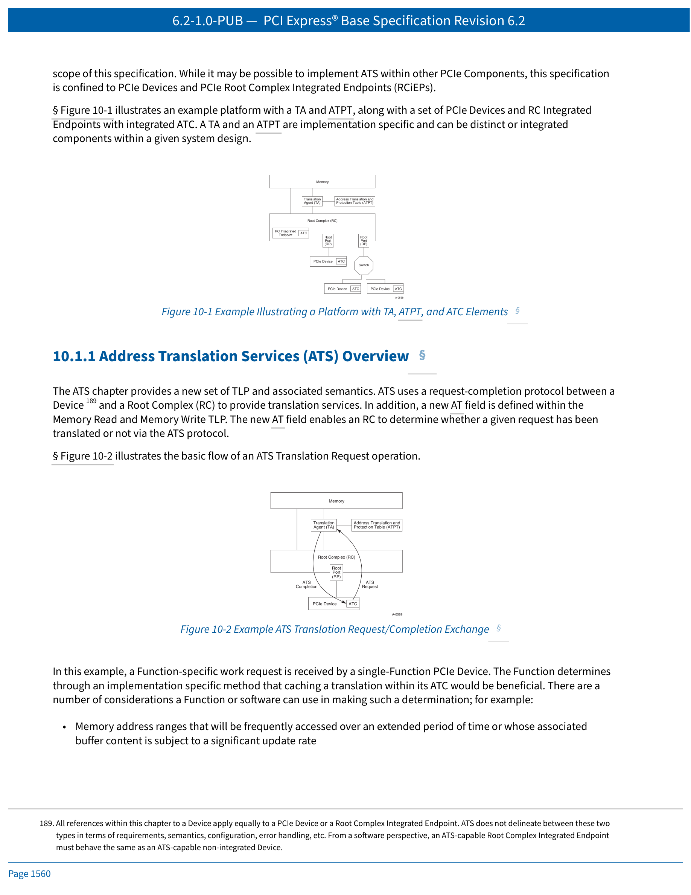
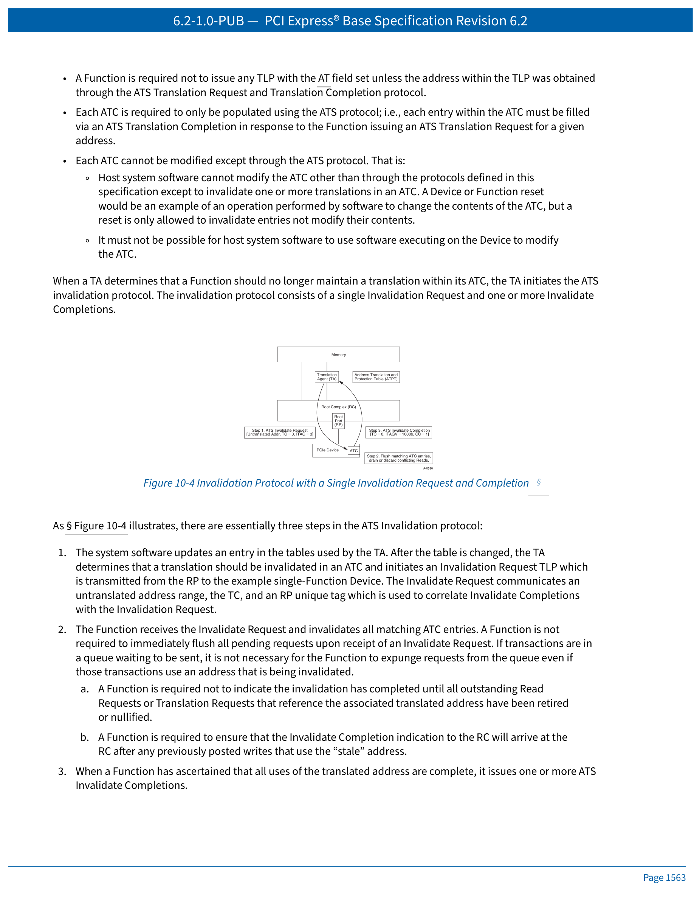
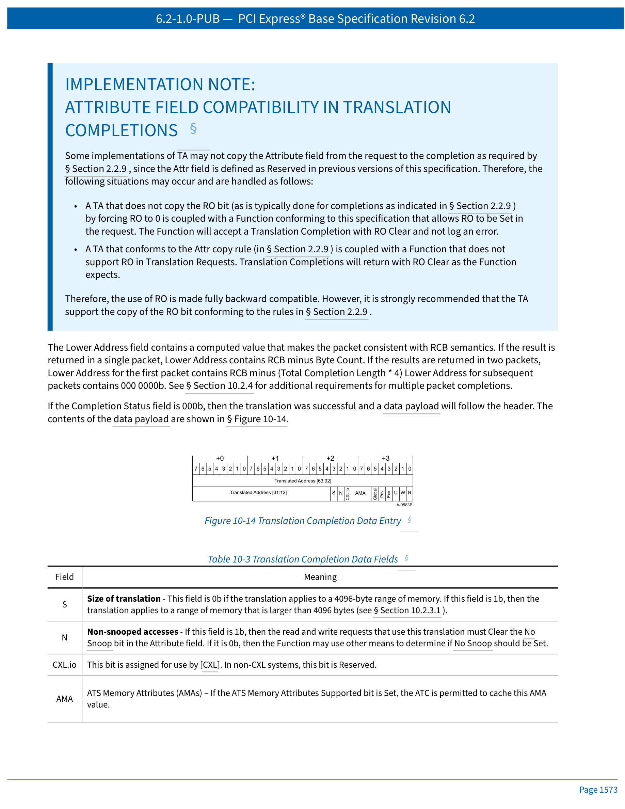
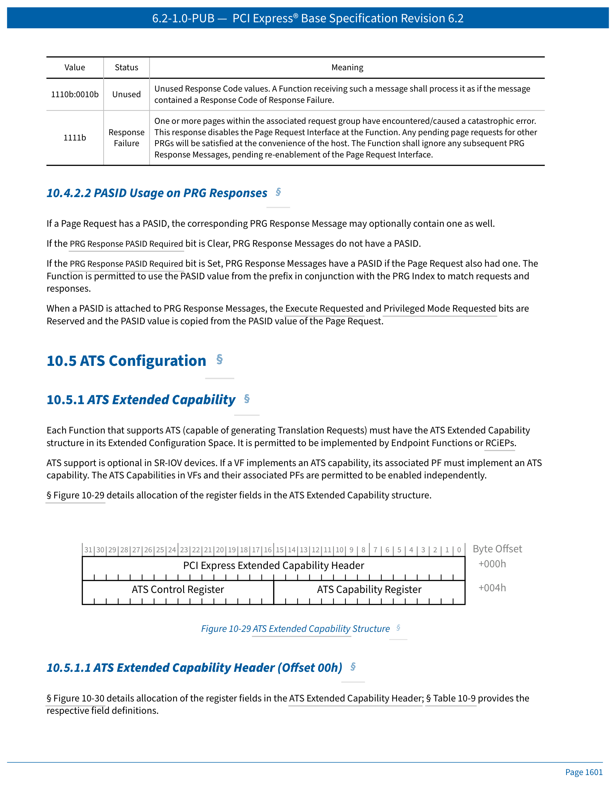

# PCI Express Base Specification 6.2 — Chapter 10
# Address Translation Services (ATS)
# 地址转换服务

> 中英文对照翻译 | Chinese-English Parallel Translation
>
> Source: NCB-PCI_Express_Base_6.2-2024-01-25.pdf, Pages 1559–1608

---

## Chapter 10. Address Translation Services (ATS)
## 第 10 章 地址转换服务

---

## 快速导航 | Quick Navigation

| 章节 | Section | 内容 |
|------|---------|------|
| [10.1](#101-ats-architectural-overview) | Architectural Overview | ATS 架构概述、ATC、PASID、内存属性 |
| [10.2](#102-ats-translation-services) | Translation Services | 地址类型、翻译请求/完成、内存属性 |
| [10.3](#103-ats-invalidation) | Invalidation | 作废请求/完成、流控、排序语义 |
| [10.4](#104-page-request-services) | Page Request Services | 页面请求消息、PRG 响应 |
| [10.5](#105-ats-configuration) | Configuration | ATS 扩展能力、Page Request 扩展能力 |

---

## 10.1 ATS Architectural Overview
## 10.1 ATS 架构概述

Most contemporary system architectures make provisions for translating addresses from DMA (bus mastering) I/O Functions. The address programmed into an I/O Function is a "handle" that is processed by the Root Complex (RC) — the result is often a translation to a physical memory address. Typically, processing includes access rights checking to ensure the DMA Function is allowed to access the referenced memory.

> 大多数当代系统架构都为 DMA（总线主控）I/O 功能的地址转换提供了支持。I/O 功能中编程的地址是一个"句柄"，由根复合体（RC）进行处理 — 其结果通常是转换为物理内存地址。通常处理过程还包括访问权限检查，以确保 DMA 功能被允许访问所引用的内存。

---

Purposes for DMA address translation include:

1. Limiting the destructiveness of a "broken" or misprogrammed DMA I/O Function
2. Providing for scatter/gather
3. Ability to redirect MSI/MSI-X to different address ranges without coordinating with the I/O Function
4. Address space conversion (32-bit I/O Function to larger system address space)
5. Virtualization support

> DMA 地址转换的目的包括：
>
> 1. 限制"损坏"或编程错误的 DMA I/O 功能的破坏性
> 2. 提供 scatter/gather 支持
> 3. 能够将 MSI/MSI-X 重定向到不同地址范围，无需与 I/O 功能协调
> 4. 地址空间转换（32 位 I/O 功能到更大的系统地址空间）
> 5. 虚拟化支持

---

Irrespective of the motivation, DMA address translation has performance implications. Depending on the implementation, DMA access time can be significantly lengthened due to time required to resolve the actual physical address. To mitigate these impacts, designs often include address translation caches — for I/O, this cache is termed the **Address Translation Cache (ATC)**.

> 无论动机如何，DMA 地址转换都会对性能产生影响。根据实现的不同，由于解析实际物理地址所需的时间，DMA 访问时间可能显著延长。为了减轻这些影响，设计通常包括地址转换缓存 — 对于 I/O，此缓存称为**地址转换缓存（ATC）**。

---

### 10.1.1 Address Translation Services (ATS) Overview
### 10.1.1 地址转换服务（ATS）概述

The mechanisms described in this specification allow an I/O Device to participate in the translation process and provide an ATC for its own memory accesses. Benefits of having an ATC within a Device include:

1. Alleviate TA resource pressure by distributing address translation caching responsibility
2. Enable ATC Devices to have less performance dependency on a system's ATC size
3. Potential to ensure optimal access latency by sending pretranslated requests

> 本规范中描述的机制允许 I/O 设备参与转换过程，并为其自身的内存访问提供 ATC。设备内具有 ATC 的好处包括：
>
> 1. 通过分散地址转换缓存责任来减轻 TA 资源压力
> 2. 使 ATC 设备对系统 ATC 大小的性能依赖性降低
> 3. 通过发送已预转换的请求，有可能确保最优的访问延迟

---

 <em>Figure 10-1 Platform with TA, ATPT, and ATC | 图 10-1 含 TA、ATPT 和 ATC 的平台</em>

---

### ATS Translation Request Flow | ATS 翻译请求流程

ATS uses a request-completion protocol between a Device and a Root Complex (RC) to provide translation services. A new **AT (Address Type)** field is defined within the Memory Read and Memory Write TLP header.

> ATS 使用设备和根复合体（RC）之间的请求-完成协议来提供转换服务。在内存读写 TLP 头部定义了一个新的 **AT（地址类型）** 字段。

---

Upon receipt of an ATS Translation Request, the TA performs:

1. Validates that the Function has been configured to issue ATS Translation Requests.
2. Determines whether the Function may access the memory and has the associated access rights.
3. Determines whether a translation can be provided.
4. Communicates success or failure via an ATS Translation Completion.

> TA 收到 ATS 翻译请求后执行：
>
> 1. 验证功能已被配置为可发出 ATS 翻译请求。
> 2. 确定功能是否可以访问内存并具有相关的访问权限。
> 3. 确定是否可以提供转换。
> 4. 通过 ATS 翻译完成来通信成功或失败。

---

Key rules:

- ATS must support a variety of page sizes (minimum 4096 bytes, power of two, naturally aligned).
- RC must generate at least one ATS Translation Completion per ATS Translation Request (1:1 minimum).
- A successful translation can result in one or two ATS Translation Completion TLPs.
- RC must transmit completions using the same TC as the corresponding request.

> 关键规则：
>
> - ATS 必须支持多种页面大小（最小 4096 字节，2 的幂，自然对齐）。
> - RC 必须为每个 ATS 翻译请求生成至少一个 ATS 翻译完成（最少 1:1）。
> - 成功的转换可产生一到两个 ATS 翻译完成 TLP。
> - RC 必须使用与相应请求相同的 TC 发送完成。

---

### ATS Invalidation Protocol | ATS 作废协议

When the TA needs to modify or invalidate translations cached in a device's ATC, it issues an **Invalidate Request**. The Function must respond with an **Invalidate Completion** after flushing any outstanding Translated Requests that use the translation being invalidated.

> 当 TA 需要修改或作废缓存在设备 ATC 中的转换时，它会发出**作废请求（Invalidate Request）**。功能在刷新完使用被作废转换的所有未完成的已转换请求后，必须以**作废完成（Invalidate Completion）** 响应。

---

 <em>Figure 10-4 Invalidation Protocol | 图 10-4 作废协议</em>

---

### 10.1.2 Page Request Interface Extension | 页面请求接口扩展

ATS supports a **Page Request Interface (PRI)** extension that enables a Function to request memory pages from the host system. This is especially beneficial for Functions supporting Shared Virtual Memory (SVM) where address translation page faults may occur.

> ATS 支持**页面请求接口（PRI）** 扩展，使功能能够向主机系统请求内存页面。这对于支持共享虚拟内存（SVM）的功能特别有益，因为在这种情况下可能发生地址转换页面错误。

---

### 10.1.3 Process Address Space ID (PASID) | 进程地址空间 ID

Certain TLPs can optionally be associated with a **Process Address Space ID (PASID)**. PASID is a 20-bit field conveyed via the PASID TLP Prefix (Non-Flit Mode) or OHC-A (Flit Mode). Each Function has an independent set of PASID values.

> 某些 TLP 可选择性地与**进程地址空间 ID（PASID）** 关联。PASID 是一个 20 位字段，通过 PASID TLP 前缀（Non-Flit Mode）或 OHC-A（Flit Mode）传递。每个功能具有独立的 PASID 值集。

---

PASID is permitted for: Memory Requests (AT=Untranslated/Translated), Address Translation Requests, Page Request Messages, ATS Invalidation Request Messages, and PRG Response Messages.

> PASID 可用于：内存请求（AT=未转换/已转换）、地址转换请求、页面请求消息、ATS 作废请求消息和 PRG 响应消息。

---

### 10.1.4 ATS Memory Attributes (AMAs) | ATS 内存属性

AMAs provide hints for performing memory operations such as cache management. If the ATS Memory Attributes Enable bit is Set, the Endpoint function retrieves AMAs from the ATC and may provide them with Memory TLPs using the TPH TLP Prefix.

> AMA 为执行内存操作（如缓存管理）提供提示。如果 ATS 内存属性使能位置位，端点功能从 ATC 中检索 AMA，并可使用 TPH TLP 前缀随内存 TLP 提供这些属性。

---

## 10.2 ATS Translation Services
## 10.2 ATS 转换服务

### 10.2.1 Memory Requests with Address Type | 带地址类型的内存请求

A Function with an ATC can send Memory Requests that contain either translated or untranslated addresses. The Address Type (AT) field indicates the type:

| AT Value | Address Type | Description |
|----------|-------------|-------------|
| 00b | Untranslated (default) | Address is untranslated; TA must translate |
| 01b | Translation Request | This is an ATS Translation Request, not a memory access |
| 10b | Translated | Address has been translated via ATS; TA may bypass translation |

> 具有 ATC 的功能可以发送包含已转换或未转换地址的内存请求。AT 字段指示地址类型：
>
> | AT 值 | 地址类型 | 描述 |
> |-------|---------|------|
> | 00b | 未转换（默认） | 地址未转换；TA 必须进行转换 |
> | 01b | 翻译请求 | 这是一条 ATS 翻译请求，非内存访问 |
> | 10b | 已转换 | 地址已通过 ATS 转换；TA 可跳过转换 |

---

### 10.2.2 Translation Requests | 翻译请求

ATS Translation Requests are Memory Read Requests with AT=01b. Key fields in the request:

- **Attribute Field**: Indicates PASID present, NW flag, execute requested, privileged mode requested
- **Length Field**: Must be 1 DW
- **Tag Field**: Function-assigned tag to match completions
- **Untranslated Address**: The address to be translated
- **NW Flag (No Write)**: If Set, Function requests read-only access
- **PASID**: Optional process address space identifier

> ATS 翻译请求是 AT=01b 的内存读请求。请求中的关键字段：
>
> - **属性字段**：指示 PASID 存在、NW 标志、执行请求、特权模式请求
> - **长度字段**：必须为 1 DW
> - **标签字段**：功能分配的标签，用于匹配完成
> - **未转换地址**：待转换的地址
> - **NW 标志（No Write）**：置位时，功能仅请求只读访问
> - **PASID**：可选的进程地址空间标识符

---

### 10.2.3 Translation Completion | 翻译完成

 <em>Figure 10-14 Translation Completion Data Entry | 图 10-14 翻译完成数据条目</em>

---

Key Translation Completion fields:

| Field | Description |
|-------|-------------|
| **Translated Address** | The translated physical address |
| **S (Translation Range Size)** | Indicates the page size of translation: 0=4KB, 1=8KB, 2=16KB, ... |
| **N (Non-snooped)** | If Set, memory accesses need not be snooped |
| **U (Untranslated Access Only)** | If Set, Function may only issue Untranslated Requests |
| **R (Read)** | Read access permitted |
| **W (Write)** | Write access permitted |
| **Exe (Execute Permitted)** | Execute permitted |
| **Priv (Privileged Mode Access)** | Privileged mode access permitted |
| **Global (Global Mapping)** | Translation applies to all PASIDs |

> 关键翻译完成字段：
>
> | 字段 | 描述 |
> |------|------|
> | **已转换地址** | 转换后的物理地址 |
> | **S（转换范围大小）** | 指示转换的页面大小 |
> | **N（非监听）** | 置位时，内存访问无需被监听 |
> | **U（仅未转换访问）** | 置位时，功能仅可发出未转换请求 |
> | **R（读）** | 允许读访问 |
> | **W（写）** | 允许写访问 |
> | **Exe（允许执行）** | 允许执行 |
> | **Priv（特权模式访问）** | 允许特权模式访问 |
> | **Global（全局映射）** | 转换适用于所有 PASID 值 |

---

### 10.2.4 Completions with Multiple Translations
### 10.2.4 多翻译完成

An ATC is allowed to request that the TA provide translations for a virtually contiguous range of addresses. It does this by setting the Length field in the Translation Request to a value that is two times the number of requested translations as long as the request size (Total Completion Length × 4) is not larger than Read Completion Boundary (RCB) in the Link Control Register.

> ATC 允许请求 TA 为一个虚拟连续的地址范围提供转换。它通过将翻译请求中的 Length 字段设置为请求的转换数量的两倍来实现，只要请求大小（Total Completion Length × 4）不大于链路控制寄存器中的读完成边界（RCB）即可。

---

If multiple translations are requested, the TA may return one or more translations as long as the number of translations does not exceed the number of requested translations. It is not an error for the TA to return fewer translations than requested and no error indication is sent unless there is an error in accessing the data.

> 如果请求了多个转换，TA 可以返回一个或多个转换，只要转换的数量不超过请求的转换数量。TA 返回的转换数量少于请求的数量不算错误，除非在访问数据时发生错误，否则不发送错误指示。

---

If the Translation Completion contains multiple translations, all translations must have the same indicated size. Also, successive translations must apply to the virtual address range that abuts the previous translation in the same completion.

> 如果翻译完成包含多个转换，所有转换必须具有相同的指示大小。此外，连续的转换必须应用于与同一完成中的前一个转换相邻的虚拟地址范围。

---

If a translation has both R = 0b and W = 0b, the TA must still set the Size field and the lower bits of the Translated Address field used to encode the completion size to appropriate values.

> 如果某个转换同时具有 R = 0b 和 W = 0b，TA 仍必须将 Size 字段和用于编码完成大小的已转换地址字段的低位设置为适当的值。

---

Each translation in a Translation Completion will have some overlap with the implied memory range of the Translation Request (see Section 10.2.2).

> 翻译完成中的每个转换都会与翻译请求所隐含的内存范围有一些重叠（见第 10.2.2 节）。

---

A successful Translation Completion must consist of one or two CplDs. Each CplD must contain an integral number of Translations (i.e., Length must be a multiple of 2).

> 成功的翻译完成必须由一个或两个 CplD 组成。每个 CplD 必须包含整数数量的转换（即 Length 必须是 2 的倍数）。

---

The TA is permitted to choose:

1. The number of translations it returns for each Translation Request (e.g., Byte Count of the first or only CplD)
2. If it returns more than one translation, whether it uses one or two CplDs
3. If it returns two CplDs, how many translations are returned in each CplD

> TA 可以选择：
>
> 1. 为每个翻译请求返回的转换数量（例如，第一个或唯一 CplD 的 Byte Count）
> 2. 如果返回多个转换，是使用一个还是两个 CplD
> 3. 如果返回两个 CplD，每个 CplD 中返回多少转换

---

The Byte Count and Length fields in each CplD are used to convey these choices to the ATC. The Lower Address field should not be needed by the ATC (its value is computed as defined in Section 10.2.3 to satisfy RCB rules but the field otherwise conveys no additional information).

> 每个 CplD 中的 Byte Count 和 Length 字段用于向 ATC 传达这些选择。ATC 不应需要 Lower Address 字段（其值按照第 10.2.3 节的定义计算以满足 RCB 规则，但该字段除此之外不传达任何额外信息）。

---

- If a Translation Completion CplD has a Byte Count that is greater than four times the Length field, then this is the **first of two CplDs** for the transaction.
- If a Translation Completion CplD has a Byte Count that is equal to four times the Length field, then this is the **second or only CplD** for the request.

> - 如果翻译完成 CplD 的 Byte Count 大于 Length 字段的四倍，则这是该事务的**两个 CplD 中的第一个**。
> - 如果翻译完成 CplD 的 Byte Count 等于 Length 字段的四倍，则这是该请求的**第二个或唯一一个 CplD**。

---

Note: There are multiple reasons that the TA may truncate the results of the completion. For example, the request might ask for a range of addresses, not all of which are defined. This could occur if the first translation is valid but located at the end of a page of translations. The TA, in looking up the next page of translations, may find that the page is not valid so the addresses are not valid. The range of addresses that are valid would be returned and no error indicated. When truncating a Translation Completion the TA is not allowed to pad the response with invalid entries (R = 0b, W = 0b).

> 注意：TA 可能截断完成结果的原因有多种。例如，请求可能要求一个地址范围但并非所有地址都已定义。如果第一个转换有效但位于转换页面的末尾，就可能发生这种情况。TA 在查找下一页转换时，可能发现该页面无效，因此地址无效。有效的地址范围将被返回，并且不指示错误。当截断翻译完成时，TA 不允许用无效条目（R = 0b, W = 0b）填充响应。

---

Note: There are multiple reasons that the TA may break a Translation Completion into multiple TLPs. As an example, if the virtual address of the Translation Completion resolves to a table access that crosses an implementation specific address boundary, the completion to the TA may be broken into two completions. Rather than require that the TA accumulate the results, the TA is permitted to send each portion of the Translation Completion to a Function when it is received from memory.

> 注意：TA 可能将翻译完成拆分为多个 TLP 的原因有多种。例如，如果翻译完成的虚拟地址解析为跨越了实现特定地址边界的页表访问，那么到 TA 的完成可能被拆分为两个完成。TA 不需要累积结果，而是允许在从内存接收到翻译完成的每个部分时直接将其发送给功能。

---

## 10.3 ATS Invalidation
## 10.3 ATS 作废

### 10.3.1 Invalidate Request | 作废请求

When the TA needs to modify translations cached in a device's ATC, it issues an Invalidate Request. The request specifies:

- **ITag**: Invalidation tag for matching completions
- **Untranslated Address / Range**: The address range to be invalidated
- **PASID**: Optional PASID scope
- **Global Invalidate**: If Set, all cached translations are invalidated

> 当 TA 需要修改缓存在设备 ATC 中的转换时，它发出作废请求。请求指定：
>
> - **ITag**：用于匹配完成的作废标签
> - **未转换地址/范围**：待作废的地址范围
> - **PASID**：可选的 PASID 范围
> - **全局作废**：置位时，所有缓存的转换都被作废

---

### 10.3.2 Invalidate Completion | 作废完成

The Function must issue an Invalidate Completion after:
1. Ensuring all outstanding Translated Requests that use the invalidated translation are completed
2. Removing the invalidated translations from its ATC

> 功能必须在以下操作后发出作废完成：
> 1. 确保使用被作废转换的所有未完成已转换请求已完成
> 2. 从其 ATC 中移除被作废的转换

---

### 10.3.3–10.3.6 Key Invalidation Rules | 关键作废规则

- **Flow Control**: A Function must accept at least 32 outstanding Invalidate Requests. The Outstanding Invalidate Request Count is reported through the Page Request Extended Capability.
- **Ordering**: Invalidate Requests must maintain ordering relative to other Invalidate Requests on the same TC. Invalidate Completions must be issued in the same order the Invalidate Requests were received.
- **Implicit Invalidation Events**: Function Level Reset, Conventional Reset, and disabling ATS all implicitly invalidate the entire ATC.

> - **流控**：功能必须接受至少 32 个未完成的作废请求。Outstanding Invalidate Request Count 通过 Page Request 扩展能力报告。
> - **排序**：作废请求必须保持相对于同一 TC 上其他作废请求的顺序。作废完成必须按接收作废请求的相同顺序发出。
> - **隐式作废事件**：功能级复位、常规复位和禁用 ATS 均隐式作废整个 ATC。

---

## 10.4 Page Request Services
## 10.4 页面请求服务

### 10.4.1 Page Request Message | 页面请求消息

The Page Request Interface enables Functions to request memory pages from the host. Page Request Messages are issued when a Function needs to access memory that is not currently mapped.

> 页面请求接口使功能能够向主机请求内存页面。当功能需要访问当前未映射的内存时，会发出页面请求消息。

---

Page Request Messages are grouped into **Page Request Groups (PRGs)**. Each PRG contains up to 64 individual page requests. Key PRG behavior:

- Functions may issue speculative page requests for performance
- Stop Marker Messages delineate PRG boundaries
- The TA responds with a **PRG Response** indicating success/failure

> 页面请求消息被分组到**页面请求组（PRG）** 中。每个 PRG 包含最多 64 个单独的页面请求。关键的 PRG 行为：
>
> - 功能可出于性能目的发出推测性页面请求
> - Stop Marker 消息分隔 PRG 边界
> - TA 以指示成功/失败的 **PRG 响应** 进行回复

---

### 10.4.2 Page Request Group Response | PRG 响应

The PRG Response Message reports the outcome of processing a PRG:

- **Response Code**: Success, Invalid Request, Response Failure
- **PASID**: Matches the PASID from the Page Request Message
- **PRG Index**: Identifies which PRG this response corresponds to

> PRG 响应消息报告 PRG 处理的结果：
>
> - **响应码**：成功、无效请求、响应失败
> - **PASID**：与页面请求消息中的 PASID 匹配
> - **PRG 索引**：标识此响应对应的 PRG

---

## 10.5 ATS Configuration
## 10.5 ATS 配置

### 10.5.1 ATS Extended Capability | ATS 扩展能力

 <em>Figure 10-29 ATS Extended Capability | 图 10-29 ATS 扩展能力</em>

---

| Offset | Register | Key Fields |
|--------|----------|------------|
| 00h | Header | PCIe Ext Cap ID = 000Fh, Capability Version |
| 04h | Capability Register | Global Invalidate Supported, Page Request Supported, Invalidate Queue Depth |
| 06h | Control Register | ATS Enable, Translated Requests with PASID Enable, ATS Memory Attributes Enable |

**ATS Enable (Bit 15)**: When Set, the Function is permitted to issue ATS Translation Requests. When Clear, all ATS-related operations are disabled and the ATC must be invalidated.

**ATS Memory Attributes Enable (Bit 12)**: When Set, the Function may provide AMAs with Memory Requests using the TPH TLP Prefix.

> **ATS Enable（位 15）**：置位时，功能可发出 ATS 翻译请求。清零时，所有 ATS 相关操作被禁用，ATC 必须被作废。
>
> **ATS Memory Attributes Enable（位 12）**：置位时，功能可使用 TPH TLP 前缀随内存请求提供 AMA。

---

### 10.5.2 Page Request Extended Capability | Page Request 扩展能力

| Offset | Register | Key Fields |
|--------|----------|------------|
| 00h | Header | PCIe Ext Cap ID = 0012h |
| 04h | Control Register | Page Request Enable, Page Request Reset |
| 06h | Status Register | Page Request Response Failure, Unexpected Page Request Group Index |
| 08h | Outstanding Page Request Capacity | Max number of outstanding page requests |
| 0Ch | Outstanding Page Request Allocation | Number of page requests allocated |

**Page Request Enable**: When Set, the Function is permitted to issue Page Request Messages. When Clear (or after Reset), all outstanding page requests are cancelled.

**Page Request Reset**: When Set, clears any active page request state and returns the function to an initial page request state.

> **Page Request Enable**：置位时，功能可发出页面请求消息。清零时（或复位后），所有未完成的页面请求被取消。
>
> **Page Request Reset**：置位时，清除任何活跃的页面请求状态并将功能返回到初始页面请求状态。

---

## Appendix: Key Acronyms | 附录：关键缩略语

| 缩略语 | 全称 (English) | 中文翻译 |
|--------|---------------|---------|
| ATS | Address Translation Services | 地址转换服务 |
| ATC | Address Translation Cache | 地址转换缓存 |
| TA | Translation Agent | 转换代理 |
| ATPT | Address Translation and Protection Table | 地址转换与保护表 |
| PASID | Process Address Space ID | 进程地址空间 ID |
| PRI | Page Request Interface | 页面请求接口 |
| PRG | Page Request Group | 页面请求组 |
| AMA | ATS Memory Attributes | ATS 内存属性 |
| AT | Address Type | 地址类型 |
| NW | No Write | 禁止写 |
| SVM | Shared Virtual Memory | 共享虚拟内存 |
| TC | Traffic Class | 流量类别 |
| TPH | TLP Processing Hints | TLP 处理提示 |

---

> **Translator's Notes | 译者说明**
>
> 本文档翻译自 PCI Express Base Specification Revision 6.2 (January 25, 2024) 第 10 章全文 (Pages 1559–1608)。
