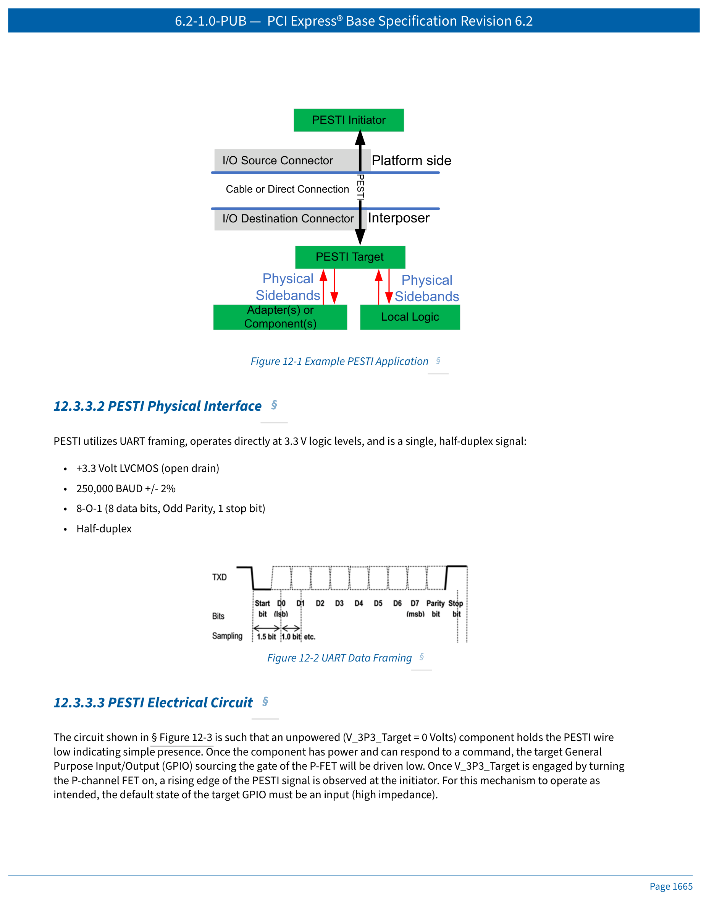
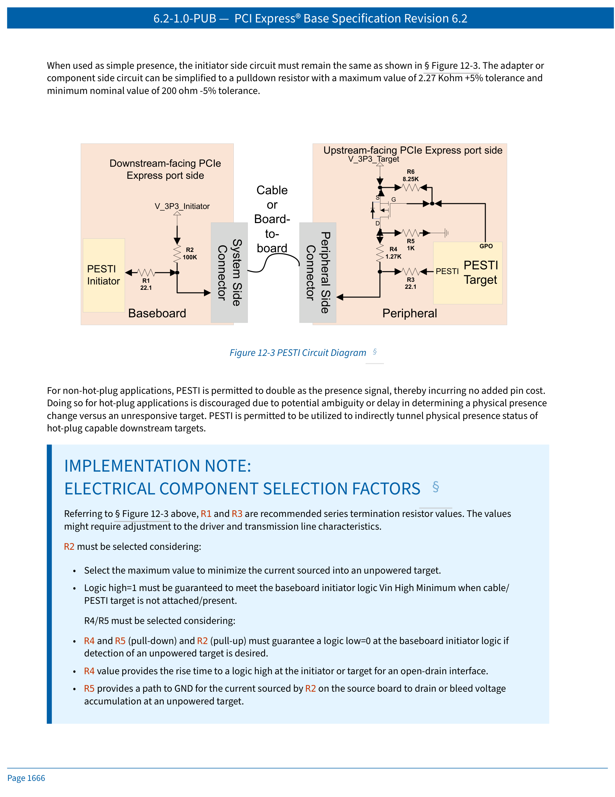
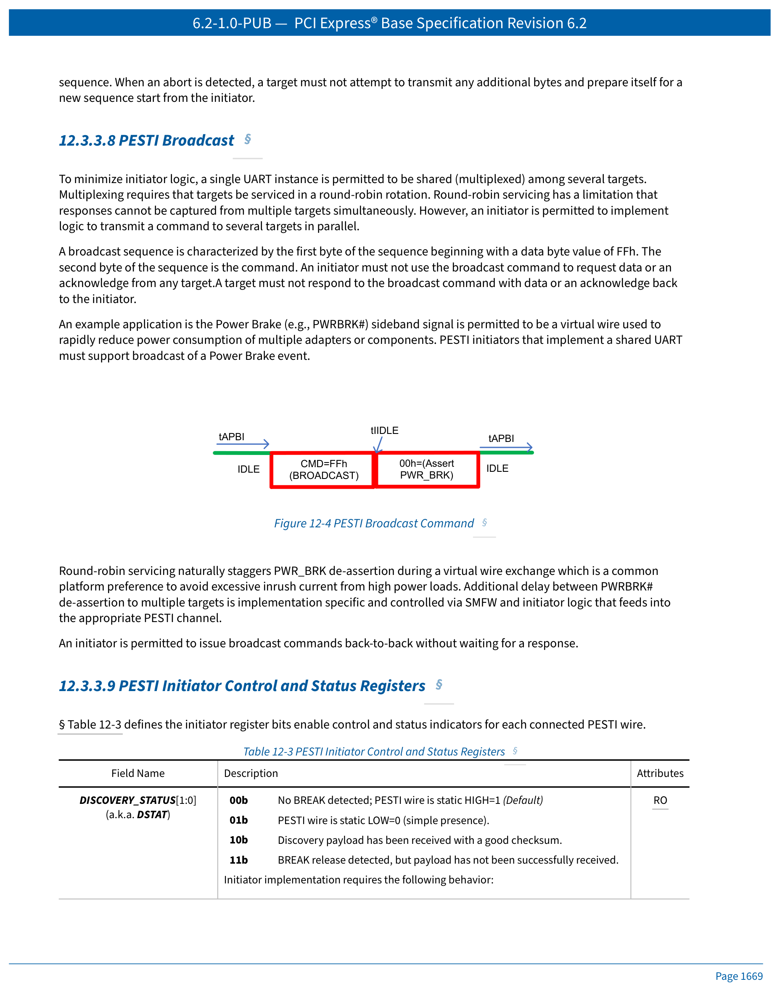
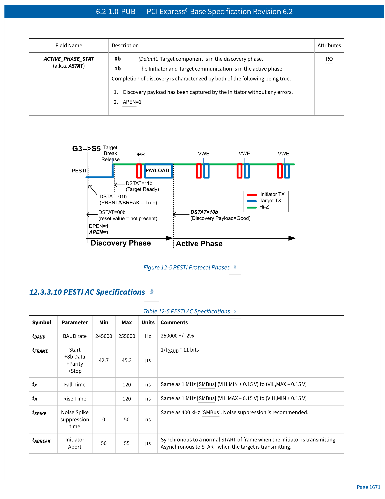
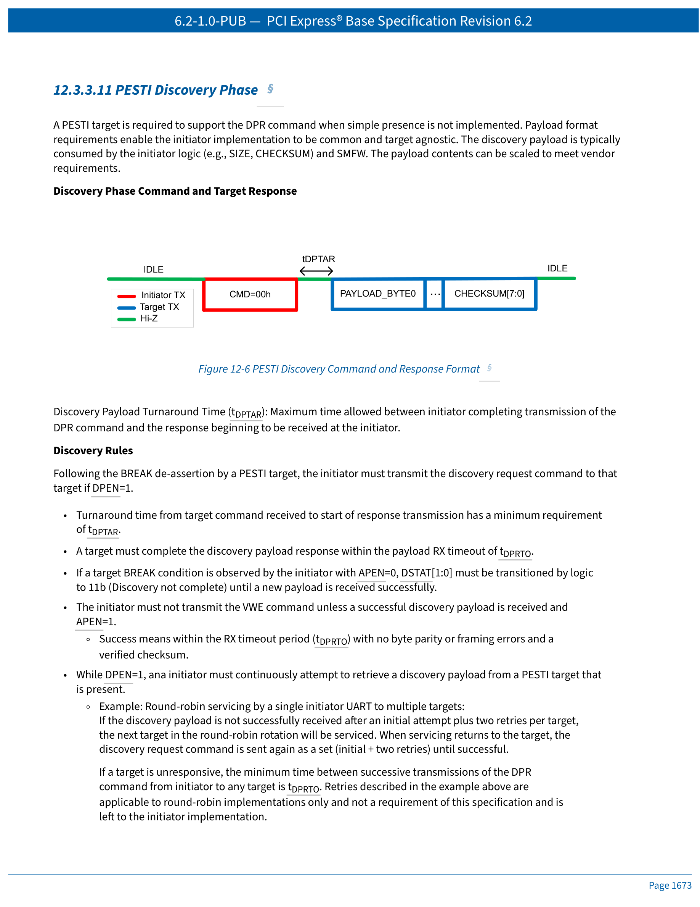
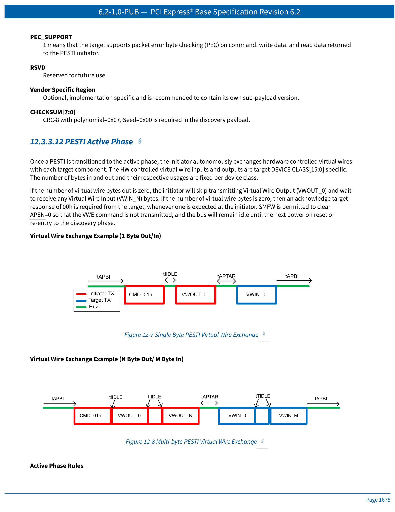
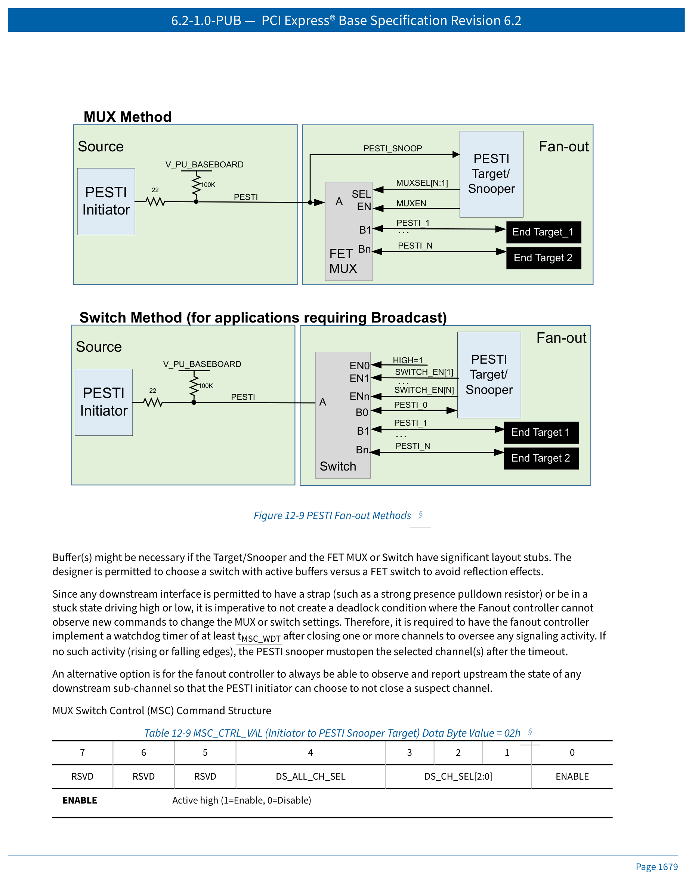
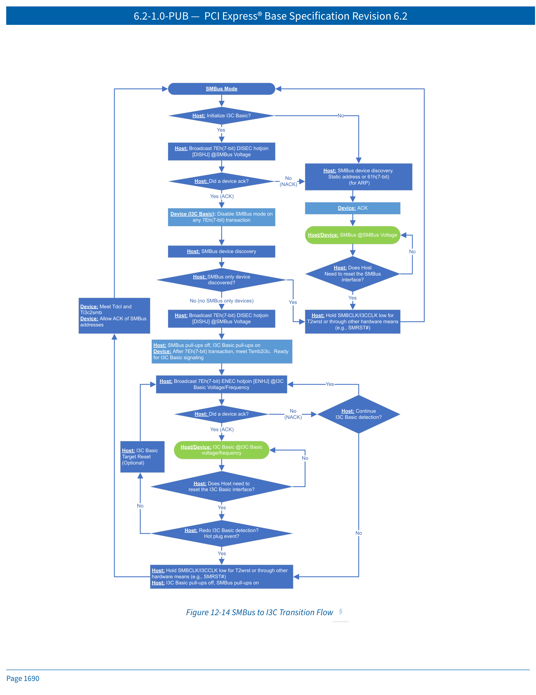

# PCI Express Base Specification 6.2 — 第12章：架构带外管理

> 中英文对照翻译 | Chinese-English Parallel Translation
> Source: NCB-PCI_Express_Base_6.2-2024-01-25.pdf, Pages 1659–1702

---

---

## 快速导航 | Quick Navigation

| 章节 | Section | 内容 |
|------|---------|------|
| [12.1](#121-introduction) | Introduction | 带外管理简介 |
| [12.2](#122-framework-for-sidebands) | Framework | 边带信号框架 |
| [12.3](#123-sideband-signaling-mechanisms) | Sideband Signaling | 边带信号机制：离散边带、Flex I/O、PESTI |
| [12.4](#124-managed-usb-20) | Managed USB 2.0 | 托管 USB 2.0 |
| [12.5](#125-2-wire-interface) | 2-Wire Interface | 双线接口：SMBus/I2C/I3C-Basic |
| [12.6](#126-field-replacement-unit-fru-information) | FRU Information | 现场可更换单元信息 |
| [12.7](#127-out-of-band-control-mechanism) | OOB Control | 带外控制机制 |
| [12.8](#128-retimer-management) | Retimer Mgmt | 重定时器管理 |
| [12.9](#129-internal-cable-management) | Cable Mgmt | 内部线缆管理 |

---

## 12.1 Introduction
## 12.1 简介

"Sidebands" are physical interfaces other than the high-speed Lanes connecting two Ports, typically used for out-of-band platform management functionality. Out-of-band (OOB) management refers to the ability to communicate with peripheral subsystems, such as adapters and components, without interacting with firmware/software running on the host CPU(s).

> "边带"（Sidebands）是指除连接两个端口的高速通道（Lane）之外的物理接口，通常用于带外（OOB）平台管理功能。带外管理是指在不需要与主机 CPU 上运行的固件/软件交互的情况下，与外围子系统（如适配器和组件）进行通信的能力。

---

This chapter provides a "toolkit" with a variety of potentially applicable technology ingredients, including, for example SMBus addressing, discrete signaling consolidation and Flexible I/O signal function negotiation, and how to utilize enhanced interfaces such as I3C-Basic and managed USB 2.0. The intent of centralizing this content in this document is to yield major improvements in capability and consistency to the physical, electrical, and logical domains for both systems and existing or new future form factor specifications or revisions.

> 本章提供了一个"工具包"，其中包含多种可能适用的技术要素，例如 SMBus 寻址、离散信号整合和灵活 I/O 信号功能协商，以及如何利用增强接口（如 I3C-Basic 和托管 USB 2.0）。将这部分内容集中到本文档中的目的是在物理、电气和逻辑域上，为系统以及现有或未来的外形规格规范或其修订版带来能力和一致性的重大改进。

---

**Table 12-1 Relative Comparisons of Typical Architectural Out-of-Band Interfaces | 表 12-1 典型架构带外接口相对比较**

| General OOB Interface | Usage Guidance | Transfer Rate | Isolated Control Plane | Example Applications |
|-----------------------|---------------|---------------|------------------------|---------------------|
| Discrete/Physical Signals | Signal propagation delay | — | Y | PERST#, PRSNT#, PWRBRK#, PWRDIS |
| Serialized/Virtual Signals (e.g., PESTI) | ~250 Kb/s | — | Y | Real-time virtual signals, OOB Controls/status |
| SMBus or I2C | 100, 400, 1000 Kb/s | — | Y | EEPROM, I/O Expanders, Sensors, MCTP, Security |
| I3C-Basic | 12.5 Mb/s SDR mode | — | Y | Hub Control, MCTP |
| USB 2.0 | 480 Mb/s | — | Y | Serial, Ethernet (NC-SI and TCP/IP), Mass Storage, MCTP, Security |
| PCIe VDM | Link-specific | — | N | MCTP |

---

## 12.2 Framework for Sidebands
## 12.2 边带信号框架

Sideband signals refer to all signals that cross a defined interface, other than those associated with the high-speed Link itself. Sideband signals impact platforms such as through added cost, additional conductors and circuits for optional signals that might be rarely or never used. This negatively impacts cross compatibility and establishes legacy constraints that might impede more efficient solutions. Although sideband signals typically travel in parallel with the Link, sideband signals often interact with components other than the two that implement the Ports at each end of the Link.

> 边带信号是指所有跨越已定义接口的信号，但不包括与高速链路本身相关的信号。边带信号对平台产生影响，例如增加成本、为可能很少或从不使用的可选信号增加额外的导线和电路。这对交叉兼容性产生负面影响，并设立了可能阻碍更高效解决方案的遗留约束。虽然边带信号通常与链路并行传输，但边带信号常常与实现链路两端端口的两个组件之外的其他组件进行交互。

---

The architectural framework defined here provides:

1. A partial catalog of sideband signals already in common use for defined form factors.
2. Reference physical topologies representing how sideband signals are used at the platform level.
3. Extensible mechanisms for sideband capability discovery and control.
4. Roles and responsibilities of various platform elements in relation to sideband signals.

> 此处定义的架构框架提供：
>
> 1. 已定义外形规格中常用边带信号的部分目录。
> 2. 表示边带信号在平台层面如何使用的参考物理拓扑。
> 3. 用于边带能力发现和控件的可扩展机制。
> 4. 与边带信号相关的各种平台元素的角色和职责。

---

## 12.3 Sideband Signaling Mechanisms
## 12.3 边带信号机制

This section describes three methods of sideband handling: fixed function interfaces using discrete sidebands, Flexible I/O (Flex I/O), and Peripheral Sideband Tunneling Interfaces (PESTI).

> 本节描述了三种边带处理方法：使用离散边带的固定功能接口、灵活 I/O（Flex I/O）以及外设边带隧道接口（PESTI）。

---

### 12.3.1 Discrete Sidebands
### 12.3.1 离散边带

Discrete sideband signals are physical wires and/or pins that have diverse functions such as those related to platform power up (e.g., PERST#), Link control (e.g., CLKREQ#), or non-Link functionality (e.g., 2-wire). Considerations for incorporating discrete sideband signals include architectural needs (e.g., PERST#), low latency needs (e.g., PWRBRK), or fault domain minimization control (e.g., PWRDIS).

> 离散边带信号是具有多种功能的物理导线和/或引脚，例如与平台上电相关的功能（如 PERST#）、链路控制（如 CLKREQ#）或非链路功能（如 2-wire）。纳入离散边带信号的考虑因素包括架构需求（如 PERST#）、低延迟需求（如 PWRBRK）或故障域最小化控制（如 PWRDIS）。

---

**Key discrete signal examples | 主要离散信号示例：**

- **PERST#** — PCIe Reset; causes a component to execute a Fundamental Reset (Section 6.6.1)
- **PRSNT#** — Presence; indication of adapter/component/cable presence (Section 6.7.1)
- **PWRDIS** — Power Disable; causes adapter/component to disable use of its own power (Section 6.7.3.3)
- **PWRBRK#** — Emergency Power Reduction; causes adapter/component to reduce power to safe level (Section 6.24)
- **CLKREQ#** — Clock Request; causes platform to provide reference clock (Section 8.6.8)
- **WAKE#** — Wake Up; causes sleeping platform to restore main power (Section 5.3.3.2)
- **SMRST#** — SMBus Reset (candidate for exclusion/serialization due to high latency, rare use)

> - **PERST#** — PCIe 复位；使组件执行基本复位（第 6.6.1 节）
> - **PRSNT#** — 存在检测；指示适配器/组件/线缆的存在（第 6.7.1 节）
> - **PWRDIS** — 电源禁用；使适配器/组件禁用自身电源（第 6.7.3.3 节）
> - **PWRBRK#** — 紧急降功耗；使适配器/组件将功耗降至安全水平（第 6.24 节）
> - **CLKREQ#** — 时钟请求；使平台提供参考时钟（第 8.6.8 节）
> - **WAKE#** — 唤醒；使休眠平台恢复主电源（第 5.3.3.2 节）
> - **SMRST#** — SMBus 复位（因高延迟和极少使用，可考虑排除或串行化）

---

### 12.3.2 Flex I/O Sidebands
### 12.3.2 灵活 I/O 边带

Flexible input/output signals/interfaces (Flex I/O) utilize the concept where interface pins are permitted to be flexibly (re)purposed following discovery and determination of mutual capabilities and applying rules that guarantee safe and backward compatibility. When represented as a signal, form factor specifications should use the FLEXIO-[N:0] nomenclature.

> 灵活输入/输出信号/接口（Flex I/O）利用的概念是：在发现和确定相互能力之后，并应用保证安全性和向后兼容性的规则，允许接口引脚被灵活地（重新）分配用途。当作为信号表示时，外形规格规范应使用 FLEXIO-[N:0] 命名法。

---

Flex I/O interfaces provide the following benefits:

1. Improved hardware interface utilization compared to fixed function pins.
2. Opportunity to continually leverage evolving high-speed management interfaces.
3. Flexibility to include value-added out-of-band functionality between platforms and peripheral subsystems.

> Flex I/O 接口提供以下优势：
>
> 1. 与固定功能引脚相比，提高了硬件接口利用率。
> 2. 有机会持续利用不断演进的高速管理接口。
> 3. 灵活地在平台和外围子系统之间包含增值的带外功能。

---

**Flex I/O engagement steps | Flex I/O 接入步骤：** Default State → Discovery → Compatibility Check → Control Negotiation

**Default State options | 默认状态选项：**

1. **Unused**: Unconnected (electrical open) or with specific termination.
2. **Pre-Wired/Inert**: Wired with predetermined circuit; functionality inactive until negotiation complete.
3. **Switchable Function**: Defaults to pre-defined (often legacy) function, then electrically/logically switchable.

> 1. **未使用**：未连接（电气开路）或按特定外形规格要求端接。
> 2. **预布线/惰性**：已用预定电路布线；协商完成前功能不激活。
> 3. **可切换功能**：默认为预定义（常为遗留）功能，然后可电气/逻辑切换到替代功能。

---

**Key Flex I/O rules | Flex I/O 关键规则：**

- Platform must compare adapter's Flex I/O capabilities before changing defaults, communicating settings, or using Flex I/O pins.
- Mismatch must result in avoidance of these actions.
- Differential interfaces on single-ended optimized Flex I/O signals is prohibited.
- Using Flex I/O pins as power supply rails is prohibited.
- Non-volatile auto-revert is prohibited; Flex I/O must return to defaults upon power loss.

> - 平台必须在更改默认值、通信新设置或使用 Flex I/O 引脚之前，对比适配器的 Flex I/O 能力。
> - 不匹配时必须避免上述操作。
> - 禁止在单端优化的 Flex I/O 信号上使用差分接口。
> - 禁止将 Flex I/O 引脚用作电源轨。
> - 禁止使用非易失性信息自动恢复；Flex I/O 必须在断电后返回默认状态。

---

### 12.3.3 Peripheral Sideband Tunnelling Interface (PESTI) Sidebands
### 12.3.3 外设边带隧道接口（PESTI）边带

#### 12.3.3.1 PESTI Introduction | PESTI 简介

Peripheral Sideband Tunnelling Protocol (PESTI) is a single wire, half-duplex, bidirectional Universal Asynchronous Receive Transmit (UART) communication channel with a protocol that enables optional discovery and optional, real-time, virtual wire tunnelling between platform and peripheral agents. PESTI enables the minimization of the number of discrete sidebands signals, while extending functionality via scalable, form factor specific, extensible, and real-time virtual wires.

> 外设边带隧道协议（PESTI）是一种单线、半双工、双向的通用异步收发（UART）通信通道，其协议支持可选的发现过程和可选的实时虚拟线隧道传输，用于平台与外设代理之间的通信。PESTI 能够最小化离散边带信号的数量，同时通过可扩展的、外形规格特定的、可扩展的实时虚拟线来扩展功能。

---

PESTI is point-to-point with fanout support that utilizes a bus snooping and bus switching command method. PESTI provides message integrity detection support. PESTI protocol leverages common UART framing to create a simple, low logic, low cost out-of-band payload and signal tunnel.

> PESTI 是点对点的，通过总线监听和总线切换命令方法支持扇出。PESTI 提供消息完整性检测支持。PESTI 协议利用通用 UART 帧格式创建一个简单、低逻辑、低成本的带外载荷和信号隧道。

---

#### 12.3.3.2 PESTI Physical Interface | PESTI 物理接口

PESTI utilizes UART framing, operates directly at 3.3 V logic levels, and is a single, half-duplex signal:

- +3.3 Volt LVCMOS (open drain)
- 250,000 BAUD ± 2%
- 8-O-1 (8 data bits, Odd Parity, 1 stop bit)
- Half-duplex

> PESTI 使用 UART 帧格式，直接在 3.3V 逻辑电平上运行，是单线半双工信号：
>
> - +3.3V LVCMOS（开漏）
> - 250,000 波特率 ± 2%
> - 8-O-1（8 个数据位，奇校验，1 个停止位）
> - 半双工

---

 <em>Figure 12-1 Example PESTI Application | 图 12-1 PESTI 应用示例</em>

 <em>Figure 12-3 PESTI Circuit Diagram | 图 12-3 PESTI 电路图</em>

---

#### 12.3.3.5 PESTI Target Detection | PESTI 目标检测

Presence of a PESTI target is characterized by a rising edge of PESTI. The default input state of PESTI at an initiator is HIGH=1 indicating no adapter/component present. If the PESTI signal is observed as static low for more than tDBREAK, that target is indicating simple presence. A rising edge indicates the target is ready to receive commands.

> PESTI 目标的"存在"以 PESTI 信号的上升沿为特征。PESTI 在发起方端的默认输入状态为 HIGH=1，表示没有适配器/组件存在。如果 PESTI 信号被观察到持续低电平超过 tDBREAK，则目标正在指示简单存在（simple presence）。上升沿表示目标已准备好接收命令。

---

**Target Detection Rules | 目标检测规则：**

1. Initiator must not attempt communication while PESTI is held low (simple presence).
2. PESTI target must not release BREAK until ready to respond.
3. Minimum low (BREAK) assertion width required for detection at initiator is tDBREAK.
4. Adapter/component may request re-start of discovery by asserting and releasing BREAK at any time prior to active phase.

> 1. 发起方在 PESTI 被拉低（简单存在）期间不得尝试通信。
> 2. PESTI 目标必须在准备好响应之前不释放 BREAK。
> 3. 发起方检测所需的最小低电平（BREAK）断言宽度为 tDBREAK。
> 4. 适配器/组件可在进入活跃阶段之前的任何时刻，通过断言并释放 BREAK 来请求重新开始发现过程。

---

#### 12.3.3.6 PESTI Protocol Commands | PESTI 协议命令

PESTI compliant targets must support:

- **Discovery Payload Request (DPR)**: Data Byte Value = 00h
- **Virtual Wire Exchange (VWE)**: Data Byte Value = 01h
- **MUX/switch control** (fanout components only): Data Byte Value = 02h

> PESTI 合规目标必须支持：
>
> - **发现载荷请求（DPR）**：数据字节值 = 00h
> - **虚拟线交换（VWE）**：数据字节值 = 01h
> - **MUX/开关控制**（仅扇出组件）：数据字节值 = 02h

---

 <em>Figure 12-4 PESTI Broadcast Command | 图 12-4 PESTI 广播命令</em>

---

#### 12.3.3.9 PESTI Initiator Control and Status Registers | PESTI 发起方控制和状态寄存器

**Table 12-3 PESTI Initiator Control and Status Registers | 表 12-3 PESTI 发起方控制和状态寄存器**

| Field | Description | Attributes |
|-------|-------------|------------|
| DISCOVERY_STATUS[1:0] (DSTAT) | 00b=No BREAK (default), 01b=Static LOW (simple presence), 10b=Discovery payload received (good checksum), 11b=BREAK release detected but no payload | RO |
| DISCOVERY_PAYLOAD_ENABLE (DPEN) | 0b=No payload request (default), 1b=Send payload request with retries until DSTAT=10b | RW |
| ACTIVE_PHASE_ENABLE (APEN) | 0b=No VWE phase, 1b=Enter active phase if DSTAT=10b (default) | RW |
| ACTIVE_PHASE_ERROR (APERR) | 0b=No error (default), 1b=RX timeout or data error (sticky, write-1-clear) | RW1C |
| ACTIVE_PHASE_STAT (ASTAT) | 0b=Discovery phase (default), 1b=Active phase | RO |

---

#### 12.3.3.10 PESTI AC Specifications | PESTI 交流电气规范

 <em>Figure 12-5 PESTI Protocol Phases | 图 12-5 PESTI 协议阶段</em>

**Table 12-5 Key AC Parameters | 表 12-5 关键交流参数**

| Symbol | Parameter | Min | Max | Unit |
|--------|-----------|-----|-----|------|
| tBAUD | BAUD rate | 245000 | 255000 | Hz |
| tFRAME | Frame time (Start+8b+Parity+Stop) | 42.7 | 45.3 | μs |
| tABREAK | Initiator Abort | 50 | 55 | μs |
| tDBREAK | Target Discovery BREAK assertion | 50 | — | μs |
| tDPRTO | Discovery payload receive timeout | — | 250 | ms |
| tAPRTO | Active Phase receive timeout | — | 500 | μs |
| tAPTAR | Active Phase Turnaround | 0.1 | 200 | μs |

---

#### 12.3.3.11 PESTI Discovery Phase | PESTI 发现阶段

 <em>Figure 12-6 PESTI Discovery Command and Response Format | 图 12-6 PESTI 发现命令与响应格式</em>

The minimum required payload (8 bytes) when simple presence is not implemented:

**Discovery Payload | 发现载荷（8 字节最小值）：**

| Byte | Field | Description |
|------|-------|-------------|
| 00h | PAYLOAD_FORMAT_VERSION | Must be 02h (01h used by OCP) |
| 01h | DISCOVERY_PAYLOAD_SIZE | (Total bytes / 8) - 1 |
| 02h-03h | VENDOR_ID[15:0] | PCI-SIG assigned Vendor ID |
| 04h | DEVICE_CLASS | Device class of PESTI target |
| 05h-06h | DEVICE_ID[15:0] | Vendor specific device type |
| 07h | Flags | PEC_SUPPORT, VENDOR_ID_FORMAT, RSVD |
| 08h-Nh | Optional Vendor Specific Region + Padding | Variable |
| Nh | Checksum | CRC-8 (polynomial=0x07, Seed=0x00) |

---

#### 12.3.3.12 PESTI Active Phase | PESTI 活跃阶段

Once PESTI transitions to the active phase, the initiator autonomously exchanges hardware controlled virtual wires with each target component. The number of bytes in/out and their usages are fixed per device class.

> 一旦 PESTI 转换到活跃阶段，发起方即自主地与每个目标组件交换硬件控制的虚拟线。输入和输出的字节数及其各自的用途因设备类别而异。

---

 <em>Figure 12-7 Single Byte + Figure 12-8 Multi-byte PESTI Virtual Wire Exchange | 图 12-7/12-8 PESTI 虚拟线交换</em>

---

#### 12.3.3.14 PESTI Fan-Out | PESTI 扇出

Two fanout methods: **MUX method** (typical 1-to-many, no broadcast) and **Switch method** (with broadcast support).

> 两种扇出方法：**MUX 方法**（典型一对多，不支持广播）和**Switch 方法**（支持广播）。

 <em>Figure 12-9 PESTI Fan-out Methods | 图 12-9 PESTI 扇出方法</em>

---

**PESTI Fanout Rules | PESTI 扇出规则：**

1. PESTI snoopers must not be nested; only single fanout level supported.
2. Fanout target must default to all downstream PESTI channels disabled during discovery.
3. Snooper must not respond to DPR (00h) or VWE (01h) when any downstream channel is selected.
4. Only a single downstream Switch channel can be selected at any given time (except broadcast).
5. Non-snooper targets must ignore MSC command (02h).

> 1. PESTI 监听器不得嵌套；仅支持单级扇出。
> 2. 扇出目标必须在发现阶段默认禁用所有下游通道。
> 3. 当下游通道被选中时，监听器不得响应 DPR 或 VWE 命令。
> 4. 任何时刻只能选择一个下游 Switch 通道（广播除外）。
> 5. 非监听器目标必须忽略 MSC 命令（02h）。

---

#### 12.3.3.15 PESTI Security Considerations | PESTI 安全考虑

Threats:

1. **Physical implant/signal re-routing** — Mitigated with SPDM security capabilities.
2. **Man-in-the-middle snooping/alteration** — Potentially mitigated with encrypted payloads (SPDM methods).

> 威胁：
>
> 1. **物理植入/信号重新路由** — 通过 SPDM 安全能力缓解。
> 2. **中间人监听/篡改** — 可通过加密载荷（SPDM 方法）缓解。

---

## 12.4 Managed USB 2.0
## 12.4 托管 USB 2.0

Numerous use cases exist for USB 2.0 as a plug-and-play, out-of-band management interface: firmware update, telemetry, debug, security operations (attestation, recovery, measurement), MCTP, TCP/IP/NC-SI, and bridges to GPIO, UART, SPI, I3C, JTAG.

> USB 2.0 作为即插即用的带外管理接口有多种用例：固件更新、遥测、调试、安全操作（认证、恢复、度量）、MCTP、TCP/IP/NC-SI，以及到 GPIO、UART、SPI、I3C 和 JTAG 的桥接。

---

**USB Rules | USB 规则：**

1. USB Host must be on the platform side.
2. USB 2.0 high speed and full speed modes are supported.
3. USB 2.0 low speed and USB 1.1 mode devices are prohibited when directly connected.
4. USB 2.0 voltage through form factor interfaces must be 3.3 V.

> 1. USB 主机必须位于平台侧。
> 2. 支持 USB 2.0 高速和全速模式。
> 3. 直接连接时禁止 USB 2.0 低速和 USB 1.1 模式设备。
> 4. 通过外形规格接口的 USB 2.0 电压必须为 3.3 V。

---

## 12.5 2-Wire Interface
## 12.5 双线接口

I2C and SMBus are long standing and useful bus interfaces. This specification defines a backward-compatible method of discovering and enabling the optional I3C-Basic mode on the existing 2-wire interface. The recommended PCI Architecture to allow interoperability with legacy adapters is for the platform to use the 2-wire Hub.

> I2C 和 SMBus 是长期存在且有用的总线接口。本规范定义了一种向后兼容的方法，用于在现有双线接口上发现并启用可选的 I3C-Basic 模式。为使传统适配器具有互操作性，推荐的 PCI 架构是平台使用双线 Hub。

---

**Generic terminology | 通用术语：**

- "2-wire interface" (双线接口)
- Signal names "SCL" (serial clock) and "SDA" (serial data)

---

### 12.5.1 2-Wire Interface Use Cases | 双线接口用例

| Functionality | Typical Applications |
|--------------|---------------------|
| FRU Information | Discovery of HW inventory, capabilities, bus topologies |
| Security | Attestation of HW/FW, RTM, RTU, RTR, Data Encryption |
| Configuration/Controls | Flex I/O, Link subdivision |
| Update | Peripheral Subsystem Firmware |
| Health | Error Causes, Crash Dump Logs, Temperature |
| Telemetry | Power, Throughput |

---

### 12.5.2 2-Wire Addressing | 双线寻址

**Table 12-12 Baseline SMBus Recommended Default Target Addresses | 表 12-12 基线 SMBus 推荐默认目标地址**

| Default Target Address | Recommended Usage |
|------------------------|-------------------|
| 1010 010xb (A4h/52h) | FRU Information Device on card carrier |
| 1010 011xb (A6h/53h) | FRU Information Device on adapter/component |
| 0011 101xb (3Ah/1Dh) | Primary MCTP-compliant Management Target |
| 1101 010xb (D4h/6Ah) | Secondary MCTP-compliant Management Target |
| 1110 100xb (E8h/74h) | Addressable SMBus MUX |
| 1110 000xb (E0h/70h) | 2-wire Hub |

---

### 12.5.3 2-wire Bus Sharing | 双线总线共享

#### 12.5.3.1 Multi-Drop Topology | 多分支拓扑

A multi-drop topology with a 2-wire interface is permitted. Unique addresses must be assigned either statically (e.g., slot identifier) or dynamically using SMBus ARP or I3C-Basic Dynamic Addressing.

> 允许使用双线接口的多分支拓扑。必须通过静态方式（如插槽标识符）或动态方式（SMBus ARP 或 I3C-Basic 动态寻址）分配唯一地址。

---

#### 12.5.3.2 SMBus MUX Use | SMBus MUX 使用

An addressable SMBus MUX is a bidirectional fan-out multiplexer with one upstream channel and one or more downstream channels. The use of addressable switches (allowing multiple downstream segments concurrently) is not recommended for signal integrity, security, and addressing complexity reasons.

> 可寻址 SMBus MUX 是一个双向扇出多路复用器，具有一个上游通道和一个或多个下游通道。出于信号完整性、安全性和寻址复杂性方面的考虑，不建议使用可寻址开关（允许同时连接多个下游段）。

---

#### 12.5.3.3 2-wire Hub Use | 双线 Hub 使用

Benefits of using a 2-wire Hub:

a. Bus capacitance isolation.
b. Fanout of I3C and SMBus components with I3C in-band interrupt aggregation.
c. Voltage translation and power domain isolation.
d. SMBus agents for asynchronous SMBus messages (e.g., MCTP).

> 使用双线 Hub 的好处：
>
> a. 总线电容隔离。
> b. I3C 和 SMBus 组件扇出，支持 I3C 带内中断聚合。
> c. 电压转换和电源域隔离。
> d. 用于异步 SMBus 消息（如 MCTP）的 SMBus 代理。

---

### 12.5.4 I3C-Basic Support on Existing SMBus Signals
### 12.5.4 在现有 SMBus 信号上支持 I3C-Basic

Key attributes of I3C-Basic support on existing SMBus signals:

- Supports MIPI Alliance Specification for I3C Basic, Version 1.0.
- I3C Data shares same signal as SMBus Data; I3C Clock shares same signal as SMBus Clock.
- SMBus voltage levels must also be tolerated for backward compatibility.
- I3C operating voltage must utilize 1.8 V signaling as defined in I3C-Basic.

> 在现有 SMBus 信号上支持 I3C-Basic 的关键属性：
>
> - 支持 MIPI 联盟 I3C Basic 规范版本 1.0。
> - I3C 数据与 SMBus 数据共用同一信号；I3C 时钟与 SMBus 时钟共用同一信号。
> - 为向后兼容，还必须容忍 SMBus 电压电平。
> - I3C 工作电压必须使用 I3C-Basic 中定义的 1.8V 信号。

---

 <em>Figure 12-14 SMBus to I3C Transition Flow | 图 12-14 SMBus 到 I3C 转换流程</em>

---

### 12.5.4.3 I3C Basic DC and AC Signal Requirements | I3C Basic 直流和交流信号要求

**Table 12-13 I3C Basic Logic Signaling DC Specification | 表 12-13 I3C Basic 逻辑信号直流规范**

| Symbol | Parameter | Min | Nominal | Max | Unit |
|--------|-----------|-----|---------|-----|------|
| Vddi3c | I3C Basic Operating Voltage | 1.65 | 1.80 | 1.95 | V |
| Ci3c | Total adapter and component capacitance | | | 20 | pF |

**Table 12-14 I3C Timing Requirements | 表 12-14 I3C 时序要求**

| Symbol | Parameter | Min | Max | Unit |
|--------|-----------|-----|-----|------|
| Tsmb2i3c | Transition from SMBus to I3C Basic | | 20 | ms |
| Tdcl | Clock low reset time | 25 | 35 | ms |
| Ti3c2smb | Transition from I3C Basic to SMBus | | 20 | ms |
| T2wrst | Host clock low timeout | | 50 | ms |

---

## 12.6 Field Replacement Unit (FRU) Information
## 12.6 现场可更换单元（FRU）信息

FRU Information is data that describes an adapter or component, including:

- Inventory information (serial number, model number, etc.)
- Capability information (power consumption, performance, etc.)
- Configuration information (connector subdivision, clocking modes, etc.)

> FRU 信息是描述适配器或组件的数据，包括：
>
> - 库存信息（序列号、型号等）
> - 能力信息（功耗、性能等）
> - 配置信息（连接器细分组合、时钟模式等）

---

FRU Information may be made available to a BMC or service processor via:

1. The 2-wire interface (SMBus/I2C protocol defined in Section 12.6.1).
2. MCTP protocol over 2-wire, USB, or PCIe VDMs.

> FRU 信息可通过以下方式提供给 BMC 或服务处理器：
>
> 1. 双线接口（使用第 12.6.1 节定义的 SMBus/I2C 协议）。
> 2. 通过双线、USB 或 PCIe VDM 的 MCTP 协议。

---

### 12.6.1 FRU Information Device Requirements | FRU 信息设备要求

1. A 2-wire discoverable FRU Information Device must be implemented when required by form-factor specifications.
2. Device may be a physical IC or virtually emulated by firmware.
3. Recommended write-protection; at least 8 full writes must be supported.
4. Must be accessible within 1 second after power valid.
5. Clock-low timeout-based reset recovery must be supported.
6. Capacity must be an even power of 2 (256 Bytes to 64 KB).
7. Must support at least 400 kHz operation in SMBus/I2C mode.
8. FRU Information Device accesses must use 2-byte addresses for read/write offsets.

> 1. 外形规格规范要求时，必须实现双线可发现的 FRU 信息设备。
> 2. 设备可以是物理 IC 或由固件虚拟仿真的。
> 3. 建议写保护；必须支持至少 8 次完整写入。
> 4. 电源有效后 1 秒内必须可访问。
> 5. 必须支持基于时钟低超时的复位恢复。
> 6. 容量必须为 2 的偶数次幂（256 字节到 64 KB）。
> 7. 在 SMBus/I2C 模式下必须支持至少 400 kHz 运行。
> 8. FRU 信息设备访问必须使用 2 字节地址进行读写偏移。

---

### 12.6.2 FRU Information Format | FRU 信息格式

FRU Information format follows the IPMI FRU Information specification with PCI-SIG defined MultiRecord descriptors for PCIe-specific capabilities such as connector subdivision, Flex I/O, and clocking modes.

> FRU 信息格式遵循 IPMI FRU 信息规范，并使用 PCI-SIG 定义的 MultiRecord 描述符来提供 PCIe 特定能力，如连接器细分、Flex I/O 和时钟模式。

---

### 12.6.3 Common PCI-SIG MultiRecord Descriptors | 通用 PCI-SIG MultiRecord 描述符

#### 12.6.3.1 Connector Subdivision (Group ID 0h, Sub-Type 0h) | 连接器细分

This descriptor reports the connector subdivision capabilities supported by a component. It enables the platform to discover the supported Lane bifurcation configurations.

> 该描述符报告组件支持的连接器细分能力。它使平台能够发现支持的通道分叉配置。

---

## 12.7 Out-of-Band Control Mechanism
## 12.7 带外控制机制

OOB control mechanisms use MCTP-based messaging for Flex I/O reconfiguration, PESTI control, and other management operations. The protocol details enable commands to configure and manage various sideband interfaces.

> 带外控制机制使用基于 MCTP 的消息传递进行 Flex I/O 重配置、PESTI 控制和其他管理操作。协议细节实现命令以配置和管理各种边带接口。

---

## 12.8 Retimer Management
## 12.8 重定时器管理

Retimer management uses the 2-wire interface for discovery, configuration, and status monitoring of PCIe Retimers. Retimers are managed through standard SMBus/I2C access methods.

> 重定时器管理使用双线接口进行 PCIe 重定时器的发现、配置和状态监控。重定时器通过标准的 SMBus/I2C 访问方法进行管理。

---

## 12.9 Internal Cable Management
## 12.9 内部线缆管理

Internal cable management uses sideband interfaces and FRU Information for discovering and managing internal cables connecting various PCIe components. Cable characteristics such as length, supported data rates, and equalization parameters are reported through FRU Information descriptors.

> 内部线缆管理使用边带接口和 FRU 信息来发现和管理连接各种 PCIe 组件的内部线缆。线缆特性（如长度、支持的数据速率和均衡参数）通过 FRU 信息描述符报告。

---

## Appendix: Key Acronyms | 附录：关键缩略语

| 缩略语 | 全称 (English) | 中文翻译 |
|--------|---------------|---------|
| OOB | Out-of-Band | 带外 |
| PESTI | Peripheral Sideband Tunnelling Interface | 外设边带隧道接口 |
| FRU | Field Replaceable Unit | 现场可更换单元 |
| Flex I/O | Flexible Input/Output | 灵活输入/输出 |
| MCTP | Management Component Transport Protocol | 管理组件传输协议 |
| SPDM | Security Protocol and Data Model | 安全协议与数据模型 |
| SMBus | System Management Bus | 系统管理总线 |
| I2C | Inter-Integrated Circuit | 内部集成电路 |
| I3C | Improved Inter-Integrated Circuit | 改进的内部集成电路 |
| UART | Universal Asynchronous Receiver/Transmitter | 通用异步收发器 |
| PEC | Packet Error Checking | 数据包错误检查 |
| BMC | Baseboard Management Controller | 基板管理控制器 |
| DPR | Discovery Payload Request | 发现载荷请求 |
| VWE | Virtual Wire Exchange | 虚拟线交换 |
| MSC | MUX Switch Control | MUX/开关控制 |
| LVCMOS | Low Voltage Complementary Metal-Oxide-Semiconductor | 低压互补金属氧化物半导体 |
| DSTAT | Discovery Status | 发现状态 |
| APEN | Active Phase Enable | 活跃阶段使能 |
| ASTAT | Active Phase Status | 活跃阶段状态 |
| APERR | Active Phase Error | 活跃阶段错误 |

---

> **Translator's Notes | 译者说明**
>
> 本文档翻译自 PCI Express Base Specification Revision 6.2 (January 25, 2024) 第 12 章全文 (Pages 1659–1702)。
> 翻译原则：
> - 术语首次出现时标注中英文对照，后续使用缩写或中文术语
> - 表格和寄存器定义保留英文原文，中文翻译以描述形式附后
> - 技术协议消息名称保留英文
> - 数值和位域定义保持不变
